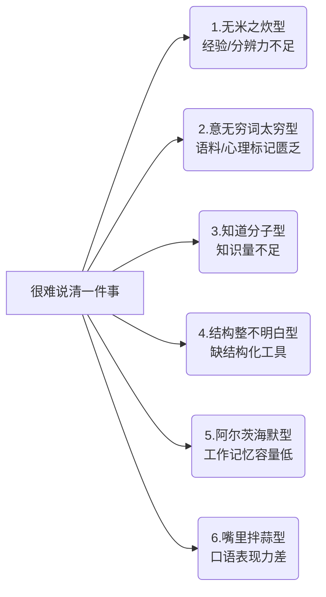

## 前言 为什么你必须上这堂“硬核表达课”

要想让读者对一个观点感兴趣，需要使用SCQA（情景分析法）框架，即背景—冲突—问题—解决框架

背景(situation)：​“这是一本关于沟通与表达的书。为这样的书写前言，也许是天底下最难的事。
​”冲突(complication)—问题(question)：​“如果连作者都没办法说清楚你为什么要看这本书，岂不成了笑话？
​”解决(answer)：​“清晰表达并不难，有很多技巧和工具能让我应对自如。​”

让一个人的态度从质疑变为信服，可以使用图尔敏论证模型。

![[Pasted image 20250817214052.png]]

我首先需要列举数据或事实：​“这本书脱胎于我在B站（视频弹幕网站）开设的关于说话的课程，上线以来累计播放量已超过百万，也收到了很多好评。​”

仅靠事实并不能说明什么，我还要讲出理据(warrant)，来说明这些事实为何能论证自己的主张

理据提供支撑(backing)。也就是说，我需要令人信服地回应这个问题：​“点击量和美誉度在多大程度上与内容质量相关？​”

反驳(rebuttal)和限定(qualifier)，即对自己主张的预先反驳和自我限定。在支撑不足的情况下，反驳和限定能在最大程度上提升可信度，它们的出现表明说话人充分地考虑了对方的顾虑和自身的认知局限性，最终审慎地提出了自己的主张。

> 平庸乏味的观点无论如何都不可能组织成发人深省的话语。

![[Pasted image 20250817214733.png]]

经验值。一切语料都来自经验，拥有好的表达能力的根本前提是说话人对世界拥有足够丰富且细致的感知经验。

词汇量。仅有丰富的经验还不够，需要有与之匹配的词汇网络。一个领域的专家往往掌握了大量的专有名词，可以用它们来标记经验中的丰富细节。

知识量。谈论“茶青质量”和“揉捻程度”​，也许能唬住外行，但想要说清楚它们与口感的关系，必须有大量的原理性知识—比如“茶青”越成熟，咖啡碱含量越低；​“揉捻”可以让茶叶被卷紧，缩小体积，为炒干成条打好基础……否则，你便无法经受住任何刨根问底的追问，也无法为自己的观点进行辩护，在别人眼中，你不过是一个夸夸其谈的“知道分子”​。

**为什么说知识量不是背一些词条?**

把“知识”等同于“能背出多少个词条”，就像把“会说话”等同于“能背出一本词典”。词条只是标着路牌的小石子，真正的知识是你在山路中一步步踩出的那条可回头的路。下面几点说明了为什么：

1. 词条是静态的，问题是动态的  
   任何词条都在编辑完成的那一秒开始老化。真实场景里，变量永远在变：用户画像、技术栈、政策背景、市场情绪……背得再熟，也拼不出下一秒突然跳出来的故障工单或客户需求。知识的价值在于“刷新”，而非“存档”。

2. 记忆是结果，理解是过程  
   把“区块链不可篡改”背下来只需十秒；理解它为何不可篡改却需要跑通一次共识算法、亲手回滚一次分叉、测算一次51%攻击成本。前者存入的是语句，后者存入的是肌肉：下次遇到“如何防止数据造假”的问题，你的大脑会直接调用那条肌肉路径，而不是去检索一句定义。

3. 缺乏连接的词条是孤岛  
   神经科学里有一个概念叫“rich-club organization”——少数高度连通的节点支撑了整张网络。孤立词条就像没连进“富人俱乐部”的散户，检索时耗时长、易遗忘；一旦你把“区块链”和“拜占庭将军问题”“哈希指针”“博弈论”织成网，任何一个节点被触发，整张网都会被激活。

4. 语言不是仓库，而是现场施工队  
   沟通的核心不是倒出库存，而是根据现场地基实时搭脚手架。对方抛出一句“我觉得NFT就是智商税”，你背出NFT定义毫无用处；你得立刻抓住他的价值预设（投机？环保？艺术？），再用他能接受的材料重新砌一道墙。这需要的不是词条，而是可迁移的结构化思维。

5. 可压缩性检验才是真知识  
   费曼技巧说：如果你不能把一个概念压缩到让外行听懂，就说明你没吃透。压缩过程会逼你把零散词条熔铸成一条最小回路：输入问题→调用模型→输出答案。只有经过压缩的知识，才能随取随用，像口袋里那把瑞士军刀，而不是后备箱那本厚重工具书。

![[Pasted image 20250817220806.png]]

### 你这“话”到底什么意思

### 我“当真”在和你“开玩笑”

### 语境—语用—语义

### 穹顶之下的符号秩序

### 沟通的根本动机与终极目标

## 第二章 关系 你不是嘴笨，是心钝

### 打破预期，顺应张力

### 让自己不舒服的坦诚

### 进入地狱，失去天真

### I see you

## 第三章 内容 说到点子上

### 三个世界

### 用关键概念来“打开”思路

### 抽象之梯与问题之锤

### “通透”的理解从何而来

## 第四章 场景与内容 在任何场合都能好好说话

### 新实用主义语言观

### 推论游戏

### 核心玩法——语言游戏中唯一重要的事

### 进阶攻略——角色、舞台、严肃感与角色紧张

### 作弊技术——“后理性”技术与“幽默”

### 假如还有更重要的事

## 第五章 关于“倾听—回应”的一切

### 翻转认知，重塑“倾听—回应”观

### 倾听：一个通用框架

### 回应：极简回应术

## 第六章 一个关于“说话”的整合框架

### 所有碎片汇流于此

### 阶段一：刺激-思维阶段（外部刺激-心理表征化阶段）

### 阶段二：思维-内部言语阶段（心理表征-符号化阶段）

### 阶段三：内部言语-外部言语阶段（符号-命题化阶段）

### 理解与表达的三重境：逻辑—结构—系统

## 第七章 进入世界的练习

### 练习之道

### 总结

## 第八章 逻辑 起点与终点

### 从真到真，必然地得出

### 用逻辑笼罩世界

### 逻辑之外的世界

## 第九章 演绎 从AEIO到AlphaGo

### AEIO

### 三段论

### 命题逻辑与命题演算

### 会推理的魔法机器

## 第十章 归纳 经验暗海上的浮木

### 什么是“归纳”

### 从二元到多元

### 从直观到实证

### 从定性到定量

### 归纳法的尴尬

## 第十一章 类比 思维之火与概念之网

### 无处不在的三种类比

### 隐喻

### 爱情如战争，成长是赛跑

### 原型

### 理性何以有限且有效

## 第十二章 溯因与辩证 能言与善辩

### 好辩的人

### 认知的三角循环

### 否定的融贯

### 否定性推演（差异化网络的发生原理）

### 辩证法：黑格尔死而复生

### 辩证的逆转——bug动力学

### 递归与我思

### 否定否定再否定

## 第十三章 总结 无限游戏中的意义之舞

### 意义

### 关系

### 内容

### 场景与内容

### 倾听与回应

### 整合框架以及练习之道

### 逻辑

## 后记 远离那条平庸之路
> [!failure]- Failure 
>   AbortError: BodyStreamBuffer was aborted
>   
>   - plugin:obsidian-textgenerator-plugin:2070 I7.endLoading
>     plugin:obsidian-textgenerator-plugin:2070:360
>   
>   - plugin:obsidian-textgenerator-plugin:2073 I7.generateStreamInEditor
>     plugin:obsidian-textgenerator-plugin:2073:273
>   
>   - plugin:obsidian-textgenerator-plugin:2170 async HTMLDivElement.eval
>     plugin:obsidian-textgenerator-plugin:2170:7154
>   
>  
