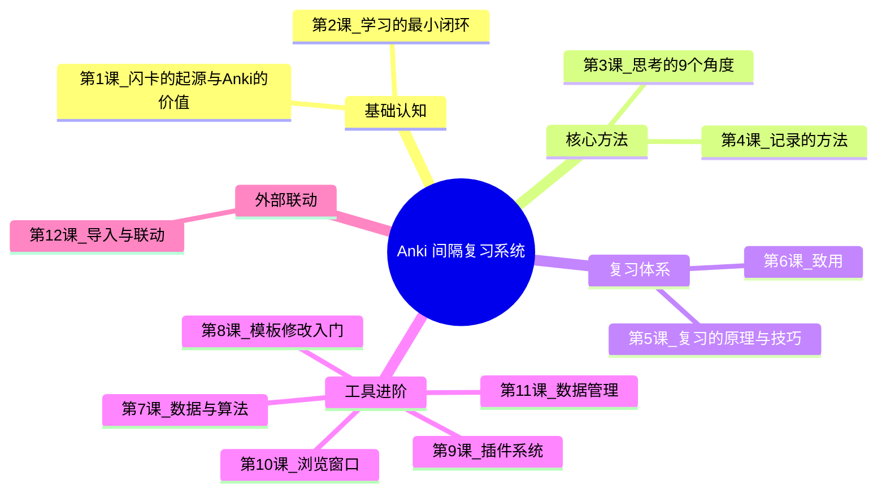
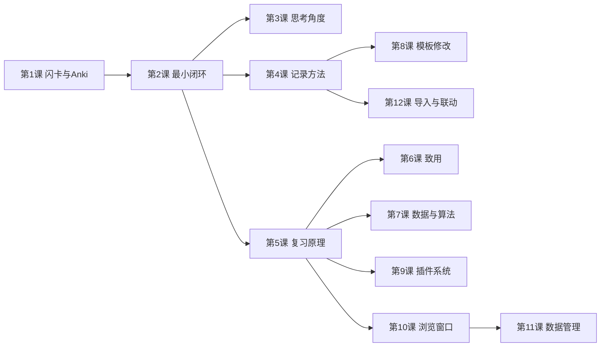
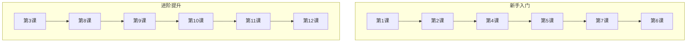

# 🗺️ 课程地图

## 📐 依赖关系图

## 📖 模块说明

### 模块一：基础认知（第1-2课）

| 课程 | 前置 | 核心主题 |
|------|------|----------|
| [[0001-flashcard-origins-and-anki-value|第1课]] | 无 | 闪卡核心机制、三代演进、Anki优势、安装配置 |
| [[0002-learning-closed-loop|第2课]] | 第1课 | 最小闭环模型、成果保存、意义升级、以终为始 |

### 模块二：核心方法（第3-4课）

| 课程 | 前置 | 核心主题 |
|------|------|----------|
| [[0003-thinking-angles|第3课]] | 第2课 | 思考的9个角度、思考三重特性、问答笔记、必要难度 |
| [[0004-recording-methods|第4课]] | 第2课 | 5种笔记类型、牌组vs标签、碎片化输入与结构化输出 |

### 模块三：复习体系（第5-6课）

| 课程 | 前置 | 核心主题 |
|------|------|----------|
| [[0005-review-principles|第5课]] | 第2课 | 四维评估、四个按钮、记忆原理、处理难点、减负策略 |
| [[0006-apply-knowledge|第6课]] | 第5课 | 致用的三层含义、意义升级、todo标签工作流 |

### 模块四：工具进阶（第7-11课）

| 课程 | 前置 | 核心主题 |
|------|------|----------|
| [[0007-algorithms-and-stats|第7课]] | 第5课 | 统计解读、学习计划、SM-2 vs FSRS、DSR模型 |
| [[0008-template-basics|第8课]] | 第4课 | CSS样式、字体、字段设计、卡片vs笔记 |
| [[0009-plugin-system|第9课]] | 第5课 | 5个核心插件、安装/备份/故障处理 |
| [[0010-browse-window|第10课]] | 第5课 | 视图布局、复合搜索、保存条件、批量操作 |
| [[0011-data-management|第11课]] | 第10课 | 同步机制、优化三件套、备份恢复、文件夹结构 |

### 模块五：外部联动（第12课）

| 课程 | 前置 | 核心主题 |
|------|------|----------|
| [[0012-import-and-integration|第12课]] | 第4课 | 通用导入格式、幕布笔记导入、微信读书导入 |

## 🎯 学习路径推荐

> [!TIP] 学习建议
> 每天约30分钟，一课接一课循序渐进。第1-2课建立认知框架，第3-6课掌握核心方法，第7-11课深入工具，第12课打通外部工具。参考文档随时查阅。

## 📚 参考文档速查

| 文档 | 内容 | 最佳使用场景 |
|------|------|-------------|
| [[reference/001-anki-foundations|Anki基础概念]] | 安装、注册、版本、快捷键 | 遇到安装/版本问题时查阅 |
| [[reference/002-closed-loop-and-thinking|闭环与思考体系]] | 闭环模型、思考角度 | 设计学习流程时参考 |
| [[reference/003-recording-methods|记录方法体系]] | 笔记类型、字段设计 | 制卡遇到选择困难时参考 |
| [[reference/004-review-and-apply|复习与致用体系]] | 记忆原理、减负、致用 | 需要调整复习策略时参考 |
| [[reference/005-anki-advanced|Anki进阶操作]] | 算法、模板、插件、数据 | 进阶操作全查阅 |
| [[reference/006-import-and-integration|导入与联动方案]] | 幕布、微信读书导入 | 导入笔记时参考 |