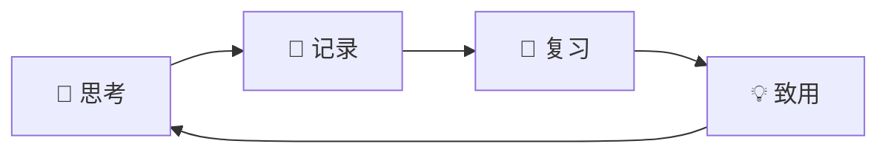

# 第2课：学习的最小闭环

## 🎯 本课目标

- 理解"学习的最小闭环"模型（思考→记录→复习→致用）
- 认识成果流失的三种典型场景
- 掌握难度再匹配和意义升级的方法
- 学会以终为始倒推学习量
- 识别流程中的易错点并加以避免

---

## 一、为什么要提出最小闭环？

> [!WARNING] 核心问题
> 学习的成果无法保存 + 长期复习的意义在哪里。

### 成果流失的三种典型场景

| 场景 | 表现 |
|------|------|
| **读书** | 读到第二本时，第一本讲什么已经忘了。当时理解了，后来又不理解了 |
| **听课** | 听下一门课时上一门课讲的已忘，更不用说用前面知识帮助理解新知识 |
| **长期备考** | 下半年再看上半年学的，辛苦没有留下任何东西 |

> "看似每天都在努力，其实只不过是上三步退两步。"

**关键洞察**：忘掉书上的话（一般性知识）没关系，但通过思考获得的**特殊性知识**应该保留下来。如果一般性知识也忘了，特殊性知识也没有，就是一张白纸。

---

## 二、最小闭环模型

### 四个环节

| 环节 | 核心任务 | 常见缺失 |
|------|---------|---------|
| **思考** | 理解、分析、联系、转化 | 满足于"听懂了"不深入 |
| **记录** | 把思考成果固化到笔记中 | 理解了但不屑于记→过段时间又丢了 |
| **复习** | 间隔复习，把理解转入常识记忆 | 复习积压或从不复习 |
| **致用** | 主题复习、整理结构、联系实践 | 一直停留在复习死扛，不升级 |

> [!NOTE] 两个类比
> - **Ctrl+S**：每次学习结束就像保存文档，第二天接着昨天的成果继续
> - **接力赛**：四棒选手缺一不可，某一棒特别优秀不等于最终能得奖

---

## 三、闭环的第二个目的：意义的挖掘

为什么复习时间长了会感到乏味？因为**难度不匹配**了——你的能力提升了，但学习材料没变。

### 两种升级方式

| 方式 | 具体做法 |
|------|---------|
| **难度再匹配** | 增加联系的内容、整合碎片、抽象变具体/具体变抽象、添加新案例 |
| **意义升级** | ① **升级结构**：碎片笔记→整理大纲结构 ② **变化形式**：具体↔抽象、综合↔分析 ③ **转入实践**：思考如何应用 |

---

## 四、按时间践行最小闭环

| 可用时间 | 分配方案 |
|---------|---------|
| **1 小时** | 30分钟思考 → 10分钟记录 → 10分钟复习 → 10分钟致用 |
| **1 天** | 上午思考+记录 → 下午复习 → 致用（整理结构/建立联系） |
| **4-5 天（慢节奏）** | 第1天思考 → 第2天记录 → 第3天复习 → 第4天致用 |
| **按章节** | 学完一节就走完一次闭环，再进入下一节 |

> [!TIP] 节奏要可调
> 如果拖太久导致记录时已忘记当时的思考，说明闭环太长了，需要缩短。

---

## 五、易错点

### 流程重复

- **思考重复**：第一遍思考了不记录→一个月后重新花时间理解同一内容
- **记录重复**：纸上记一遍→思维导图记一遍→Anki再记一遍，多花了2-3倍时间却没有增量价值

### 流程缺失

- **记录缺失**：理解了不屑于记→第二遍再看时理解已丢失
- **致用缺失**：死扛在复习环节不升级，哪怕已经乏味无聊

---

## 六、核心原则

### ① 以终为始（倒推）

> "我能复习多少 → 我就记多少；我能记多少 → 我就思考多少。"

先确定你能复习的量，再决定你学多少。如果明天没时间复习，今天就不要学太多。

### ② 改进（找瓶颈）

当某个环节特别拖后腿时，集中精力改进它。比如复习慢 → 分析原因：反应慢（增加锻炼）、思考不透彻（下次理解透了再进行下一步）、记录组织不好（条分缕析而非粘贴）。

### ③ 克制囤积欲

学得多、记得多 ≠ 留下来得多。不完成闭环的新知识，宁可不学。

### ④ 质量优先

**质量 = 1，速度 = 0**。没有质量，后面再快也是 0。

---

## 七、特殊情况处理

| 情况 | 对策 |
|------|------|
| 任务多 | 筛选重要的走闭环，次要的传统方式对付；分层：必考点走闭环，非必考点等下一轮 |
| 任务少 | 不要加新学！放慢节奏、复习薄弱点、升级学习阶段 |
| 要加班/放假 | 新学停下来，只复习。可以不进步，但不能退步 |
| 辅导班节奏快 | 辅导班当划重点参考，学习节奏自己把握 |

---

## 📝 自我检测

> [!QUESTION] Q1：最小闭环的四个环节是什么？哪一个环节最容易被忽略？

查看答案

**思考→记录→复习→致用**。最常见缺失的是**记录**（理解了不屑于记）和**致用**（一直复习死扛不升级）。

> [!QUESTION] Q2："以终为始"原则在日常 Anki 使用中具体怎么操作？

查看答案

先确定你每天能复习多少张卡片（如 50 张），再倒推决定今天新增多少（如 ≤ 50 张）。如果明天没时间复习 50 张，今天就不要学 50 张的新内容。量变引起质变的前提是**质变**——没有质量保障的数量增长毫无意义。

> [!QUESTION] Q3：复习感到乏味无聊时应该怎么办？

查看答案

不要死扛！通过**难度再匹配**或**意义升级**来推进：① 升级结构（碎片→大纲）② 变化形式（具体↔抽象、综合↔分析）③ 转入实践（想怎么用/怎么考）。

> [!QUESTION] Q4：以下做法属于流程重复还是流程缺失？"在纸上记一遍笔记，再到思维导图里记一遍，再到 Anki 里记一遍。"

查看答案

**流程重复**（记录重复）。多记几遍并没有创造增量价值，时间翻了 2-3 倍但效果没有提升。正确做法是：选择一个工具记好，把省下的时间用于复习和致用。

---

## ⚡ 今日行动

1. **检查你的闭环**：回顾你目前的学习流程，有没有缺失或重复的环节？
2. **倒推练习**：今天学之前，先问自己"我明天能复习多少张？"然后决定今天新增的量。
3. **升级实验**：找一张已经复习到乏味的卡片，尝试为它添加一个新角度的笔记（比如联系一个实际场景）。

---

## 📚 延伸阅读

- 参考：[[reference/001-anki-foundations|Anki 基础概念参考]]
- 书籍：《精益创业》（MVP 理念来源）、《如何阅读一本书》艾德勒
- 下一课：[[0003-thinking-angles|思考的9个角度]]——如何对任何知识点进行深度加工