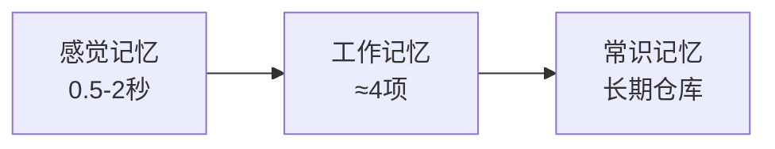

# 第5课：复习的原理与技巧

## 🎯 本课目标

- 理解四维评估体系（流畅度、准确度、完整度、状态）
- 掌握四个评估按钮的深层逻辑
- 了解笔记的五种处置方式
- 理解记忆原理（三阶段模型、遗忘曲线、干扰理论）
- 掌握处理难点的策略和减负方法

---

## 一、复习的四维评估

| 维度 | 含义 | 实操 |
|------|------|------|
| **流畅度** | 回忆的顺畅程度 | Again(生疏)→Hard(困难)→Good(顺利)→Easy(轻松) |
| **准确度** | 答案是否正确 | 答对 vs 答错（直接影响是否重学） |
| **完整度** | 是否遗漏要点 | 部分正确？需要补充？ |
| **状态** | 卡片所处阶段 | 未学习→学习中→复习中→已掌握 |

### 四个按钮的深层逻辑

| 按钮 | 含义 | 间隔变化 | 正确用法 |
|------|------|---------|---------|
| **Again** | 没记住/答错 | 立即重来（<10分钟） | 忘记、错误、不确定时用 |
| **Hard** | 想起但很困难 | 较短（原间隔×1.2） | 回忆吃力，但最终对了 |
| **Good** | 顺利回忆 | 标准间隔 | 正常情况 |
| **Easy** | 太简单 | 很长间隔 | 已烂熟于心时用 |

> [!WARNING] 常见误区
> - 用 Hard 代替 Again → 下次间隔过长，遗忘曲线断裂
> - 过度使用 Easy → 以为自己会了，下次发现忘了
> - 机械点击不回忆 → 相当于重新阅读，不是提取练习

---

## 二、笔记的五种处置

| 处置 | 操作 | 适用场景 |
|------|------|---------|
| **删除** | 彻底移除 | 确定不需要、记错了 |
| **暂停** | 暂时隐藏 | 还没学到、等以后再说 |
| **搁置** | 关联卡片推迟到次日 | 多卡片共享题干，避免连续出现 |
| **标记** | 添加颜色标记 | 存疑、"回头查一下" |
| **修改** | 编辑笔记内容 | 表达不清、需要补充 |

### 标记颜色建议

- 🔴 **红色**：完全没理解/错误
- 🟠 **橙色**：理解但记忆不牢
- 🟢 **绿色**：需要补充内容
- 🔵 **蓝色**：需要查证/存疑
- 🩷 **粉色**：自定义用途（如todo跟踪）

---

## 三、记忆原理

### 阿特金森-谢夫林三阶段模型

> "工作记忆容量在本质上和智力是相同的。"——《教育心理学理论与实践》

### 艾宾浩斯遗忘曲线

- 遗忘在学习后立即开始，最初遗忘最快
- 间隔复习可以有效抵消遗忘趋势
- 每次成功提取，下次遗忘速度减慢

### 提取练习效应

- 主动回忆 vs 被动重读 → 效果天差地别
- 每次提取都在强化神经回路
- **必要难度**：回忆越费力，记忆效果越好

> "仅仅理解某个问题的解决办法，不足以创造日后能随时回想的组块。"——《学习之道》

### 干扰理论

- **前摄干扰**：旧知识干扰新知识记忆
- **倒摄干扰**：新知识干扰旧知识回忆
- 间隔复习可以减少干扰效应

---

## 四、复习方式对比

| 对比维度 | A | B | 建议 |
|---------|--|--|------|
| **回忆 vs 再认** | 主动回忆答案 | 看到答案判断 | 优先回忆型 |
| **顺序 vs 乱序** | 按章节顺序 | 混合随机 | 前期顺序，后期乱序 |
| **单一 vs 交错** | 一个学科 | 多学科交替 | 可交替不同学科 |
| **集中 vs 分散** | 一天多次 | 多天分散 | 间隔分散是核心 |

---

## 五、处理难点

| 难点类型 | 表现 | 对策 |
|---------|------|------|
| **瓶颈卡片** | 多次复习记不住 | ①暂停数周后重学 ②拆成更小笔记 ③换角度记 |
| **理解缺陷** | 不是记不住是没理解 | 回原文重新理解，改写笔记 |
| **上下文缺失** | 孤立卡片难回忆 | 添加上下文提示/做专题复习 |
| **混淆相似内容** | 两个概念搞混 | 做对比笔记，放在一起复习 |

### 减负策略

| 方法 | 说明 |
|------|------|
| 调整上限 | 降低每日新卡和复习上限 |
| 暂停不重要的 | 用标签区分优先级，暂缓低优先级的 |
| 删除过剩 | 删掉根本不重要的笔记 |
| 增加间隔倍数 | 在牌组选项中调整 |
| 设置到期日 | 将来复习的笔记分散到未来 |

---

## 📝 自我检测

> [!QUESTION] Q1：回忆不出来但又不确定是否该点Again时，该怎么做？

查看答案

**点Again**。宁可多复习一次，也不要因为面子点Hard然后遗忘。Again不是"失败"，是"再给一次机会"。

> [!QUESTION] Q2：小明发现最近复习都很"顺"，每张卡片都能轻松点Good。这说明什么？

查看答案

说明**间隔太短**了，缺乏必要难度。可以增加间隔倍数或启用FSRS算法，让卡片在快忘的时候出现，才能真正锻炼记忆。

> [!QUESTION] Q3：暂停和搁置有什么区别？

查看答案

**暂停**：让卡片完全停止出现，直到你手动取消暂停。**搁置**：自动把同笔记的关联卡片推迟到次日，避免连续出现造成提示。

---

## ⚡ 今日行动

1. **检查你的评估习惯**：你是不是习惯性点Good或Hard？尝试有意识地使用Again
2. **标记一张瓶颈卡片**：找一张记不住的卡片，尝试拆分成更小的笔记
3. **计算你的10倍量**：看一下你每天新增多少 → 预测未来复习量

---

## 📚 延伸阅读

- 参考：[[reference/004-review-and-apply|复习与致用体系参考]]
- 书籍：《为什么学生不喜欢上学》《学习之道》《激活你的学习脑》
- 下一课：[[0006-apply-knowledge|致用——让知识产生价值]]