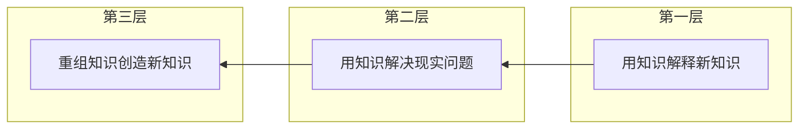

# 第6课：致用——让知识产生价值

## 🎯 本课目标

- 理解"致用"在闭环中的定位和三层含义
- 掌握致用的具体方法
- 学会用 todo 标签跟踪致用情况
- 理解"意义升级"是持续学习的动力来源

---

## 一、为什么需要致用？

回到最小闭环模型：思考→记录→复习→**致用**→（回到思考）

前三个环节解决的是"记住"的问题，致用解决的是"为什么记住"和"记住了有什么用"的问题。

### 没有致用的后果

- 复习变成机械重复，越来越乏味
- 知识停留在"知道"层面，无法转化
- 学了很多但用不上，产生挫败感

---

## 二、致用的三层含义



| 层次 | 含义 | 例子 |
|------|------|------|
| **第一层** | 用知识解释新知识 | 学"工作记忆"时联系"前摄干扰" |
| **第二层** | 用知识解决现实问题 | 学"必要难度"→调整自己的复习间隔 |
| **第三层** | 重组知识创造新知识 | 联系不同书相同主题→产生新见解 |

---

## 三、意义升级

为什么复习时间长了会感到乏味？因为**难度不匹配**了——你的能力提升了，但材料没变。

### 两种升级方式

| 方式 | 具体做法 |
|------|---------|
| **难度再匹配** | 增加联系的内容、整合碎片、抽象变具体/具体变抽象、添加新案例 |
| **意义升级** | ① 升级结构：碎片→大纲 ② 变化形式：具体↔抽象、综合↔分析 ③ 转入实践：思考怎么用 |

> [!NOTE] 升级实验
> 找一张已经复习到乏味的卡片，尝试为它添加一个新角度的笔记。比如原本只记了"是什么"，现在加一条"怎么办"或"和我有什么关系"。

---

## 四、致用的具体方法

| 方法 | 操作 | 频率 |
|------|------|------|
| **主题复习** | 通过标签筛选同主题卡片集中复习 | 学完一章/一本书后 |
| **结构整理** | 把碎片笔记整理成大纲结构 | 定期 |
| **联系实践** | 记录实际使用场景 | 遇到相关场景时 |
| **专题笔记** | 用标签跟踪todo，评估致用情况 | 日常 |
| **跨书联系** | 不同书相同主题放一起复习 | 积累到一定量后 |

### todo 标签工作流

```mermaid
flowchart LR
  A[看笔记时想<br>"能用在哪里？"] --> B[添加标签<br>todo::待实践]
  B --> C[筛选牌组<br>集中复习]
  C --> D[实践中用到<br>改标签为已完成]
  D --> E[定期复盘<br>哪些还没用过]
  E --> A
```

1. 看笔记时想"这个知识可以用在哪里？"
2. 添加标签 `todo` 或 `todo::待实践`
3. 设置筛选牌组只复习带 `todo` 标签的卡片
4. 实践中用到了 → 改标签为 `todo::已完成`
5. 定期复盘：哪些知识还没用过？为什么？

---

## 📝 自我检测

> [!QUESTION] Q1：致用的三层含义是什么？

<details>
<summary>查看答案</summary>

**第一层**：用知识解释新知识；**第二层**：用知识解决现实问题；**第三层**：重组知识创造新知识。

</details>

> [!QUESTION] Q2：为什么复习会感到乏味？怎么解决？

<details>
<summary>查看答案</summary>

因为**难度不匹配**——能力提升但材料没变。解决：难度再匹配（增加联系、整合碎片）或意义升级（结构升级、变化形式、转入实践）。

</details>

> [!QUESTION] Q3：如何用 Anki 跟踪学以致用的进度？

<details>
<summary>查看答案</summary>

使用**todo标签体系**：给笔记添加 todo 标签→创建筛选牌组专门复习→实践后改标签→定期复盘。

</details>

---

## ⚡ 今日行动

1. **升级实验**：找一张复习乏味的卡片，添加一个新角度的笔记
2. **设置 todo 标签**：在Anki中添加 todo 标签体系
3. **跨书联系**：找两个不同来源但主题相同的笔记，创建一个筛选牌组

---

## 📚 延伸阅读

- 参考：[[reference/004-review-and-apply|复习与致用体系参考]]
- 书籍：《精益创业》《如何阅读一本书》
- 下一课：[[0007-algorithms-and-stats|数据与算法]]——SM-2和FSRS的奥秘