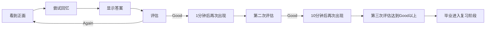

# 第7课：数据与算法

## 🎯 本课目标

- 理解统计窗口的各项数据含义
- 掌握学习计划的设置
- 理解 SM-2 和 FSRS 两种算法的核心区别
- 学会根据数据调整自己的学习策略

---

## 一、统计窗口解读

| 统计项 | 含义 | 健康参考 |
|--------|------|---------|
| 到期卡片 | 今天需要复习的卡片 | 与复习上限匹配 |
| 新增卡片 | 今天新学的卡片 | ≤30（建议10-20） |
| 学习中的卡片 | 尚未毕业的新卡片 | 不宜过多积压 |
| 复习中的卡片 | 已毕业定期复习的卡片 | 总数的60%以上 |
| 保留率 | 回忆成功的比例 | 80-90% |
| 预测 | 未来7/30天复习量 | 帮你预判工作负荷 |

### 欠熟练笔记

- 统计窗口→点击"欠熟练"→自动跳转到浏览窗口
- 保存此搜索条件，方便随时查看
- 对欠熟练笔记做专题复习效率更高

> [!TIP] 数据驱动
> 看统计→获反馈→调整计划。长期趋势比单日数据更重要。如果某天没完成，不要第二天补两倍量。

---

## 二、学习计划设置

### 10倍法则

> **复习量 ≈ 新增量 × 10**

每天新增10张卡片 → 未来每天约100张复习。控制新增是管理复习量的根本。

### 核心参数

| 参数 | 推荐值 | 说明 |
|------|--------|------|
| 每日新卡上限 | 10-30 | 根据可用时间调整，少即是多 |
| 每日复习上限 | 100-200 | 超过此值可能导致积压 |
| 间隔倍数 | 1.0（默认） | 可适当调高以减少复习量 |
| 简单奖励 | 130%（默认） | 点Easy的额外间隔加成 |
| 毕业间隔 | 1天 | 学习阶段→复习阶段所需天数 |
| 新卡步长 | 1 10（分钟） | 新卡学习阶段的间隔 |

### 新卡学习流程

1. 看到正面→尝试回忆→显示答案→评估
2. 点Again/Good→卡在"学习中"状态
3. 经过步长间隔（1分钟→10分钟）后再次出现
4. 第二次评估达到Good以上→"毕业"进入复习阶段
5. 此后按算法安排间隔

---

## 三、SM-2 算法

Anki 默认算法，由 SuperMemo 的 SM-2 改进而来。

### 核心机制

- 新卡学习分两步：默认1分钟→10分钟
- 毕业后：间隔 = 前次间隔 × 间隔倍数
- Again → 重置到学习阶段
- Hard → 间隔 × 1.2
- Good → 标准间隔
- Easy → 间隔 × 简单奖励

### 局限性

- 对所有卡片"一视同仁"——不考虑个体难度差异
- 间隔增长固定倍数——不够灵活
- 不能根据历史复习表现动态调整

---

## 四、FSRS 算法

新一代算法（Free Spaced Repetition Scheduler），基于机器学习。Anki 23.10+ 内置。

### DSR 模型

| 参数 | 含义 | 作用 |
|------|------|------|
| **D** - Difficulty | 卡片的固有难度 | 稳定但可变化，随复习改善而降低 |
| **S** - Stability | 记忆能保持多久 | 决定下次间隔的基础 |
| **R** - Retrievability | 能回忆起来的概率 | 0-1 之间，控制保留率目标 |

### 优势

- 为每张卡片建立独立记忆模型
- 根据个人历史数据优化参数
- 支持设置期望保留率（推荐0.8-0.9）
- 难卡片和简单卡片差异化安排

### 启用方法

1. 牌组→齿轮→选项→FSRS栏
2. 启用FSRS并运行优化
3. 设置期望保留率（默认0.9）
4. 配合 FSRS4Anki Helper 插件使用

---

## 📝 自我检测

> [!QUESTION] Q1：按照10倍法则，如果你每天新增15张卡片，一个月后每天的复习量大约是多少？

查看答案

**约150张/天**。15×10=150。所以在新学期第一周就要想好：我是否能承受这个量？

> [!QUESTION] Q2：SM-2和FSRS最大的区别是什么？

查看答案

SM-2对所有卡片用相同的间隔增长公式（无差别对待）。FSRS为每张卡片建立独立的DSR模型（难度、稳定性、可提取性），根据个人实际表现动态优化。

> [!QUESTION] Q3：新卡学习中，步长（1分钟→10分钟）的作用是什么？

查看答案

步长是**学习阶段**的间隔。第一次回忆后点Good→1分钟后再次出现；第二次点Good→10分钟后出现。通过短间隔强化，确保卡片真正存入记忆后，才"毕业"进入间隔复习阶段。

---

## ⚡ 今日行动

1. **查看你的统计**：打开统计窗口，记录"学习中"和"复习中"的卡片数
2. **检查新增量**：按10倍法则算一下你未来的复习量，必要时调整
3. **尝试 FSRS**：如果还没用FSRS，打开牌组选项启用并优化

---

## 📚 延伸阅读

- 参考：[[reference/005-anki-advanced|Anki 进阶操作参考]]
- 下一课：[[0008-template-basics|模板修改入门]]——修改Anki卡片外观