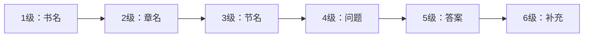
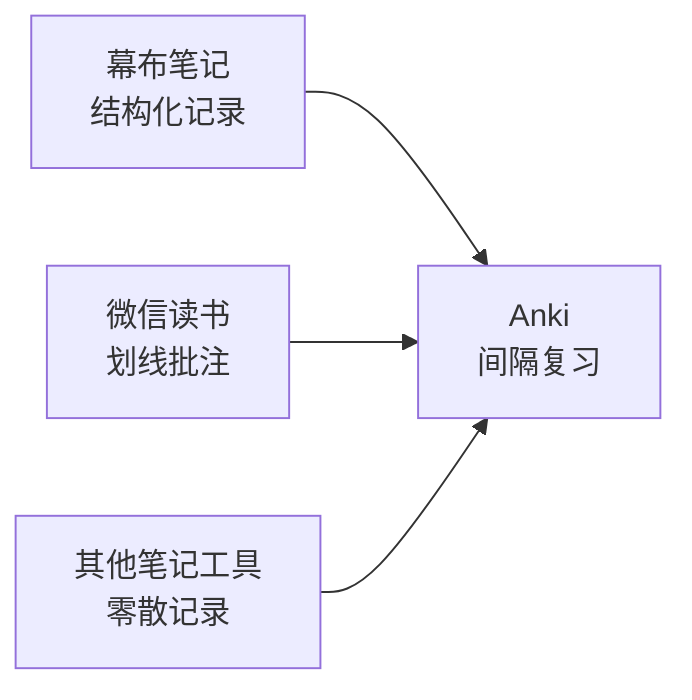

# 第12课：导入与联动

## 🎯 本课目标

- 了解通用的导入格式和选项
- 掌握从任意笔记工具导入的方法
- 掌握幕布笔记与Anki的联动
- 掌握微信读书与Anki的联动
- 理解"强强联合"的核心理念

---

## 一、通用导入知识

### 支持的格式

| 格式 | 扩展名 | 说明 |
|------|--------|------|
| Anki牌组包 | .apkg | 单牌组，导入不覆盖原有库 |
| Anki集合包 | .colpkg | 整个库，导入会覆盖 |
| CSV/TSV | .csv/.tsv | 通用文本格式 |
| 纯文本 | .txt | 一行一条笔记 |

### 导入选项详解

| 选项 | 说明 |
|------|------|
| **模板** | 选择导入笔记使用的模板 |
| **牌组** | 导入到哪个牌组 |
| **现有笔记** | 更新（新替旧）/ 保留（旧不变）/ 复制（新旧共存） |
| **匹配范围** | 仅模板 / 模板+牌组（判断重复的条件） |
| **字段匹配** | 导入文本与模板字段的对应关系 |

---

## 二、任意笔记工具导入（通用方案）

### 一句话/一段话笔记

**流程**：任意工具记一句话 → 保存为.txt → 导入Anki → 选浏览划线模板 → 可挖空成填空题

### 问答笔记

- 格式：以"问"开头的问题 → 换行 → 以"答"开头的答案
- 可与一句话笔记混合
- 支持特殊符号：双括号（高亮）、细方括号[ ]（标签+高亮）、粗方括号【 】（填空）

### 在线转换工具

没有.txt文件或手机不便创建文件时使用：

1. 粘贴笔记到在线转换工具
2. 点击处理→下载 .csv 文件
3. Anki→文件→导入

提供两种方案：自动分配牌组 / 自由选择目标牌组

---

## 三、幕布笔记导入

### 幕布的特点

- 大纲式笔记，适合记学科知识
- 三大快捷键：回车（新建）、Tab（降级）、Shift+Tab（升级）
- 支持一键切换思维导图模式

### 层级规范

| 层级 | 内容 | 对应Anki |
|------|------|---------|
| 1-3级 | 书名::章名::节名 | 多级标签 |
| 4级 | 问题 / 题干 | 问题字段 |
| 5级 | 答案 / 补充 | 答案字段 |
| 6级 | 补充说明 | 补充字段 |

### 两种笔记类型的区分

| 类型 | 标记 | 4级 | 5级 |
|------|------|-----|-----|
| 问答题 | 4级末尾加两个问号（??） | 问题 | 答案 |
| 浏览划线题 | 无两个问号 | 一句话/一段话 | 可选补充 |

### 支持的样式

加粗、斜体、下划线→填空题、高亮、超链接、删除线、代码块、颜色、描述（灰色小字折叠）

**不支持**：内部引用链接、部分公式、大图片

### 导入流程

1. 幕布笔记→导出OPML格式
2. 在线转换→上传OPML→处理→下载
3. Anki→文件→导入→选择下载文件
4. 已导入部分可标记为"完成"→下次自动忽略

### 标签与优先级管理

- 幕布中：空格 + #标签名 + 空格 → Anki中变成标签
- 设置"重要性高/低"标签→浏览窗口筛选→低优先级设置到期日分散复习

---

## 四、微信读书导入

### 三种笔记类型与自动分级

| 微信读书操作 | 对应Anki牌组 | 难度 | 学习方式 |
|-------------|-------------|------|---------|
| **划线** | 了解 | 低 | 浏览 / 可选挖空 |
| **批注**（写想法） | 理解 | 中 | 有思考加工 |
| **问答笔记**（批注中间答） | 掌握 | 高 | 深层加工 |

### 特殊符号

- 细方括号[ ]：关键词→标签+高亮
- 粗方括号【 】：填空内容→填空题

### 导入流程

1. 微信读书APP导出笔记（目前网页版导出有bug）
2. 在线转换→粘贴笔记→处理→下载
3. Anki→文件→导入

### 专题学习

- 不同书同主题→通过标签聚合→筛选牌组专题复习
- 学完一章→选中该章标签→创建筛选牌组→结构化复习
- 学完一本书→创建全书筛选牌组→整体回顾

---

## 五、核心理念

> **各工具做自己最擅长的事**：幕布/微信读书负责记录和整理 → 定期导入Anki → Anki负责间隔复习

- 保留原有记笔记习惯，不需要改变工作流
- 发挥各工具特长
- 多一份归档打印的备份
- 导入Anki后不需要回改原始工具——最终目的是记住

---

## 📝 自我检测

> [!QUESTION] Q1：幕布笔记导入Anki时如何区分问答题和浏览划线题？

查看答案

看第4级末尾是否有**两个连续的问号（??）**。有→问答题（4级问题+5级答案）；无→浏览划线题（4级一句话/一段话）。

> [!QUESTION] Q2：微信读书的三种笔记类型分别导入到哪三个牌组？

查看答案

**划线**→了解牌组；**批注**→理解牌组；**问答笔记**→掌握牌组。难度从低到高，适合用FSRS算法差异化安排。

> [!QUESTION] Q3：为什么说"导入Anki后不需要回改原始工具"？

查看答案

因为最终目的是**记住知识**，不是保持各工具间的一致。如果把时间花在来回同步修改上，反而挤占了复习时间。改了原始工具，还有教材、讲义——改不完的。

---

## ⚡ 今日行动

1. **选择一种导入方案**：根据你的使用习惯，选幕布方案或微信读书方案
2. **完成一次导入**：实际操作一次，从记笔记到导入Anki全流程
3. **检查重复笔记**：导入后检查匹配范围和重复处理选项是否合适

---

## 📚 延伸阅读

- 参考：[[reference/006-import-and-integration|导入与联动方案参考]]
- 参考：[[reference/003-recording-methods|记录方法体系参考]]