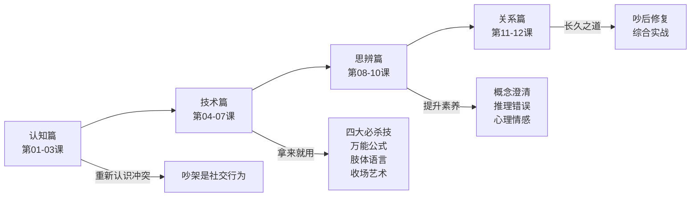

# 吵架课·学习路线图

> 系统学习吵架这门技术，一共12节课，四个模块。

## 模块一：认知篇（第01-03课）

> 目标：重新认识吵架，消除恐惧

| 课次 | 标题 | 核心问题 |
|------|------|----------|
| 第01课 | [[lessons/0001-cheng-zhi-ben-zhi|争执的本质]] | 吵架到底是什么？ |
| 第02课 | [[lessons/0002-wei-shen-me-chao-jia|为什么会吵架]] | 我们为什么吵？ |
| 第03课 | [[lessons/0003-chao-jia-ji-ji-mian|吵架的积极面]] | 吵架也可以是好事？ |

## 模块二：技术篇（第04-07课）

> 目标：掌握实战技巧，拿来就能用

| 课次 | 标题 | 核心技能 |
|------|------|----------|
| 第04课 | [[lessons/0004-si-da-bi-sha-ji|吵架四大必杀技]] | 四个不出错的边界原则 |
| 第05课 | [[lessons/0005-wan-neng-gong-shi|万能吵架公式]] | 多种话术模板 |
| 第06课 | [[lessons/0006-zhi-ti-yu-yan|肢体语言与气场]] | 不开口先赢一半 |
| 第07课 | [[lessons/0007-shou-chang-yi-shu|收场艺术]] | 吵得起来也收得回来 |

## 模块三：思辨篇（第08-10课）

> 目标：提升逻辑素养，看穿对方话术

| 课次 | 标题 | 核心能力 |
|------|------|----------|
| 第08课 | [[lessons/0008-gai-nian-xian-jing|概念的陷阱]] | 澄清概念，避免无效争论 |
| 第09课 | [[lessons/0009-tui-li-cuo-wu|常见推理错误]] | 识别七种神逻辑 |
| 第10课 | [[lessons/0010-xin-li-qing-gan|心理与情感]] | 内心强大才是真强大 |

## 模块四：关系篇（第11-12课）

> 目标：把冲突变成关系润滑剂

| 课次 | 标题 | 核心技能 |
|------|------|----------|
| 第11课 | [[lessons/0011-chao-hou-xiu-fu|吵后修复]] | 吵完架的三件必做之事 |
| 第12课 | [[lessons/0012-zong-he-shi-zhan|综合实战]] | 全流程场景演练 |

## 参考文档

- [[reference/glossary|吵架课术语表]] —— 术语速查
- [[reference/cheat-sheet|吵架万能话术速查表]] —— 拿来就用的回击话术

## 学习建议

1. **顺序学习**：建议按01→12顺序，前后知识点有依赖
2. **每课一练**：每课后都有自测题，务尝试回忆再看答案
3. **先认知后技术**：不要跳过认知篇直接学话术——心态不对，学了也用不好
4. **思辨篇最难**：第08-10课相对抽象，建议放慢节奏
5. **实战检验**：第12课综合实战可以反复练习，形成肌肉记忆