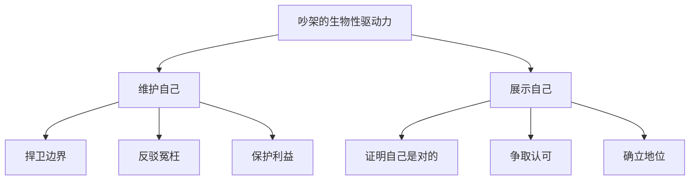

# 第01课：争执的本质：吵架是一种社交行为

## Learning Objectives

- 理解吵架作为一种社交行为的本质属性
- 认识吵架背后的生物性驱动力：维护自己与展示自我
- 破除对吵架的恐惧心理，将其视为可习得的技术

## Core Idea

很多人害怕吵架，这种恐惧并非源于吵架本身，而是源于三个层面的无力感：**不会吵、不能吵、不敢吵**。

- **不会吵**——缺乏吵架的技术和策略，不知道什么时候该说什么话；
- **不能吵**——受制于身份、场合、关系，觉得自己"没有资格"吵；
- **不敢吵**——害怕冲突带来的后果，担心关系破裂或被报复。

要克服这种恐惧，首先要回到原点：**吵架到底是什么？**

### 吵架是一种社交行为

从本质上说，吵架不是暴力，不是失控，而是一种 **社交行为**。无论你喜欢它还是厌恶它，它都是人与人之间发生互动的一种方式。就像谈判、闲聊、辩论一样，吵架是社交光谱上的一个正常组成部分。

既然是社交行为，就意味着它可以被学习、被练习、被优化。你不是天生就会谈判，同样也不是天生就"不会吵架"。

### 吵架的生物性驱动力

在生物层面，吵架的根本动机只有两件事：

**维护自己**——当你的边界被侵犯、利益被损害、名誉被污蔑时，吵架是一种本能的防御反应。它的目的是"停止伤害"。

**展示自己**——当你需要证明自己的观点、能力或立场时，吵架是一种主动的表达。它的目的是"我被看见、我是对的"。

> [!TIP] 关键认知
> 吵架不是情绪的失控，而是**社交的工具**。就像你不会因为要使用锤子而感到羞愧一样，你也不必因为要使用"吵架"而感到恐惧。关键在于——你是否掌握了使用它的方法。

### 把吵架当作一门技术

一旦你接受了"吵架是一种社交行为"这个设定，你的学习路径就清晰了：

1. **认知层面**——了解吵架的起因、目的、积极作用（本模块）
2. **技术层面**——学习吵架的话术、节奏、策略（后续模块）
3. **逻辑层面**——掌握论证结构、反驳技巧（后续模块）
4. **关系层面**——学会吵架后的修复与重建（后续模块）

## Worked Example

**场景**：同事在会议上抢先汇报了你的工作成果。

**错误的反应**：当场沉默，回去后越想越气，从此心生隔阂——这是"不敢吵"的典型表现。

**正确的思路**：把这件事看作一个**社交博弈**。对方的行为是在"展示自己"并侵犯了你的边界（"维护自己"的需求被触发）。你需要做的不是情绪爆发，而是用社交行为回应社交行为——例如在合适的时机补充说："刚才XX提到的这部分，我补充一下原始数据和调研过程。"

这不一定是"吵"，但本质上是同一类社交行为：你在维护自己的边界，展示自己的价值。

## Practice

> [!QUESTION] 自测
> 以下哪些属于"吵架是一种社交行为"的正确理解？（多选）
>
> 1. 吵架是失控的表现，情商低的人才会吵架
> 2. 吵架可以像谈判一样被学习和练习
> 3. 吵架的本质是为了维护自己或展示自己
> 4. 害怕吵架是因为不会吵、不能吵、不敢吵
> 5. 吵架不是社交行为，而是纯粹的情绪宣泄

查看答案

**正确答案：2、3、4**

- 选项1错误：吵架不是失控，它是一种有驱动的社交行为
- 选项2正确：吵架是一种社交行为，可以像其他社交技能一样被学习
- 选项3正确：生物性驱动力就是维护自己和展示自己
- 选项4正确：害怕吵架来源于这三个层面的无力感
- 选项5错误：吵架是一种社交行为，虽然可能伴随情绪，但不等于纯粹的情绪宣泄

## Next Step

吵架的本质是社交行为，但为什么我们会吵起来？下一课 [[0002-wei-shen-me-chao-jia|第02课：为什么会吵架：六大原因与目的]] 将深入分析吵架的六大根源和五种目的。