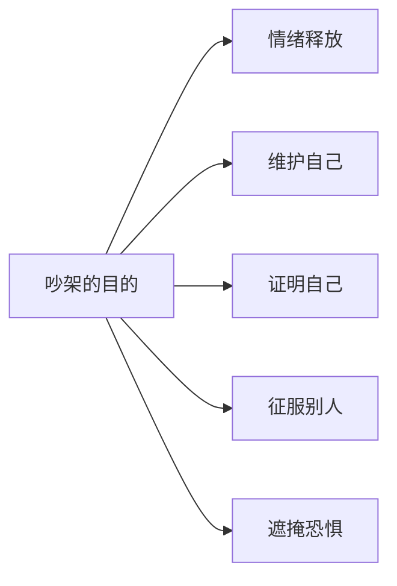

# 第02课：为什么会吵架：六大原因与目的

## Learning Objectives

- 识别引发吵架的六大根源原因
- 区分吵架的五种主要目的
- 能够对照自身经历，分析每一次争吵背后的真实动因

## Core Idea

了解了"吵架是一种社交行为"之后，我们需要进一步追问：**到底是什么触发了吵架？**

吵架不是无缘无故发生的。所有争吵的背后，都可以归因到六大原因之一或多种的组合。

### 吵架的六大原因

| 原因 | 核心感受 | 典型场景 |
|------|----------|----------|
| **被人冤枉** | 委屈 | 你没做过的事被安在头上，百口莫辩 |
| **被人戳到痛处** | 刺痛 | 对方精准地提到了你特别介意的地方——腿短、脸大、收入低等 |
| **侵害了你的利益** | 愤怒 | 插队、挡路、抢功劳——公共场合的争吵多半源于此 |
| **伤害了你的感情** | 心寒 | 亲友不尊重你、不理解你、忽视你的感受 |
| **纯情绪释放** | 崩溃 | 最近事事不顺心、样样不如意，一点小事就引爆 |
| **恐惧遮掩** | 心虚 | 做了亏心事，像刺猬一样装得很生气去伪装自己 |

> [!WARNING] 常见误区
> 很多人以为吵架的原因是"对方不讲道理"，但更常见的情况是：**你的原因和对方的原因不同**。你觉得是"利益被侵害"，他觉得是"被冤枉"——两个人吵的根本不是同一件事。识别原因，比争对错更重要。

### 吵架的五种目的

即便原因相同，每个人在吵架中想达成的目的也可能不同。目的决定了吵架的方式和走向：

1. **情绪释放**——不是为了解决问题，只是需要出口。这种吵架往往来得快去得也快
2. **维护自己**——捍卫边界和利益。这种吵架需要坚定而非攻击
3. **证明自己**——想要被认可、被看见。这种吵架容易陷入"一定要赢"的陷阱
4. **征服别人**——让对方屈服、认输。这种吵架最有破坏性
5. **遮掩恐惧**——用愤怒掩盖心虚。这种吵架往往伴随着逻辑漏洞

> [!TIP] 关键认知
> 同一个行为背后可能有不同的目的。下次吵架时，先问自己一句："我到底想要什么？"——是想要释放情绪？还是想要对方理解你？目的不同，策略完全不同。

## Worked Example

**场景**：伴侣忘记了你交代的重要事情。

**分析原因**：
- 表面原因：利益被侵害（事情没办成）
- 深层原因：感情被伤害（感觉对方不重视你）

**分析目的**：
- 如果你只是大吼几句然后消气 → 目的是情绪释放
- 如果你反复追问"你到底在不在乎我" → 目的是维护自己/证明自己
- 如果你要求对方写保证书并认错 → 目的是征服别人

**启示**：同一件事，不同的目的会导致完全不同的吵架走向。知道自己为什么吵，才能决定怎么吵。

## Practice

> [!QUESTION] 自测
> 请对照以下场景，判断它属于哪一类吵架原因，以及最可能的吵架目的。
>
> **场景**：地铁上有人踩了你的脚却没有道歉，你忍不住脱口而出"你没长眼睛吗？"
>
> 1. 原因是什么？
> 2. 目的是什么？

查看答案

**原因：侵害了你的利益**——你的身体空间被侵犯（被踩），加上对方没有履行基本社交礼仪（道歉），双重刺激触发了争吵。

**目的：维护自己**——你不是要征服对方，也不是要证明什么，而是要对方承认这个侵犯行为并给予基本的尊重（道歉）。

**补充思考**：如果当天你本来就心情不好，这个原因可能会叠加"纯情绪释放"，导致反应比平时激烈得多。

## Next Step

了解了吵架的原因和目的，你可能已经注意到了——吵架并不全是坏事。下一课 [[0003-chao-jia-ji-ji-mian|第03课：吵架的积极面：冲突是关系的润滑剂]] 将彻底颠覆你对吵架的负面认知。