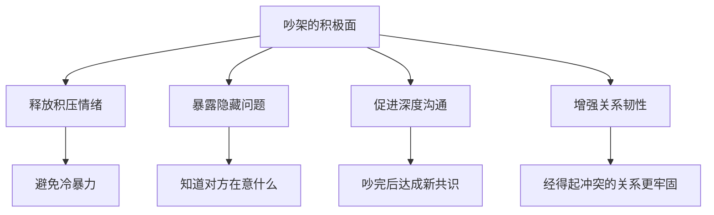

# 第03课：吵架的积极面：冲突是关系的润滑剂

## Learning Objectives

- 打破"吵架等于关系破裂"的认知偏见
- 理解吵架在关系中的正向功能
- 建立"高情商=会吵架"的新认知框架

## Core Idea

说到吵架，绝大多数人的第一反应是消极的：伤感情、丢面子、不体面。但如果我们回到第一课的结论——**吵架是一种社交行为**——那么它和所有社交行为一样，既有破坏性的一面，也有建设性的一面。

真正情商高的人，不是从不吵架的人，而是 **会吵架的人**。

### 吵架的积极功能

#### 能吵架的情侣不会散

在亲密关系中，一个反直觉的现象是：**能吵起来的情侣往往走得更远，吵不起来的反而容易散**。

原因在于：吵架本质上是一种**高强度的沟通**。当双方愿意吵，说明双方还在意这段关系，还愿意投入精力去争取、去表达、去碰撞。而那些连架都懒得吵的关系，往往已经进入了"情感死亡"状态——不在乎了，所以不吵了。

#### 不打不相识

"不打不相识"这句老话蕴含着深刻的社交智慧。冲突是一个 **快速了解对方底线的机制**：

- 吵一次架，你才知道对方真正的雷区在哪里
- 吵一次架，你才知道对方在压力下的沟通模式
- 吵一次架，你才知道这段关系的边界在哪里

#### 吵架可能让关系更好

高质量的吵架有一个关键的后续动作：**吵完之后，双方把之前积累的矛盾全部摊开并解决**。

这就像一个系统重启——平时积累的小摩擦、小误会，如果一直不说，就会变成暗伤；而一场恰如其分的争吵，把这些暗伤一次性暴露出来，然后彻底清理。吵完之后，关系不但不会破裂，反而会因为"问题被解决"而变得更紧密。

> [!TIP] 关键认知
> 破坏关系的从来不是吵架本身，而是**不会吵**和**吵后不修复**。吵架可以成为关系的体检工具——它暴露问题，而不是制造问题。

### 如何看待吵架

| 错误认知 | 正确认知 |
|----------|----------|
| 吵架是坏事 | 吵架是中性工具，好坏取决于如何使用 |
| 吵架代表关系不好 | 不敢吵架的关系才是真正脆弱的关系 |
| 情商高的人不吵架 | 情商高的人会吵架、会修复 |
| 吵架说明你不成熟 | 逃避冲突才是真正的不成熟 |

### 不要把吵架当作坏事

吵架是人际关系中不可避免的一部分。如果你把它当作"坏事"来回避，你只会：

1. 压抑自己的情绪，导致积累后的大爆发
2. 错失解决问题的时机，让小问题变成大问题
3. 在关系中变得越来越被动和无力

相反，如果你把吵架当作一种正常的社交技能来对待，你就可以在需要的时候使用它，在不需要的时候收放自如。

## Worked Example

**场景**：朋友连续三次约会迟到，每次都有理由。

**低情商处理**：每次都笑着说"没关系"，心里却越来越不满，最终在某件小事上爆发，友谊破裂。

**高情商处理**：在一次迟到后直接表达不满——"你这周三次都迟到，我感觉不被尊重。我们需要聊一下这个问题。" 双方就时间观念和互相尊重的问题展开对话（可能伴随争吵），最终达成共识。

**结果对比**：前者看似"维持了和谐"，实则失去了关系；后者看似"发生了冲突"，实则保住了关系。

## Practice

> [!QUESTION] 自测
> 判断以下说法是否正确：
>
> 1. 真正的情商高就是避免一切冲突
> 2. 能吵架的情侣不会散，吵不起来的反而容易散
> 3. 吵架过后只要把问题解决清楚，关系可能比以前更好
> 4. 吵架是一种社交行为，不应该被当作纯粹的坏事
> 5. 好的关系中不应该有吵架

查看答案

1. **错误**——真正情商高的人是会吵架的人，不是从不吵架的人
2. **正确**——愿意吵代表还在意这段关系；不吵往往意味着情感死亡
3. **正确**——高质量的吵架可以暴露隐藏问题并彻底解决，让关系更紧密
4. **正确**——这是本模块三节课的核心观点
5. **错误**——任何关系都会有冲突，关键在于如何处理冲突，而不是完全避免冲突

## Next Step

恭喜你完成了认知篇的全部三节课！你已经建立了对吵架的全新认识。在下一个模块中，我们将进入 **技术篇**——学习具体的话术、节奏和策略，把认知转化为实战能力。