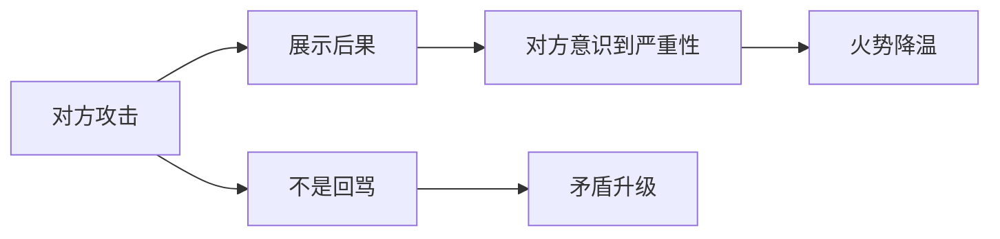

# 第04课：吵架四大必杀技

## Learning Objectives

- 掌握吵架中阻止矛盾升级的四个实操原则
- 理解"不要想赢"这一核心心态对胜负的颠覆性影响

## Core Idea

吵架不是辩论，不能靠逻辑取胜。本课传授四大必杀技，每一招都针对最常见的吵架陷阱，帮助你在激烈冲突中保持战术清醒。

### 必杀技一：不让矛盾升级

**只揪这个点，不该讲的别讲。**

很多人一吵架就翻旧账，把半年前、甚至十年前的事全翻出来；还有人情绪上头后问候对方祖宗十八代。这种做法是典型的**双输**——矛盾被无限放大，双方都收不了场。

> [!tip] 实操要点
> 情绪也许控制不住，但嘴巴里吐什么还是可以控制的。反复问自己：**我现在说的话，是在解决当前这个点，还是在火上浇油？**

### 必杀技二：不扩大范围

**不要拉第三个人进来。**

跟 A 吵，最后跟 B 打起来；明明是两个人的争执，非要把亲戚朋友全卷进来——这些都是范围扩大。人越多，情绪越杂，问题越难收场。

| 错误做法 | 正确做法 |
|---------|---------|
| 把对方家人拉进来骂 | 只针对当事人 |
| 找朋友站队、帮腔 | 独立面对冲突 |
| 在公开场合吵给更多人看 | 尽量私下一对一解决 |

### 必杀技三：不讲道理

**吵架是纯主观的。**

讲道理只会让你越来越生气，因为对方根本不会跟你讲道理——他会胡搅蛮缠、偷换概念、转移话题。你越认真讲理，越容易被拖入对方的节奏，情绪越失控。

> [!important] 关键认知
> 吵架的目的是表达情绪、划定边界，不是分出谁对谁错。想讲道理？等双方都冷静了再说。

### 必杀技四：把怒气发泄到后果上面（结果展示）

**不是骂对方，而是强调后果。**

举例："如果你一定要这样，今天我就死在这里。"

这句话的力量在于——它不是攻击对方，而是展示一个**血淋淋的结果**。就像影视剧里往自己身上捅刀子的桥段：让对方看到后果的严重性，反而会让对方的怒气有所收敛。

这个技巧给双方都敲响警钟，起到**降温**作用。

### 核心原则：不要想赢

真正想赢的人，反而会输得更惨。

**赢在人心，赢在损失最小，不是赢在胜负。** 如果一场架吵赢了但关系破裂、双方受伤，那叫双输。真正的赢，是及时止损、留有余地。

> [!quote] 易士老师
> 不要把"赢"定义为压倒对方，而要把"赢"定义为——**事态没有变得更糟**。

## Worked Example

**场景：** 伴侣因为忘记洗碗这件小事开始翻旧账。

**错误示范：**
A："你上周也这样！上个月也是！你从来不做家务！"
B："你还好意思说我？你上次……"
→ 矛盾升级，互揭伤疤，全面开战。

**四大必杀技应用：**
1. **不让升级：** 只说"今天没洗碗"这一件事
2. **不扩大：** 两个人私下说，不找父母评理
3. **不讲道理：** 不说"你应该怎样怎样"，而是表达感受
4. **展示后果：** "如果你一定要每次都这样翻旧账，那我们以后没法沟通了"

## Practice

> [!question] 自测题
> 以下哪些行为违反了四大必杀技？（多选）
>
> 1. 吵架时把对方三年前的错误翻出来
> 2. 只针对当前发生的事进行沟通
> 3. 拉上朋友一起找对方对质
> 4. 认真跟对方论证谁对谁错

查看答案

**答案是 1、3、4。**

- 1 → 违反"不让矛盾升级"，翻旧账只会火上浇油
- 3 → 违反"不扩大范围"，拉第三个人进来
- 4 → 违反"不讲道理"，吵架时讲道理是徒劳的

## Next Step

Continue with the next lesson or complete the review task above before moving on.