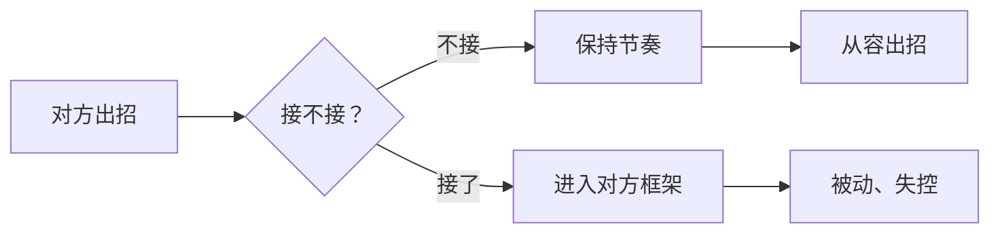

# 第05课：万能吵架公式与实战话术

## Learning Objectives

- 掌握冷静三要素，避免被对方牵着鼻子走
- 学会万能公式、人格否定法、"对对对"破解法、反衬托吵架法四套话术

## Core Idea

上一课讲了四大必杀技的战略原则，本课进入**战术层面**——给你可以直接用的话术模板。

### 第一步：冷静三要素

在出招之前，先稳住自己。任何技巧发挥的前提是**你不乱**。

1. **不接他的话** —— 对方说什么你别顺着往下接，拒绝进入他的叙事框架
2. **不顺着他思考** —— 保持自己的节奏，别被他带偏
3. **保持冷静** —— 情绪稳定才有语言质量

### 万能公式：三分嘲笑三分凉薄四分漫不经心

来自吵架气人教程，适合**终结对话**的场景：

1. 先三分嘲笑、三分凉薄、四分漫不经心地盯着对方两秒
2. 冷笑一声，看向旁边
3. 转过头来，挑眉瞪着对方说：
   > "你不觉得自己很**小肚鸡肠/没有教养/三观不正/戾气太重**吗？"
4. 翻个白眼，迅速撤离战场

这个公式的精髓不在话的内容，而在**姿态和节奏**——停顿、冷笑、挑眉、翻白眼，整套动作做完，杀伤力远大于语言本身。

### 人格否定法

不攻击对方的逻辑漏洞，而是攻击对方的**"自我方式"**。

> "你说的话很没有逻辑，而且前后矛盾，你自己想想。"
> "我觉得咱们已经没有必要再谈下去了。"

为什么有效？因为逻辑漏洞可以争辩，但**人格层面的否定**让对方无法反驳——一旦反驳就等于承认自己在意。这种方式相当于**单方面宣布对话结束**，把主动权牢牢抓在手里。

### "对对对"破解法

当对方用敷衍的"对对对"来应付你时，不要生气。用**居高临下的姿态 + 微笑**回击：

> "这么多年你悲惨的人生，不就是一直在卑躬屈膝、对所有人按全马首是瞻中度过吗？"
> "没想到跟你萍水相逢，你这么认同我的观点。"

> [!tip] 使用前提
> 用这套话术前，确保你已经做好了**随时结束对话**的准备。这是终结技，不是起手式。

### 反衬托吵架法

当对方用侮辱性词汇攻击你（例如"真的很恶心"），平静地回应：

> "是吗？我也这么觉得。你有一个很善于发现的眼睛。"

然后平静地让对方**"展开说说"**。

这一招的原理是**不接对方的情绪**——对方想看你生气，你偏不生气。你越平静，对方越显得歇斯底里。角色瞬间反转。

## Worked Example

**场景：** 同事在公开场合批评你的工作，语气充满攻击性。

**人格否定法应用：**
同事："你这个方案根本不行，数据全是错的！"
你（平静地）："你说的话很没有逻辑，而且前后矛盾，你自己想想。我觉得咱们已经没有必要再谈下去了。"
→ 你终结了对话，对方被迫消化自己的情绪。

**反衬托法应用：**
同事："你这个方案真的很恶心。"
你（微笑）："是吗？我也这么觉得。你有一个很善于发现的眼睛。展开说说？"
→ 气氛瞬间变得微妙——对方成了那个"找茬的人"。

## Practice

> [!question] 自测题
> 对方对你大喊："你就是一个不负责任的人！"
>
> 请用三种不同的方法回应（人格否定法 / 万能公式 / 反衬托法），各写一句回应。

查看答案

**人格否定法：** "你说的话很没有逻辑，我觉得我们已经没有必要再谈下去了。"

**万能公式：** （冷笑 + 挑眉）"你不觉得自己**戾气太重**吗？"

**反衬托法：** "是吗？你有一个很善于发现的眼睛。"

## Next Step

Continue with the next lesson or complete the review task above before moving on.