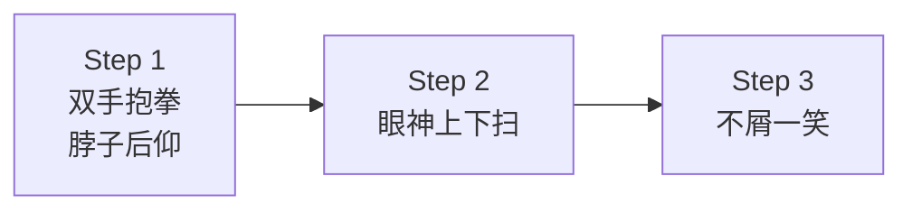

# 第06课：肢体语言与气场管理

## Learning Objectives

- 掌握肢体语言三步法，在开口前建立气场优势
- 学会用法律话术预防冲突升级为暴力

## Core Idea

吵架不只是语言博弈。在你开口之前，你的**肢体语言**已经在说话。本课教你如何用最小的幅度，发挥最大的肢体语言效果；以及如何在必要时用法律话术震慑对方，防止暴力升级。

### 肢体语言三步法

来自吵架教程第二期，吵架时的标准肢体动作：

**Step 1：双手抱拳，脖子往后仰**

这个姿态传递的信息是：**你不在我的威胁范围内**。抱拳是防御性的自信，后仰则拉开距离，表示"你够不着我"。

**Step 2：眼神上下扫**

不要盯着对方的眼睛——上下打量对方全身，像是在**评估一件物品**。这种眼神极其具有蔑视效果，会让对方瞬间感到被看低。

**Step 3：给对方一个不屑的笑**

嘴角微微一翘，不是大笑，是那种**看穿一切**的淡笑。配合眼神上下扫，整套动作构成完整的"你在我这里什么都不算"的信号。

> [!tip] 最小幅度原则
> 不是动作越大越好。恰恰相反——**幅度越小，气场越强**。大幅度的指手画脚只会暴露你的情绪不稳，小幅度的精准动作才显得从容不迫。

### 用最小的幅度，发挥最大的肢体语言

这个原则贯穿整个肢体语言体系：

| 动作 | 错误（幅度大） | 正确（幅度小） |
|------|--------------|--------------|
| 表达不屑 | 大声冷笑、翻白眼 | 嘴角微翘、轻轻移开视线 |
| 表达自信 | 拍桌子、指人 | 抱拳、后仰、不动声色 |
| 表达蔑视 | 上下跳脚 | 眼神缓慢上下扫一遍 |

关键在于**控制感**——每个动作都是你主动选择的，不是情绪支配的。

### 法律话术防暴力

冲突升级到一定程度，对方可能想动手。这时候需要用**法律话术**来震慑：

> "根据治安管理处罚法第43条，殴打他人，处5日以下拘留；如果情节严重，刑法第234条，处3年以下有期徒刑。"
> "这一拳打下来，你的孩子以后可能就没法考公进体制了。"

这套话术的价值：

1. **让对方意识到后果** —— 很多人动手是一时冲动，没想过代价
2. **把冲突拉到理性层面** —— 从情绪对抗变成成本计算
3. **给你争取脱身时间** —— 对方一愣神的功夫，你可以拉开距离或离开现场

> [!warning] 安全第一
> 法律话术的目的一定是**给自己争取安全空间**，而不是挑衅对方。说完后不要等对方回应，立刻拉开距离或离开现场。

## Worked Example

**场景：** 对方情绪激动，一边骂一边逼近你，看起来要动手。

**错误应对：**
你也迎上去、指对方、大声对骂 → 肢体接触风险极高。

**正确应对：**

1. 双手抱拳，脖子微仰（拉开距离 + 防御姿态）
2. 眼神上下扫对方全身（传递"你构不成威胁"的信号）
3. 淡淡一笑（不屑，不是挑衅）
4. 如果对方继续逼近，冷静说出法律话术：
   > "根据治安管理处罚法第43条，殴打他人，处5日以下拘留。"
5. 说完立刻后退，离开现场

## Practice

> [!question] 自测题
> 以下哪些做法符合"最小幅度原则"？
>
> 1. 吵架时大幅度挥手、指指点点
> 2. 双手抱拳、脖子微微后仰
> 3. 用眼神上下慢慢扫视对方
> 4. 大声拍桌子站起来

查看答案

**答案是 2、3。**

- 2 → 抱拳后仰是安静但有力的姿态，符合最小幅度原则
- 3 → 用眼神而非动作表达蔑视，精准控制
- 1 和 4 → 幅度过大，暴露出情绪失控

## Next Step

Continue with the next lesson or complete the review task above before moving on.