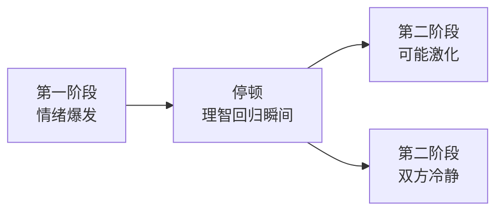

# 第07课：收场艺术：高潮过后的关键一句话

## Learning Objectives

- 识别吵架中的"理智回归瞬间"，并用一句话收场
- 理解"不要想赢"在收场阶段的实战意义

## Core Idea

吵得再凶，总有停下来的时候。真正的高手不仅会吵架，更会**收场**。本课教你如何在恰当的时候说出关键一句话，给双方台阶下，把损失降到最低。

### 吵架的两个阶段

吵架一般分为两个阶段：

**第一阶段：情绪爆发。** 双方都在情绪顶峰，说什么都没用。

**停顿：关键节点。** 可能是双方都吵累了，或者某一句话让场面突然安静。这个停顿极其重要——

> **停顿的瞬间，是双方理智回归的瞬间。**

这个瞬间稍纵即逝：要么双方借机冷静下来，要么重新进入更激烈的第二轮。

### 高潮过后的关键一句话

在这个理智回归的瞬间，说出关键一句话：

> **"算了吧，别吵了，都没意义。"**

这句话的力量在于：

- **给对方台阶下** —— 对方正愁怎么收场，你递了梯子
- **给自己台阶下** —— 你也体面地退出了战斗
- **终止损失** —— 吵下去只有双输，停在这里损失最小

> [!tip] 劝架的红利
> 如果你在场劝架，也要在这个**停顿的瞬间**介入。早了没用（对方听不进去），晚了来不及（已经进入第二轮）。

### 不要想赢（重申）

这是第04课核心原则的再次强调。

**真正想赢的人，反而会输得更惨。** 在收场这个环节更是如此——如果双方都憋着"我必须赢"的念头，谁也不肯先低头，那么一个小小的停顿之后，迎来的将是更猛烈的第二轮冲突。

| 心态 | 结果 |
|------|------|
| 想赢 | 不肯让步 → 矛盾持续升级 → 双输 |
| 不想赢 | 主动递台阶 → 及时止损 → 赢在损失最小 |

> [!quote] 易士老师
> "算了吧，别吵了，都没意义"——这句话不是认输，而是**最高级的不想赢**。你主动结束了一场没有意义的战争，你就是赢家。

### 收场后的状态

说出关键一句话后，不要继续纠缠。给对方时间消化，也给自己时间平复。收场之后：

- 不要追加"但是……"（追加等于重新开战）
- 不要等对方道歉（收场的目的是止损，不是分对错）
- 尽快物理上离开现场（给双方真正的冷静空间）

## Worked Example

**场景：** 你和朋友因为某件事大吵一架，双方都沉默了3秒钟。

**错误做法：**
（沉默后）"但是你刚才说的那一点我还是不同意……"
→ 重新开战，刚才的沉默白费了。

**正确做法：**
（在沉默的瞬间，放低声音）
"算了吧，别吵了，都没意义。"
→ 双方都有台阶下，各自冷静。

## Practice

> [!question] 自测题
> 以下哪个时刻是说出"算了吧，别吵了，都没意义"的最佳时机？
>
> 1. 对方刚说完话、情绪最激动的时候
> 2. 双方都沉默了几秒钟的停顿瞬间
> 3. 自己刚被对方戳中痛处、想反击的时候
> 4. 吵完架一个星期后发微信说

查看答案

**答案是 2。**

- 1 → 对方还在情绪顶峰，听不进去
- 2 → 理智回归的瞬间，正是最佳时机
- 3 → 你想反击说明还在情绪中，不适合收场
- 4 → 太晚了，已经错过当面收场的窗口

## Next Step

Continue with the next lesson or complete the review task above before moving on.