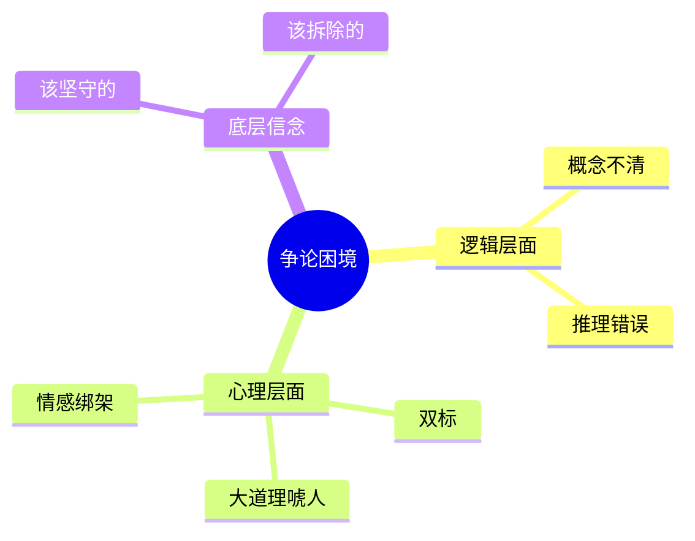

# 第10课：心理与情感：比逻辑更底层的力量

## Learning Objectives

- 理解为什么许多推理错误的根源是心理问题而非逻辑问题
- 识别"大道理唬人"和"双标现象"的心理机制
- 建立"底层信念"的概念框架，学会区分该坚守和该拆除的信念

## Core Idea

很多人犯推理错误，不是逻辑不好——恰恰相反，是**逻辑太好了**。他知道自己想要什么结论，所以能快速切换前提来适应结论。这不是逻辑问题，是**心理问题**。

### 内心强大比头脑好使更重要

双标（双重标准）的本质是什么？是信奉**彼此矛盾的前提**，根据实际需要跳来跳去。

- "学校是我家，安全文明靠大家" → "你还真把学校当自己家？"
- "爸爸妈妈这么做都是为了你好" → "你这么说就不考虑爸爸妈妈的感受吗？"

每一句话单独看似乎都有道理，但组合在一起就自相矛盾。能如此自如地在矛盾前提之间切换的人，逻辑能力并不差——他知道从哪个前提出发能得出自己想要的结论。问题在于：他缺乏**在矛盾面前保持一致的勇气**。

内心脆弱的人面对大道理会先投降。而内心强大的人能保持冷静，拆解对方的语言策略。

### 大道理唬人

大道理本身是对的，但不一定适用于具体情况——它的力量不在于正确性，而在于**气势**。

- "人不能想怎么样就怎么样" → "所以你必须来上课"
- "没有绝对的自由" → 据此剥夺你所有自由

大道理之所以能唬人，是因为：
1. 它听起来对，反驳它似乎就在挑战公理
2. 内心脆弱的人会先自我怀疑："我是不是太任性了？"
3. 一旦接受了前提，推导出的具体结论就难以拒绝

破解方法：承认大道理本身是对的，但质疑它的**适用范围**。"人确实不能想怎么样就怎么样，但这跟'我必须来上课'之间还需要论证，不能直接划等号。"

### 底层信念与内心迷宫

如果把人的内心比作一座迷宫，那么迷宫的墙壁就是我们的**底层信念**。

> [!TIP] Key Insight
> 每个人的内心都由底层信念的墙壁构成迷宫。人与人之间的巨大差异，本质上是内心迷宫的结构不同。正确的底层信念要坚守，错误的要拆除。

做一个勇敢的**"破壁者"**，意味着：
- 审视自己信念体系中的每一堵墙
- 判断它是保护性的（该坚守）还是限制性的（该拆除）
- 对于限制性的信念，主动打破它，哪怕过程痛苦

### 只强调原则不提供方法

这是另一种常见的心理操控方式：用正确的原则掩盖方法的缺失。

- "要多读文献" —— 原则没错，但怎么读？读哪些？读到什么程度？
- "要有问题意识" —— 原则没错，但怎么发现问题？
- "具体问题具体分析" —— 原则没错，但怎么分析？

只谈原则不谈方法，本质上是**把论证责任推给了对方**。指出这一点并不难：承认原则的正确性，然后追问方法。

## Worked Example

**场景**：孩子不想去上补习班，妈妈说"人不能想怎么样就怎么样，你以后就知道了"。

**问题分析**：

这是典型的**大道理唬人**。"人不能想怎么样就怎么样"是一个原则上正确的陈述，但它被用来论证"必须去上补习班"这一具体结论。

这里存在的跳跃：
1. "人不能想怎么样就怎么样"是普遍性原则，适用于一切人
2. "不去上补习班"并不意味着"想怎么样就怎么样"
3. 孩子可能有充分的理由不去——比如补习班效率低下、身体疲劳、或者有其他更重要的安排

**破解方法**：
1. 先同意大道理："你说得对，人确实不能想怎么样就怎么样"
2. 再缩小适用范围："但是，不去补习班不等于任性，我们来具体说说今天为什么不想去"
3. 将讨论从"原则层面"拉回到"事实层面"

## Practice

> [!QUESTION] Self-check
> 以下场景中，孩子面临的是什么样的心理困境？应该如何应对？
>
> 爸爸对孩子说："爸爸妈妈这么做都是为了你好，你这么说就不考虑爸爸妈妈的感受吗？"
>
> 请分析这句话中的"双标"现象，并给出应对策略。

Reveal answer

**双标分析**：

这句话同时使用了两个原则，但这两个原则是自相矛盾的：
- 原则A："我们要为你考虑，所以你得听我们的" —— 强调父母权威
- 原则B："你怎么不考虑我们的感受" —— 强调孩子要体谅父母

如果"为你好"是正当的，那孩子的反对也应该基于同样的逻辑被认真对待，而不是反过来被指责"不考虑感受"。矛盾在于：**当原则A遇到挑战时，发言者没有反思原则A是否成立，而是跳到原则B来压制对方**。两套标准之间没有一致性，只有实用主义的选择。

**应对策略**：
1. 不要陷入"谁考虑谁的感受"的情感辩论
2. 温和地指出矛盾："你们说为我好，我说我的想法，这不就是在互相考虑吗？为什么我的感受需要考虑，你们的感受也需要考虑，但我的想法还是被否定了呢？"
3. 将话题拉回到具体事务："不如我们具体说说这件事为什么对我好"

## Next Step

至此，思辨篇的全部三节课已经完成：从概念澄清到推理识别，再到心理洞察。接下来请进入**实战篇**，学习如何在真实对话中运用这些工具。