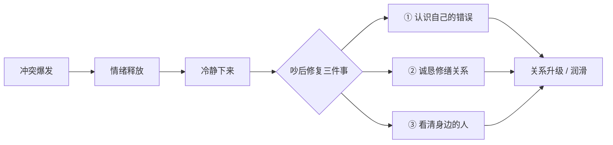

# 第11课：吵后修复：吵完架才是真正的关键

## Learning Objectives

- 理解吵架不是社交关系的终点，而是修复关系的起点
- 掌握吵后反思的三个维度：自身错误、关系修缮、人际甄别
- 学会把冲突转化为关系润滑剂的具体方法

## Core Idea

很多人怕吵架，是因为潜意识里把吵架当成"社交行为的终止"——一旦吵起来，关系就完了。但恰恰相反，**吵完架之后才是完善关系的时候**。

吵架是一场情绪的集中释放，而释放之后的空白地带，恰恰是建立更深连接的黄金窗口。能不能把吵架变成好事，完全取决于吵完之后怎么做。

### 第一件事：认识自己的错误，改变自己

吵架时人往往会觉得"都是对方的错"，但冷静下来后需要问自己三个问题：

- **我为什么吵？**——表面原因和真实原因分别是什么？
- **我哪些地方做得不对？**——语气、措辞、时机，总有一个可以改进的点
- **有没有更好的方式？**——如果重来一次，我会怎么表达？

> [!CAUTION] 不能总在一个地方跟人吵架
> 如果每次吵架都是因为同一个原因、同一个模式，说明你根本没有从上一场冲突中学到东西。重复踩同一个坑，不是对方的问题，是你的问题。

### 第二件事：尽最大努力、用最诚恳的态度去修缮关系

人什么时候最脆弱？**吵完架之后**。

刚吵完架的那段时间，双方的情绪防线都处于开放状态。这个时候去建立联系，比原来轻松得多——原来可能需要各种讨好、各种铺垫，现在可能一句真诚的"对不起"就能让关系更近一层。

> [!TIP] Key Insight
> 跟陌生人吵完架，说一句"兄弟别吵了，交个朋友"——真的就没事了。陌生人之间的冲突往往只差一个台阶。

修缮关系的关键在于**态度要诚恳**，而不是敷衍了事。对方能分辨出你是真心道歉还是走个过场。

### 第三件事：通过吵架看清身边的人

吵架是情绪的即时爆发，这个时候人的反应最真实、最不加掩饰。通过观察身边人在吵架时的表现，可以快速识别谁值得深交。

| 吵架时身边的人 | 真实面目 | 你的应对 |
|:---|:---|:---|
| 在旁边怂恿你的人 | 看热闹不嫌事大，甚至想借你的火达到自己的目的 | **远离**——没几个好货 |
| 拼命拉住你的人 | 真正在意你的利益和形象，怕你吃亏 | **珍惜**——这是真心朋友 |
| 默默走开的人 | 不想卷入是非 | 理解，但不一定是深交对象 |

> [!NOTE] 吵架应该是社交的润滑剂，不是一把火烧掉身边所有东西
> 冲突本身是中性的，它是好是坏完全取决于你怎么处理善后。用得好，一次冲突可以让人际关系更加牢固；用得不好，它确实能毁掉多年积累的信任。

## Worked Example

**场景：** 你和同事因为项目分工问题大吵了一架，双方都说了一些难听的话。

**吵后修复三步走：**

1. **认识错误：** 冷静后反思，发现自己在吵架时用了攻击性的语言（"你从来都不负责任"），把具体问题上升到了人格否定。这个问题在之前的冲突中也出现过。
2. **修缮关系：** 第二天主动找同事，诚恳地说："昨天我话说重了，尤其是那句关于你责任感的评价，是我的问题。分工的事我们可以再聊，但我先为我的语气道歉。"
3. **看清身边的人：** 回想吵架过程中，坐在旁边的另一位同事一直在轻声说"先冷静一下，别说了"——这个人值得信任。而另一个同事则在群里发了几句煽风点火的话——今后需要保持距离。

## Practice

> [!QUESTION] Self-check
> 回想你最近经历的一次冲突（或想象一个场景），按照本课的三件事写一份"吵后修复计划"：
> 1. 在这次冲突中，你自己的错误是什么？
> 2. 你会用什么方式、在什么时间去修缮关系？
> 3. 通过这次冲突，你观察到了身边人什么样的反应？

参考示例

假设你和朋友因为聚会安排吵了一架：

1. **自己的错误：** 没有提前表达自己的时间限制，到了现场才抱怨。吵架时说了"你从来不考虑别人"——这是以偏概全的扩大化攻击。
2. **修缮方式：** 第二天发消息："昨天是我没安排好时间，提前说清楚就好了。我说的话有点重，你别往心里去。下次提前沟通时间，你看行不行？"
3. **人际观察：** 当时在场的另一个朋友一直在打圆场，帮忙调节氛围——这是值得深交的人。

## Next Step

完整的"吵"流程已经走完——从准备、入场、防守、攻击到修复。下一课是**综合实战**，我们会把前11课的所有工具运用到三个真实场景中，看看这些技巧如何组合使用。

Continue with the next lesson or complete the review task above before moving on.