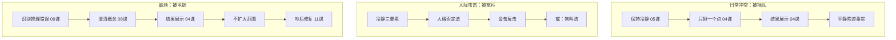
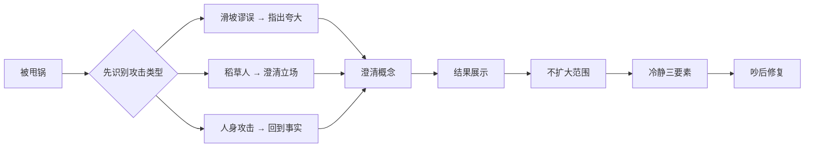

# 第12课：综合实战：从日常冲突到职场辩论

## Learning Objectives

- 综合运用前11课的核心技巧应对真实冲突场景
- 在不同类型的冲突中快速识别适用的策略
- 强化"目的不是赢，是解决问题"的核心意识

## Core Idea

本课将前11课的工具综合运用到三个典型场景中。每个场景都不是单一技巧的展示，而是多种策略的组合运用。

### 场景一：日常冲突——被插队

这是最常见的公共场合冲突。很多人要么忍气吞声，要么爆发成争吵。以下是系统化的应对流程：

**第一步：保持冷静（第05课 万能公式）**
深呼吸，不要被插队者的态度带偏。你的目标是让对方意识到行为有问题，而不是跟他比谁嗓门大。

**第二步：只揪插队这个点，不扩大范围（第04课 必杀技）**
不要说"你们这些人真没素质"（扩大化），也不要说"你是不是赶时间啊"（帮对方找理由）。只盯住一个点：**他插队了**。

**第三步：用结果展示让对方意识到后果（第04课 结果展示）**
"你插队的话，后面的人都要多等，你觉得公平吗？"

**第四步：用平静的语调指出事实**
语气是关键。平静、清晰、不带攻击性地陈述："你好，队伍在后面，请到后面排队。"

> [!TIP] Key Insight
> 平静本身就是一种力量。当对方情绪激动而你保持冷静时，围观者的天然同情会站在你这边。

### 场景二：被人身攻击

当对方开始骂你个人、贬低你的人格时，不要掉进他设定的战场。

**第一步：冷静三要素**
- **不接话**——不回应对方的人身攻击内容
- **不顺着他思考**——不在他的逻辑框架里辩论
- **保持冷静**——你的情绪稳定就是最大的武器

**第二步：人格否定法**
用居高临下的冷静回应对方：
> "我不会跟你一般见识，我很理解你的心情。"

这句话的精髓在于：你把自己放在更高的心理位置，否定了对方与你对等争论的资格。

**第三步：高级金句（可选）**
> "你对我的诋毁，构不成千分之一的我，却暴露了一览无余的你自己。"

这句话杀伤力极大，但使用时需要注意场合和语气——平静地说出来，不要带着愤怒。

**第四步：狗叫法（备选方案）**
如果对方纠缠不休，可以使用"狗叫"策略——**反复使用同一句话**回应对方的任何攻击：
- "你说的对。"
- "你说的对。"
- "你说的对。"

这个方法的本质是拒绝进入对方的辩论框架，同时不给他继续升级的理由。

> [!WARNING] 狗叫法适用场景
> 这个方法只适用于对方已经失去理性、无法正常沟通的情况。在有第三方在场时使用效果更佳，因为旁观者能看出谁在无理取闹。

### 场景三：职场被甩锅

职场冲突是最需要策略的场景，因为不能简单地"赢了就走"——你还要继续跟这些人共事。

**第一步：识别对方的推理错误（第09课）**
职场甩锅常用的逻辑谬误：
- **滑坡谬误：** "如果你这次没做A，以后整个项目都会崩溃"——识别并指出对方在夸大后果
- **稻草人：** "你的意思就是不想负责任"——先澄清自己真正的意思
- **人身攻击：** "你就是个不靠谱的人"——回到事实层面，不接人格评价

**第二步：澄清概念（第08课）**
当对方用模糊的标签扣帽子时，要求对方具体化：
> "你刚才说我不负责任，请问我具体哪件事做得不负责任？"

这一问能把模糊的指责变成具体的事实讨论，让对方无法继续用大词压人。

**第三步：用结果展示提醒对方后果（第04课）**
> "如果按照你说的方式处理，最后的结果会是这样……你觉得这是大家想要的结果吗？"

**第四步：不扩大范围，不拉其他人进来**
职场冲突最容易犯的错误就是把无关的人卷进来。管好自己的嘴，不要试图拉帮结派。

**第五步：冷静三要素贯穿始终**
无论对方怎么说，保持冷静、不接人身攻击的招、不顺着对方的情绪走。

**第六步：吵完后记得修缮职场关系（第11课）**
> "刚才讨论得比较激烈，但都是为了工作。如果有说得不恰当的地方，你别介意。"

> [!CAUTION] 不要想赢（第04课、第07课反复强调）
> 在职场尤其重要——目的是解决问题，不是证明自己对。当你发现讨论方向从"解决问题"变成"证明谁对"时，主动拉回来。

## Practice

> [!QUESTION] Self-check
> **场景设计：** 你在一场团队会议上被同事公开指责："你总是拖延，导致整个项目进度落后。你根本不适合做这个岗位。"
>
> 请用本课学到的综合技巧，写出你的完整应对流程（至少包含：识别谬误类型、澄清概念、结果展示、吵后修复各一步）。

参考应对流程

1. **识别谬误：** "你总是拖延"——这是以偏概全和人身攻击。把一次或几次行为上升到了人格评价。
2. **澄清概念：** "你说的'拖延'具体指哪一次任务？我们先把具体问题列清楚，而不是用'总是'来概括。"
3. **结果展示：** "如果继续用这种方式讨论，我们今天的会就变成了互相指责，问题反而解决不了。你是想解决问题，还是想追责？"
4. **不扩大范围：** 不要拉其他同事站队，也不要翻旧账说"上次你也……"。
5. **吵后修复：** 会议结束后单独找这位同事："今天会上讨论得比较激烈，如果我说的话让你不舒服，我道歉。但我们确实需要把流程理顺，你看要不要一起理一下分工？"

## Next Step

至此，本课程的主体内容已经全部完成。你已经掌握了从认知准备、技术策略到关系修复的完整吵架体系。如果需要复习，建议回到第01课重新梳理整个框架，或者选择你最薄弱的环节进行针对性练习。

Continue with the next lesson or complete the review task above before moving on.