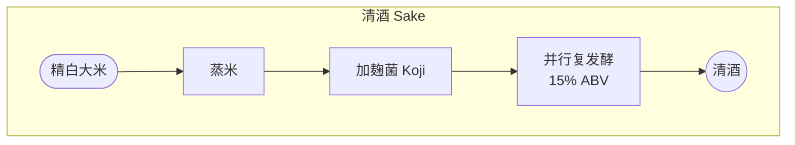
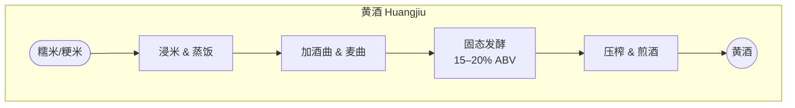
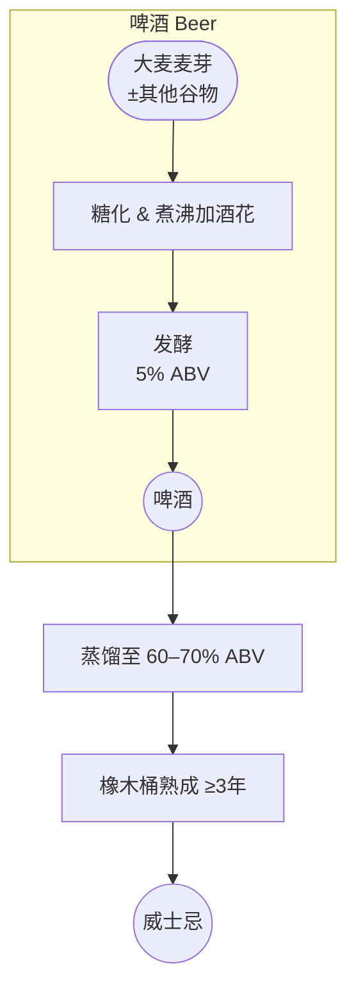
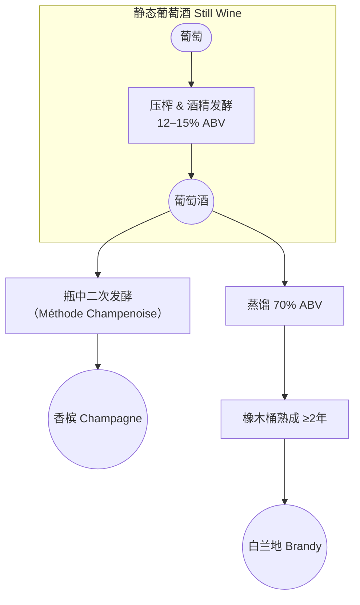
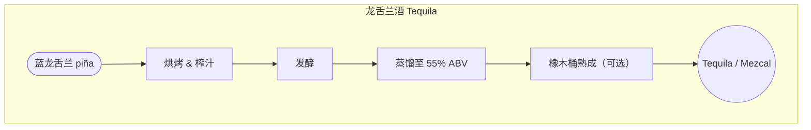
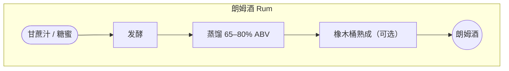
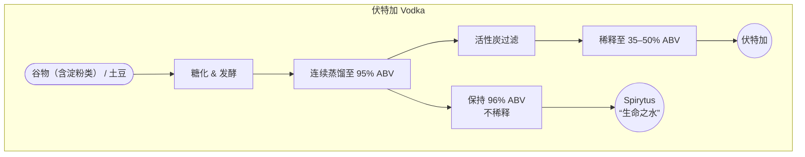

大米发酵就是清酒
糯米发酵就是黄酒
大麦发酵就是啤酒再蒸馏就是威土忌
葡萄发酵就是葡萄酒 加气就是香槟 蒸馏就是白兰地
龙舌兰发酵加蒸馏就是龙舌兰酒
甘蔗发酵再蒸馏就是朗姆酒 能调各种好看还好喝的鸡尾酒
土豆发酵加蒸馏加过滤就是伏特加使劲蒸馏就是96度的生命之水

```mermaid
%% 1. 清酒
flowchart TD
    subgraph 清酒 Sake
        A([精白大米]) --> B[蒸米]
        B --> C[加麹菌 Koji]
        C --> D[并行复发酵<br>15% ABV]
        D --> E((清酒))
    end
```

```mermaid
%% 2. 黄酒
flowchart TD
    subgraph 黄酒 Huangjiu
        F([糯米/粳米]) --> G[浸米 & 蒸饭]
        G --> H[加酒曲 & 麦曲]
        H --> I[固态发酵<br>15–20% ABV]
        I --> J[压榨 & 煎酒]
        J --> K((黄酒))
    end
```

```mermaid
%% 3. 啤酒 → 威士忌
flowchart TD
    subgraph 啤酒 Beer
        L([大麦麦芽<br>±其他谷物]) --> M[糖化 & 煮沸加酒花]
        M --> N[发酵<br>5% ABV]
        N --> O((啤酒))
    end

    O --> P[蒸馏至 60–70% ABV]
    P --> Q[橡木桶熟成 ≥3年]
    Q --> R((威士忌))
```

```mermaid
%% 4. 葡萄酒 → 香槟 / 白兰地
flowchart TD
    subgraph 静态葡萄酒 Still Wine
        S([葡萄]) --> T[压榨 & 酒精发酵 <br> 12–15% ABV]
        T --> U((葡萄酒))
    end

    U --> V[瓶中二次发酵 <br> （Méthode Champenoise）]
    V --> W((香槟 Champagne))

    U --> X[蒸馏 70% ABV]
    X --> Y[橡木桶熟成 ≥2年]
    Y --> Z((白兰地 Brandy))
```

```mermaid
%% 5. 龙舌兰酒
flowchart TD
    subgraph 龙舌兰酒 Tequila
        A1([蓝龙舌兰 piña]) --> B1[烘烤 & 榨汁]
        B1 --> C1[发酵]
        C1 --> D1[蒸馏至 55% ABV]
        D1 --> E1[橡木桶熟成（可选）]
        E1 --> F1((Tequila / Mezcal))
    end
```

```mermaid
%% 6. 朗姆酒
flowchart TD
    subgraph 朗姆酒 Rum
        G1([甘蔗汁 / 糖蜜]) --> H1[发酵]
        H1 --> I1[蒸馏 65–80% ABV]
        I1 --> J1[橡木桶熟成（可选）]
        J1 --> K1((朗姆酒))
    end
```

```mermaid
%% 7. 伏特加 & 生命之水
flowchart TD
    subgraph 伏特加 Vodka
        L1([谷物（含淀粉类） / 土豆]) --> M1[糖化 & 发酵]
        M1 --> N1[连续蒸馏至 95% ABV]
        N1 --> O1[活性炭过滤]
        O1 --> P1[稀释至 35–50% ABV]
        P1 --> Q1((伏特加))

        N1 --> R1[保持 96% ABV<br>不稀释]
        R1 --> S1((Spirytus<br>“生命之水”))
    end
```

