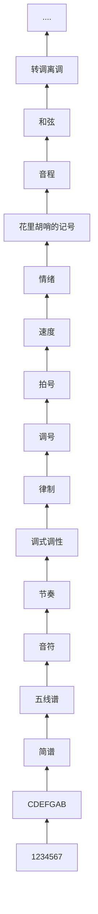

D:\static\DownKyi-1.0.11-1.win-x64\Media\【四川音乐学院作曲硕士】零基础自学音乐学乐理合集-第二季（最终版）已完结

## 1-0-序
1. 多交流
2. 是第一季的基础上加了1/3
## 2-1-你为什么学乐理

### 乐理的树干

无论目的是什么，都需要搞懂基础乐理


要顺着树往上爬

## 3-2-“唱名”与记住“唱名”的方法

理解乐理需要认识数字0-7 这八个数字

1234567念作哆来咪发索拉西。注意为什么0没有对应的唱名？因为在音乐中出现0的时候，就表示我们不要唱了，不要弹了

第一个任务需要建立阿拉伯数字和唱名之间的关联

从中文到数字，再到数字到中文


```abc
%%scale 1
X:1
T:小星星
C:传统
M:4/4
L:1/4
K:C
C C G G | A A G2 | F F E E | D D C2 |
```

## 4-3-唱名的来历，简谱的构造

## 5-4-初探调号、拍号、情绪与速度

## 6-5-音名、钢琴键盘

## 7-6-初步理解1=C

## 8-7-升降号、黑键的音名

## 9-学习乐理最强辅助文件

## 10-8-重升重降号、等音扩展篇

## 11-9-纯八度是什么

## 12-10-音的分组、中央C、标准音

## 13-11-高音点、低音点

## 14-12-音域、1=C到底是哪组的C

## 15-13-半音、全音

## 16-14-乐音、噪音、乐音体系、音列

## 17-15-音级、基本音级、变化音级

## 18-16-自然半音、变化半音、自然全音、变化全音

## 19-17-1234567的内在规则

## 20-18-调式、自然大调式

## 21-19-音阶是什么、有什么用

## 22-20-关于调式、音阶的一个萌新常见误区

## 23-21-黑键出发的自然大调、等音调、音阶的选择

## 24-22-等音调扩展篇、何为一共十五个大调

## 25-23-调号总结篇

## 26-24-模唱、相对音高的练习方式

## 27-25※-为什么要有这么多调号？

## 28-26※-如何构建大调音阶

## 29-27※-7的发音是Si还是Ti

## 30-28※-升降号写音名左边还是右边

## 31-29※-调性是什么

## 32-30-C大调也会运用到黑键？

## 33-31-首调与固定调

## 34-32-相对音感与绝对音感

## 35-33-原调、移调、转调、离调

## 36-34-简谱需要移调吗？

## 37-35※-高八度低八度算不算跑调

## 38-36※-音名为什么有时候分组，有时候不分组

## 39-37※-不太明确的乐理题

## 40-38-调号章节哪些东西还没有讲？为什么？什么时候讲？

## 41-39-拍号部分开始，认识音符

## 42-40-什么是一拍

## 43-41-小节、小节线、终止线

## 44-42-看懂拍号的意义

## 45-43-附点

## 46-44-复附点

## 47-45-延音线

## 48-46-连线

## 49-47-休止符

## 50-48※-小节线、音符、休止符之间无任何其他停顿

## 51-49-常见的拍号，强弱关系

## 52-50-单拍子、复拍子

## 53-51-混合拍子

## 54-52-一拍子、散拍子

## 55-53-变换拍子、交错拍子

## 56-54-小节序号

## 57-55-弱起小节、弱起

## 58-56-情绪与速度、具体的速度、BPM

## 59-57-抽象的速度

## 60-58-节拍器与使用

## 61-59-拍号、情绪与速度总结篇

## 62-60-打拍子（1）-V字打拍法

## 63-61-打拍子（2）-休止符打法

## 64-62-打拍子（3）-二八

## 65-63-打拍子（4）-四十六

## 66-64-打拍子（5）-前八后十六、前十六后八

## 67-65-打拍子（6）-前附点、后附点

## 68-66-打拍子（7）-小切分

## 69-67※-打拍子（8）-一拍内的变体

## 70-68-打拍子（9）-大附点与变体

## 71-69-打拍子（10）-大切分与变体

## 72-70-打拍子（11）-三连音

## 73-71-打拍子（12）-三连音的变体

## 74-72-打拍子（13）-加延音线的节奏型

## 75-73-打拍子（14）-还原号、临时变音记号在简谱中的规则

## 76-74-打拍子（15）-八几拍的V字打法

## 77-75-打拍子（16）-八三、八六拍的三角形打法

## 78-76-打拍子（17）-二连音、四连音

## 79-77※-打拍子（18）-其他连音与连音总结

## 80-78-打拍子（19）-非常见拍号如何打拍子

## 81-79-打拍子（20）-总结、重点、练习与检验方法

## 82-80※-音值组合法概述

## 83-81※-什么是“切分”

## 84-82※-与拍号相关的一些词义解释

## 85-83※-四三拍与八三拍有差别吗

## 86-84※-八八拍为什么不是四个八二拍的组合

## 87-85-力度记号-p、f、mp、mf、sf、cresc、dim等

## 88-86-速度记号-rit、rall、accel、a tempo等

## 89-87-反复记号（一）-反复、跳房子

## 90-88-反复记号（二）-D.C、D.S.、Fine、Coda

## 91-89-省略记号-震音、音型与小节反复

## 92-90-演奏记号（一）-换气、跳音、断音、连跳（断）音

## 93-91-演奏记号（二）-保持音、滑音

## 94-92-演奏记号（三）-刮奏、琶音

## 95-93-装饰音记号（一）-级进、跳进、经过音、辅助音

## 96-94※-装饰音记号（二）-助音的四种类型

## 97-95-装饰音记号（三）-波音

## 98-96-装饰音记号（四）-回音

## 99-97-装饰音记号（五）-颤音

## 100-98-装饰音记号（六）-倚音

## 101-99-简谱的多声部

## 102-100-是否需要学习五线谱

## 103-101-五线谱的构造、谱号是什么

## 104-102-高音谱号

## 105-103-低音谱号

## 106-104※-中音谱号、次中音谱号

## 107-105※-谱号拓展

## 108-106-八度记号

## 109-107-十五度记号

## 110-108-五线谱的拍号、音符与写法

## 111-109-五线谱的附点、休止符、连线、延音线

## 112-110-五线谱的速度

## 113-111-五线谱的节奏型、打拍子

## 114-112-五线谱的调号（一）

## 115-113-五线谱的调号（二）

## 116-114-快速识别五线谱的调号

## 117-115-五线谱的练习方式

## 118-116※-音值组合法（一）

## 119-117※-音值组合法（二）

## 120-118※-音值组合法（三）

## 121-119-五线谱的标记

## 122-120-五线谱的多声部与指法问题

## 123-121-五线谱的临时变音记号规则

## 124-122-音程、度数、根音、冠音

## 125-123-大二度、小二度、音数

## 126-124-大三度、小三度

## 127-125-大六度、小六度

## 128-126-大七度、小七度

## 129-127-纯一度、纯八度

## 130-128-纯四度、纯五度

## 131-129-增音程、减音程、等音程

## 132-130-倍增音程、倍减音程

## 133-131-快速识别音程（一）

## 134-132-快速识别音程（二）

## 135-133-超过八度的音程怎么判断、单音程、复音程

## 136-134※-音程名字的简写

## 137-135※-半音是小二度吗？全音是大二度吗？三全音

## 138-136※-旋律音程、和声音程、自然音程、变化音程

## 139-137-协和音程、不协和音程

## 140-138-等音、等音程的意义

## 141-139※-一四五八度为何用“纯”？

## 142-140-音程的转位

## 143-141-男声女声音域、模唱、记谱与实际音高等若干问题解释

## 144-142-音程的构唱练习

## 145-143-和弦是什么？和声是什么？三和弦

## 146-144-根三五音、大三和弦、小三和弦

## 147-145-增三和弦、减三和弦

## 148-146-三和弦的第一转位、第二转位

## 149-147-七和弦是什么，七和弦的名字

## 150-148-常用的7个七和弦结构与简称

## 151-149-七和弦的第一转位、第二转位、第三转位

## 152-150-和弦固定标记法（一）-原位三和弦、七和弦

## 153-151-和弦固定标记法（二）-转位和弦，斜杠（slash）和弦

## 154-152-广义的、实际的原位与转位，转位的意义

## 155-153-和弦的织体

## 156-154※-和弦固定标记法（三）-九音、十一音、十三音

## 157-155-和弦固定标记法（四）-加音（add）和弦、六和弦意义之二

## 158-156-和弦固定标记法（五）-挂留（sus）和弦、省略音（omit）和弦

## 159-157-和弦固定标记法总结与常用结构汇总

## 160-158-和弦功能与级数标记法、属七和弦意义之二

## 161-159-和声模板是什么？优缺点与运用要点

## 162-160※-等和弦与一些做题问题

## 163-161-音程、和弦版块总结、重点、建议

## 164-162-和声大调、旋律大调

## 165-163-自然小调、音名为什么从C开始

## 166-164-和声小调、旋律小调

## 167-165-关系大小调、同主音调、小调的调号判断

## 168-166-五声性调式、宫商角徵羽

## 169-167-四个偏音、六声、七声、清雅燕乐

## 170-168-中古调式概述

## 171-169-调式版块总结、调式判断

## 172-170※-律制科普

## 173-171※-泛音列（分音列）

## 174-172※-五度圈（四度圈）

## 175-173※-移调乐器

## 176-174※-若干词汇概念补充

## 177-175※-本课程中一些未涉及概念与未涉及原因

## 178-【乐理完结】22分钟梳理基础乐理知识点