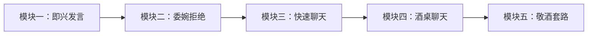

# 课程学习路径图

> **循序渐进，由浅入深。**

本课程的设计遵循 **"先能说 → 敢拒绝 → 会聊天 → 懂控场 → 善敬酒"** 的递进逻辑。建议严格按照模块顺序学习，每个模块的课程请先上后下。

---

## 整体依赖关系

- **严格顺序：** 前一模块是后一模块的基础。
- **推荐节奏：** 每周 1 个模块（2 节课），5 周完成全部课程。
- **快速通道：** 如果已有较好口才基础，可直接从模块四开始，但不建议跳过前三模块。

---

## 模块一：即兴发言的 12 大套路

> **解决"没准备时被点名发言"的恐慌。**

| 维度 | 内容 |
|------|------|
| 课时 | 2 节课（第 01-02 课） |
| 核心公式 | 感谢 + 赞美 + 故事 + 借用 + 提问 |
| 学习目标 | 任何场合被点名，张口就能说 1-3 分钟 |
| 推荐用时 | 3-4 天 |

### 课程列表

1. [[0001-ji-xing-fa-yan-shang|第 01 课：即兴发言的 12 大套路（上）]]
   - 三大核心公式：感谢法、赞美法、故事法
   - 如何快速组织发言结构

2. [[0002-ji-xing-fa-yan-xia|第 02 课：即兴发言的 12 大套路（下）]]
   - 借用他人话语法、提问互动法
   - 多种公式组合实战演练

> **模块前置：** 无。
> **通过标准：** 能在 30 秒内构思出一个完整的即兴发言框架。

---

## 模块二：委婉拒绝别人的套路

> **解决"不好意思拒绝，结果自己难受"的困境。**

| 维度 | 内容 |
|------|------|
| 课时 | 2 节课（第 03-04 课） |
| 核心策略 | 推己及人、以退为进、借力打力 |
| 学习目标 | 得体拒绝劝酒、劝菜、借钱等请求 |
| 推荐用时 | 3-4 天 |

### 课程列表

1. [[0003-wei-wan-ju-jue-shang|第 03 课：委婉拒绝别人的套路（上）]]
   - 委婉拒绝的底层逻辑
   - 三大策略详解

2. [[0004-wei-wan-ju-jue-xia|第 04 课：委婉拒绝别人的套路（下）]]
   - 高频场景实战：劝酒、劝菜、借钱、拉关系
   - 拒绝后的关系修复话术

> **模块前置：** [[0001-ji-xing-fa-yan-shang|模块一]]（掌握基本发言能力，才能在拒绝时表达得体）。
> **通过标准：** 能在 3 个常见劝酒/劝菜场景中自如运用拒绝策略。

---

## 模块三：快速和别人聊到一起的套路

> **解决"和陌生人坐在一起不知道说什么"的尴尬。**

| 维度 | 内容 |
|------|------|
| 课时 | 2 节课（第 05-06 课） |
| 核心系统 | 十六字口诀 + 五步聊天法 |
| 学习目标 | 5 分钟内与陌生人建立初步连接 |
| 推荐用时 | 4-5 天 |

### 课程列表

1. [[0005-kuai-su-liao-tian-shang|第 05 课：快速和别人聊到一起的套路（上）]]
   - 聊天的十六字口诀
   - 自身铺垫八要素：让对方快速了解你
   - 话题准备两大切入点

2. [[0006-kuai-su-liao-tian-xia|第 06 课：快速和别人聊到一起的套路（下）]]
   - 五步聊天法：从破冰到深度连接
   - 常见冷场场景及应对

> **模块前置：** [[0001-ji-xing-fa-yan-shang|模块一]]（发言能力是聊天的基础）。
> **通过标准：** 能在 5 分钟内与一位陌生人完成从破冰到深入话题的全流程。

---

## 模块四：酒桌上聊天的套路

> **解决"酒桌上不知道该怎么带话题/接话题"的困惑。**

| 维度 | 内容 |
|------|------|
| 课时 | 2 节课（第 07-08 课） |
| 双重视角 | 主人视角 + 客人视角 |
| 学习目标 | 无论做主做宾都能掌控聊天节奏 |
| 推荐用时 | 4-5 天 |

### 课程列表

1. [[0007-jiu-shang-liao-tian-shang|第 07 课：酒桌上聊天的套路（上）]]
   - 主人视角：开场欢迎词、话题引导、控场技巧
   - 如何让每位客人都感觉被照顾

2. [[0008-jiu-shang-liao-tian-xia|第 08 课：酒桌上聊天的套路（下）]]
   - 客人视角：如何接话、捧场、配合主人
   - 与邻座深度聊天的技巧

> **模块前置：** [[0005-kuai-su-liao-tian-shang|模块三]]（聊天基础能力）。
> **通过标准：** 能主持一个 6-8 人的饭局聊天环节，确保无人冷落。

---

## 模块五：酒桌上敬酒的套路

> **解决"敬酒不知道说什么、不知道怎么敬"的难题。**

| 维度 | 内容 |
|------|------|
| 课时 | 2 节课（第 09-10 课） |
| 核心内容 | 17 个敬酒话题 + 敬酒时机 + 话术组合 |
| 学习目标 | 每一次敬酒都自然、得体、有分量 |
| 推荐用时 | 5-7 天 |

### 课程列表

1. [[0009-jing-jiu-tao-lu-shang|第 09 课：酒桌上敬酒的套路（上）]]
   - 17 个万能敬酒话题分类
   - 敬酒时机选择与顺序排列
   - 不同对象（领导、客户、朋友、长辈）的敬酒策略

2. [[0010-jing-jiu-tao-lu-xia|第 10 课：酒桌上敬酒的套路（下）]]
   - 敬酒话术组合公式
   - 应对拒酒与反敬的机智回应
   - 敬酒全流程模拟

> **模块前置：** [[0007-jiu-shang-liao-tian-shang|模块四]]（酒桌聊天能力）。
> **通过标准：** 能在一场完整饭局中独立完成 3 次以上高质量的敬酒发言。

---

## 推荐学习计划

### 标准路线（5 周）

| 周次 | 学习内容 | 课后实践 |
|------|----------|----------|
| 第 1 周 | 模块一（即兴发言） | 在团队会议中主动发言一次 |
| 第 2 周 | 模块二（委婉拒绝） | 婉拒一次不合理请求 |
| 第 3 周 | 模块三（快速聊天） | 与一位陌生人聊天 5 分钟 |
| 第 4 周 | 模块四（酒桌聊天） | 在饭局中主动引导话题 |
| 第 5 周 | 模块五（敬酒套路） | 在饭局中完成敬酒实战 |

### 速成路线（2 周）

适合已有一定社交经验、急需提升饭局表现的学习者：

| 阶段 | 内容 |
|------|------|
| 第 1-3 天 | 模块一 + 模块二 |
| 第 4-6 天 | 模块三 + 模块四 |
| 第 7-10 天 | 模块五 + 全场模拟 |
| 第 11-14 天 | 真实饭局实战 + 复盘 |

---

## 参考资料

- [[reference/glossary|术语表]] — 课程核心概念速查
- [[reference/formula-cheatsheet|速查手册]] — 场景化话术卡片

---

> **学习提醒：** 口才是练出来的，不是看出来的。每节课后的"自我检查"（Self-check）请认真完成，并在真实社交场景中刻意练习。即使第一次不完美，也要迈出那一步。