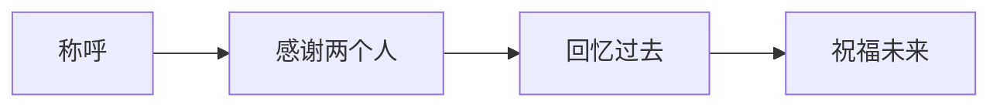
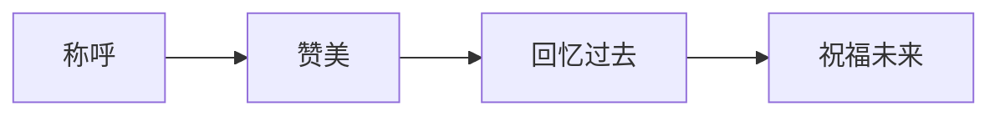
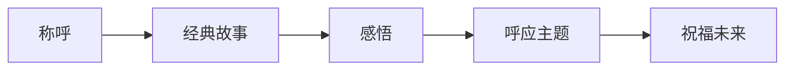
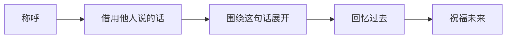
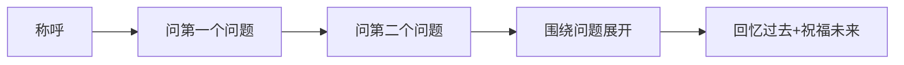

# 第01课：即兴发言的12大套路（上）

## Learning Objectives

- 理解即兴发言的本质规律，消除"不知道说什么"的恐惧心理
- 掌握五大套路公式的结构与适用场景
- 能够根据场合灵活选用不同套路组织即兴发言

## Core Idea

所谓即兴发言，是指**在事先没有准备的情况下，临场因时、因事、因人、因景、因情而发的说话方式**。很多人一听到"即兴"两个字就紧张，觉得自己没有准备，担心说错话、冷场、丢面子。

但事实上，**万事万物都有规律可循，即兴发言也不例外**。高手之所以能够出口成章，不是因为他们天赋异禀，而是因为他们掌握了隐藏在即兴背后的"套路"。这些套路就像建筑的脚手架，你不需要每次都从零开始搭建，只需要知道在什么场合用什么架子，然后往里面填充内容即可。

本课将为你拆解即兴发言的12大套路中的前5个，每一个都有固定的公式和变体，学完就能用。

> [!TIP] Key Insight
> "即兴"不等于"随意"。真正的高手从不打无准备之仗——他们只是把准备藏在了套路里。

## 真实案例

### 案例一：婚礼发言被人当成"托儿"

学员参加朋友婚礼，司仪随机点名让他上台说两句。换作以前，他肯定会大脑一片空白、支支吾吾。但这次他用了本课学到的套路，镇定自若地说了以下这段话：

> "尊敬的各位来宾，大家好！（称呼）
> 我要感谢新郎新娘给我这个机会站在这里，也要感谢司仪老师的精彩主持。（感谢两个人）
> 我和新郎认识十年了，还记得大学时候他追新娘那会儿，大冬天在我宿舍楼下等了一个小时，就为了让我帮他递一封情书。那封信我偷看了一眼，写得真不怎么样……（回忆过去）
> 但今天看到他们站在一起，我就知道——字写得不好没关系，心诚就够了。祝二位白头偕老，早生贵子！（祝福未来）"

他说完下台，同桌的朋友拉着他问："你是不是司仪安排的托儿？说得太好了！"

这就是套路的威力——用对了方法，别人以为你是专业的。

### 案例二：下雨天聚餐，"天洗兵"鼓舞团队

一次部门聚餐，外面下着大雨，大家情绪都不太高。这时候被领导点到发言，直接说：

> "今天这场雨，让我想起一个典故。当年武王伐纣的时候，出兵那天也是下着大雨，大家都觉得不吉利。但姜子牙说——这是'天洗兵'，老天爷帮我们把兵器上的灰尘洗掉，让我们干干净净去打胜仗。
> 今天咱们聚在一起，这场雨就是给我们洗尘的，把上半年的疲惫都冲走，下半年咱们轻装上阵，再创佳绩！（祝福未来）"

短短几句话，全场气氛瞬间被点燃。

这个例子用的是后面的**借力感悟**套路（套路12），后面会更详细地拆解。这里先让你感受一下：同样的场景，用不同套路都能讲出彩。

## 五大套路公式（上）

下面逐一拆解前5个套路。每个套路有一个基础公式，配合具体案例讲解。

---

### 套路1：称呼 + 感谢两个人 + 回忆过去 + 祝福未来

这是最基础、最安全、最适合婚礼和聚会场合的套路，堪称"新手第一式"。

**公式结构：**

**拆解要点：**

| 要素 | 说明 | 注意事项 |
|------|------|----------|
| 称呼 | 尊敬的各位来宾、各位朋友等 | 根据场合调整正式程度 |
| 感谢两个人 | 感谢大家都认可的人 | 主人、组织者、主办方均可 |
| 回忆过去 | 一个具体的往事片段 | 要有画面感，不要空泛 |
| 祝福未来 | 美好的祝愿收尾 | 贴合主题，真诚为佳 |

**核心要点：** 感谢的"两个人"不是随便选的——要感谢大家都认可的人，比如主人、组织者或司仪。这样你能借到全场的好感。

**婚礼案例详解：**

假设你参加朋友婚礼，司仪突然点你的名。用套路1：

> **称呼：** 尊敬的各位来宾，大家好！
> **感谢两个人：** 首先感谢新郎新娘给我这个上台的机会，也感谢司仪老师今天辛苦主持。
> **回忆过去：** 我和新郎是大学同学，记得大三那年冬天，他为了给新娘送一杯热奶茶，骑自行车穿了大半个城市。到了楼下才发现奶茶已经凉了，他又折回去重新买。那天我在宿舍等他到晚上十一点，他进门的时候脸都冻红了，但笑得比谁都开心。
> **祝福未来：** 十年过去了，那份心意一点没变。祝福二位新人在未来的日子里，风雨同舟，幸福美满！

**同学聚会变体示例：**

毕业十周年聚会，被推举发言：

> 老同学们，好久不见！（称呼）
> 先感谢咱们的班长张罗这次聚会，也感谢今天到场的每一位同学，能从百忙之中抽时间来。（感谢两个人）
> 还记得当年咱们班在学校篮球赛上逆风翻盘那场吗？最后三秒，三分绝杀——全班都疯了，那天晚上我们一起在操场上喊到嗓子哑了。（回忆过去）
> 十年过去了，希望大家在各自的人生赛场上，也能像当年那样，关键时刻不掉链子，漂亮得分！（祝福未来）

---

### 套路2：称呼 + 赞美 + 回忆过去 + 祝福未来

如果场合比较轻松，或者你想让气氛更融洽，可以把"感谢两个人"换成"赞美"。

**公式结构：**

**赞美分为两种：**

1. **直接赞美：** 当面夸，适用于关系较熟或赞美对象在场
2. **间接赞美：** 借用第三者的话来夸，效果更客观、更真诚

> [!TIP] Key Insight
> 间接赞美比直接赞美更有力量。心理学上称之为"第三者效应"——同样一句赞美的话，从别人嘴里传到当事人耳朵里，可信度翻倍。

**直接赞美示例（婚礼）：**

> 各位亲朋好友，大家好！（称呼）
> 今天的新娘是我见过最美的新娘，新郎也是我见过最有福气的新郎。（直接赞美）
> 记得刚认识新娘那会儿，她就是咱们朋友圈里最细心的人，谁生日她都记得，谁生病她都问候。（回忆过去）
> 新郎能娶到她，真的是捡到宝了！祝你们幸福一辈子！（祝福未来）

**间接赞美示例（婚礼）：**

> 各位来宾好！（称呼）
> 来的路上，我妈妈听说我来参加这场婚礼，她说了一句话——"这家儿媳妇是出了名的好，你去了好好沾沾喜气。"（间接赞美——借妈妈的话）
> 我妈妈平时不怎么夸人，能让她这么说，今天算是见识到了。新娘从上台到现在一直笑盈盈地给大家敬酒，那种发自内心的温暖，确实让人舒服。（回忆过去+呼应赞美）
> 祝福这对新人，也祝福今天到场的每一位朋友！（祝福未来）

---

### 套路3：称呼 + 故事 + 回忆过去 + 祝福未来

这个套路的核心在于"用一个好故事穿针引线"。故事选得好，全场耳朵都竖起来。

**公式结构：**

**两个关键点：**

1. 故事以**经典故事为主**——听众不需要太多背景知识就能理解
2. **说完必须有感悟**——感悟要合乎整体主题，不能为了讲故事而讲故事

> [!WARNING] 常见误区
> 很多人讲完故事就结束了，忘了把"感悟"和"今天的主题"连接起来。故事只是手段，感悟才是目的。没有感悟的故事，就是一个跑题的段子。

**"张敞画眉"典故示例：**

假设是在一对新婚夫妻的聚会上发言：

> 各位朋友好！（称呼）
> 今天我想跟大家分享一个典故，叫"张敞画眉"。（引入故事）
> 汉朝有个官员叫张敞，和他夫人感情特别好。每天早晨他都会亲自给夫人画眉。有人觉得这不成体统，就告到了皇帝那里。皇帝把张敞叫来问罪，张敞说了一句很妙的话——"臣闻闺房之乐，有甚于画眉者。"意思是说，夫妻之间的事，比画眉亲密的多了去了。皇帝听完哈哈大笑，也就不再追究了。（讲完故事）
> 这个故事让我想到，真正的感情不在于惊天动地，而在于日复一日的细心呵护。就像今天的新郎新娘，他们之间一定也有无数个"画眉"的温暖瞬间。（感悟呼应主题）
> 祝两位在今后的日子里，把这份温情一直延续下去。（祝福未来）

---

### 套路4：称呼 + 借用他人说的话 + 回忆过去 + 祝福未来

当你不知道讲什么故事，也不知道怎么赞美的时候，可以"借话"——从别人口中听到的一句话，就能成为你发言的切入点。

**公式结构：**

**操作方法：**

1. 在他人发言或聊天时，**竖起耳朵留意那些有分量、有意思的句子**
2. 从中挑出最有意义的一句，作为你发言的"引子"
3. 围绕这句话展开你的分享
4. 可以用互动技巧活跃气氛——"刚才王总说的那句话，大家还记得吗？"

**聚餐案例：**

> 各位好！（称呼）
> 刚才李总说了一句话，我印象特别深——他说"做业务就是做人"。（借用他人的话）
> 这句话让我想起我刚入职那会儿，第一次跟着李总去见客户。（自然过渡）
> 那天客户其实对我们方案不太满意，但李总没有急着推销，而是认认真真听客户讲了一个小时的烦恼。临走的时候客户说了一句话——"你这个人靠谱，方案再改改就行。"（回忆过去）
> 从那个时候我就明白，李总那句"做业务就是做人"不是挂在墙上的口号，是真的刻在骨子里的。（呼应开头的引子）
> 今天借这杯酒，敬李总，也敬在座每一位把"做人"放在第一位的好朋友！（祝福未来）

> [!TIP] Key Insight
> "借用他人说的话"这个套路的妙处在于——你不用自己想开头，别人已经把话送到你嘴边了。你只需要做一个有心人，把它接住。

---

### 套路5：称呼 + 问两个问题 + 回忆过去 + 祝福未来

这个套路适合气氛比较沉闷、需要互动调动的时候。通过提问把全场注意力抓过来。

**公式结构：**

**三个要点：**

1. 问题必须**和今天的主题相关**，不能为了提问而提问
2. 问题要**易于回答**——最好是"是不是""对不对"这种不需要思考就能回答的问题
3. 通过互动**调动气氛**——让全场人都被你"拉进来"

**同学聚会案例：**

> 老同学们！（称呼）
> 我想问大家一个问题——你们还记得咱们班的班歌是什么吗？（第一个问题——调动记忆）
> 再问一个——当年是谁带头把歌词改了，害得全班被班主任罚站？（第二个问题——引爆笑点）
> （大家回答、笑闹之后继续）
> 对，就是咱们"捣蛋鬼"王磊干的！那时候觉得天都要塌了，现在想想，那罚站的二十分钟，反而是高中三年最难忘的记忆之一。（回忆过去）
> 谢谢今天到场的每一位，虽然我们发际线高了、肚子大了，但笑声没变。希望大家以后的每一天，都能像今天这样开心！（祝福未来）

**会议/团队聚餐饮案例：**

> 各位伙伴们！（称呼）
> 先问大家一个问题——咱们团队去年的目标完成率是多少？（第一个问题）
> 再问一个——今年咱们的目标比去年高了多少？（第二个问题——制造对比）
> 对，高了30%。去年那么难我们都扛下来了，今年有什么理由不行呢？（自然过渡）
> 记得去年最后一个季度冲刺的时候，大家在办公室加班到凌晨，有人趴在桌上就睡着了，但第二天没人迟到。（回忆过去）
> 今年咱们继续拼，但别忘了照顾好自己！（祝福未来）

---

## 五大套路总结对比

| 套路 | 公式 | 最佳场合 | 难度 |
|------|------|----------|:----:|
| 套路1 | 称呼 + 感谢两个人 + 回忆 + 祝福 | 婚礼、正式聚会 | ★☆☆ |
| 套路2 | 称呼 + 赞美 + 回忆 + 祝福 | 热闹轻松的场合 | ★☆☆ |
| 套路3 | 称呼 + 故事 + （感悟） + 祝福 | 需要展现文化底蕴的场合 | ★★☆ |
| 套路4 | 称呼 + 借用他人话 + 回忆 + 祝福 | 有人在前面铺垫过的情况 | ★★☆ |
| 套路5 | 称呼 + 问两个问题 + 回忆 + 祝福 | 气氛需要调动时 | ★★☆ |

> **核心记忆口诀：**
> 感谢赞美故事讲，借话提问五招强；
> 遇事不慌套路出，即兴发言不冷场。

## 使用原则

1. **称呼根据场合决定正式程度**——正式场合用"尊敬的各位来宾"，非正式场合用"各位朋友、各位家人"
2. **"回忆过去"是套路的灵魂**——它是区分"套路"和"空洞套话"的关键。没有具体回忆的发言，听起来就是敷衍的官腔
3. **灵活组合**——套路不必死板照搬，同一个场合可以先感谢再赞美、也可以先讲故事再问问题

## Practice

> [!QUESTION] Self-check
> 请设计一个场景：大学室友结婚，司仪突然点名让你上台讲两句。请分别用**套路1**和**套路2**各写一段发言稿（每段100-150字）。
>
> **提示：** 先确定你和室友之间最有画面感的一个回忆细节，然后根据套路的公式把细节放进去。

参考答案

**套路1版本（感谢+回忆+祝福）：**

尊敬的各位来宾，大家好！首先要感谢新郎新娘给我这个机会，也要感谢司仪老师的主持。我和新郎住一个宿舍四年，印象最深的是大二那年他生病发烧，新娘（当时还是女朋友）冒着大雨给他送粥，到宿舍楼下的时候自己浑身都湿透了，粥还是热的。从那天起我就知道，这姑娘值得托付。今天看到他们终于修成正果，我比谁都开心。祝二位永结同心，白头偕老！

**套路2版本（赞美+回忆+祝福）：**

各位亲朋好友大家好！今天的新娘是我见过最温柔的新娘，新郎也是我见过最帅气的新郎。其实我跟新郎认识这么多年，他这个人平时大大咧咧的，但有一件事他特别认真——每次提到他女朋友，眼睛都会发光。这就是爱情最好的样子吧。祝你们俩幸福一辈子，早生贵子！

两个版本的区别：套路1靠"感谢"建立连接，套路2靠"赞美"拉近距离。根据你和新人的关系亲疏灵活选用即可。

## Next Step

恭喜你完成了即兴发言前5个套路的学习！下一课我们将继续学习剩余的7个套路，包括名人名言、悬念制造、谦虚开场的技巧，以及三个重要的注意事项。

继续学习 [[0002-ji-xing-fa-yan-xia|第02课：即兴发言的12大套路（下）]]。