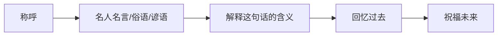
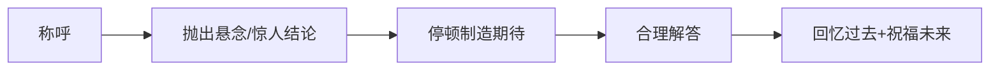
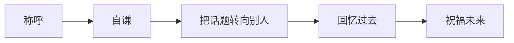
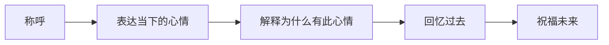
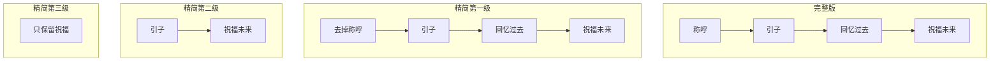
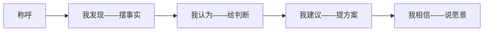
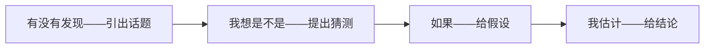
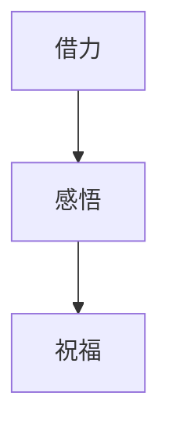
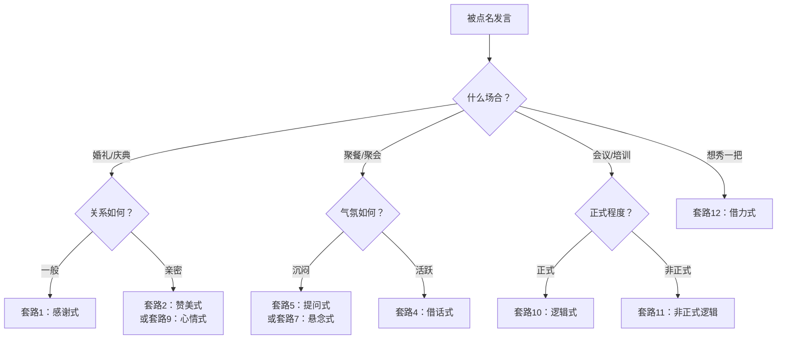

# 第02课：即兴发言的12大套路（下）

## Learning Objectives

- 掌握套路6-12的公式结构和适用场景
- 理解三大注意事项，避免套路使用中的常见错误
- 学会根据场合灵活组合、精简套路

## Core Idea

上一课我们学习了5个基础套路——感谢、赞美、故事、借话、提问，这些都是即兴发言的"常规武器"。本课将继续解锁余下的7个套路，它们各有侧重：有的擅长制造氛围、有的适合正式场合、有的则是"万金油"式的好用。

此外，我们还会讨论三个非常重要的问题：

1. 这些套路到底怎么用才不显得生硬？
2. 称呼在什么时候可以省略？
3. 时间紧张时，套路能精简到什么程度？

把这些问题搞懂，你就真正"活学活用"了。

> [!TIP] Key Insight
> 套路的价值不在于"照搬"，而在于给你一个"骨架"——当你紧张到大脑空白时，骨架能撑住场面，让你有条不紊地往里面填内容。

## 套路6-9（上接第1课的套路1-5）

---

### 套路6：称呼 + 名人名言 + 回忆过去 + 祝福未来

所谓"名人名言"在这里是广义的——不只是名人的话，还包括**俗语、谚语、歇后语、诗词名句**等一切广为流传的语言。

**公式结构：**

**选择名言的两个原则：**

1. **通俗易懂**——不要用生僻的典故，大家听不懂等于白说
2. **贴合主题**——名言是为你的内容服务的，不要为了炫技而选一个八竿子打不着的

**婚礼案例：**

> 各位亲朋好友，大家好！（称呼）
> 有一句老话说得好——"百世修来同渡船，千世修来共枕眠。"（名人名言——俗语）
> 意思是要修一百世才能同坐一条船，修一千世才能成为夫妻。今天的新郎新娘能走到一起，那真的是千世修来的缘分。（解释）
> 还记得新郎第一次跟我提起新娘的时候，那个大男生居然脸红了，我就知道——缘分到了挡都挡不住。（回忆过去）
> 祝二位珍惜这千世修来的缘分，这辈子牵手，下辈子还在一起！（祝福未来）

**团队聚会案例：**

> 各位伙伴！（称呼）
> 古人说"千人同心，则得千人之力"。（名言引用）
> 这句话放在今天的聚会上特别应景。咱们团队今年能完成那个几乎不可能的目标，靠的不是哪一个人的英雄主义，而是每一个人都在自己的位置上扛住了。（解释+回忆过去）
> 接下来咱们继续同心协力，再创佳绩！（祝福未来）

---

### 套路7：称呼 + 悬念 + 回忆过去 + 祝福未来

这个套路的核心是**先给一个意想不到的结果，再合理解答**。听众被你的"悬念"勾住好奇心，注意力自然就集中了。

**公式结构：**

> [!TIP] Key Insight
> 悬念的精髓在于"意料之外，情理之中"。结论要反常，但解释要合理。如果听众听完觉得"哦，原来是这样"，你就成功了。如果他们觉得"什么乱七八糟的"，那就用力过猛了。

**企业培训训话案例（经典）：**

当年一位企业内训师在年终总结会上登台，全场安静等他讲话。他说了四个字——

> **"训话结束，谢谢。"** （悬念——全场愕然）

沉默三秒后，他继续说：

> 大家是不是觉得很奇怪？怎么刚上来就说结束了？（解答悬念）
> 其实我想说的是——今年该说的、该做的，大家已经在工作中完完整整地表达出来了。今天站在这里，我不需要再多说什么，因为你们的成绩就是最好的发言。过去这一年，我看到大家加班到深夜的身影、看到你们拿下一个个项目时的笑容。那些瞬间，比任何言语都更有力量。（回忆过去）
> 明年咱们继续保持这个势头，不用多说话，用行动说话！（祝福未来）

这个案例的高明之处在于：用"训话结束"制造了一个全场记忆点，然后话锋一转，把焦点让给台下的人。所有人都会记住这次"最短的训话"。

**团队聚餐案例：**

> 各位，我想告诉大家一个"坏消息"——（悬念）
> 今年咱们的业绩比去年涨了50%。（停顿）
> 坏消息是——明年老板定的目标是再涨50%，咱们得准备好掉头发了！（转折解答——全场哄笑）
> 但说真的，去年那么难我们都挺过来了，今年怕什么？还记得去年年底冲刺的时候，大家挤在那个小会议室里吃盒饭、对数据，有人累到趴在桌上睡着……但最后我们做到了。（回忆过去）
> 兄弟姐妹们，再拼一年，明年这时候我请大家吃好的！（祝福未来）

---

### 套路8：称呼 + 谦虚 + 回忆过去 + 祝福未来

谦虚即"自谦"——放低自己，抬高他人。这是一个永远不会出错的万能开头。

**公式结构：**

**两个要点：**

1. **自谦要真诚**——"其实我不太会说话"比"我是最不会说话的"更自然
2. **自谦之后要迅速转移话题**——不要把焦点停留在自己身上，要引导到当事人或主题上

**婚礼场景变体示例：**

> 各位好！（称呼）
> 其实我这个人不太会说话，每次被点到名都紧张。但今天这个场合，无论如何也得说两句。（谦虚）
> 刚才在台下看着新郎牵着新娘的手走进来，我眼眶都有点湿了。（转移话题）
> 我和新郎认识十五年，从小一起光着屁股长大。他这个人什么都好，就是嘴笨，从来没跟我说过什么肉麻的话。但有一年我家里出了点事，他什么都没问，直接把银行卡塞到我手里，说"先用着"。那一刻我就知道，这个人值得交一辈子。（回忆过去——把焦点引向新郎的情义）
> 今天看到他找到了能陪他一辈子的人，我真替他高兴。祝二位和和美美，日子越过越红火！（祝福未来）

---

### 套路9：称呼 + 心情 + 回忆过去 + 祝福未来

"心情"和前面"赞美""谦虚"不同——赞美是对他人的评价，谦虚是放低自己，而**心情是说话人当下的内在感受**。说心情是最真实、最不易让人反感的开场方式。

**公式结构：**

**说心情的好处：**
- 它是真实的——没有人能否定你的感受
- 它是有温度的——听众会被你的真诚打动
- 它是不需要准备的——你此刻正在感受，直接说出来即可

**婚礼场景变体示例：**

> 各位亲朋好友大家好！（称呼）
> 说实话，此刻站在这里，我的心情特别复杂——有开心，有不舍，更多的是感动。（心情）
> 开心的是，今天是我最好的朋友大喜的日子；不舍的是，从此以后他在兄弟和老婆之间，肯定优先选老婆了（笑）；感动的是，从他们相识到现在，我见证了一段最好的爱情。（解释心情）
> 记得他们第一次约会，新郎紧张得换了三件衬衫，最后还是穿了我那件。他这个人平时天不怕地不怕，那天手心全是汗。那一刻我就知道——他是真的动心了。（回忆过去）
> 今天看到他们幸福的样子，这份感动还在，而且更深了。祝二位永远像今天这样，手心出汗也要牵着对方的手。（祝福未来）

---

## 三大注意事项

在继续讲授套路10-12之前，这三个注意事项非常重要。理解了它们，你才能真正灵活运用而不是生搬硬套。

### 注意事项一：这9个套路适用于任何即兴发言场合

从婚礼致辞到年终总结，从同学聚会到项目汇报，前9个套路的"称呼+~~+回忆过去+祝福未来"框架是一个通用结构。把"~~"替换成不同的"引子"（感谢、赞美、故事、名言等），就能适应不同场合。

> 这就是为什么叫"套路"——同一个骨架，套上不同的外衣，就能应对上百种场景。

### 注意事项二：称呼根据场合决定是否使用

| 场合 | 称呼用法 | 示例 |
|------|----------|------|
| 正式场合（婚礼、年会、典礼） | 必须使用，且要完整 | "尊敬的各位来宾、各位长辈" |
| 半正式场合（部门聚餐、同学会） | 可以简化 | "各位伙伴""老同学们" |
| 非正式场合（朋友小聚、家庭聚餐） | 可以省略 | 直接说话 |

> 省略称呼的前提是——在场所有人都知道你在对谁说话。如果不确定，加个称呼最安全。

### 注意事项三：套路可精简

如果时间紧张，或者你只需要说一两句话，套路可以做以下精简：

**完整版：** 称呼 + 引子 + 回忆过去 + 祝福未来

**精简版（三级递减）：**

| 精简层级 | 保留要素 | 示例 |
|----------|----------|------|
| 第一级 | 去掉"称呼"，直接开始 | "感谢张总今天的安排……" |
| 第二级 | 去掉"回忆过去"，只留引子和祝福 | "今天特别开心能参加这个聚会，祝大家吃好喝好！" |
| 第三级 | 只保留"祝福未来" | 举杯时的一句"祝大家新年快乐！" |

> 精简的原则是：**关系越熟，话越短；场合越正式，话越长。**

---

## 套路10-12

前面9个套路都是"称呼+引子+回忆过去+祝福未来"的变体。套路10-12则提供了三种**完全不同的结构**，在特定场合中同样高效。

---

### 套路10：称呼 + 我发现 + 我认为 + 我建议 + 我相信

这个套路适用于**正式会议、培训、项目总结**等需要逻辑表达的场合。"我发现-我认为-我建议-我相信"是一个层层递进的逻辑链。

**公式结构：**

**课程感悟示例：**

假设参加完一场管理培训，被邀请分享心得：

> 各位同事，大家好！（称呼）
> **我发现**咱们团队在执行项目的时候，经常遇到两个问题——一是信息同步不及时，二是跨部门沟通成本高。（我发现——陈述客观现象）
> **我认为**这些问题的根源不在于大家不努力，而是缺少一个统一的信息平台和沟通机制。（我认为——给出判断）
> **我建议**以后每个项目启动前，先拉一个共享文档，明确各环节负责人和截止时间，每周开一次15分钟的站会同步进度。（我建议——提出可执行的方案）
> **我相信**只要把这些基础动作做到位，咱们的项目效率至少能提升30%。（我相信——给出愿景）

**四个部分的分工：**

| 环节 | 作用 | 常见表达 |
|------|------|----------|
| 我发现 | 摆事实、讲数据、不作评价 | "我注意到……""数据显示……""回顾过去一年……" |
| 我认为 | 给判断、亮观点 | "这背后的原因是……""我的理解是……" |
| 我建议 | 提方案、可执行 | "我建议……""能不能这样……""下一步可以……" |
| 我相信 | 说愿景、给信心 | "我相信……""我期待……""有信心……" |

> [!WARNING] 常见误区
> 很多人跳过"我发现"直接讲"我认为"——没有事实依据的观点就是空谈。顺序不能乱：先讲看到了什么，再讲怎么看，然后是怎么办，最后是预期结果。缺一环都不完整。

---

### 套路11：有没有发现 + 我想是不是/我想可能 + 如果 + 我估计

这个套路是套路10的"非正式版本"——语气更加委婉、试探性，适合**关系比较熟的同事、朋友之间的交流**。

**公式结构：**

**和套路10的区别：**

| 对比项 | 套路10（正式版） | 套路11（非正式版） |
|--------|------------------|-------------------|
| 语气 | 肯定、笃定 | 委婉、试探 |
| 适用关系 | 上下级、正式会议 | 平级、熟人间 |
| 表达特点 | "我发现……我认为……" | "有没有发现……我想可能……" |

**团队内部交流示例：**

> **有没有发现**最近咱们部门的加班时间越来越长了？（引出话题——用问句代替断言，不冒犯人）
> **我想可能**是项目的周期安排上还有一些可以优化的地方，比如有些环节其实可以并行处理，但我们现在还是串行在做。（我想可能——用试探性的语气给出猜测）
> **如果**我们把A环节和B环节同时推进，而不是等A做完再做B，**我估计**每个项目至少能省出两到三天的时间。（如果+我估计——给出假设和预判）

**课程感悟示例：**

> 学完今天这堂课，**有没有发现**其实即兴发言没那么可怕？（用问题拉近距离）
> **我想是不是**我们以前之所以紧张，不是因为能力不够，而是因为我们一直以为"即兴"等于"硬想"，没有意识到背后是有套路在的。（用同理心的角度解读）
> **如果**以后每次被点到名的时候，先在脑子里快速过一遍这些模板，选一个最合适的往里套，**我估计**大家都能说得比想象中好得多。（给出可执行的建议）

---

### 套路12：称呼 + 借力感悟 + 祝福未来

这是前面所有套路中最"高级"的一个，也是最能体现一个人即兴发言功力的套路。它的精髓在于——**借现场之力，发自己之声**。

**公式结构：**

**借力的三个层次：**

| 层次 | 借力对象 | 示例 |
|------|----------|------|
| 第一层 | 借**天气**之力 | "今天下雨了……""今天天气真好……" |
| 第二层 | 借**历史/典故**之力 | "今天这场雨让我想起一个典故——天洗兵" |
| 第三层 | 借**突发事件**之力 | 现场发生的小插曲、意外情况都可以信手拈来 |

**核心要点：**

1. **借力之后的"感悟"才是重点**——借力只是引子，目的是为了引出你的感悟
2. **感悟要合情合理**——不能为了借力而借力，生搬硬套最尴尬
3. **"天洗兵"的典故要在关键时刻用**——这个典故特别适合鼓舞士气、扭转低落情绪

**"天洗兵"案例详解（重温+扩展）：**

场景：部门聚餐，外面下着大雨，大家心情低落。

> 各位伙伴，今天这天气，让我想起一个典故。（借天气之力）
> 当年武王伐纣，出征那天也是突然下起了倾盆大雨。士兵们都觉得不吉利，士气低落。这时候姜子牙站出来说了一句话——"此乃天洗兵也！"老天爷这是在帮咱们把兵器上的灰尘洗掉，让咱们干干净净、利利索索地去打胜仗。（借历史典故之力）
> 这个故事给我的感悟是——有时候看起来不好的事情，换一个角度看，反而是好事。就像今天这场雨，把咱们上半年的疲惫、烦恼统统冲走，下半年咱们轻装上阵，从头再来。（感悟）
> 来，干了这杯，下半年一起打场漂亮仗！（祝福未来）

**突发事件的借力（进阶）：**

假设在聚会上，有人不小心把酒杯打翻了，场面有点尴尬。你可以借机发言：

> 今天这杯酒摔得好——这叫"碎碎平安"！（借突发事件之力）
> 其实仔细想想，人生就是这样，有时候打翻一杯酒反而是好事，提醒我们慢下来、看看身边的人。今天咱们聚在一起不容易，借这杯"岁岁平安"，祝大家平平安安、顺顺利利！（感悟+祝福）

> [!TIP] Key Insight
> 借力感悟的最高境界是——你以为我只是在说天气、说典故、说突发事件，其实我句句都在说"我们"。听众不会觉得我是在"用套路"，而是觉得我"真会说话"。

**关于"认真准备"的两层含义：**

有人可能会说——即兴发言不是临场的吗，怎么还需要准备？

这里的"准备"包含两层含义：

1. **平时的素材积累：** 脑子里存的典故、故事、名言越多，即兴时可选的范围就越大。建议平时看到好的故事、听到精彩的发言，随手记下来。
2. **当下的腹稿准备：** 被点名之前的那一两分钟，别人说话的时候，你已经在脑子里快速过一遍"待会儿我说的话用什么套路"。**真正的即兴高手，从"被点到名"那一刻才开始思考。**

> 所谓"即兴"，不是完全不准备，而是把准备的时间压缩到了最短。

---

## 全部12大套路终极总结

### 完整对照表

| # | 套路名称 | 公式 | 最佳场合 | 难度 |
|:-:|:--------:|:----|:----------|:----:|
| 1 | 感谢式 | 称呼 + 感谢两个人 + 回忆 + 祝福 | 婚礼、正式聚会 | ★☆☆ |
| 2 | 赞美式 | 称呼 + 赞美 + 回忆 + 祝福 | 热闹轻松的场合 | ★☆☆ |
| 3 | 故事式 | 称呼 + 故事 + 感悟 + 祝福 | 需要文化底蕴的场合 | ★★☆ |
| 4 | 借话式 | 称呼 + 借用他人话 + 回忆 + 祝福 | 有人铺垫过的场合 | ★★☆ |
| 5 | 提问式 | 称呼 + 问两个问题 + 回忆 + 祝福 | 需要调动气氛时 | ★★☆ |
| 6 | 名言式 | 称呼 + 名言/俗语 + 回忆 + 祝福 | 各种场合通用 | ★★☆ |
| 7 | 悬念式 | 称呼 + 悬念 + 解答 + 祝福 | 需要抓住注意力时 | ★★★ |
| 8 | 谦虚式 | 称呼 + 自谦 + 回忆 + 祝福 | 想表现低调时 | ★☆☆ |
| 9 | 心情式 | 称呼 + 表达心情 + 回忆 + 祝福 | 需要真情实感时 | ★☆☆ |
| 10 | 逻辑式（正式） | 我发现 + 我认为 + 我建议 + 我相信 | 会议、培训 | ★★★ |
| 11 | 逻辑式（非正式） | 有没有发现 + 我想可能 + 如果 + 我估计 | 熟人交流 | ★★☆ |
| 12 | 借力式 | 称呼 + 借力感悟 + 祝福 | 所有场合，最高级 | ★★★ |

### 终极心法口诀

> 感谢赞美故事王，借话提问不慌张；
> 名言悬念吸眼球，谦虚心情显心肠；
> 正式会议用逻辑，熟人交流把话商；
> 最高境界看借力，天洗兵典故能扛；
> 十二套路心中记，即兴发言你最靓。

### 万能选择指南

## Practice

> [!QUESTION] Self-check
> 请在以下三个场景中任选两个，分别选用本课学到的套路写一段即兴发言稿（100-150字）。
>
> **场景A：** 朋友聚会，讨论到"中年危机"话题，你被点名发言。
> **场景B：** 公司项目总结会，领导让你分享这个项目的经验教训。
> **场景C：** 婚礼上，同桌发生了一个小意外（比如上菜时盘子打碎了），你顺势被点名说两句。

参考答案

**场景A参考答案（选套路9：心情式）：**

说实话，聊"中年危机"这个话题，我心里还挺有感触的。我今年刚好三十五，上有老下有小，房贷车贷压着，说没有焦虑是假的。但前几天翻到一张老照片——是我们几个十年前在路边摊吃烤串的合影。那时候我们什么都没有，但笑得比谁都开心。看到那张照片我忽然就释然了——日子不管怎么变，朋友还在，身体还好，这不就是最大的幸福吗？别想太多，今晚先喝好！

**场景B参考答案（选套路10：逻辑式）：**

我发现这个项目从一开始就存在一个问题——需求定义阶段讨论的时间太短，导致后期改了三版方案。我认为这是项目延期最核心的原因。我建议以后新项目启动时，花至少一周时间把需求彻底对齐，签字确认后再进入开发。我相信只要把前面这个环节做扎实了，后面的效率至少能提高一倍。

**场景C参考答案（选套路12：借力式——借突发事件）：**

刚才这一声响把大家都吓了一跳。不过我老家有句老话——"岁岁平安"，盘子碎了，平安到了。就像婚姻一样，不可能一帆风顺，偶尔也会有磕磕碰碰，但只要两个人心里装着对方，再大的事儿也能笑着过去。今天这对新人，从相识到相爱一路不容易，以后的日子，也要像今天这样——不管遇到什么，碎碎平安，笑对人生。来，大家一起举杯，祝二位碎碎平安、岁岁平安！

## Next Step

你已经学完了即兴发言的全部12大套路！这是整个饭局口才系列最重要的一课。建议你把12个套路的公式抄在手机备忘录里，每次需要发言前快速扫一眼，选一个最适合的。

如果你在做练习时感觉"回忆过去"这个环节最难——不知道该讲什么往事——这很正常。下一课我们将进入一个新的主题：如何委婉地拒绝别人，帮你在饭局上既不伤和气、又守住底线。

继续学习 [[0003-wei-wan-ju-jue-shang|第03课：委婉拒绝的六大套路（上）]]。