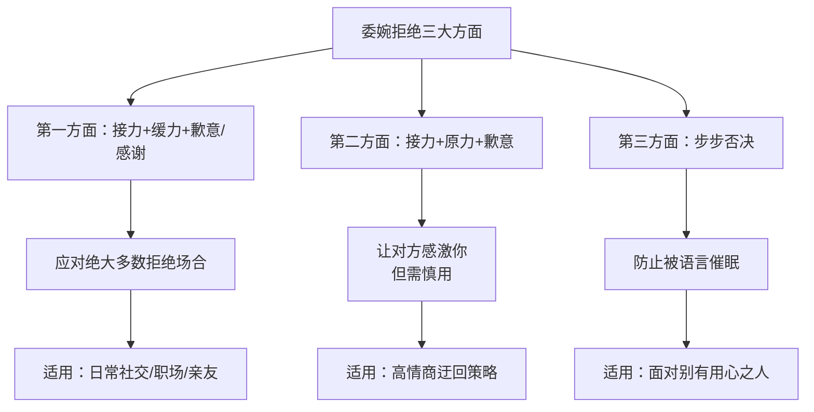
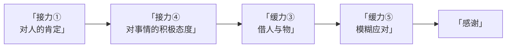
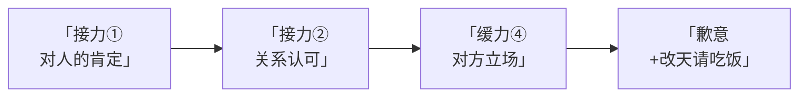
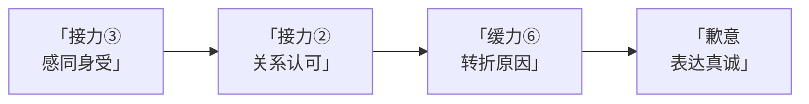

# 第03课：委婉拒绝别人的套路（上）

## Learning Objectives

- 掌握委婉拒绝的三大核心方面框架，能够区分不同公式的适用场景
- 熟练运用**接力**（情绪安抚）的4个切入点，实现在拒绝前建立情感缓冲区
- 熟练运用**缓力**（委婉拒绝）的6个切入点，组合出得体的拒绝话术
- 学会区分何时用**歉意**、何时用**感谢**，以及何时两者都不用

## 核心框架概述

委婉拒绝别人的套路总共分为三大方面，本节课先讲第一大方面，后两个方面在[[0004-wei-wan-ju-jue-xia|第04课：委婉拒绝别人的套路（下）]]中详细展开。

### 第一大方面核心公式

> **接力 + 缓力 + 歉意或感谢**

这一公式可以应对**绝大多数**的拒绝场合，能够将拒绝产生的不利影响降到最低。

> [!TIP] Key Insight
> 委婉拒绝的核心不是"怎么说不"，而是"怎么说才能让对方舒服地接受不"。**接力**是情绪抚慰，**缓力**是拒绝表达，**歉意/感谢**是收尾闭环。三者缺一不可。

---

## 接力（情绪安抚）的4个切入点

**接力**的目的是对另一方前期情绪的安抚，让对方在心理上先得到肯定，为后面的拒绝做铺垫。

在实际使用中，可以**单独使用**一个切入点，也**经常叠加使用**多个切入点。

| 编号 | 切入点 | 核心要义 | 例句 |
|------|--------|----------|------|
| 1 | 对人的**肯定和赞美** | 认可对方的能力、眼光、人品 | "你的眼光一向独到" |
| 2 | 对**双方关系**的肯定、认可和关心 | 强调关系的重要性，表明你在乎对方 | "还是你够意思，有好事没忘了我这个好哥们" |
| 3 | 对对方的**感同身受** | 表示理解对方的处境和感受 | "你现在的这个状态，我也是深有体会" |
| 4 | 对**事情的积极态度** | 先正面肯定事情本身的价值 | "这个项目确实不错" |

> [!NOTE] 叠加使用技巧
> 多数情况下，2~3个切入点叠加使用效果最佳。例如：先赞美对方（切入点1），再表达对关系的认可（切入点2），最后肯定事情的价值（切入点4）——三重情绪铺垫之后，对方已经做好了被拒绝的心理准备。

---

## 缓力（委婉拒绝）的6个切入点

**缓力**的目的是对另一方的请求给予委婉的拒绝。与接力一样，可以选择**单独使用**或**叠加使用**多个切入点。

| 编号 | 切入点 | 核心要义 | 示例话术 |
|------|--------|----------|----------|
| 1 | **延长答复** | 不立即拒绝，把答复时间延后 | "我明天中午给你答复" |
| 2 | **提高对方**（同时贬低自己） | 抬高对方能力，贬低自己不足 | "你的执行力那么强肯定没问题，不过我做事自由散漫习惯了，还是不给你添乱了" |
| 3 | **借人与物** | 把最终拒绝权转给别人 | "我需要和我们家那位商量一下" |
| 4 | **对方立场** | 站在对方角度考虑问题 | "我如果参与进去，可能会影响项目的进一步发展" |
| 5 | **模糊应对** | 不给出明确时间或承诺 | "商量完之后给您答复"（不说具体时间） |
| 6 | **转折原因** | 给出一个合理的客观原因 | "我前段时间刚投资了个项目，手底下也没钱" |

### 关键辨析：延长答复 vs 模糊应对

- **延长答复**：给出了具体的答复时间节点（如"明天中午"），对方知道什么时候会有结果
- **模糊应对**：不给出具体时间，用"回头再说""之后答复"等模糊表述，让对方自然淡化

> [!TIP] Key Insight — 借人与物的精髓
> "借人与物"的核心是把**最终的拒绝权转给别人**。即便对方最终被拒绝了，也**并非是我本人的意思**，而是"第三方的决定"。这样可以最大程度保护双方关系。

---

## 歉意或感谢的选择

| 选择 | 使用场景 | 原因 |
|------|----------|------|
| **感谢** | 对方出发点好、想共谋事情 | 对方是出于善意邀请你共同参与，感谢既是对善意的回应，也是给自己留后路 |
| **歉意** | 让对方看到你的真诚，画圆满句号 | 对方是明显求助或请求，你确实无法满足，表达歉意让对方感受到你的无奈和真诚 |
| **都不加** | 隐形拒绝 | 对方对于你给予肯定答复的意愿**不是很强**时，不需要画蛇添足 |

> [!WARNING] 注意
> 当使用缓力的第一个切入点"**延长答复**"时，后面一般不需要加歉意或感谢。因为既然还没有正式拒绝（只是说回头再答复），提前道歉反而显得奇怪。

---

## Worked Example

### 案例一：拒绝参与项目（多人变体）

**前提设定**：同辈或晚辈下属突然说有个项目，想找你一起参与，你不想参与。

#### 变体A：接力（切入点1+4）+ 缓力（切入点3+5）+ 感谢

> "你的眼光一向独到，这个项目肯定不错。不过呢需要投这么多钱，我需要和我们家那位商量一下，商量完之后给您答复。谢谢你能提供一个这么好的信息给我。"

#### 变体B：接力（切入点4）+ 缓力（切入点2）+ 感谢

> "这个项目确实不错。你的执行力那么强肯定没问题，不过我做事你也知道自由自在习惯了，比较懒散，还是不给你添乱了。不过谢谢你能够想到我。"

> [!NOTE] 提高对方的核心
> 使用"提高对方"切入点时，**必须同时贬低自己**。抬高对方不是单纯的夸奖，而是在对比中衬托出对方优于自己，从而让拒绝合理化。

#### 变体C：接力（切入点1+2）+ 缓力（切入点4）+ 歉意

> "还是你够意思，有好的事情没忘了我这个好哥们。不过我如果参与进去，你可能会有麻烦——你知道我和小明有矛盾，这个项目想要进一步发展，小明这一关是必须要过的。因此我参与进去必然会影响项目的进一步发展，所以我还是不参与了吧。但是必须要感谢你的这个邀请，改天我请你吃饭。"

### 案例二：拒绝借钱

**前提设定**：有人向你借钱，但你也没有钱。

> "你现在的这个状态，我也是深有体会。你是我最好的兄弟，我必须要尽全力帮你。但是我前段时间刚刚投资了个项目，现在手底下也没钱。这次真是抱歉了，好不容易兄弟找我帮个忙，我还没有帮上，实在是不好意思。"

**分析**：
- "你现在的这个状态，我也是深有体会" — 接力**切入点3**（感同身受）
- "你是我最好的兄弟，我必须要尽全力帮你" — 接力**切入点2**（关系认可）
- "但是我前段时间刚刚投资了个项目，手底下也没钱" — 缓力**切入点6**（转折原因：客观事实，无法反驳）
- "这次真是抱歉了……实在是不好意思" — **歉意**（让对方看到真诚，画圆满句号）

---

## Practice

> [!QUESTION] Self-check
> **场景**：你的同事想邀请你周末一起做一个兼职项目，但你周末已经安排了家庭活动，不想参加。请分别用两种不同的切入点组合，写出你的回复。

**要求**：
1. 第一种：使用接力切入点1 + 缓力切入点1 + 感谢
2. 第二种：使用接力切入点2+3 + 缓力切入点4 + 歉意

Reveal answer

**第一种（接力① + 缓力① + 感谢）：**

"你做事一向很靠谱，这个兼职项目听起来挺不错的。不过我需要先和家人确认一下周末的安排，明天上班给你答复。谢谢你想到我。"

- 接力①：肯定对方的做事能力
- 缓力①：延长答复（明天上班）
- 感谢：对方出发点好，想邀请你一起赚钱

**第二种（接力②+③ + 缓力④ + 歉意）：**

"咱俩同事这么多年，我一直很珍惜咱们的合作关系。周末做兼职确实能多挣点，这个心情我特别理解。不过说实话，如果我在周末投入太多精力，反而可能影响平时的工作状态，到时候拖了你的后腿就不好了。真是抱歉，这次没法一起了。"

- 接力②：肯定双方关系
- 接力③：对赚钱需求的感同身受
- 缓力④：站在对方立场（怕拖后腿）
- 歉意：画圆满句号

---

## 切入点使用总结表

### 接力（情绪安抚）切入点总览

| 切入点 | 核心动作 | 适用场景 | 示例关键词 |
|--------|----------|----------|------------|
| ① 对人肯定赞美 | 戴高帽 | 对方有能力、有眼光时 | "你眼光独到""你很靠谱" |
| ② 关系认可关心 | 拉近距离 | 关系较好的亲友、同事 | "还是你够意思""好哥们" |
| ③ 感同身受 | 共情 | 对方处于困境或迫切需要 | "我深有体会""特别理解" |
| ④ 积极态度 | 先肯定事 | 事情本身有价值、有意义 | "这个项目不错""挺好的" |

### 缓力（委婉拒绝）切入点总览

| 切入点 | 核心动作 | 适用场景 | 注意事项 |
|--------|----------|----------|----------|
| ① 延长答复 | 拖延时间 | 对方非紧急请求 | 给出具体时间点，否则变成模糊应对 |
| ② 提高对方 | 抬高+自贬 | 对方自尊心强、好面子 | **必须同时贬低自己** |
| ③ 借人与物 | 转移决定权 | 涉及多人决策的事情 | 把拒绝权"甩锅"给第三方 |
| ④ 对方立场 | 换位思考 | 对方是关系较好的熟人 | 站对方角度说明为什么"不参与对他更好" |
| ⑤ 模糊应对 | 不留把柄 | 不想把话说死、不确定的情况 | 不给出具体承诺和时间 |
| ⑥ 转折原因 | 给客观理由 | 有真实或合理的客观原因 | 理由要站得住脚，不能太牵强 |

### 歉意/感谢选择速查

| 对方类型 | 对方动机 | 应选 | 原因 |
|----------|----------|------|------|
| 邀你共谋好事 | 分享机会、善意邀请 | **感谢** | 肯定善意 + 给自己留后路 |
| 求你帮忙 | 求助、请求 | **歉意** | 表达真诚 + 画句号 |
| 试探性请求 | 意愿不强、随口一提 | **都不加** | 对方不期待肯定答复 |

---

## Next Step

继续学习 [[0004-wei-wan-ju-jue-xia|第04课：委婉拒绝别人的套路（下）]]，掌握第二大方面（接力+原力+歉意）和第三大方面（步步否决）的核心套路。

---

*课程内容基于王光宗"口才套路学"音频课程整理*