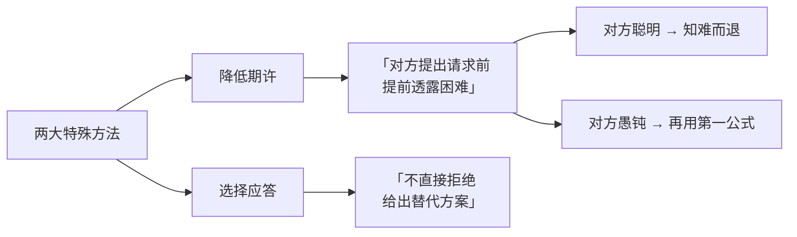
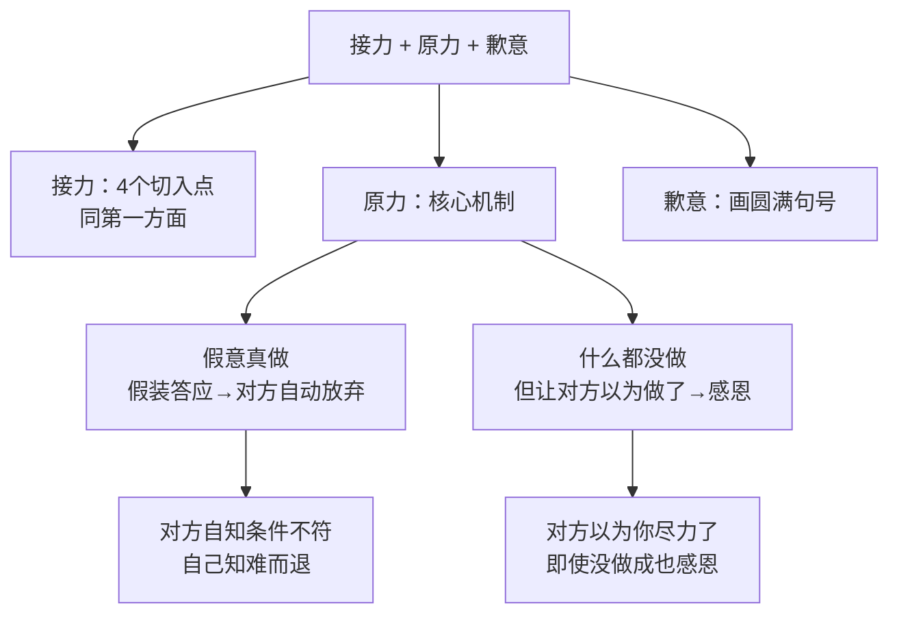
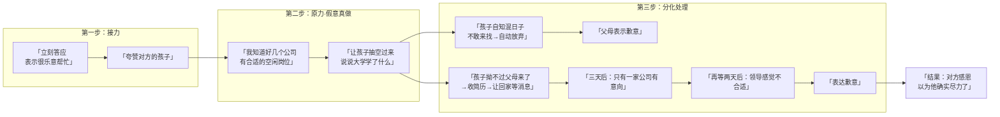
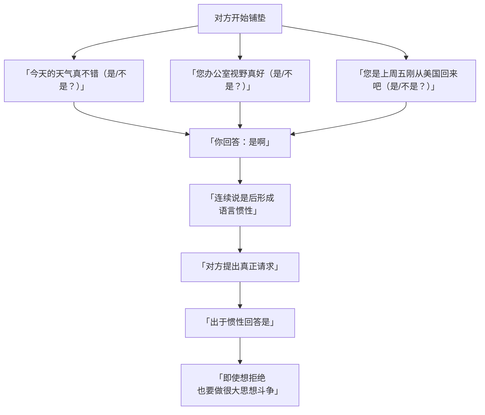

# 第04课：委婉拒绝别人的套路（下）

## Learning Objectives

- 掌握**降低期许**和**选择应答**两种特殊委婉拒绝方法
- 理解**接力+原力+歉意**的核心机制，学会让对方感恩的拒绝技巧
- 掌握**步步否决**法，防止被别有用心之人语言催眠
- 能够根据不同场景选择最合适的拒绝策略

## 回顾与导入

在[[0003-wei-wan-ju-jue-shang|第03课：委婉拒绝别人的套路（上）]]中，我们学习了委婉拒绝的**第一大方面**——

> **接力 + 缓力 + 歉意或感谢**

接力的4个切入点（肯定赞美、关系认可、感同身受、积极态度）和缓力的6个切入点（延长答复、提高对方、借人与物、对方立场、模糊应对、转折原因）构成了最常用的拒绝工具库。

本节课我们接着讲剩余内容：**两大特殊方法** → **第二大方面（接力+原力+歉意）** → **第三大方面（步步否决）**。

---

## 一、两大特殊委婉拒绝方法

在学习第二大方面之前，先补充两个特殊的委婉拒绝方法，它们可以配合第一大方面的公式使用。



### 1. 降低期许

**核心要义**：你已经大体猜到对方的目的了，在对方**还没有提出请求之前**，就已经把你的拒绝理由**不着痕迹**地表达给了对方。

**操作步骤**：
1. 预判对方的目的（如要借钱、要帮忙）
2. 在聊天中不经意透露你在这方面的困难
3. 观察对方反应

> 对方聪明 → 自然**知难而退**，不再提出请求
> 对方愚钝 → 没理解你的意思，提出请求后你再用第一公式（接力+缓力+歉意/感谢）

**实战举例**：

| 预判对方目的 | 降低期许话术 | 预期效果 |
|-------------|-------------|----------|
| 对方想借钱 | 聊天时不经意透露："最近手头也不太宽裕，投资的项目还没回本" | 聪明人不再提借钱 |
| 对方想让你帮忙办事 | "最近公司查得严，所有流程都要走审批" | 聪明人知难而退 |
| 对方想约你周末出差 | "这周末已经答应了家人，再放鸽子就该跪搓衣板了" | 对方自然不提邀约 |

### 2. 选择应答

**核心要义**：不直接拒绝，而是给出一个**替代方案**，让对方在替代方案中做选择。

**实战举例**：

> 妻子："咱今晚去吃牛排可以吗？"
> 丈夫（不想吃）："要不咱去吃酸菜鱼吧？"

丈夫没有说"不"，而是直接给了另一个选项。如果妻子接受，问题解决；如果妻子坚持，丈夫再用第一公式。

> [!TIP] Key Insight
> 选择应答的本质是把对话从"是/否"的二元模式切换到"A还是B"的选择模式。当对方开始考虑你的替代方案时，就已经默认接受了"原来的方案不可行"这个前提。

---

## 二、第二大方面：接力 + 原力 + 歉意

### 核心公式

> **接力 + 原力 + 歉意**

这个公式不仅可以很好地拒绝对方，还可以让**对方感激你**。不过，**要慎用**。



### 原力的两个核心

| 核心 | 操作方式 | 适用对象 | 心理机制 |
|------|----------|----------|----------|
| **假意真做** | 假装答应要做，提出具体要求让对方自动放弃 | 对方动机强但条件不够 | 让对方自己意识到"我不行"，从而主动放弃 |
| **什么都没做，但让对方以为做了** | 制造"努力过的假象"，最终给出"尽力但没办成"的结果 | 执着、坚持不懈的人 | 让对方感受到你的付出，即使结果一样也对你感恩 |

> [!WARNING]
> 第二大方面的公式**要慎用**！因为它涉及一定的"表演"成分，如果被对方识破，反而会损害关系。使用前提是：你对对方有足够的了解，并且确定对方不会看穿你的策略。

---

### 真实案例一：上市企业高管的亲戚找工作

**背景**：一位上市企业高管的农村老家亲戚经常上门，让帮忙给孩子安排工作。但亲戚的孩子根本不适合这些岗位，硬性安排会给公司带来损失。

**以前的做法（错误）**：打哈哈或直接拒绝 → 被亲戚说"六亲不认"。

**后来的做法（原力策略三步法）**：



**关键分析**：

| 步骤 | 对应环节 | 具体操作 | 心理效果 |
|------|----------|----------|----------|
| 欣然接受 + 肯定孩子 | **接力** | 热情答应，夸赞孩子 | 消除敌意，建立好感 |
| 让孩子来说说学了什么 | **原力·假意真做** | 提出具体的"下一步要求" | 孩子自己知道大学混日子，不敢来，**自动放弃** |
| 父母因此表示歉意 | 附加效果 | 父母觉得不好意思 | 对方不但不怪你，反而向你**道歉** |
| 对执着的人走完整流程 | **原力·制造假象** | 收简历→等消息→反馈→最终说不行→抱歉 | 对方以为你真的尽力了，**非常感恩** |

> [!TIP] Key Insight
> 这个案例的精妙之处在于：**"假意真做"激发的是对方的自我筛选机制**。你没有拒绝任何人，是对方自己选择了放弃、选择了不来找你。而最终真的来找的人，你又走完了"帮忙"的整个流程——虽然结果一样，但对方感受到的是你的诚意和付出。

---

### 真实案例二：车险续保业务员的理想应对

**背景**：作者的**车险快到期**，接到车险公司业务员电话推销续保。作者对业务员说：

> "通过您刚才的交流，发现您很热情，对业务也很熟练。我也是你们家老客户了，每年都在你们家投保。您看能否再向您领导申请一下额外的礼品？"

业务员的实际应对是：一直表示已经是最大限度了，自己可以出钱买礼品给作者。结果让作者觉得"业务做得好"但仅此而已。

**如果用「接力+原力+歉意」理想应对**：

| 环节 | 话术 | 分析 |
|------|------|------|
| **接力** | "说实话先生，这确实是针对老客户最大的力度了。但是刚才和您聊得比较投机，您就像我大哥似的。" | 肯定对方 + 拉近关系 |
| **缓力过渡** | "这样吧，我在后面的领导反馈一下。不管领导给什么答复，我下午都给您去个电话。您下午几点方便？" | 制造"要帮忙"的信号 |
| **原力** | （挂电话后 **什么都不做**）到约定时间打电话："不好意思先生，领导一直没答复，您再等等。" | 让对方以为你真的找了领导 |
| **原力升级** | 晚上或第二天再打："领导说这是最大限度了，还批评我了，因为公司统一定好了奖励，谁都不能改变。" | 进一步强化"努力过"的印象 |
| **歉意** | "非常抱歉，没能和领导申请到额外的礼品。但是我自己可以出钱买礼品给您。" | 即使结果一样，让对方感动 |

**对比分析**：

| 对比维度 | 实际应对 | 理想应对（原力策略） |
|----------|----------|---------------------|
| 客户心理 | 业务不错，但也就这样了 | 这人真够意思，为我挨了批评还自己贴钱 |
| 后续影响 | 无 | 客户可能介绍朋友来买车险 |
| 关系深化 | 浅层交易关系 | 深层信任关系 |

> 两者结果的差异，就在于**原力**这个环节——让客户产生"你确实为我付出了努力"的认知。即使客观上什么都没改变，**主观感受**完全不一样。

---

## 三、第三大方面：步步否决

### 核心要义

> **精髓：坚持说"不"**

哪怕对方提出与话题没有关系的、融洽气氛的话，也要坚持说"不"。目的是防止自己被对方**催眠**，形成一种**语言惯性**，当你真正想拒绝时，却说不出"不"字。

### 原理：语言的惯性催眠



> [!WARNING] 步步否决 — 防催眠核心原则
> 当你知道对方的目的是为了向你提请求，而这个请求是你**不能帮对方做到**的，那么一定要**步步否决**对方！不要被任何"轻松话题"带入语言惯性。

### 实战对比

| 对方引导话术 | 错误回应（被催眠） | 正确回应（步步否决） |
|-------------|-------------------|---------------------|
| "今天的天气真不错" | "是啊，天气不错" | "天气预报说可能**有雨**" |
| "您办公室的视野真好" | "是啊，楼高就是有这个好处" | "就我个人而言，还是**更喜欢看车流**，会让我更有灵感" |
| "您是上周五刚从美国回来吧" | "对，刚回来" | "**其实上周四就回来了**，一直在倒时差" |

### 为什么这招有效？

| 概念 | 解释 |
|------|------|
| **语言惯性** | 人有一种心理倾向：连续回答了多个"是"之后，对后续问题也倾向于回答"是" |
| **催眠阻断** | 在对方铺垫阶段就用"不"打断，对方就失去了建立惯性链条的基础 |
| **核心原则** | 对方在营造轻松气氛时，你不需要跟着轻松——你知道他的目的，你就要打断他的节奏 |

---

## 三大方面综合对比

| 对比维度 | 第一方面 | 第二方面 | 第三方面 |
|----------|----------|----------|----------|
| **核心公式** | 接力+缓力+歉意/感谢 | 接力+原力+歉意 | 步步否决 |
| **适用场景** | 绝大多数拒绝场合 | 想让对方感恩的场合 | 面对别有用心之人的催眠 |
| **复杂性** | 中等，可自由组合切入点 | 较高，需要演技和耐心 | 简单，但需要警觉 |
| **使用频率** | 最高，日常必备 | 低，特定场合使用 | 中等，遇到"套路"时使用 |
| **风险** | 低，最安全 | **中高**，被识破反而伤关系 | 低，中断对话即可 |
| **对方心理** | 理解但不一定接受 | 感恩戴德 | 无法进入催眠状态 |

---

## 切入点使用速查表

| 你需要什么 | 选择哪个方面 | 原因 |
|------------|-------------|------|
| 快速、得体地拒绝 | 第一方面：接力+缓力+歉意/感谢 | 公式化操作，安全可靠 |
| 拒绝的同时让对方感恩 | 第二方面：接力+原力+歉意 | 让对方觉得你尽力了 |
| 对方明显在"套路"你 | 第三方面：步步否决 | 立刻打断他的催眠节奏 |
| 不想把关系搞僵 | 第一方面 + 降低期许前置 | 提前铺垫，让对方知难而退 |
| 不想直接说不 | 选择应答 | 给出替代方案，转移焦点 |

---

## Practice

> [!QUESTION] Self-check
> **场景一（降低期许练习）**：你知道一位不太熟的同事下周可能会找你帮忙做一个额外项目，但你最近已经超负荷工作了。在你预测他会开口之前，你会在聊天时说什么来降低他的期许？
>
> **场景二（原力练习）**：一位朋友想让你帮忙联系一个你认识但不熟的行业专家，你不想欠这个人情。设计一个"接力+原力+歉意"的回应。
>
> **场景三（步步否决练习）**：一位推销员走进你的办公室，先环顾四周说"您的办公室采光真好"，你如何回应？

<details>
<summary>Reveal answer</summary>

**场景一（降低期许）：**
"最近项目特别多，这周已经连续加了三天班了。领导还说下个月可能还有新项目要上，估计这个月都够呛能正常休息了。哎，打工人不容易啊。"

→ 对方如果聪明，就不会再开口提额外项目的事。

**场景二（原力策略）：**
"你找我帮忙说明你是信任我，咱俩这关系没的说！（接力：关系认可）这样吧，我先联系一下那位专家，看看他最近档期怎么样。（原力：假意真做↔让对方以为你做了）"

→ 过两天回复："我联系上了，但他说最近在忙一个大项目，暂时抽不出时间。他说等忙完这阵子可以再约。实在抱歉，这次没帮上忙。（歉意）"

→ 在这个过程中你可能只发了一条微信，但对方会以为你费了不少心思。

**场景三（步步否决）：**
"采光是一般，朝北的，下午两点就没阳光了。而且这窗户隔音不太好，外面车流声都能听见。"

→ 直接打破对方的寒暄铺垫，让他无法建立"是"的惯性链条。

</details>

---

## 全课总结：委婉拒绝三大方面总览

```
┌─────────────────────────────────────────────────────────────┐
│                    委婉拒绝别人的套路                         │
├─────────────────────────────────────────────────────────────┤
│                                                             │
│  第一方面：接力 + 缓力 + 歉意/感谢                           │
│  ├─ 接力：①肯定赞美 ②关系认可 ③感同身受 ④积极态度            │
│  ├─ 缓力：①延长答复 ②提高对方 ③借人与物                     │
│  │        ④对方立场 ⑤模糊应对 ⑥转折原因                      │
│  └─ 歉意/感谢：善意邀约→感谢；明显求助→歉意；隐形拒绝→不加    │
│                                                             │
│  第二方面：接力 + 原力 + 歉意（慎用）                         │
│  ├─ 原力①：假意真做 → 对方自动放弃                          │
│  └─ 原力②：什么都没做 → 让对方以为做了 → 感恩               │
│                                                             │
│  第三方面：步步否决                                         │
│  └─ 精髓：坚持说"不"，打断语言惯性，防止被催眠                │
│                                                             │
│  两大特殊方法：                                             │
│  ├─ 降低期许：提前透露困难，聪明人知难而退                    │
│  └─ 选择应答：给出替代方案，转移焦点                         │
│                                                             │
└─────────────────────────────────────────────────────────────┘
```

> [!TIP] Key Insight — 最后的忠告
> 委婉拒绝的本质是一种**沟通艺术**，而不是**欺骗技巧**。第一大方面是"如何真诚地说不"，第二大方面是"如何策略地说不"，第三大方面是"如何警觉地拒绝被套路"。请始终以真诚为本，技巧为辅。

---

## Next Step

继续学习 [[0005-kuai-su-liao-tian-shang|第05课：快速和别人聊到一起的套路（上）]]，掌握快速破冰、拉近距离的口才套路。

---

*课程内容基于王光宗"口才套路学"音频课程整理*