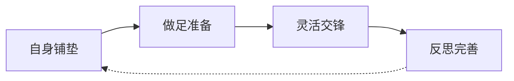

# 第05课：快速和别人聊到一起的套路（上）

## Learning Objectives

- 掌握聊天的**十六字口诀**和**核心公式**，建立系统化的聊天思维框架
- 学会从8个方面进行**自身铺垫**，让自己成为一个"有内容、有状态、有吸引力"的人
- 掌握**话题准备**的两大板块：候补亮点和共同话题，做到任何场合都有话可聊

## Core Idea

聊天能力不是天生的，而是可以**通过套路训练**获得的。本课提出的**十六字口诀**——"自身铺垫、做足准备、灵活交锋、反思完善"——是一套闭环系统。

这四个环节环环相扣，每一次聊天都是对这套系统的一次演练和优化。

> [!TIP] Key Insight
> 真正的聊天高手，不是临场发挥型的"天才"，而是**课前准备型**的"匠人"。他们在开口之前，已经做了80%的工作。

## 十六字口诀详解

| 环节 | 核心要求 | 一句话总结 |
|------|---------|-----------|
| **自身铺垫** | 调整心态、形象、知识储备 | 你自己就是最好的话题 |
| **做足准备** | 提前搜集素材、预判场景 | 有备无患，手中有粮心不慌 |
| **灵活交锋** | 根据现场情况随机应变 | 套路是死的，人是活的 |
| **反思完善** | 事后复盘、持续优化 | 每一次聊天都是升级的机会 |

---

## 核心公式

> **自身铺垫 + 话题准备 + 灵活交锋 + 话后反思 + 执行完善 = 聊天高手**

这五个板块构成了聊天能力训练的完整闭环。本课重点讲解前两个板块，后面的内容将在 [[0006-kuai-su-liao-tian-xia|第06课]] 中继续。

---

## 第一板块：自身铺垫（8个方面）

自身铺垫是聊天的**地基工程**。地基不牢，再好的技巧也无从施展。以下8个方面构成了一个完整的自我准备体系：

| # | 方面 | 核心要点 | 具体操作 |
|---|------|---------|---------|
| 1 | **积极心态** | 正能量的心理状态 | 比上不足比下有余、早睡早起做运动、[[#478呼吸法]] |
| 2 | **学会微笑** | 亲和力的第一道门槛 | [[#三步微笑法]]，每天对镜子练习 |
| 3 | **充分自信** | 相信自己值得被倾听 | 后续课程详解（[[0009-jing-jiu-tao-lu-shang|第09课]]） |
| 4 | **礼貌待人** | 尊重是沟通的前提 | 后续课程详解 |
| 5 | **干净整洁** | 第一印象的硬件条件 | 衣服干净无异味、每天刷牙洗澡、注意口腔气味 |
| 6 | **多去付出** | 小恩小惠建立好感 | 带小礼物、帮做力所能及的小事 |
| 7 | **发现兴趣** | 用爱好给自己贴标签 | 培养1-2个兴趣爱好作为谈资 |
| 8 | **热爱运动** | 多人运动打开社交圈 | 篮球、羽毛球等集体运动，容易融入圈子 |

### 1. 积极心态

心态决定状态。一个消极抱怨的人，即使技巧再好，也让人避之不及。

**三个实用技巧：**

**技巧一：比上不足比下有余**
- 不看自己缺少的，多看自己拥有的
- 和别人比较时，向上看激励自己，向下看感恩生活
- 聊天时不要抱怨工作、家庭、社会，保持正向输出

**技巧二：早睡早起做运动**
- 充足的睡眠是情绪稳定的基础
- 规律的运动能释放压力、提升自信心
- 早起让人从容，不迟到本身就是一种积极暗示

> [!TIP] 478呼吸法
> 这是一种源自瑜伽的放松技巧，在聊天前紧张时使用效果极佳。
>
> **步骤：**
> 1. **吸气** 4秒（用鼻子缓缓吸气）
> 2. **憋气** 16秒（屏住呼吸，保持放松）
> 3. **吐气** 8秒（用嘴巴缓缓吐气）
>
> **比例：** 1 : 4 : 2
>
> **使用时机：** 进入饭局前、即将发言前、感到紧张时
> **练习频率：** 每天早晚各做3-5组，养成习惯后临场自然能用

### 2. 学会微笑

微笑是最低成本的社交工具。但很多人要么笑不出来，要么笑得很假。

> [!TIP] 三步微笑法
> 每天对着镜子练习，直到形成肌肉记忆。
>
> **第一步：嘴唇自然闭合**
> - 面部放松，双唇轻轻合拢
> - 不要抿嘴，不要用力
>
> **第二步：嘴唇微张**
> - 上下唇微微分开约2-3毫米
> - 露出上排牙齿的切缘
>
> **第三步：嘴角上扬**
> - 嘴角向两侧和上方轻轻提起
> - 带动苹果肌微微上提
> - 眼神配合，眼睛微弯（"眼笑"比"嘴笑"更重要）
>
> **练习方法：** 每天早晚对着镜子练习5分钟，先拆解练习三步，再连贯完成。一周后尝试在和人打招呼时自然使用。

### 3-4. 充分自信与礼貌待人

这两个方面涉及更深层的人际交往技巧，将在后续课程中详细讲解，此处不展开。

### 5. 干净整洁

干净整洁是社交的**入场券**。没有人有义务透过邋遢的外表去发现你有趣的灵魂。

**关键检查清单：**
- ✅ **衣着：** 衣服干净、无褶皱、无异味，合身得体
- ✅ **口腔：** 每天刷牙，饭后漱口，随身携带薄荷糖或漱口水
- ✅ **身体：** 每天洗澡，注意体味，适当使用淡香水
- ✅ **细节：** 指甲修剪干净，头发整齐，鞋子干净

### 6. 多去付出

**小付出原则：** 不要求大，重在心意和频率。

**可操作的做法：**
- 赴约时带一盒水果、一袋点心、一瓶好酒
- 看到别人需要帮忙时主动搭把手（倒茶、递纸巾、挪椅子）
- 记住别人的小喜好，下次见面时带给他

### 7. 发现兴趣

兴趣是最好的**话题储备库**。一个没有爱好的人，在聊天中是"无色无味"的。

**行动指南：**
- 培养1-2个可以**持续投入**的兴趣爱好（摄影、书法、烹饪、钓鱼等）
- 将兴趣变成自己的**社交标签**（"老张是我们圈子里最会泡茶的人"）
- 通过兴趣积累谈资（相关领域的趣闻、知识、故事）

### 8. 热爱运动

多人运动是最好的**社交场景**。在运动中建立的情谊，比饭桌上更深厚。

**推荐运动类型：**
- **球类运动：** 篮球、羽毛球、乒乓球、网球——天然的分组对抗，快速拉近距离
- **户外运动：** 徒步、骑行、登山——共同的经历是最好的话题
- **竞技类：** 桌球、保龄球、飞盘——轻松有趣，适合商务休闲

---

## 第二板块：话题准备

话题准备分为两个层面：**候补亮点**（以防冷场的应急素材）和**共同话题**（主动发起和主导聊天的素材）。

### 候补亮点（4个方面）

候补亮点是**备胎话题**，在冷场或需要过渡时随时拿出来用。

| # | 候补来源 | 具体操作 | 举例 |
|---|---------|---------|------|
| 1 | **历史上的今天** | 每天早晨花3分钟搜索当日历史事件 | "今天正好是XX诞辰100周年，他当年……" |
| 2 | **与天气匹配的故事/笑话** | 准备2-3个和天气有关的趣事 | 下雨天→关于雨天的趣事/冷知识 |
| 3 | **与交通情况匹配的故事/笑话** | 准备通勤路上遇到的趣事 | 堵车时看到的奇葩事、打车遇到的司机趣闻 |
| 4 | **与谈话载体形式匹配的故事/笑话** | 根据场合准备相关素材 | 聚餐→餐厅特色、菜品典故（如宫保鸡丁的由来） |

#### 候补亮点案例：宫保鸡丁的由来

> 在饭局上，一道宫保鸡丁上桌，你可以这样说：
>
> "大家知道宫保鸡丁为什么叫'宫保'吗？其实这不是一道菜名，而是一个官名。清朝的丁宝桢担任过'太子少保'，人称'丁宫保'。他最爱吃这道菜，后人就把这道菜命名为'宫保鸡丁'。所以这个'宫保'不是指宫廷御膳房，而是这位丁大人的官衔简称。"
>
> 这类**菜品典故**既显得有文化，又很自然地活跃了气氛。

### 共同话题（7大方面）

共同话题是聊天的**主食**，决定了聊天的深度和持久度。

#### 1. 时下热点

时下热点是**最容易上手**的共同话题，因为大家都在关注。

**核心方法：**
1. **要有自己的看法** — 不要只是转述新闻，要加工成观点
2. **搜集网友的有趣评论** — 有料有梗的评论是最好的聊天素材

> [!TIP] 案例详解：林丹出轨事件
>
> **事件背景：** 林丹被曝在妻子谢杏芳孕期出轨。
>
> **准备过程：**
> 1. **了解事实经过**：什么时间、什么地点、被谁曝光
> 2. **形成自己的观点**：
>    - 公众人物的道德责任与社会期待
>    - 体育明星的商业价值与形象管理
>    - 婚姻关系的本质与人性考验
> 3. **搜集网友评论**：
>    - "以后林丹的比赛，观众应该喊'扣杀'还是'出轨'？"（幽默角度）
>    - "谢杏芳才是最惨的，孕期被全世界通知老公出轨。"（同情角度）
>    - "明星的私生活和公众形象该不该分开看？"（深度角度）
>
> **如何在聊天中主导话题：**
> 1. **引入话题：** "最近林丹的事你们看了吗？真是让人唏嘘。"
> 2. **抛出观点：** "我倒觉得，这事儿暴露了一个问题——公众人物的道德成本到底该多高？"
> 3. **引导讨论：** "你们觉得明星的私生活和专业能力应该分开看吗？"
> 4. **引入趣评：** "网上有条评论很有意思，说……你们怎么看？"
>
> **注意：** 热点话题要**把握分寸**，不要在饭桌上制造对立，以交流和讨论为目标，不要争输赢。

## Worked Example

**场景：** 部门聚餐，你和同事A、同事B（都是比较熟但不常私下联系的关系）一起吃饭。菜还没上齐，大家都在低头玩手机，气氛有些冷。

**应用十六字口诀：**

**自身铺垫（你已经做过）：**
- 今天穿着整洁，面带微笑到场
- 心态调整好了，告诉自己"今晚的目标是开心吃饭"
- 路上做了3组478呼吸法，心情放松

**做足准备（你已经准备）：**
- 候补亮点：查了今天的"历史上的今天"，正好是某位著名作家的诞辰
- 共同话题：最近公司附近开了一家网红奶茶店，同事朋友圈都在发

**灵活交锋：**
- 主动打招呼："最近项目忙完了，终于有机会和大家吃顿饭了"
- 引入话题："哎对了，楼下那家奶茶店你们去过没？我看朋友圈都被刷屏了"
- 接续话题："我排了40分钟才买到，但说实话……味道一般（笑）你们觉得呢？"
- 气氛活起来后，大家都放下了手机

**话后反思（回家后做）：**
- 记录：今天用"奶茶店"话题打开了局面，效果不错
- 不足：中间有大约2分钟的冷场，没有及时接话
- 改进：准备更多候补话题，尤其是和同事行业相关的

## Practice

> [!QUESTION] 自检练习
>
> 1. 请写出十六字口诀和核心公式，确保能脱口而出。
>
> 2. 在自身铺垫的8个方面中，选出你最薄弱的两项，制定一个本周改进计划。
>
> 3. 明天出门前，用"历史上的今天"搜索当天的重要事件，准备一个可以在聊天中使用的候补话题。
>
> 4. 选择一个当前的热点事件，准备：①你的核心观点（30字以内）②一个有代表性的网友评论，下次聊天时试着用上。

参考回答

**1. 十六字口诀：**
自身铺垫 → 做足准备 → 灵活交锋 → 反思完善

**核心公式：**
自身铺垫 + 话题准备 + 灵活交锋 + 话后反思 + 执行完善

**2. 改进计划示例（假设选"积极心态"和"发现兴趣"）：**
- 积极心态：每天睡前写3件感恩的小事，坚持21天
- 发现兴趣：报名一个周末的摄影入门班，下个月和同事约一次外拍

**3-4. 无标准答案，关键在于执行。** 建议用手机备忘录记录自己的准备过程和实际使用效果，一周后回顾总结。

## Next Step

继续学习 [[0006-kuai-su-liao-tian-xia|第06课：快速和别人聊到一起的套路（下）]]，掌握共同话题的其余6个方面、灵活交锋的技巧、话后反思和执行完善的系统方法。