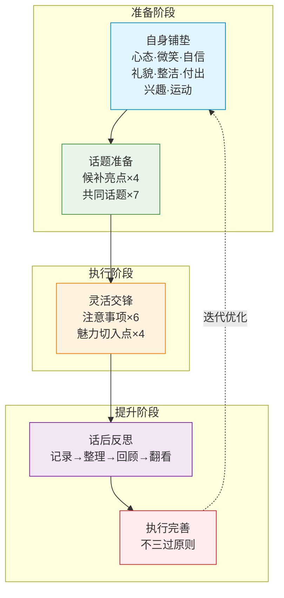
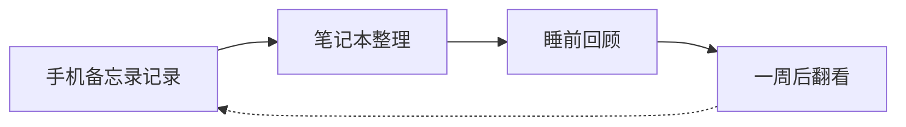

# 第06课：快速和别人聊到一起的套路（下）

## Learning Objectives

- 掌握**共同话题**的7大方面（续），能在任何场合找到与对方共振的话题
- 学会**灵活交锋**的6大注意事项和4大魅力切入点，让聊天生动有趣
- 建立**话后反思**和**执行完善**的闭环系统，持续提升聊天能力

## Core Idea

如果说[[0005-kuai-su-liao-tian-shang|第05课]]是"备菜"，那么本课就是"炒菜"和"复盘"。**话题准备**让你有料可聊，**灵活交锋**让你聊得精彩，**话后反思**和**执行完善**让你一次比一次更好。

> [!TIP] Key Insight
> 聊天不是"说什么"的问题，而是"怎么说"和"说完之后怎么办"的系统工程。真正的高手，每一次聊天都是为下一次聊天做准备。

---

## 五大板块完整系统

---

## 共同话题（续：第2-7方面）

接续[[0005-kuai-su-liao-tian-shang#共同话题（7大方面）|第05课的共同话题]]，以下为第2至第7个方面。

### 2. 参与者所在行业的相关方面

这是最能**拉近距离**的话题方向。每个人都对自己的行业有话说。

**操作方法：**
- 提前了解对方行业的基本常识（不需要精通，但要知道几个关键词）
- 提问时表现出"我是外行，但真的感兴趣"的姿态
- 从正面角度切入，不要一上来就批评对方的行业

**话术示例：**
- "李总，您做房地产这么多年了，这两年市场变化这么大，您觉得最大的挑战是什么？"
- "王老师，现在做教育行业不容易啊，线上线下的结合您是怎么看的？"

### 3. 参与者感兴趣事情的最新信息

**核心原则：** 关注对方的朋友圈、社交动态，发现他最近在关注什么。

**操作方法：**
- 翻阅对方最近的朋友圈，找到他晒过的活动、文章、照片
- 见面时自然带出："上次看到你发的那个展，我也一直想去，值得看吗？"
- 对方喜欢什么领域（车、茶、书法、健身），就关注该领域的最新动态

> [!TIP]
> 在饭局前花3分钟翻一下对方的朋友圈，你就比别人多了一个"定制话题"。这是性价比最高的准备工作。

### 4. 参与者遇到的人生大事

**适合切入的人生节点：**
- **结婚/订婚** — "恭喜恭喜！婚礼准备得怎么样了？"
- **生子/孩子升学** — "宝宝多大了？长得像谁？" / "孩子考上哪所大学了？"
- **开业/升职** — "听说你那边新店开张了，生意怎么样？"
- **买房/装修** — "新房在哪儿？装修风格定了吗？"
- **生病/康复** — （注意分寸）"最近身体恢复得怎么样？"

**注意事项：**
- **分清喜事和敏感话题**，如果不确定就不要提
- **先恭喜后关心**，即使是对方主动提起的烦心事，也先表达理解
- **不要过度追问**隐私细节，点到为止

### 5. 国家/当地关注问题的政策方针

这个方向适合**正式场合**或**与长辈/领导**的聊天。

**操作方法：**
- 像准备时下热点一样，要有自己的看法 + 搜集网友的有趣评论
- 保持**中立客观**的口吻，不要站队或激化矛盾
- 适合：房产政策、交通规划、教育政策、环保政策等

**话术示例：**
- "最近新出的那个政策您看了吗？我看网上讨论挺热烈的，有人说……也有人说……您怎么看？"
- "咱们这边新修的地铁线快通车了，以后出门方便多了。"

### 6. 对聊天地方的了解

饭局上最自然的切入点——**说你当下所在的地方**。

**核心内容：**
- **餐厅特色：** 装修风格、招牌菜、历史背景
- **菜品知识：** 八大菜系的特点、经典菜品的做法和故事
- **酒水知识：** 酒的产地、年份、品鉴要点

> [!TIP] 八大菜系速览
>
> | 菜系 | 特点 | 代表菜 |
> |------|------|--------|
> | **鲁菜** | 咸鲜，讲究火候 | 葱烧海参、九转大肠 |
> | **川菜** | 麻辣，百菜百味 | 宫保鸡丁、麻婆豆腐 |
> | **粤菜** | 清淡，原汁原味 | 白切鸡、清蒸鱼 |
> | **苏菜** | 刀工精细，口味平和 | 松鼠鳜鱼、狮子头 |
> | **闽菜** | 鲜香清淡，善用高汤 | 佛跳墙、荔枝肉 |
> | **浙菜** | 清新爽口，鲜美滑嫩 | 西湖醋鱼、东坡肉 |
> | **湘菜** | 香辣，口味重 | 剁椒鱼头、腊味合蒸 |
> | **徽菜** | 火候足，重油重色 | 臭鳜鱼、毛豆腐 |

### 7. 参与者的语言特色和方言了解

**作用：** 用对方的语言方式沟通，能快速产生"自己人"的感觉。

**操作方法：**
- 了解对方家乡的方言特色（不需要会说，知道几个标志性词汇即可）
- 可以请教对方："你们那儿的方言里，'吃饭'怎么说？"
- 如果会一两句对方的方言，在合适的时机用上，效果翻倍

**话术示例：**
- "你是东北人？那我得学一句'你干哈呢'（笑）"
- "我听你说话带点四川口音，'巴适'这个说法是四川话对吧？"

---

## 第三板块：灵活交锋

准备再多，如果不会"临场发挥"，一切都是白搭。灵活交锋是让准备好的素材**活起来**的关键。

### 聊天六大注意事项

| # | 注意事项 | 核心要求 | 错误示范 | 正确做法 |
|---|---------|---------|---------|---------|
| 1 | **主动打招呼** | 见面第一时间开口 | 低头玩手机等别人先开口 | 进门后3秒内主动微笑问候 |
| 2 | **遵守时间不迟到** | 尊重他人的时间 | 迟到5分钟说"堵车" | 提前10分钟到场，从容准备 |
| 3 | **合理幽默** | 幽默有分寸，不伤人不低俗 | 拿别人的缺陷开玩笑 | 用[[#五线三点法]]制造轻松气氛 |
| 4 | **不要夸耀自己** | 在失意人面前不谈得意事 | 在失业者面前谈升职加薪 | 多聊对方感兴趣的话题 |
| 5 | **以多听为主** | 倾听比说话更重要 | 打断别人、抢话 | 点头微笑，适时提问引导 |
| 6 | **多赞美对方** | 赞美要具体、真诚 | "你人真好"（空洞） | "你今天的领带颜色很衬你"（具体） |

#### 五线三点法详解

**定义：** 幽默的5条技术路线 + 3个关键要点。

**五条技术路线：**

| 路线 | 定义 | 话术示例 |
|------|------|---------|
| **故意曲解** | 对对方的话做"错误"但有趣的理解 | 对方："我最近在学游泳" → 你："那你以后下雨天出门岂不是自带游泳圈？" |
| **断章取义** | 抽取对方话中的某一个词进行发挥 | 对方："这个项目我们投入了很多人力物力" → 你："所以你是说，只要人够多，猪也能上树？"（笑） |
| **制造矛盾** | 设置一个明显的矛盾点制造笑料 | "我这人有三个优点：第一，谦虚；第二，从来不吹牛；第三……我忘了。" |
| **意外转折** | 先说正常的，然后突然反转 | "我这个人最大的优点就是——长得帅。好吧，开个玩笑，其实我最大的优点是有自知之明。" |
| **巧换妙接** | 用一个巧妙的谐音或双关接话 | 对方说"这个菜太咸了" → 你："那说明厨师是个'盐'值很高的人。" |

**三个关键要点：**
1. **时机要对** — 插话要在对方说完一句话的间歇，不要打断
2. **对象要对** — 自嘲最安全，调侃要挑关系好的人
3. **尺度要对** — 不涉及政治、宗教、身体缺陷、家庭隐私

### 四大魅力切入点

魅力切入点是让聊天**从平淡变精彩**的秘诀。

| # | 切入点 | 定义 | 案例 |
|---|--------|------|------|
| 1 | **联想起自身经历的好玩事情** | 对方的话题触发你的同类趣事，分享出来 | [[#QQ虚拟美女交友案例]]、[[#老师乳名宝宝案例]] |
| 2 | **对幼稚话题的双向处理** | 别人在聊你觉得无聊的话题时，假装热情参与进去 | 大家聊某个明星的八卦，你虽然不感兴趣，但可以问："所以那个明星到底做了什么？"推动话题 |
| 3 | **不懂问题或违背原则问题的模糊处理** | 遇到不懂或不便回答的问题时，用技巧带过 | "这个问题很有意思，但我还真没深入想过，您先说说您的看法？" |
| 4 | **对方刚经历过的状态延伸** | 从对方此刻的状态切入，建立共鸣 | 见[[#状态延伸案例]] |

> [!TIP] 案例一：QQ虚拟美女交友案例
>
> **场景：** 大家在聊网恋话题，有人说"网上认识的人不靠谱"。
>
> **你的联想：** "说到这个，我想起大学时候干过一件特傻的事。那时候流行QQ交友，我一个室友用女生的头像和资料去逗别人玩，结果对方特别认真，写了一封超长的表白信。我室友慌了，不知道怎么收场，最后只好'让这个女生消失'——把QQ号注销了（笑）。现在想想，网络交友确实方便，但也得多个心眼。"
>
> **效果：** 用自己的趣事佐证了观点，既有趣又有说服力，还自然地推进了话题。

> [!TIP] 案例二：老师乳名"宝宝"案例
>
> **场景：** 饭局上大家在聊小时候的绰号。
>
> **你的联想：** "听你们说绰号，我想起我们初中班主任，一个特别严肃的中年男老师，有次他妈妈来学校找他，站在走廊上喊了他一句'宝宝，吃饭了'——整个走廊都安静了。从那以后，我们全班私下都叫他'宝宝老师'（笑）。不过说真的，这件事让我们觉得老师也不是那么可怕的，反而更亲近了。"
>
> **效果：** 用反差制造笑点，同时传递了正向的人际关系思考。

#### 状态延伸案例

**场景：** 对方刚刚从外地出差赶到饭局。

**延伸提问：**
- "路上车多吗？这个点过来是不是堵了很久？"
- "坐了那么久的车，累不累？要不要先喝口茶缓缓？"
- "这次打算待几天？有没有想去转转的地方？"

**效果：** 这些看似"废话"的问题，实际上是**共情**的表现。对方会觉得你体贴、细心，对你产生好感。

---

## 第四板块：话后反思

聊天结束不是结束，而是**下一个聊天的开始**。

### 四步反思法

| 步骤 | 时间 | 操作 | 记录内容 |
|------|------|------|---------|
| **第一步：手机备忘录记录** | 聊天结束后10分钟内 | 趁记忆新鲜，简单记录 | 聊了什么话题、对方反应、自己的表现 |
| **第二步：笔记本整理** | 当天回家后 | 将零散记录整理成结构化笔记 | 分类归档：成功经验、失败教训、新学到的知识点 |
| **第三步：睡前回顾** | 睡前5分钟 | 在脑海中回放聊天过程 | 当时的表情、语气、对方的反应细节 |
| **第四步：一周后翻看** | 一周后的某个固定时间 | 重温笔记，发现规律 | 哪些话题效果好？哪些沟通方式需要改进？ |

### 临界点效应

> **30次** — 这是一个关键的数字。
>
> 当你将有意识地准备和反思聊天这个过程重复**30次**之后，你会发现聊天变得越来越轻松。这些套路会内化成你的**本能反应**，不再需要刻意去想。
>
> 就像学开车一样，前30次你紧张地记着每一个步骤，第31次开始，你已经可以在聊天中"自动驾驶"了。

---

## 第五板块：执行完善

### 不三过原则

> **同一个问题，不要犯第三次。**

| 层级 | 定义 | 示例 |
|------|------|------|
| **第一次** | 正常犯错，不可避免 | 聊天时不小心打断了别人 |
| **第二次** | 虽然意识到问题但没改，可以理解 | 又打断了同一个人 |
| **第三次** | 明知故犯，不可原谅 | 第三次在没有道歉的情况下打断别人 |

**执行方法：**
- 每次话后反思时，问自己：**"这次聊天中，我犯了哪些以前犯过的错误？"**
- 如果同一个问题出现了两次，立即制定**针对性改进方案**
- 可以用手机设置**每日提醒**，在当天第一次聊天前看一遍自己的"待改进清单"

---

## 五大板块总结

| 板块 | 核心理念 | 关键行动 | 时间分配（%) |
|------|---------|---------|:----------:|
| **自身铺垫** | 你就是最好的话题 | 8个方面持续修炼 | 25% |
| **话题准备** | 手中有粮心不慌 | 候补亮点+共同话题 | 35% |
| **灵活交锋** | 套路是死的，人是活的 | 注意事项+魅力切入点 | 30% |
| **话后反思** | 每一次聊天都是升级 | 四步反思法 | 5% |
| **执行完善** | 不三过 | 针对性改进 | 5% |

> [!TIP] 最后的话
> 这套系统看似复杂，但只要你坚持执行，**30次之后**你会发现——所有的"套路"都变成了你的本能，你已经不再需要刻意使用它们了。到那时，你就是一个真正的"聊天高手"。

## Worked Example

**场景：** 朋友组织的饭局，桌上有一半人你不认识。你旁边坐了一位做市场营销的女士，另一位是做IT开发的男士。

**应用五大板块：**

**自身铺垫（你已经做了）：**
- 衣着整洁、微笑入场、提前10分钟到场

**话题准备（你提前做了）：**
- 候补亮点：查了"历史上的今天"、准备了一个天气趣事
- 共同话题：关注了最近的热点事件、了解了这家餐厅的招牌菜

**灵活交锋：**
- → **主动打招呼：** "大家好，我是XX的朋友，今天过来蹭饭的（笑）"
- → **行业话题（共同话题#2）：** "听朋友说您是做市场营销的，最近很火的XX案例您关注了吗？"
- → **魅力切入点（状态延伸）：** "您是从公司直接过来的吗？这个点过来应该不堵吧？"
- → **魅力切入点（联想自身经历）：** "您说这个XX营销案例，让我想起之前我们公司也做过类似的尝试……"

**话后反思（回家后）：**
- 手机备忘录："今天认识了做市场的小林和做IT的小张。小林对XX案例很感兴趣，这个方向可以深挖。小张话不多，下次需要准备IT相关的话题。"
- 睡前回顾：今天"主动打招呼"做得好，但"赞美对方"做得不够

**执行完善：**
- 记录到待改进清单：下次聊天要有意识地赞美对方，至少说一次具体的赞美

## Practice

> [!QUESTION] 自检练习
>
> 1. 请默写出**聊天六大注意事项**，并对照你今天最后一次聊天，找出你违反了几条。
>
> 2. 从**四大魅力切入点**中选一个你最不擅长的，在本周的一次聊天中有意识地使用它，并记录效果。
>
> 3. 找一个朋友或同事，练习**状态延伸**式提问——从对方当下的状态切入，至少连续问出3个相关问题。
>
> 4. 审视自己的聊天习惯，找出一个犯了"两次"以上的问题，制定一个具体的改进方案（可执行的具体行动，不要笼统的"下次注意"）。

参考回答

**1. 六大注意事项：**
主动打招呼、遵守时间不迟到、合理幽默、不要夸耀自己、以多听为主、多赞美对方

**2-4. 无标准答案，重在执行。**
关键是要"做记录、看效果、再调整"——这也是话后反思和执行完善的核心精神。

**一个提醒：** 如果你发现自己在"以多听为主"这一条上总是做不到，可以尝试一个**具体行动方案**：在接下来的每次聊天中，强制自己在开口之前先等对方说完，并在心里默数3秒再发言。坚持21天，形成新习惯。

## Next Step

继续学习 [[0007-jiu-shang-liao-tian-shang|第07课：酒桌上聊天的套路（上）]]，掌握酒桌这个特殊场景下的聊天技巧和应对策略。