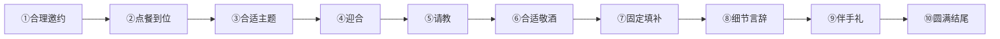

# 第07课：酒桌上聊天的套路（上）

## Learning Objectives
- 掌握酒桌聊天的"三有"原则：有礼、有利、有节
- 学会请领导吃饭的十大环节完整套路公式
- 熟练运用各环节的具体切入点和话术

## Core Idea

在中国文化中，"无酒不成席，无酒不成欢"。酒桌不仅是吃饭喝酒的场所，更是社交、沟通、建立关系的重要场合。本课的核心原则是**有礼、有利、有节**，所有套路都围绕这三个原则展开。

> [!TIP] Key Insight
> **"屁股决定脑袋"**——你在酒席上的角色决定了你应该如何交谈。主动的组局者和被动的参与者，套路完全不同。本章先聚焦**组局者请领导吃饭**的场景。

---

## 酒桌三原则

从大的层面上，酒席参与者分为两大部分：
1. **主动的组局者**
2. **被动的参与者**

在进入具体套路之前，先记住酒桌的三大核心原则：

| 原则 | 解释 | 关键要点 |
|------|------|----------|
| **有礼** | 言谈举止合乎礼仪规范 | 尊重他人、不失分寸 |
| **有利** | 符合参加酒席的目的，利益最大化 | 围绕目标展开言行 |
| **有节** | 保护照顾好自己 | 学会拒绝、量力而行 |

---

## 组局者之请领导吃饭

这是最常见也最需要技巧的场景。以下是完整的**十大环节套路公式**：

> **公式：** 合理邀约 + 点餐到位 + 合适主题 + 迎合 + 请教 + 合适敬酒 + 固定填补 + 细节言辞 + 伴手礼 + 圆满结尾

---

### ① 合理邀约

请领导吃饭，邀约的理由必须自然、合理，不能让领导感到突兀或为难。主要有**三个切入点**：

| 切入点 | 说明 | 示例话术 |
|--------|------|----------|
| **直接邀约法** | 领导帮了忙表示感谢，或单纯联络感情 | "刘局长，前段时间某某事给您添麻烦，您费心受累了。您看您什么时间有空，我想请您吃个便饭。" / "领导，中午有空吗？一起吃个饭吧。" |
| **假借餐厅或特色菜/酒** | 以特色菜品或好酒为理由邀约 | "领导，我这珍藏了一瓶好酒，要不要今天晚上找个地方尝一下？" / "领导，长江路上最近刚开了一家特色餐馆，据说饭菜不错，要不要今天晚上去品尝一下？" |
| **请教** | 以有事商量、有难题咨询为由 | "领导，我有事找您商量，可以一起吃个饭聊聊吗？" / "领导，我在工作中遇到了一些难题，想咨询您点建议，不知可以和您一起吃个饭聊聊吗？" |

---

### ② 点餐到位

请领导吃饭，点餐是展现细心和尊重的重要环节。流程和话术如下：

**标准流程：** 先递菜单给领导 → 领导推辞说"你点吧" → 你再点餐

点餐时要注意**四个注意点**：

| 注意点 | 操作方法 | 示例话术 |
|--------|----------|----------|
| **重复忌口和喜欢** | 知道就说出来确认，不知道就主动询问 | "领导，我记着您是不吃辣、喜欢吃海鲜，是吧？" / "领导，您有什么忌口的？喜欢吃什么？" |
| **问特色菜** | 向服务员询问特色菜，并确认是否符合领导口味 | "你们店里有什么特色菜？" → "这个菜辣不辣？可以不放辣吗？" |
| **询问领导是否可以** | 选好后征求领导意见 | "领导，点这个菜可以吗？" |
| **数量控制** | 热菜=人数×1.5倍（重要场合2倍），凉菜按人数½ | "我们5个人，点8个热菜，凉菜先来3个，您看合适吗？" |

---

### ③ 合适主题

和领导聊天的主题选择非常关键，记住一个核心原则：

> **不要试图主导话题！**

您只需要运用 [[0005-kuai-su-liao-tian-shang|快速和别人聊到一起的套路]] 中提到的**共同话题七大方面**即可：
1. 工作相关话题（但不要抱怨或打小报告）
2. 兴趣爱好
3. 时事新闻
4. 健康养生
5. 旅游见闻
6. 家庭生活
7. 人生感悟

让领导主导话题，您负责配合和延伸。

---

### ④ 迎合

迎合是让领导感到被理解和认可的技巧，有**两个切入点**：

| 切入点 | 说明 | 示例 |
|--------|------|------|
| **延伸 + 提供价值点** | 用解释/例子/故事延伸对方观点，再提供相关的新信息 | 领导："绿萝比较好养。" → 您："确实是，绿萝生命力很顽强。我以前养其他花都养不活，就绿萝只要浇水就行。（延伸）而且我无意中发现一个浇绿萝的新方法：刚开始要把水浇到托盘上，让根扎下来，一个月后就能随便浇水了。（提供价值点）" |
| **提炼 + 升华** | 总结领导的话，在此基础上升华夸赞 | 领导讲了5分钟团队合作 → 您提炼要点后说："王总用心良苦，有这样的领导是我们的幸运。我提议大家一起敬王总一杯！" |

> **注意：** 如果没有合适的升华词语，**只提炼不升华**，否则会有画蛇添足的感觉。

---

### ⑤ 请教

请教是赞美的高级形式——通过请教让对方感到被尊重，从而更愿意和您聊天。

| 应用场景 | 示例话术 |
|----------|----------|
| 请教工作 | "领导，为什么您看问题总是那么全面，有什么诀窍吗？" |
| 请教生活 | "领导，为什么我学网球总是感觉很难呢？" |

**额外好处：** 请教还能为下一步的敬酒做好铺垫。

---

### ⑥ 合适敬酒

敬酒的环节非常重要，这里先做简要说明，详细内容将在 [[0009-jing-jiu-tao-lu-shang|下节课]] 中展开。

| 场景 | 要点 |
|------|------|
| **单独请一个领导** | 一开始直接敬酒，内容侧重于感谢和感恩 |
| **请多位领导** | 请其中一位领导做主陪，您做副陪 |

---

### ⑦ 固定填补

固定填补是指在酒席过程中，当出现沉默或冷场时，用来填补空档的固定话术。有**三个切入点**：

| 切入点 | 示例话术 |
|--------|----------|
| **请对方吃菜** | "领导您尝一下这个菜，味道挺不错的。" / "领导您多吃点菜，否则只喝酒对胃不好。" |
| **请对方喝水** | "领导您多喝点水吧，否则只喝酒对胃不好。" |
| **应对突发情况** | 见下方表格 |

**突发情况的吉利话：**

| 情况 | 话术 |
|------|------|
| 嫌弃酒没倒满 | "领导，天酒天福，天增岁月人增寿嘛。" |
| 嫌弃酒倒太满 | "领导，酒撒杯外都是福。您要是不撒点福，我们怎么能沾上您的福气呢？" / "领导，酒撒开花，富贵荣华。" |
| 杯子碎了 | "领导，碎碎平安，富贵永伴。" / "领导，碎碎平安，幸福永伴。" |

---

### ⑧ 细节言辞

细节决定成败，酒桌上的细节言辞分为**四个切入点**：

| 切入点 | 说明 | 示例话术 |
|--------|------|----------|
| **续酒水、忙点烟** | 时刻关注领导的酒杯和茶杯 | 看到酒杯空了："领导，我给您加点酒吧。" / 看到领导要抽烟："领导，我给您点吧。" |
| **醒酒及时** | 适时安排醒酒措施 | 招呼服务员上热茶、醒酒汤、水果等 |
| **提醒是否有东西落下** | 酒席即将结束时使用 | "领导，您看看有没有什么东西落下了？" |
| **结束要嘱咐** | 分别时叮嘱安全 | "领导您路上慢点。" |

---

### ⑨ 伴手礼

| 注意点 | 说明 |
|--------|------|
| **核心道理** | 有付出必有回报 |
| **心态建设** | 当下不一定在求人办事，但对方只要收了，对您就有益无害 |
| **灵活使用** | 根据自身情况决定是否准备及准备什么 |

---

### ⑩ 圆满结尾

酒席结束后还有重要的收尾工作，有**两个注意点**：

| 注意点 | 操作方法 |
|--------|----------|
| **询问是否安全到家** | 发信息或打电话均可 |
| **强调准备的伴手礼** | 如果给了领导司机，一定要借机提一下（防司机忘记），正所谓"小心驶得万年船" |

---

## Worked Example

**场景：** 小王想请领导刘局长吃饭，感谢刘局长在上次项目中给予的帮助。

**应用过程：**

1. **合理邀约：** "刘局长，上次那个项目多亏了您帮忙才顺利通过，您费心了。您看这周末有时间吗，我想请您吃个便饭。"

2. **点餐到位：** 菜单先递给领导，领导说"你点吧"。小王说："刘局长，我记得您不吃辣，喜欢吃清淡的，对吧？" 然后问服务员特色菜，确认不辣后说："刘局长，点这个清蒸鲈鱼可以吗？"

3. **合适主题：** 领导聊起最近行业政策变化，小王认真倾听，不抢话。

4. **迎合：** 领导说："现在的政策对咱们行业的要求越来越高了。" 小王说："是啊，确实是这样，不过我觉得这也是好事，能倒逼咱们提升专业水平。（延伸）而且我注意到领导您上周开会时提到的应对方案，已经走在了政策前面。（提供价值点）"

5. **请教：** "领导，您是怎么判断政策方向的？有什么经验能分享一下吗？"

6. **合适敬酒：** "刘局长，感谢您一直以来的关照和指导，这杯我敬您。"

7. **固定填补：** "刘局长，您尝尝这个菜，味道确实不错。"

8. **细节言辞：** 看见领导杯子空了："刘局长，我再给您添点酒。"

9. **伴手礼：** 提前准备了一盒好茶，结束时送给领导。

10. **圆满结尾：** 晚上发信息："刘局长，您到家了吗？今天聊得很开心，那盒茶您尝尝，觉得好我下次再给您带。"

---

## Practice

> [!QUESTION] Self-check
> 如果你请领导吃饭，领导接过菜单后说"你点吧，我随便"，你应该怎么做？请写出完整的点餐对话流程（至少包含4个注意点中的3个）。

Reveal answer

正确的做法和话术流程：

1. **重复忌口和喜欢：** "领导，我记着您是不吃辣、喜欢吃海鲜，对吧？"

2. **问特色菜（确认口味）：** 向服务员询问特色菜后追问："这个菜不辣吧？可以不放辣吗？"

3. **询问领导是否可以：** "领导，点这个蒜蓉粉丝蒸扇贝可以吗？"

4. **控制数量：** 心里计算好热菜数量（人数×1.5倍）和凉菜数量（人数÷2）。

关键点：全程不要让领导觉得你需要他操心，而是让他感受到你的细心和周到。

## Next Step

Continue with the next lesson [[0008-jiu-shang-liao-tian-xia|第08课：酒桌上聊天的套路（下）]] to learn about inviting friends, clients, family, and how to behave as a guest.