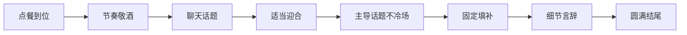
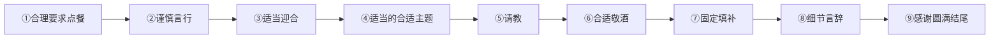

# 第08课：酒桌上聊天的套路（下）

## Learning Objectives
- 掌握请朋友、客户、家人吃饭的不同套路
- 学会作为被邀请者（领导请客等场景）的聊天套路
- 能根据不同角色和场景灵活组合套路公式

## Core Idea

上节课我们讲了**组局者请领导吃饭**的十大完整套路。本课继续深入，先讲组局者的其他场景（请朋友、客户、家人），再讲作为**被动的参加者**该如何应对各种酒席。

> [!TIP] Key Insight
> 本节课涵盖的套路公式可以覆盖**95%以上**的酒桌场景。剩下5%的情况，可以根据学到的公式灵活组合。

---

## 一、组局者（续）

### 请朋友吃饭

套路公式：

> **公式：** 点餐到位 + 节奏敬酒 + 聊天话题 + 适当迎合 + 主导话题不冷场 + 固定填补 + 细节言辞 + 圆满结尾

各板块说明：

| 板块 | 说明 |
|------|------|
| **点餐到位** | 与请领导套路相同（参考上节课），但可适当放松 |
| **节奏敬酒** | 作为主陪，动筷子前第一杯酒要有，过程中的待酒敬酒，以及最后的杯中酒。具体话术详见 [[0009-jing-jiu-tao-lu-shang|敬酒套路课]] |
| **聊天话题** | 不像和领导吃饭那么多约束。大家玩得开心快乐就好。用 [[0005-kuai-su-liao-tian-shang|快速聊到一起的套路]] 即可 |
| **适当迎合** | 都是朋友，适当迎合即可，否则显得见外。方式与上节课相同：延伸+提供价值点 / 提炼+升华 |
| **固定填补** | 同上节课 |
| **细节言辞** | 同上节课 |
| **圆满结尾** | 同上节课 |

#### 主导话题不冷场（5个切入点）

因为您是组局者，有义务让酒席不冷场，时刻关注场上气氛。以下是**五个切入点**：

| 切入点 | 说明 | 示例 |
|--------|------|------|
| **自己讲一个话题** | 主动发起新话题 | "最近那个新电影你们看了吗？" |
| **让某人谈论自己** | 点名某位朋友，让他分享近况 | "听说您上周刚提了新车？" ——对方一回答，其他人一参与，场面就活跃了 |
| **借助敬酒活跃气氛** | 用敬酒打破沉默 | "来，咱们一起走一个！" |
| **讲故事或笑话** | 预先准备一些有趣的内容 | 分享工作中的趣事或最近听到的笑话 |
| **固定填补方式** | 用请吃菜等填补冷场 | "来来来，大家多吃菜，这个凉了就不好吃了。" |

---

### 请客户吃饭

分两种情况：

#### 有领导在场

> **公式：** 点餐到位 + 合适主题 + 迎合 + 请教 + 合适敬酒 + 固定填补 + 细节言辞 + 圆满结尾

与请领导套路几乎相同，但有**两点关键区别**：

| 区别点 | 操作要点 |
|--------|----------|
| **点餐顺序** | 先考虑客户的口味，再考虑您的领导 |
| **谈话重心** | 以配合领导讲话为主，适当迎合客户。**不要去抢领导的风头** |

#### 没有领导在场

说明两点情况：
- 您请的客人地位一般
- 或者您的身份已经是领导了，完全可以应对

直接使用简化版套路，所有板块在上节课均已讲过，不再重复。

---

### 请家人吃饭

分两种情况：

#### 有长辈在场

> **公式：** 点餐到位 + 合适主题 + 迎合 + 请教 + 合适敬酒 + 固定填补 + 细节言辞 + 圆满结尾

与请领导套路差不多，唯一的区别是心理上可以稍微放松一些。

#### 无长辈 / 关系亲密

> **公式：** 点餐到位 + 节奏敬酒 + 聊天话题 + 适当迎合 + 主导话题不冷场 + 固定填补 + 细节言辞 + 圆满结尾

与请朋友套路相同。

---

## 二、组局者场景总结（主动方）

| 场景 | 核心区别 | 关键要点 |
|------|----------|----------|
| **请领导** | 10个环节完整套路 | 不主导话题，多迎合多请教 |
| **请朋友** | 少"合理邀约""伴手礼"，多"主导话题不冷场" | 适当迎合，活跃气氛 |
| **请客户（有领导）** | 同请领导套路 | 先考虑客户，配合领导讲话 |
| **请客户（无领导）** | 简化版 | 视对方地位灵活调整 |
| **请家人（有长辈）** | 同请领导套路 | 心理可放松 |
| **请家人（亲密）** | 同请朋友套路 | 玩得开心就好 |

---

## 三、作为被动的参加者

现在我们转换角色——当您是酒席的**被邀请者**时，套路又完全不同了。

### 领导请吃饭

这是最常见也最需要谨慎的场景。

> **公式：** 合理要求点餐 + 谨慎言行 + 适当迎合 + 适当的合适主题 + 请教 + 合适敬酒 + 固定填补 + 细节言辞 + 感谢圆满结尾

#### ① 合理要求点餐（3个切入点）

作为被邀请者，点餐不应太过主动，而应让主人来点。

| 切入点 | 操作方法 | 示例话术 |
|--------|----------|----------|
| **拒绝点餐，说出忌口** | 领导单独请你时，婉拒并简单说忌口 | "领导您点吧，我除了不吃辣，其余都可以。其实吃点辣的也没事。" |
| **必须点时点一个后询问** | 领命非要你点时，象征性点一个，然后确认 | "领导，我点这个菜和您的口味吗？" |
| **必须点时重复忌口** | 多人场合非要你点时，重复前面人所说的忌口 | "李总不吃辣，张明不吃海鲜，李磊不吃油腻，这样我点地三鲜吧。" |

#### ② 谨慎言行（4层意思）

| 层次 | 说明 |
|------|------|
| **第一层** | 哪怕领导单独请你吃饭，也不要过于兴奋，认为自己和领导成了好朋友。**不该说的话不要说** |
| **第二层** | 领导请很多人吃饭时，顺其自然，不要一味出风头。大部分时间做个好观众——**鼓掌、赞美、微笑、点头**，给予积极回馈 |
| **第三层** | **不要提工作中的问题** |
| **第四层** | 充分利用敬酒机会展现自己（详见 [[0009-jing-jiu-tao-lu-shang|敬酒套路课]]） |

#### ③ 适当迎合

作为客人，适当迎合是良好谈话进行的铺垫。方式同上节课：延伸+提供价值点 / 提炼+升华。

#### ④ 适当的合适主题

注意加了"适当"二字。领导请吃饭都是有目的的，吃饭的基本格调已经定了，您只需适当配合表达即可。关键是利用好后面的**请教、敬酒、固定填补、细节言辞**这几个板块。

#### ⑤ 请教 / ⑥ 合适敬酒 / ⑦ 固定填补 / ⑧ 细节言辞

这四个板块与组局者场景中讲的内容一致，此处不再重复。

#### ⑨ 感谢圆满结尾（4个切入点）

| 切入点 | 说明 | 示例话术 |
|--------|------|----------|
| **感谢领导的酒席** | 一定要表达感谢 | "谢谢领导的款待，今天真的很开心。" |
| **询问安全到家** | 发信息或打电话 | "领导到家了吗？今天感谢您的招待。"（如果之前感谢得不够好，此时可以再次感谢） |
| **提前离开要道歉** | 如有急事先走，一定要和领导说并道歉 | "领导非常不好意思，我临时有点急事需要提前走了。"然后询问领导是否有必要和大家也说一下 |
| **主动说下次组织** | 对朋友、家人、客户使用 | "下次我来组织，咱再聚一下。" / "下次我来组织，咱去吃鱼。" |

---

### 其他被动场景

以下场景的套路与主动组局的对应场景几乎一样，唯一的不同在**第一个板块（点餐）** 和**最后一个板块（感谢结尾）** 上。

#### 陪领导被请吃饭

> **公式：** 合理要求点餐 + 合适主题 + 适当迎合 + 请教 + 合适敬酒 + 固定填补 + 细节言辞 + 感谢圆满结尾

#### 朋友请吃饭

> **公式：** 合理要求点餐 + 聊天话题 + 适当迎合 + 请教 + 合适敬酒 + 固定填补 + 细节言辞 + 感谢圆满结尾

#### 客户请吃饭

> **公式：** 合理要求点餐 + 合适话题 + 适当迎合 + 请教 + 合适敬酒 + 固定填补 + 细节言辞 + 感谢圆满结尾

#### 家人请吃饭

> **公式：** 合理要求点餐 + 话题准备 + 适当迎合 + 请教 + 合适敬酒 + 固定填补 + 细节言辞 + 感谢圆满结尾

> **核心逻辑：** 套路中的"适当迎合"和"请教"起的作用是聊好天的铺垫——因为**每个人都希望被认可和赞美**，同时**每个人都好为人师**，希望被人尊重。

#### 和陌生朋友吃饭

> **公式：** 合理要求点餐 + 前半场时刻 + 适当迎合 + 请教 + 合适话题 + 合适敬酒 + 固定填补 + 细节言辞 + 感谢圆满结尾

**"前半场时刻"板块详解：**

把整个酒席按时间分为两部分：

| 阶段 | 策略 | 具体做法 |
|------|------|----------|
| **前半部分** | 少说话，多吃饭，多观察 | 积极回馈、及时点头、及时鼓掌、及时肯定、及时赞扬。目的是**充分了解新朋友**，为下半场做铺垫 |
| **后半部分** | 根据情况发挥 | 根据自己的身份，遵循"有利"原则，具体执行后面的板块 |

---

## 四、所有场景总对比

### 组局者（主动方）场景汇总

| 场景 | 完整公式 | 与请领导套路的差异 |
|------|----------|---------------------|
| **请领导** | 合理邀约+点餐到位+合适主题+迎合+请教+合适敬酒+固定填补+细节言辞+伴手礼+圆满结尾 | 基准模板 |
| **请朋友** | 点餐到位+节奏敬酒+聊天话题+适当迎合+主导话题不冷场+固定填补+细节言辞+圆满结尾 | 减少合理邀约、伴手礼，增加主导话题不冷场 |
| **请客户（有领导）** | 同请领导套路 | 点餐先考虑客户，配合领导讲话 |
| **请客户（无领导）** | 简化版 | 同请领导但可放松 |
| **请家人（有长辈）** | 同请领导套路 | 心理上可放松 |
| **请家人（亲密）** | 同请朋友套路 | 与朋友相同 |

### 参与者（被动方）场景汇总

| 场景 | 完整公式 | 关键差异点 |
|------|----------|------------|
| **领导请吃饭** | 合理要求点餐+谨慎言行+适当迎合+适当的合适主题+请教+合适敬酒+固定填补+细节言辞+感谢圆满结尾 | 多了"谨慎言行"板块 |
| **陪领导被请** | 合理要求点餐+合适主题+适当迎合+请教+合适敬酒+固定填补+细节言辞+感谢圆满结尾 | 同主动方对应场景，点餐和结尾不同 |
| **朋友请吃饭** | 合理要求点餐+聊天话题+适当迎合+请教+合适敬酒+固定填补+细节言辞+感谢圆满结尾 | 同主动方对应场景，点餐和结尾不同 |
| **客户请吃饭** | 合理要求点餐+合适话题+适当迎合+请教+合适敬酒+固定填补+细节言辞+感谢圆满结尾 | 同主动方对应场景，点餐和结尾不同 |
| **家人请吃饭** | 合理要求点餐+话题准备+适当迎合+请教+合适敬酒+固定填补+细节言辞+感谢圆满结尾 | 同主动方对应场景，点餐和结尾不同 |
| **和陌生朋友吃饭** | 合理要求点餐+前半场时刻+适当迎合+请教+合适话题+合适敬酒+固定填补+细节言辞+感谢圆满结尾 | 多了"前半场时刻"板块，先观察后发挥 |

---

## Worked Example

**场景：** 领导请小张和几位同事一起吃饭，小张作为被邀请者。

**应用过程：**

1. **合理要求点餐：** 领导让点菜，小张说："领导您点吧，我除了不吃辣，其他都可以。"

2. **谨慎言行：** 席间领导讲了一个工作上的趣事，小张跟着笑但不多嘴。领导和其他同事聊得热闹时，小张适时点头、微笑，不做"出头鸟"。

3. **适当迎合：** 领导说最近团队业绩不错，小张说："这都是在您的带领下大家才齐心协力做出来的。"

4. **适当的合适主题：** 顺着领导的话题聊了几句行业动态，不多延伸。

5. **请教：** "领导，您平时是怎么管理时间的？我看您处理那么多事还游刃有余。"

6. **合适敬酒：** "领导，感谢您一直以来对我的指导和照顾，这杯我敬您。"

7. **固定填补：** "领导您多吃点菜，这家的味道确实不错。"

8. **细节言辞：** 看到领导杯子空了："领导，我再给您添点茶。"

9. **感谢圆满结尾：** 结束后发信息："领导到家了吗？今天感谢您的款待，和大家聊得很开心。"

---

## Practice

> [!QUESTION] Self-check
> 如果你是组局者，请你的几个好朋友吃饭，席间突然冷场了，大家各自低头玩手机。请写出至少3种打破冷场的方法。

Reveal answer

作为组局者，营造不冷场的氛围是您的义务。以下是5种方法中的任意3种：

1. **自己讲话题：** "哎，你们最近刷到那个XX新闻了吗？太有意思了。"

2. **让某人谈论自己：** "老王，听说你最近去云南玩了？快给我们讲讲。"

3. **借助敬酒：** "来来来，咱们几个好久没聚了，先走一个！"

4. **讲故事/笑话：** "我给你们讲个昨天遇到的奇葩事……"

5. **固定填补：** "来来来，大家吃菜啊，这家的红烧肉可是一绝，凉了就不好吃了。"

关键：作为组局者，要时刻关注场上气氛，一旦有冷场苗头立刻采取措施。

## Next Step

Continue with the next lesson [[0009-jing-jiu-tao-lu-shang|第09课：酒桌上敬酒的套路（上）]] to learn the detailed art of toasting.