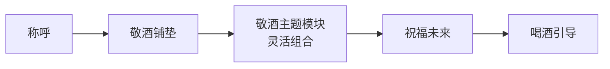

# 第09课：酒桌上敬酒的套路（上）

## Learning Objectives

- 掌握敬酒的核心公式，能够灵活拆解并组合各个模块
- 区分正式敬酒和自由敬酒两种场景的铺垫方式
- 熟练运用前4个敬酒主题模块（欢迎、感谢、祝贺、借力感悟）

## Core Idea

敬酒不是碰杯喝酒那么简单，而是一套完整的**语言结构**。只要掌握核心公式，任何场合都能即兴组织出得体、有分量的敬酒词。

### 敬酒核心公式

**五大模块缺一不可，但也无需每次全用**——根据场合和对象灵活裁剪。下面逐一拆解。

---

### 一、称呼

称呼体现的是个人修养，也是敬酒的第一印象。

| 场景 | 推荐称呼 | 说明 |
|------|----------|------|
| 正式场合敬大家 | "各位尊敬的领导、各位亲爱的同事" | 覆盖全场，周全得体 |
| 敬领导/长辈 | "刘局长""张总""王叔" | 姓氏+职务/尊称 |
| 平辈/朋友 | "哥们儿""兄弟""老李" | 亲切自然 |
| 初次见面 | "刘总，您好" | 先问好再敬酒 |

> [!TIP] 称呼的黄金法则
> **宁高勿低，宁尊勿亲**。拿不准时往高里叫——"领导"永远比直呼其名稳妥。对副职领导称呼时省略"副"字（如"刘局"而非"刘副局长"），对方不会纠正你，但会记你的好。

---

### 二、敬酒铺垫

铺垫决定了敬酒是突兀还是自然。分为两大类：**正式敬酒铺垫**和**自由敬酒铺垫**。

#### 正式敬酒铺垫（敬大家、领导/长辈敬酒、主陪副陪开场）

适用场景：主陪/副陪开场敬酒、领导起身敬大家、长辈敬全桌。

**方法一：告知敬酒数量 + 具体提示（不同地区）**

当桌上宾客来自不同地区时，先说明本地规矩，避免误会。

> 示例："各位领导，按照咱们这里的规矩，主陪带三杯酒，第一杯我敬大家，祝愿咱们..."

**方法二：直接告知具体数量（同地区）**

同地区宾客都熟悉规矩，直接说数量即可。

> 示例："来，我敬大家三杯。第一杯..."

#### 自由敬酒铺垫（一对一/多对一）

**方法一：含敬酒词（直接提出/请示提出）**

直接提出："王总，我敬您一杯酒。"
请示提出："王总，方便的话，我想敬您一杯酒。"

**方法二：直接表达喝酒意思（熟人间）**

> "来，喝一个。"
> "走一个。"

---

### 三、祝福未来

敬酒的核心不是回顾过去，而是**指向未来**——祝福、希望、期待。

| 切入点 | 话术示例 |
|--------|----------|
| 希望常来常往 | "希望以后多走动，常来常往" |
| 希望多多指教 | "以后还请王总多多指教" |
| 祝福祝愿（通用） | "祝您身体健康、工作顺利、阖家幸福" |
| 祝福祝愿（看对象） | 领导 → "步步高升"；长辈 → "身体硬朗"；朋友 → "财源广进" |
| 祝福祝愿（看状态） | 对方刚升职 → "祝您在新的岗位上大展宏图"；对方生病初愈 → "祝您早日康复" |

---

### 四、喝酒引导

| 方式 | 适用场景 | 话术示例 |
|------|----------|----------|
| 以茶代酒 | 不喝酒的领导/客人 | "领导，我以茶代酒敬您，情谊都在茶里了" |
| 我干了您随意 | 领导、初次相识 | "我干了，您随意" |
| 直接说明干杯 | 朋友、平辈 | "来，干杯！" |

---

### 17大敬酒主题模块全景预览

| 编号 | 主题 | 适用场景 | 本课/下课 |
|:----:|:----|:----------|:----------:|
| 1 | 欢迎主题 | 外地客人 / 新成员 | 🔼 本课 |
| 2 | 感谢主题 | 领导栽培 / 朋友帮助 | 🔼 本课 |
| 3 | 祝贺主题 | 升职 / 生日 / 纪念日 | 🔼 本课 |
| 4 | 借力感悟主题 | 天气 / 历史事件 / 特色菜 | 🔼 本课 |
| 5 | 谦虚主题 | 不善言辞时自谦 | ⬇️ 下节课 |
| 6 | 荣幸主题 | 见到重要人物 | ⬇️ 下节课 |
| 7 | 相似点话题 | 老乡 / 校友 / 同好 | ⬇️ 下节课 |
| 8 | 敬佩主题 | 白手起家 / 行业前辈 | ⬇️ 下节课 |
| 9 | 层次渐进 | 敬多杯酒时层层递进 | ⬇️ 下节课 |
| 10 | 引用对方话语 | 引用对方刚才的话敬酒 | ⬇️ 下节课 |
| 11 | 心情主题 | 激动 / 紧张 / 开心 | ⬇️ 下节课 |
| 12 | 名人名言 | 借古人/名言敬酒 | ⬇️ 下节课 |
| 13 | 缘分主题 | 初次见面 / 偶然相聚 | ⬇️ 下节课 |
| 14 | 第一次主题 | 第一次相见 / 第一次在XX喝酒 | ⬇️ 下节课 |
| 15 | 赞美主题 | 第三者赞美 / 对比赞美 | ⬇️ 下节课 |
| 16 | 问题互动 | 提问引导干杯 | ⬇️ 下节课 |
| 17 | 俗话说+押韵句子 | 押韵顺口溜敬酒 | ⬇️ 下节课 |

---

### 主题1：欢迎主题

欢迎主题是最常见的敬酒场景——欢迎外地来的客人、欢迎新加入团队的同事、欢迎远道而来的朋友。

> [!NOTE] 欢迎主题完整套路
> **场景**：外地客户李总来公司考察，你作为项目负责人敬酒。
>
> **称呼**：李总
>
> **敬酒铺垫**：李总，这杯酒我敬您。
>
> **主题模块**：今天您不远千里从上海飞到北京，一路辛苦了。咱们北京这几天正好降温，您这真是"风雪送春归"，给我们带来了上海的暖意和活力。（借力天气）
>
> **祝福未来**：希望您在北京这几天一切顺利，咱们这个项目在您的指导下一定能做出口碑。
>
> **喝酒引导**：我干了，您随意。
>
> **变体**：如果客人来自更远的地方（如海外），可以强调"跨越千山万水"、"漂洋过海"等词汇来强化欢迎的诚意。

---

### 主题2：感谢主题

感谢主题分为**直接感恩感谢**和**间接感恩感谢**。

#### 直接感恩感谢

> [!NOTE] 感谢领导栽培
> **场景**：年底聚餐，敬直属领导张总。
>
> "张总，这杯酒我敬您。今年跟着您做项目，从方案策划到落地执行，您手把手教我。说实话，要不是您的包容和指点，我不可能这么快上手。**千言万语汇成一句话：谢谢您。** 希望在接下来的工作中，还能继续跟着您学习。我干了，您随意。"

> [!NOTE] 感谢朋友帮助
> **场景**：朋友帮你介绍了重要资源。
>
> "兄弟，这杯酒我敬你。上次那个客户的事，你一个电话帮我搞定，真的是帮了大忙。**大恩不言谢，都在酒里了。** 以后你有用得着我的地方，一句话。来，干杯！"

#### 间接感恩感谢（替他人感恩）

适用场景：作为中间人，替自己认识的人感谢对方。

> 示例："王总，这杯酒我替老李敬您。他说您上次帮他牵线搭桥，一直念叨着要当面感谢您。我正好今天碰到您，就替他敬您一杯。"

---

### 主题3：祝贺主题

祝贺分为**正式敬酒**（阶段性纪念事件）和**自由敬酒**（个人重大成就/喜事）。

#### 正式敬酒（公司周年庆、项目里程碑、年终总结）

> [!NOTE] 公司成立十周年
> "各位同事，这杯酒敬咱们公司十周年。**十年风雨同舟，十年砥砺前行。** 从一个三个人、一张桌子的小团队，走到今天行业知名的上百人企业，作为其中一员，我深感骄傲。祝福公司下一个十年更辉煌！来，干杯！"

#### 自由敬酒（个人成就/喜事）

> [!NOTE] 同事升职
> "刘哥，这杯酒祝贺你升任总监！**实至名归。** 你在咱们部门这些年，业务能力大家有目共睹，这个位置非你莫属。以后还请你多关照。来，干杯！"

---

### 主题4：借力感悟主题

借力感悟是敬酒中**最有智慧**的一个主题——不直接说敬酒词，而是借助现场环境中的一个元素来引出感悟，显得自然、有深度。

#### 借力的3大切入点

| 切入点 | 说明 | 示例 |
|--------|------|------|
| **天气** | 雨天/大风/雪天/晴天 | "今天这场雨，真是'好雨知时节'" |
| **历史事件** | 当天有什么历史意义 | "今天正好是二十四节气的立秋" |
| **突发事件** | 特色菜/服务员插话/手机响 | "今天这道'鸿运当头'端上来，寓意太好了" |

> [!NOTE] 借力天气——雨天
> **场景**：外面下着大雨，饭局刚开始，你起身敬大家。
>
> "各位领导，外面下着大雨，但我看今天一个迟到的都没有，说明大家都是风雨无阻干实事的人。**古人说'遇水则发'，今天这场雨是个好兆头。** 这杯酒敬大家，祝咱们的工作也像这场雨一样——风生水起！"

> [!NOTE] 借力特色菜——"老虎上山不愁吃穿"
> **场景**：桌上上了一道特色菜——红烧老虎蟹（或任何名字带"虎"的菜）。
>
> "今天这道'老虎蟹'上得太是时候了。**老虎上山，不愁吃穿。** 在座的都是各行各业的精英，我相信大家今年一定会——如虎添翼，虎虎生威！来，我敬大家。"

> [!NOTE] 借力突发事件——服务员说"菜齐了"
> **场景**：服务员上完最后一道菜说"菜齐了"。
>
> "刚才服务员说'菜齐了'，我借这个话头说一句——菜齐了，人齐了，今天这顿饭就圆满了。**圆满就是福气。** 敬各位，祝大家事事圆满，心想事成！"

---

> [!TIP] Key Insight
> **敬酒的最高境界不是背台词，而是即兴发挥。** 核心公式提供了结构框架，但真正打动人的是主题模块中的"借力"——把现场的元素变成你的敬酒素材。一个会借力的人，永远不缺敬酒词。

---

## Worked Example

### 综合案例：欢迎外地领导，借力天气+感谢主题组合

> **场景**：总公司刘副总从深圳来分公司视察，晚宴上你作为部门负责人敬酒。
>
> "刘副总，这杯酒我敬您。"（称呼）
>
> "您今天从深圳飞过来，一路辛苦。"（自由敬酒铺垫）
>
> "咱们北京今天正好入冬第一场雪，**瑞雪兆丰年**。深圳温暖如春，北京冰天雪地，您这一趟是'穿越四季来指导'。"（借力天气→欢迎主题）
>
> "去年您推荐我参加那个行业峰会，对我的启发特别大，我一直记在心里。**您对后辈的提携，我感激不尽。**"（感谢主题）
>
> "希望您在北京这几天工作顺利，也祝您在总公司的带领下，新的一年再创佳绩。"（祝福未来）
>
> "我干了，您随意。"（喝酒引导）

---

## Practice

> [!QUESTION] Self-check
> **场景**：你请一位外地来的客户吃饭，正巧当天是客户生日，同时外面下了大雪。请你用敬酒公式，组合2个以上主题模块，写一段敬酒词。

参考答案

**参考答案不唯一，以下是一个示范：**

"李总，这杯酒我敬您。"（称呼）

"今天您从广州专程过来谈合作，一路辛苦了。"（自由敬酒铺垫）

"今天正好赶上北京今年的第一场大雪，**瑞雪兆丰年**，这是个好兆头。更巧的是今天是您的生日——**双喜临门！**"（借力天气→欢迎主题 + 祝贺主题）

"希望咱们这次合作顺利，也祝您生日快乐、身体健康、心想事成。"（祝福未来）

"我干了，您随意。"（喝酒引导）

---

## Next Step

Continue with [[0010-jing-jiu-tao-lu-xia|第10课：酒桌上敬酒的套路（下）]]，学习剩余的13个敬酒主题模块，以及"少喝、缓喝、多喝"的实战技巧。