# 第10课：酒桌上敬酒的套路（下）

## Learning Objectives

- 掌握剩余13个敬酒主题模块并能灵活运用
- 理解"少、缓、多"三种喝酒策略的优劣与适用场景
- 回顾整门课程的核心套路，形成系统化的饭局口才知识体系

## Core Idea

敬酒套路（上）我们学习了核心公式和前4个主题。这一课补全剩余13个主题，并解决一个更实际的问题——**喝多少、怎么喝**。真正的饭局高手不是拼酒量，而是**用最小的代价达到最好的效果**。

---

### 17大敬酒主题模块（续）

#### 主题5：谦虚主题

适用场景：不善言辞、不知道说什么时，用谦虚来化解尴尬。

> [!NOTE] 谦虚主题完整话术
> **场景**：轮到你敬领导，一时想不出词。
>
> "王总，我不太会说话，**千言万语都在酒里了**。我干了，您随意。"
>
> **变体**："我这人口才不好，但心意是实实在在的。这杯酒敬您，一切尽在不言中。"

> [!WARNING]
> 谦虚主题偶尔使用效果很好，但**不要每杯酒都谦虚**——次次都说"不会说话"，反而让人觉得你真的不会说话。谦虚之后，至少要搭配一个其他主题。

---

#### 主题6：荣幸主题

适用场景：见到仰慕已久的领导、行业前辈、名人。

> [!NOTE] 荣幸主题完整话术
> **场景**：行业论坛晚宴，你向仰慕已久的陈教授敬酒。
>
> "陈教授，今天非常荣幸能见到您。您的《XX论》我反复读了三遍，每次都有新的启发。**今天能当面敬您一杯酒，是我的荣幸。** 祝您身体健康，桃李满天下！"

---

#### 主题7：相似点话题

找到你和对方的共同点，拉近距离。共同点越具体越好。

| 共同点类型 | 话术示例 |
|-----------|----------|
| 老乡 | "王总，我一听您口音就觉得亲切，咱们是老乡啊！这杯酒敬老乡。" |
| 校友 | "李总，原来您是北大毕业的？我也是！**师兄，我敬您。**" |
| 同好（打球） | "张局，听说您也打高尔夫？改天向您请教。这杯酒敬有相同爱好的您。" |
| 同车型 | "刘哥，您也开奥迪A6？咱们眼光一样。敬有品位的您！" |
| 同姓 | "咱俩都姓陈，五百年前是一家。本家兄弟，我敬您。" |

> [!TIP] 相似点话题的进阶技巧
> 如果找不到天然的共同点，可以**创造共同点**：
> - "我之前也在XX行业待过，所以特别能理解您的辛苦。"
> - "咱们都是在这个城市打拼的外地人，这份不易我懂。"

---

#### 主题8：敬佩主题

详细解释敬佩的原因，越具体越真诚。

> [!NOTE] 敬佩主题——白手起家案例
> **场景**：敬一位白手起家的企业家赵总。
>
> "赵总，这杯酒我敬您。我最敬佩您的不是今天的事业规模，而是**您当年从零开始、白手起家的那股劲儿**。我听您公司老员工说，您创业第一年睡办公室、吃泡面，跑业务跑到鞋子都磨破了。**这份韧劲，值得我们每个年轻人学习。** 祝您身体健康，事业长青！"

---

#### 主题9：层次渐进

需要敬多杯酒时，用层次渐进来组织——每一杯都有一个独立的主题，既不重复又有递进感。

**纵向深入**：从大到小，层层聚焦。

> **第一杯敬缘分**——"今天能坐在一起就是缘分"
> **第二杯敬区域**——"咱们都是华东区过来的"
> **第三杯敬具体**——"咱们俩还是同一个项目组的"
>
> → 从全场到局部，从整体到个人

**横向累计**：每一杯赋予不同的吉祥寓意。

| 杯数 | 主题 | 话术 |
|:----:|:----|:------|
| 第一杯 | 祝贺 | "第一杯敬您，祝贺您取得今天的成就" |
| 第二杯 | **好事成双** | "第二杯，好事成双" |
| 第三杯 | **三三不断** | "第三杯，三三不断，友谊长存" |
| 第四杯 | **四季平安** | "第四杯，四季平安" |
| 第五杯 | **五福临门** | "第五杯，五福临门" |
| 第六杯 | **六六大顺** | "第六杯，六六大顺" |

> [!NOTE] 层次渐进完整案例
> "王总，今天高兴，我敬您三杯。
>
> **第一杯**敬您的人品——圈里人都说您仗义，今天一接触果然名不虚传。
>
> **第二杯**敬您的眼光——您做的那个项目，布局之精准，让人佩服。
>
> **第三杯**三三不断，祝愿您的事业连绵不断、再攀高峰！"

---

#### 主题10：引用对方话语

对方刚才说了什么，你借他的话来敬酒——说明你**在认真听**，非常显诚意。

> [!NOTE] 引用对方话语完整话术
> **场景**：张总刚才在聊天时说"做企业最重要的是诚信"。
>
> "张总，您刚才说的那句话——**做企业最重要的是诚信**——我特别认同。就冲您这句话，我敬您一杯。在当今这个浮躁的社会，能有这样坚守底线企业家，值得我们尊敬。"
>
> **变体**："刚才您说'年轻人要敢于试错'，这句话说到我心坎里去了。就为这句话，我敬您。"

---

#### 主题11：心情主题

直接表达你此刻的心情——激动、紧张、开心，搭配谦虚使用。

> [!NOTE] 心情主题完整话术
> **场景**：第一次参加公司高层饭局。
>
> "各位领导，说实话，今天坐在这里我既**激动又紧张**。激动是因为有机会向各位领导学习，紧张是因为在座的都是前辈。**但我更多的是开心**——能在一个这样优秀的团队里，和一群这么优秀的人一起奋斗，是我最大的幸运。这杯酒敬大家，我会加倍努力，不辜负各位的期望。"

---

#### 主题12：名人名言

引用一句名言来敬酒，点到为止即可，不要加"我觉得""正如""所以说"这类前缀，直接说。

> 好的：**"李白说：人生得意须尽欢，莫使金樽空对月。这杯酒敬大家！"**
>
> 不好：**"正如李白所说的，我觉得人生得意须尽欢，莫使金樽空对月，所以说我们要及时行乐，所以说这杯酒..."**（太啰嗦）

| 名言 | 适用场景 |
|------|----------|
| "人生得意须尽欢，莫使金樽空对月" | 开心、庆祝场合 |
| "酒逢知己千杯少" | 朋友聚会 |
| "海内存知己，天涯若比邻" | 送别/招待外地朋友 |
| "莫愁前路无知己，天下谁人不识君" | 送别/祝福远行 |

---

#### 主题13：缘分主题

> [!NOTE] 缘分主题完整话术
> **场景**：第一次见面饭局，敬新朋友。
>
> "张总，咱们14亿中国人，每天擦肩而过的人成千上万，**今天能坐在一张桌子上吃饭，这就是缘分。** 就冲这份缘分，我敬您一杯。希望以后常联系、多走动。"
>
> **变体**（人多的场合）："在座的各位，咱们从五湖四海聚到一起，没有早一步也没有晚一步，恰巧今天坐在这里，**这就是佛家说的缘分。** 为缘分干杯！"

---

#### 主题14：第一次主题

> [!NOTE] 第一次主题完整话术
> **场景**：第一次和某位领导喝酒。
>
> "王总，虽然我是第一次和您喝酒，但您的名字我早就如雷贯耳了。**第一次和您喝酒，印象特别深刻——人随和、有气场、有智慧。** 希望以后还有更多机会向您请教。这杯酒我敬您。"

---

#### 主题15：赞美主题

**第三者赞美**：不直接夸对方，而是借第三者的口来夸。

> "王总，来之前老李特意跟我说，说您是这个行业里最有格局的人。**今天一见面，果然如此。**"

**对比赞美**：通过对比来抬高对方。

> "我之前也接触过不少供应商，但像您这样既专业又贴心的，真的是第一次见。王总，就冲您的专业，我敬您。"

---

#### 主题16：问题互动

通过提问来引导对方进入你的敬酒节奏。

**初级版**：

> "王总，今天开心吗？"
> → 对方回答"开心"
> → **"开心就好，为开心干杯！"**

**高级版**（套路更深）：

> "王总，今天高兴吗？"
> → 对方回答"高兴"
>
> **"高兴就好。俗话说，高兴不如高官，高官不如高寿，高寿不如高兴。人生在世，最难得的就是一个'高兴'。来，为今天的高兴干杯！"**

> [!TIP] 问题互动的秘诀
> 不管对方回答什么，你都可以引导到"干杯"上。即使对方说"一般"，你也可以接："一般更要喝一杯，喝了这杯酒，心情马上就变好了！"

---

#### 主题17：俗话说 + 押韵句子

这是敬酒中最**接地气**、最容易调动气氛的主题。关键在于**押韵**——韵母相同，朗朗上口。

| 押韵句子 | 韵母 | 解释 |
|----------|:----:|:------|
| "激动的心，颤抖的手，和领导吃饭必须敬杯酒" | -ou/-iu | 最经典的押韵敬酒词 |
| "感情深，一口闷；感情浅，舔一舔" | -en/-ian | 劝酒用 |
| "只要感情有，喝啥都是酒" | -iu | 以茶代酒用 |
| "感情铁，喝出血" | -ie | 关系铁时用（慎用） |
| "路遥知马力，日久见人心" | -i/-in | 表达长久情谊 |
| "一杯酒香飘万里，二杯敬你好福气" | -i/-i | 敬多杯时用 |

> [!NOTE] 押韵句子完整案例
> **场景**：敬领导。
>
> "**激动的心，颤抖的手，和领导吃饭必须敬杯酒。** 领导，这杯酒我敬您，祝您身体健康、万事如意、步步高升！"

---

### 第二部分：关键升华点——少喝、缓喝、多喝

饭局上真正的高手，比的不是酒量，而是**控场能力**。什么时候该喝、什么时候不该喝、怎么喝得少还不失礼数——这才是核心智慧。

#### 三字方针总览

| 方针 | 态度 | 核心策略 | 推荐度 |
|:----:|:----:|:----------|:------:|
| **少** | 不提倡 | 撒、掺、吐、倒 | ❌ 有风险 |
| **缓** | 提倡 | 解、垫、淡、慢、躲、吐、卖、说、闪 | ✅ 最实用 |
| **多** | 不喝酒也让人刮目相看 | 水对水、先坏规矩、对方随意你多喝 | ✅ 高手境界 |

---

#### 少（不提倡）

投机取巧的方式，有风险，不推荐。

| 方法 | 做法 | 风险 |
|:----:|:-----|:-----|
| **撒** | 假装喝，趁人不注意撒掉 | 一旦被发现很尴尬 |
| **掺** | 酒里掺水、饮料 | 味道不对会被发现 |
| **吐** | 喝进嘴里吐回杯里或毛巾 | 不卫生且容易被察觉 |
| **倒** | 假装不小心打翻 | 一次可以，两次就假了 |

> [!WARNING]
> 这些方式治标不治本，而且可能让领导觉得你**不诚实**。与其用这些方法，不如光明正大地选择"缓"或"多"策略。

---

#### 缓（提倡）

缓的核心是**延长喝酒的节奏**，而不是逃避喝酒。让你在饭局上能撑到最后而不失态。

| 方法 | 关键词 | 具体操作 | 说明 |
|:----:|:------:|:---------|:-----|
| **解** | 解酒药 | 提前吃解酒药或护肝片 | 物理辅助，但不能依赖 |
| **垫** | 垫肚子 | 先吃主食、肉类、**浓酸奶** | 浓酸奶在胃壁形成保护膜，是最佳选择 |
| **淡** | 多喝水 | 每喝一口酒立即喝一口水 | 稀释酒精浓度，加速代谢 |
| **慢** | 慢慢喝 | 别人一口干，你分三口 | 拉长时间，给身体分解酒精的机会 |
| **躲** | 去洗手间 | 借上厕所休息一下 | 自然离开5-10分钟 |
| **吐** | 催吐 | 去洗手间催吐 | 不得已时才用，伤胃 |
| **卖** | 倒给别人 | 说自己量到了，请朋友帮忙挡酒 | 需要有靠谱的搭档 |
| **说** | 多聊天 | 用说话占用时间 | 聊天时别人不会催你喝酒 |
| **闪** | 中途离开 | 以有事为由提前走 | 压轴菜上完后撤退最自然 |

> [!TIP] 缓策略的黄金组合
> 最佳套路：**先垫（喝浓酸奶）→ 再淡（边喝边喝水）→ 最后慢（每杯分三次喝完）**。三管齐下，酒量至少提升50%。

---

#### 多（不喝酒也能让人刮目相看）

这是最高境界——**不是真的喝得多，而是让对方觉得你喝得多、喝得实在**。即使不喝酒，也能赢得对方的好感。

**第一招：水对水**

对方喝的是酒，你喝的是水（白开水、矿泉水、茶）。关键在于**对方喝酒时你也举杯喝**，对方看到的是"你也在喝"，不会觉得你怠慢。

> "领导，我今天身体实在不舒服，但我不能扫了您的兴。**您喝酒，我喝水，情谊是一样的。** 只要感情有，喝啥都是酒。"

**第二招：自己先坏规矩**

在任何人要求你之前，**主动出击**，自己先说明情况。

> 一入座就对大家说："各位领导，我先自罚一杯——不对，自罚三杯水。今天吃了头孢，医生说绝对不能喝酒。**但我这个人有个毛病，不喝酒也要喝出气氛来。** 这样，领导喝一杯酒，我喝三杯水，算是赔罪，也算表态。"

对方听到"头孢"二字一般都会理解，加上"你喝一杯我喝三杯"的态度，没有人会再逼你。

**第三招：对方随意你多喝**

> "王总，您喝一小口意思一下就行，**我这杯干了**，表达我的诚意。"

你的诚意到了，对方心里自然有数。

> [!NOTE] 完整话术——感冒吃了头孢
> **场景**：饭局上大家都知道你平时能喝，但今天你确实不能喝。
>
> "各位领导，实在抱歉，今天这酒我真的不能喝——**前两天重感冒，医生开了头孢**。大家都知道，吃头孢喝酒那是要出人命的，我这条小命还想留着继续为公司做贡献呢。"
>
> （停顿，等大家反应）
>
> **"但是——** 不喝酒不等于不敬酒。这样，**领导喝一杯酒，我喝三杯水。** 水代表纯洁、代表真诚，我用三杯水的诚意，换领导一杯酒的情谊。"
>
> （举杯喝水，喝完亮杯底）
>
> "各位看我这一杯水干了，诚意到位了吧？来，我再敬下一位领导。"
>
> **效果**：不仅没有因为不喝酒而失礼，反而因为"三杯水换一杯酒"的态度，让人觉得你**懂事、会来事、有诚意**。

---

> [!TIP] Key Insight
> **喝酒的最高境界是不喝。** 但"不喝"不是逃避，而是用更高的情商来弥补。当你用三杯水换对方一杯酒时，对方感受到的不是你的推脱，而是你的诚意。**真正的酒桌高手，杯子里装的可以是水，但话里话外装的都是情谊。**

---

## Worked Example

### 综合案例：完整酒桌敬酒流程

> **场景**：你是乙方项目经理小王，请甲方张总（三人）吃饭，一主陪一主宾的格局。你不胜酒力，但需要让甲方满意。
>
> **开场（主陪）**：
>
> "张总，欢迎您和两位领导光临。今天我们按照本地规矩，**主陪先带三杯酒**。
>
> **第一杯敬缘分**——在这么多供应商中选中我们，是缘分。
>
> **第二杯敬信任**——感谢您把这么重要的项目交给我们，这份信任我们一定不辜负。
>
> **第三杯敬未来**——预祝项目圆满成功，合作愉快！"
>
> **自由敬酒（一对一，借力天气）**：
>
> "张总，我单独敬您一杯。今天正好是立秋，**春华秋实**，咱们的项目也到了收获成果的时候。我干了，您随意。"
>
> **应对劝酒（缓策略+多策略）**：
>
> "张总，说实话我酒量不行，但我有个原则——**酒量不够，水量来凑。** 您喝酒我喝水，您一杯我三杯。来，我给您打个样！"
>
> **收尾（再次感谢）**：
>
> "各位领导，今天非常开心。感谢张总和两位的信任与支持。咱们来日方长，项目上见真章。我以水代酒，敬大家最后一杯——祝项目顺利，合作愉快！"

---

## 课程总复习：饭局口才全套知识体系

至此，[[0001-ji-xing-fa-yan-shang|第01课]]到[[0010-jing-jiu-tao-lu-xia|第10课]]全部完成。以下是整门课程的完整结构导图。

### 核心公式

```mermaid
flowchart TB
    subgraph 即兴发言套路
        A1[感谢套路] --> A2[赞美套路]
        A2 --> A3[故事套路]
        A3 --> A4[借用他人话语]
        A4 --> A5[提问互动]
    end

    subgraph 委婉拒绝技巧
        B1[先承后转] --> B2[以退为进]
        B2 --> B3[模糊回应]
        B3 --> B4[幽默化解]
    end

    subgraph 快速聊天方法
        C1[十六字口诀] --> C2[自身铺垫八要素]
        C2 --> C3[话题准备两切入点]
        C3 --> C4[控场三技巧]
    end

    subgraph 酒桌聊天全流程
        D1[组局者十大环节] --> D2[参与者六大策略]
    end

    subgraph 敬酒套路
        E1[核心公式: 称呼+铺垫+主题+祝福+引导] --> E2[17大主题模块]
        E2 --> E3[少/缓/多策略]
    end

    style E1 fill:#ff6b6b,color:#fff
    style E2 fill:#ff6b6b,color:#fff
    style E3 fill:#ff6b6b,color:#fff
```

### 十大课程速查表

| 课号 | 课程名称 | 核心内容 | 关键口诀 |
|:----:|:---------|:---------|:---------|
| 01 | 即兴发言套路（上） | 感谢/赞美/故事/借用/提问 | "感谢赞美加故事，借用提问来加持" |
| 02 | 即兴发言套路（下） | 移花接木/借用物品/六大万能公式 | "移花接木借物品，万能公式走天下" |
| 03 | 委婉拒绝技巧（上） | 先承后转/模糊回应/幽默化解 | "先承后转不伤人，模糊幽默都管用" |
| 04 | 委婉拒绝技巧（下） | 拒绝九法+劝酒十招 | "九法拒酒不伤面，十招劝酒显真诚" |
| 05 | 快速聊天套路（上） | 十六字口诀/自身铺垫八要素 | "看人下菜碟，话从铺垫来" |
| 06 | 快速聊天套路（下） | 话题两大切入点/控场三技巧 | "时事故事加自己，控场三招不冷场" |
| 07 | 酒桌聊天（上） | 组局者十大环节 | "组局十环环环扣，领导满意全场热" |
| 08 | 酒桌聊天（下） | 参与者六大策略 | "参与者有六招，不组局也出彩" |
| 09 | 敬酒套路（上） | 核心公式+前4主题 | "称呼铺垫加主题，祝福未来再引导" |
| 10 | 敬酒套路（下） | 后13主题+少/缓/多策略 | "十七主题随便选，少缓多喝显智慧" |

### 饭局口才的终极心法

> [!TIP] 饭局高手的三个层次
> **第一层：有话说**——掌握了即兴发言的公式和敬酒的17个主题，任何时候都有话可说。
>
> **第二层：会拒绝**——掌握了委婉拒绝和"少、缓、多"策略，不被酒绑架，不失礼数。
>
> **第三层：懂人心**——掌握了聊天套路和酒桌全流程，让每个人在饭局上都舒服。
>
> **从"有话说"到"会拒绝"再到"懂人心"**，这就是饭局口才的完整进阶路线。不是教你说假话，而是教你在饭局这个特殊场景下，**得体地表达真实的自己。**

---

## Practice

> [!QUESTION] Self-check
> **场景**：你参加一个商务饭局，桌上有一位德高望重的行业前辈赵老，一位同行业的王总，还有几位初次见面的朋友。你需要依次敬酒，但今晚你吃了感冒药不能喝酒。
>
> 请你：
> 1. 为赵老设计一段敬酒词（至少使用2个主题模块）
> 2. 为王总设计一段敬酒词（使用相似点话题）
> 3. 向全场解释你不喝酒的原因（使用"多"策略）

参考答案

**1. 敬赵老（敬佩主题 + 荣幸主题）**

"赵老，这杯酒我敬您。我入行第一天就读过您的著作，可以说我是**看着您的书长大的**。今天能当面见到您本人，**三生有幸**。（荣幸主题）我最敬佩您的是，在行业最困难的时候，您坚持不裁员、不降薪，带着团队硬扛了过来——**这才是真正的企业家精神。**（敬佩主题）祝您身体硬朗，福寿安康！"

**2. 敬王总（相似点话题）**

"王总，听说您也是XX大学毕业的？太巧了，**我是您学弟。** 师兄，这杯酒敬您。您在行业内的成绩我一直关注，给咱们学校长脸了。希望以后多关照。"

**3. 向全场解释不喝酒（多策略）**

"各位领导，我先统一敬大家一杯——只不过我这杯里是水。**今天实在抱歉，吃了头孢，医生说喝酒会出问题。** 但我这人有个习惯：酒可以不喝，礼数不能少。这样，**各位喝一杯酒，我喝三杯水。** 水代表诚意、代表透明。我先干为敬，给各位打个样。"

（说完连干三杯水）

---

## Next Step

恭喜你完成了全部10节课的学习！建议将学到的公式和套路在真实的饭局中多加练习，只有**刻意练习**才能将知识转化为能力。

如需查阅特定知识点，可随时返回各课章节。