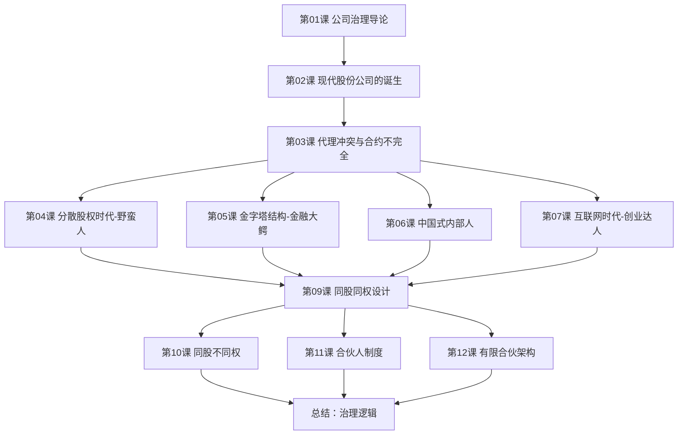

# 课程地图

## 学习路径说明

### 基础层（第01-03课）

建立公司治理的基本认知框架：

1. **第01课**：理解公司治理的定义、为什么重要，以及课程结构
2. **第02课**：追溯现代股份公司的起源，理解两场革命
3. **第03课**：掌握公司治理问题的根源——代理冲突与合约不完全

### 制度因素层（第04-07课）

认识中国资本市场的四大制度因素，理解四种人：

| 制度因素 | 对应"人物" | 需要回答的问题 |
|---|---|---|
| 分散股权时代 | 野蛮人 | 如何防止被入侵？ |
| 金字塔结构 | 金融大鳄 | 如何防止被掏空？ |
| 政治/社会/文化 | 中国式内部人 | 如何形成制度？ |
| 互联网时代 | 创业达人 | 如何相信陌生人？ |

### 机制设计层（第09-12课）

从三个层面学习公司治理制度设计：

| 设计层面 | 核心内容 | 典型案例 |
|---|---|---|
| 股权结构设计 | 同股同权、同股不同权 | 京东、谷歌、拼多多 |
| 董事会制度 | 合伙人制度 | 阿里巴巴 |
| 薪酬激励 | 有限合伙架构 | 蚂、格力电器 |

## 学习建议

- **创业者**优先学习第04、09-12课，掌握控制权设计
- **投资者**重点学习第03、05、10课，识别治理风险
- **管理者**关注第06、11课，理解内部人控制与合伙机制
- **初学者**按课程顺序学习，每课后完成自我检测题

## 自检清单

学习完成后，你应能回答以下问题：

- [ ] 现代股份公司带来哪两场革命？
- [ ] 公司治理问题产生的根源是什么？
- [ ] 中国资本市场进入分散股权时代的标志是什么？
- [ ] 金字塔式控股结构有哪些危害？
- [ ] 中国式内部人控制与英美模式有何不同？
- [ ] 互联网时代如何加剧了信息不对称？
- [ ] 持股比例不高时，保持控制权的四种方法是什么？
- [ ] AB双重股权结构的利弊和日落条款的作用是什么？
- [ ] 阿里合伙人制度如何变相形成同股不同权？
- [ ] 有限合伙架构如何实现控制权与激励的兼顾？