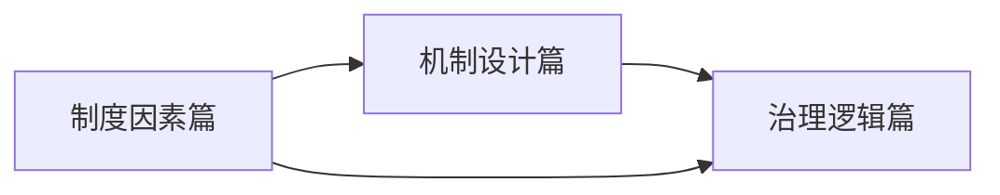

# 公司治理导论——掌控与激励的艺术

## 什么是公司治理？

公司治理，通俗地说，是一套帮助**股东之间**、**股东与经理人之间**实现合作共赢的制度框架。它要回答的核心问题是：一群互不相识的人，如何通过一套制度设计，把自己的钱放心地交给别人去经营？

> [!NOTE]
> 公司治理的本质是协调利益相关者之间的利益冲突，降低代理成本，最终提升企业价值。好的公司治理不是约束，而是**赋能**。

## 掌控与激励：一个硬币的两面

郑志刚教授将公司治理概括为**"掌控与激励的艺术"**，这两个维度缺一不可：

### 掌控（Control）

- **股权结构设计**：通过股权集中度、表决权安排等机制，确保控制权掌握在合适的人手中
- **董事会监督**：通过独立董事制度、专业委员会设置等，对大股东和管理层形成有效制衡
- 防止"内部控制人"和"大股东掏空"两种极端风险

### 激励（Incentive）

- **薪酬合约设计**：通过年薪、奖金、股票期权等工具，使经理人的利益与股东利益对齐
- 核心挑战：如何在**激励相容**的前提下，让代理人主动为委托人创造价值
- 激励不是越强越好，而是**风险与收益的平衡**

> [!TIP]
> 掌控与激励互为补充。没有掌控的激励可能演变为管理层的自我交易；没有激励的掌控则可能扼杀企业家精神。

## 案例：李子柒与股权结构设计

李子柒与微念公司的纠纷，是一个经典的**股权结构设计失败**案例：

- 李子柒（内容创作者）与微念公司（运营方）的合作中，品牌归属权模糊
- 股权结构未充分体现**人力资本**的贡献
- 当IP价值暴涨后，利益分配机制失衡，导致合作破裂

> [!WARNING]
> 创业初期的"关系好"往往经不起利益的考验。股权结构设计中，**"亲兄弟明算账"**不是不信任的表现，而是对合作关系的最大保护。

## 课程的三部分结构

本课程分为三大模块，层层递进：

### 第一部分：制度因素篇

探讨影响公司治理的外部制度环境，包括：

- [[0002-xian-dai-gu-fen-gong-si-dan-sheng|现代股份公司的诞生]]——公司治理的起源
- 法律制度与投资者保护
- 市场环境与文化传统
- **股权结构**的制度根源

### 第二部分：机制设计篇

深入剖析公司治理的具体机制设计：

- **董事会**：构成、职能与独立董事
- **薪酬激励**：短期与长期激励的搭配
- **控制权市场**：并购与代理权争夺
- **信息披露**与投资者关系管理

### 第三部分：治理逻辑篇

构建公司治理的整体分析框架：

- 治理模式的国际比较（英美模式 vs. 德日模式）
- 中国公司治理的特殊逻辑
- 公司治理的前沿趋势

## 中国资本市场的特点

郑志刚教授特别强调，理解中国公司治理，需要把握两个关键词：

### 市场基因

中国资本市场的"基因"与生俱来就带有以下特征：
- 国有企业的历史包袱
- "一股独大"的股权结构传统
- 散户主导的投资者结构

### 制度惯性

- 路径依赖导致改革难以一蹴而就
- **"看得见的手"**（政府监管）与**"看不见的手"**（市场机制）的博弈
- 制度创新往往在"试错-纠错"中缓慢推进

> [!QUESTION]
> 中国的公司治理是应该照搬英美模式，还是走出一条自己的路？答案或许不是非此即彼，而是在吸收国际经验的基础上，根据中国特殊的制度环境和市场条件进行**适应性创新**。

## 为什么要学习公司治理？

无论是投资者还是职场人，公司治理都与我们息息相关：

| 角色 | 为什么需要了解公司治理 |
|------|------------------------|
| **投资者** | 识别"好公司"与"坏公司"，避免踩雷，保护自己的投资 |
| **创业者** | 设计合理的股权结构和激励机制，避免"兄弟反目" |
| **职场人** | 理解公司决策背后的逻辑，看懂"谁在掌控方向盘" |
| **管理者** | 设计有效的治理机制，平衡各方利益，实现长期价值 |

> [!EXAMPLE]
> 一个简单的自测：如果你投资了一家公司，你能回答以下三个问题吗？
> 1. 公司的实际控制人是谁？
> 2. 董事会中独立董事占比多少？
> 3. CEO的薪酬与公司业绩挂钩吗？
> 
> 如果答不上来，你就需要学习公司治理了。

## 自我检测

点击展开自我检测题

**单选题**：以下哪个选项最准确地描述了公司治理的核心目标？

A. 最大化公司短期利润
B. 确保公司完全听命于大股东
C. 协调利益相关者的利益冲突，降低代理成本，提升企业长期价值
D. 满足政府监管要求

**答案**：C

---

**思考题**：李子柒案例中，如果在合作之初设计怎样的股权结构，可能避免后来的纠纷？

提示：考虑将品牌所有权与运营权分离，或者通过动态股权调整机制来反映人力资本的持续贡献。

## 下一篇预告

下一篇我们将回到300年前，看看**现代股份公司**是如何在荷兰诞生的。为什么一群陌生人愿意把钱交给"十七绅士"去冒险？为什么股票的诞生被称为一场"革命"？

敬请关注：[[0002-xian-dai-gu-fen-gong-si-dan-sheng|第02课：分工与合作——现代股份公司是如何诞生的？]]