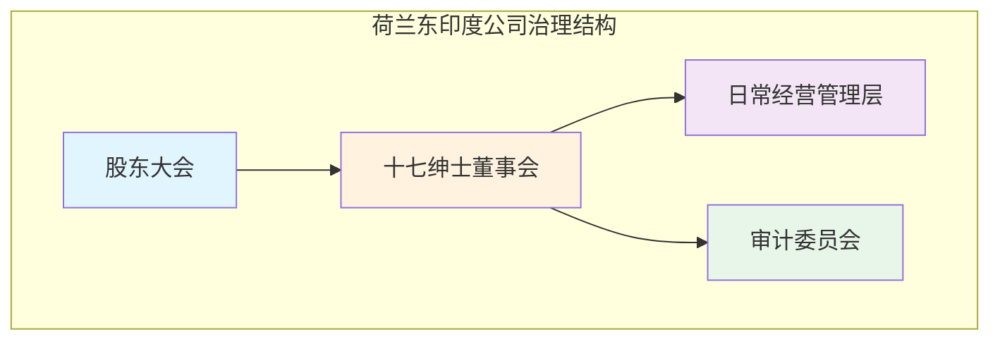
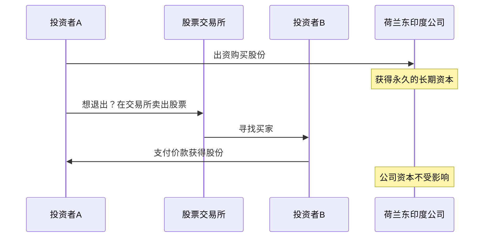
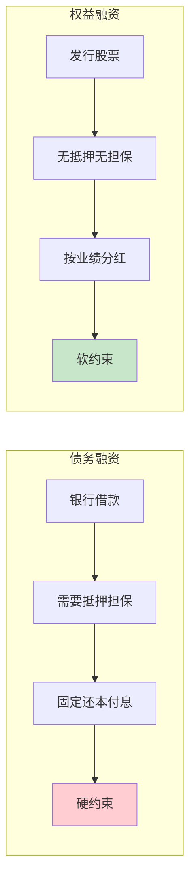

# 分工与合作——现代股份公司是如何诞生的？

## 德龙教授的惊人发现

加州大学伯克利分校的**德龙（Bradford DeLong）**教授做过一项著名的统计研究：他将人类过去2500年的**人均收入变化**绘制在同一张图上，结果令人震撼——

在前2250多年里，人均收入几乎是一条水平的直线，增长微乎其微。但从**1750年左右开始**，曲线突然垂直向上攀升，人类财富以肉眼可见的速度爆炸式增长。

> [!NOTE]
> 德龙的解释是：真正创造这250年来财富奇迹的，不是蒸汽机本身（它只是技术的"硬件"），而是支撑技术革命背后的**制度创新**，其中最重要的就是**现代股份公司**。

## 工业革命呼唤新的组织形式

### 传统组织形式的局限

在工业革命之前，企业组织形式主要有三种：

| 组织形式 | 特点 | 局限性 |
|---------|------|--------|
| 个体户 | 一人出资、一人经营 | 规模极小，无法承载大项目 |
| 合伙制 | 多人出资、无限连带责任 | 风险太大，且合伙人退出即解散 |
| 特许公司 | 皇室授予垄断特权 | 依赖政治权力，非市场化的产物 |

工业革命带来的**社会化大生产**需要巨额资本投入——修建铁路、建造工厂、购买机器——这些都不是个体户或几个合伙人能够承受的。

### 核心矛盾

> [!QUESTION]
> 如何将社会上大量分散的闲置资金，集中起来投入到需要巨额资本的实业中去？
> 
> 更具体地说：如何让一群互不相识、互不信任的陌生人，心甘情愿地把钱交给另一个人去经营？

## 1602年：荷兰东印度公司的诞生

### 故事的起点：霍特曼的冒险

1595年，一位名叫**霍特曼**的荷兰探险家带领船队远航东南亚，试图打破葡萄牙对香料贸易的垄断。这次航行风险极大：

- 漫长的航程充满未知的海况和风暴
- 可能遭遇海盗的劫掠
- 沿途国家敌友不明

但回报也同样惊人——**利润率高达500%**！

### 巨大的风险与有限的资本

如此高的利润自然会吸引更多人参与，但问题在于：

- 单个商人的资本有限，无法支撑一支远洋船队
- 如果多条船同时出海，资本需求成倍增长
- 一次航海失败就可能血本无归——**风险太大，个人无法承受**

> [!TIP]
> 这就是股份公司要解决的核心问题：**通过"集合众人之资"来分散风险**。用现代经济学的语言来说，就是实现风险的**社会化分摊**。

### 公司的成立

1602年，荷兰东印度公司（VOC）正式成立，它是人类历史上第一家**公众持股的股份公司**。它的制度设计包含了几项关键创新：

## "十七绅士董事会"：治理的雏形

荷兰东印度公司设立了由**17位董事**组成的董事会，史称"十七绅士"（Heeren XVII）。

这一制度安排的意义在于：

- **专业化决策**：由17位代表不同城市的绅士共同决策，而非一人独断
- **权力制衡**：董事会成员来自阿姆斯特丹、泽兰等不同地区，形成内部制衡
- **受托责任**：董事们对全体股东负有信义义务（fiduciary duty）——这是现代董事制度的灵魂

> [!NOTE]
> "十七绅士董事会"可以被看作现代**独立董事制度**和**专业委员会制度**的最早雏形。虽然它远不如今天的治理结构精致，但其"委托-代理"的基本逻辑已经确立。

## 1611年：第一个股票交易所

### 流动性困境

荷兰东印度公司的股份是永久性的——股东投入的资金不能中途要求退回。这在当时是一个巨大的制度障碍：**"我的钱投进去就拿不回来了？"**

如果这个问题不解决，根本不会有人愿意投资。

### 解决方案：股票交易所

1611年，阿姆斯特丹建立了世界上第一个**股票交易所**。它的出现解决了股份公司的"最后一公里"问题：

- **退出机制**：股东虽然不能向公司退股，但可以在交易所把股票卖给其他人
- **价格发现**：股票价格在交易中形成，反映了市场对公司价值的判断
- **流动性溢价**：正是因为股票可以交易，投资者才愿意接受"不退股"的安排

> [!EXAMPLE]
> 这个机制的精妙之处在于：**公司获得了"不退股"的永久资本**，而投资者获得了"随时退出"的流动性。二者不再矛盾——这就是制度创新的力量。

## 第一场革命：生产组织形式的革命

### 专业化分工

股份公司实现了两个层面的专业化分工：

1. **资本与管理的分离**：出资人不一定懂经营，懂经营的人不一定有资本
2. **风险承担与日常经营的分离**：股东承担最终风险，经理人负责日常运营

这呼应了亚当·斯密在《国富论》中提出的**分工提高效率**的核心思想。

### 社会化大生产

股份公司使得**社会化大生产**成为可能：

$$
\text{企业规模} = f(\text{资本集中度}, \text{风险分散度})
$$

股份公司同时提高了资本集中度和风险分散度，从而极大地拓展了企业的规模边界。

## 第二场革命：融资工具的革命

### 从债务融资到权益融资

在股份公司诞生之前，企业的外部融资主要靠**借款**（债务融资）。股份公司带来了一种全新的融资方式——**权益融资**（发行股票）。

### 权益融资的三大特点

郑志刚教授概括了权益融资的三个核心特点：

#### 1. 无抵押、无担保

借钱需要抵押物，但投资股票不需要。股东购买股票是基于对公司的**信任**，而非抵押品的保障。

#### 2. 陌生人融资

传统融资往往发生在熟人之间（亲友借贷、本地钱庄），但股份公司突破了这一限制——**素不相识的人也可以成为你的股东**。这是人类信任半径的一次巨大扩展。

#### 3. 软约束

银行贷款有固定的还本付息要求，是**硬约束**；而股票投资没有固定的回报承诺，分红与否由公司经营状况决定，是一种**软约束**。

> [!WARNING]
> 软约束是一把双刃剑。对企业而言，它减轻了现金流压力；但对投资者而言，它意味着更大的不确定性。这正是为什么需要公司治理来保护投资者——**没有治理保障的"软约束"就是"没约束"**。

## 思想家们的评价

### 马克思的洞察

马克思在《资本论》中对股份公司给予了极高的评价，他认为股份公司是：

> "在资本主义体系本身的基础上，对资本主义的私人产业的扬弃。"

换句话说，股份公司**在资本主义框架内部，实现了对资本主义某种程度的超越**——它将私人资本转化为社会资本，将个人决策转变为专业化的集体决策。

### 巴特勒教授的总结

英国公司法学者**巴特勒（Nicholas Butler）**教授（后任哥伦比亚大学校长）则有一段更为脍炙人口的评价：

> "有限公司是近代最伟大的发明。蒸汽机和电力的重要性远远不及有限公司。"

> [!NOTE]
> 为什么巴特勒说有限公司比蒸汽机还伟大？因为蒸汽机解决的是**技术问题**，而有限公司解决的是**人类合作的问题**。没有有限公司的制度支撑，再先进的技术也无法实现大规模商业化。**制度是技术的"土壤"**。

## 现代公司的基因密码

荷兰东印度公司确立的三项制度创新，构成了现代股份公司的**基因密码**：

| 创新 | 解决的问题 | 现代对应物 |
|------|-----------|-----------|
| 股份永久化 + 可交易 | 长期资本与流动性的矛盾 | 证券交易所、上市公司 |
| 董事会制度 | 专业化决策与权力制衡 | 独立董事、专业委员会 |
| 权益融资 | 大规模资金募集 | IPO、增发、配股 |

今天的公司治理，本质上仍然在解决这三个问题——只不过在更复杂的制度环境中，面对更庞大的组织和更多元的利益相关者。

> [!QUESTION]
> 思考：荷兰东印度公司虽然创造了股份公司的"模板"，但它本身最终因为**代理成本失控**（管理层腐败、利益输送）而走向衰落。这就引出了一个关键问题：股份公司诞生了，公司治理还会远吗？

## 自我检测

点击展开自我检测题

**单选题**：荷兰东印度公司的"十七绅士董事会"最重要的制度意义是什么？

A. 人数正好是17个人
B. 引入了来自不同地区的代表形成内部制衡，体现了受托责任和专业化决策的理念
C. 由皇室直接任命
D. 全部由大股东组成

**答案**：B

---

**思考题**：为什么说权益融资的"无抵押无担保"特点既是优点也是缺点？这与公司治理有什么关系？

提示：无抵押无担保降低了企业的融资门槛，但也意味着投资者缺乏传统的"保护机制"。因此，需要用公司治理（信息披露、董事会监督、股东诉讼权等）来**替代抵押品**，作为投资者的保护机制。

## 下一篇预告

股份公司诞生了，但随之而来的问题也浮出水面：股东把钱交给了经理人，如何才能确保经理人不滥用这些钱？**代理问题**——公司治理的核心命题——即将登场。

敬请关注第03课：代理问题的起源与应对
