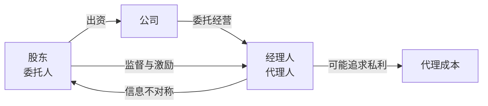
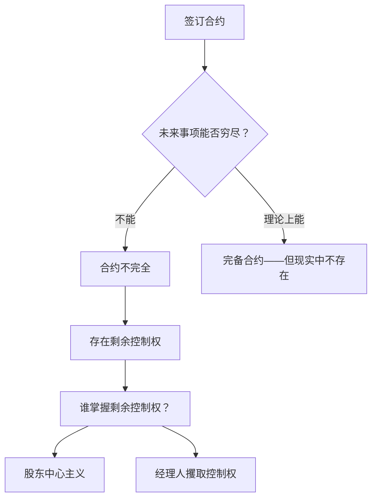
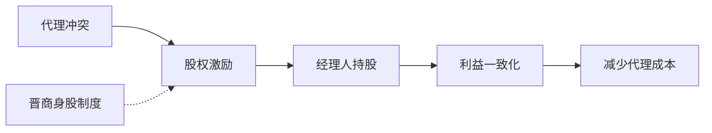
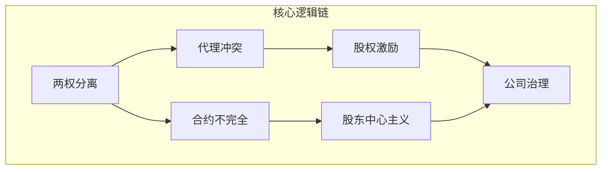

# 第03课：代理冲突与合约不完全——为什么公司需要治理？

## 引言：公司治理问题的根源

公司治理之所以成为一门学问，根源在于现代公司的一个基本特征——**所有权与经营权的分离**。股东出钱但不经营，经理人经营但不出钱（或少出钱）。这种分离带来了两个核心问题：**代理冲突**和**合约不完全**。

> [!QUESTION]
> 思考：如果一家公司的老板同时是CEO，公司还需要"治理"吗？请带着这个问题阅读本篇。

---

## 一、代理冲突：当委托人与代理人利益不一致

### 1.1 什么是代理冲突？

**代理冲突（Agency Conflict）** 是指在委托代理关系下，由于**信息不对称**和**利益不一致**，代理人（经理人）可能偏离委托人（股东）利益最大化目标的行为倾向。

简单来说：股东希望股价上涨，经理人可能更关心自己的工资、奖金、办公室大小和闲暇时间。

### 1.2 亚当·斯密的先知预见

早在1776年，**亚当·斯密**在《国富论》中就对代理问题做出了经典论述：

> [!NOTE]
> "股份公司的董事，作为他人钱财而非自己钱财的管理者，很难期望他们会像私人合伙公司的合伙人那样，以同样程度的警惕心来看管公司的钱财……疏忽和挥霍必定会在这种公司的管理事务中或多或少地盛行。"

斯密的这段话一语成谶——两百多年后，这仍然是公司治理试图解决的核心矛盾。

### 1.3 伯利和米恩斯的里程碑研究

1932年，**伯利（Berle）和米恩斯（Means）** 出版了《现代公司与私有财产》，系统揭示了美国大型公司的所有权与控制权分离现象。他们发现：

- 美国最大的200家非金融公司中，**44%** 由管理层控制而非股东控制
- 股权极度分散，单个股东缺乏监督经理人的动力

> [!WARNING]
> 这本书出版于大萧条期间（1932年），揭示了当时公司治理失败的制度性根源——所有权与控制权的广泛分离使得经理人可以脱离股东约束，进行高风险操作或自利行为，最终放大了1929年股市崩盘和经济大萧条的深度。

---

## 二、合约不完全：为什么不能靠合同解决一切？

### 2.1 不完全合约理论

如果股东和经理人能够签订一份**完备合约**——把所有未来可能发生的情况都写清楚，规定经理人在每种情况下应当如何行动——那么代理冲突就可以被事先解决。

但现实是：**合约不可能完备**。

**合约不完全**的原因：
1. **未来不可预测**——无法预知所有可能发生的事件
2. **语言局限性**——无法用语言精确描述所有情形
3. **验证成本**——即使发生了某些情况，法院也难以验证
4. **签约成本**——写一份完备合约的成本高到不可行

### 2.2 哈特教授的洞见

**奥利弗·哈特（Oliver Hart）** 教授从不完全合约的角度为公司治理提供了理论根基，并因此获得2016年诺贝尔经济学奖。他的核心观点是：

> 既然合约不完全，就必须对合约中没有规定的事项（即**剩余控制权**）做出安排。而剩余控制权应当归股东所有——这就是**股东中心主义**的理论基础。

---

## 三、两个核心问题的解决方案

### 3.1 解决代理冲突：股权激励计划（金手铐）

让经理人变成股东——用股权将经理人的利益与股东利益捆绑在一起。

> [!EXAMPLE]
> **明清晋商的"身股"制度**
>
> 早在数百年前，中国山西的晋商就发明了"身股"制度——掌柜（经理人）可以凭借自身能力获得股份（身股），参与分红。这就是现代**股权激励计划**的雏形。
>
> 现代企业中，股权激励被称为"**金手铐**"——既给予激励（金），又锁定人才（手铐），如限制性股票、股票期权、员工持股计划等。

### 3.2 解决合约不完全：产权安排与股东中心主义

既然合约不完全，就需要明确**剩余控制权**的归属。哈特主张：股东作为剩余索取权人（只有在所有其他人得到支付后才能获得剩余），最有权极性做出最优决策，因此剩余控制权应当归股东。

这构成了**股东中心主义**的公司治理模式——公司应当以股东利益最大化为目标。

---

## 四、治理失败的历史教训

即使有了上述制度安排，公司治理失败仍然反复发生：

### 4.1 安然丑闻（2001年）

美国能源巨头安然通过复杂的财务造假掩盖巨额亏损，高管在财务崩溃前套现数亿美元，而员工和股东血本无归。直接推动了**2002年萨班斯-奥克斯利法案（SOX）** 的出台。

### 4.2 2008年全球金融危机

金融衍生品的过度冒险、高管薪酬的短期激励、董事会的失职——公司治理的系统性失败被认为是危机的重要成因。

### 4.3 恒大债务危机

中国房地产巨头恒大集团在2021年爆发债务危机，暴露了控股股东与中小股东之间的严重代理冲突——大股东利用控制权进行关联交易、过度扩张，最终损害了中小股东和债权人的利益。

### 4.4 北大方正集团

曾经的"中国校企明珠"北大方正，在公司治理混乱、内部人控制、盲目扩张等问题下走向破产重组。管理层脱离股东约束，决策失误无人问责。

> [!WARNING]
> 这些案例说明：**公司治理不是锦上添花，而是企业的生存底线。** 无论制度设计多么精妙，如果执行不到位，代理冲突和合约不完全的问题随时可能爆发。

---

## 五、本课小结

| 问题 | 本质 | 解决方案 |
|------|------|----------|
| 代理冲突 | 委托代理下的利益不一致 | 股权激励（金手铐） |
| 合约不完全 | 无法穷尽未来事项 | 产权安排、股东中心主义 |

---

<strong>自我检测题</strong>

1. **所有权与经营权的分离为什么必然导致代理冲突？**
   

   
答案

   因为股东（委托人）和经理人（代理人）的利益函数不同，且信息不对称——经理人了解自己的行为和努力程度，股东难以完全监督。
   

2. **合约不完全的含义是什么？它与公司治理有何关系？**
   

   
答案

   合约不完全指无法在合同中穷尽所有未来可能发生的事项。正因为合约不完全，才需要公司治理来安排剩余控制权，决定"合约中没有规定的事项由谁说了算"。
   

3. **伯利和米恩斯的研究揭示了什么现象？**
   

   
答案

   他们发现美国大型公司普遍存在所有权与控制权分离，管理层实际控制公司而股东失去控制力，这是大萧条的重要制度诱因。
   

4. **股权激励为什么被称为"金手铐"？**
   

   
答案

   "金"代表激励（让经理人分享公司成长收益），"手铐"代表锁定（通常有归属期和行权条件），既激励经理人努力工作，又防止人才流失。
   

---

**下一篇预告：** [[0004-fen-san-gu-quan-shi-dai|第04课：门口的野蛮人——为何股权分散会让公司失控？]]

当股权高度分散时，公司就像没有城墙的城堡——野蛮人随时可能破门而入。