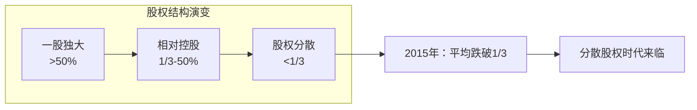
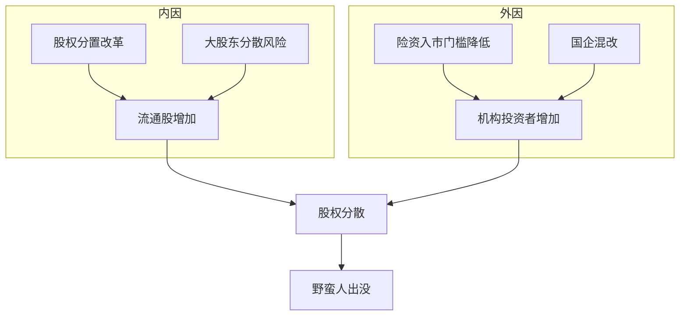
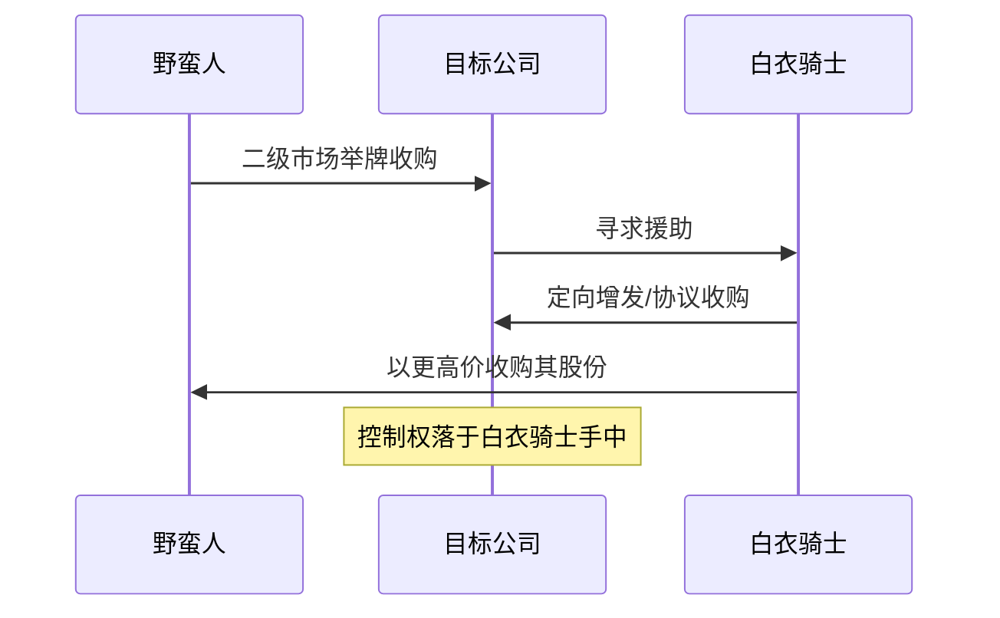
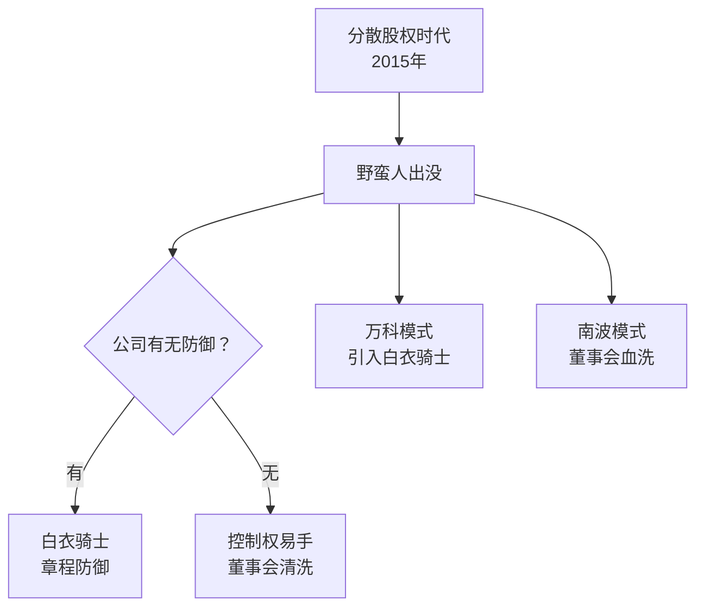

# 第04课：门口的野蛮人——为何股权分散会让公司失控？

## 引言：当城堡没有城墙

如果一家公司的股权高度分散，第一大股东持股不到5%，这家公司就像一座没有城墙的城堡——任何有实力的投资者都可以通过二级市场买入股票，一步步逼近控制权。这就是**分散股权时代**的公司治理难题。

> [!NOTE]
> **野蛮人（Barbarians at the Gate）** 一词源自1989年关于KKR收购RJR Nabisco的经典著作《门口的野蛮人》，专指那些通过举牌收购谋取公司控制权的"入侵者"。

---

## 一、中国进入分散股权时代

### 1.1 标志性起点：2015年

2015年是中国资本市场的一个分水岭。这一年，A股上市公司**第一大股东平均持股比例跌破1/3**，意味着大股东不再拥有绝对控制权，"一股独大"的时代渐行渐远。

### 1.2 万科股权之争：标志性事件

2015年爆发的**万科股权之争**是中国资本市场上分散股权时代到来的最典型标志。万科作为中国最大的房地产公司，长期股权极其分散，第一大股东华润持股仅约15%。这头"大象"被宝能系盯上，引发了一场旷日持久的控制权争夺战。

> [!WARNING]
> 万科事件的意义远超一家公司——它向所有上市公司敲响了警钟：**在分散股权时代，没有谁的控制权是绝对安全的。**

---

## 二、为什么进入分散股权时代？

### 2.1 四大原因

#### 内因一：股权分置改革

2005年启动的股权分置改革，解决了国有股、法人股"不能流通"的历史遗留问题。全流通之后，上市公司股权结构开始走向分散，为控制权市场提供了基础条件。

#### 内因二：大股东分散风险

部分大股东（尤其是民营企业）出于分散风险的考虑，主动减持股份，将"鸡蛋放在不同篮子里"，客观上加速了股权的分散化。

#### 外因三：险资入市门槛降低

保险资金入市门槛大幅降低，体量庞大的险资成为资本市场的重要力量。它们有动力也有能力对股权分散的公司发起"举牌"。

#### 外因四：国企混合所有制改革

国企混改引入社会资本，原本国有股东持股比例下降，为外部投资者提供了进入机会。

---

## 三、野蛮人的武器库

### 3.1 举牌（>5%）

根据《证券法》，投资者持有上市公司股份达到**5%**时，必须公告披露。这一行为被称为"**举牌**"。举牌是野蛮人发起进攻的公开信号。

### 3.2 关键概念

| 概念 | 含义 | 攻/守 |
|------|------|-------|
| **举牌** | 持股达5%须公告 | 进攻信号 |
| **白衣骑士** | 公司管理层引入的善意收购者 | 防守策略 |
| **一票否决权** | 持股达1/3可否决重大事项 | 防守底线 |
| **要约收购** | 持股达30%须发起全面要约 | 进攻升级 |

> [!TIP]
> **一票否决权（1/3）** 是防守方最重要的底线。根据《公司法》，修改公司章程、增资减资、合并分立等重大事项需要**2/3以上表决权通过**。因此，只要持有**超过1/3**的股份，就可以否决这些重大事项，从而保住对公司基本方向的掌控。

### 3.3 白衣骑士

当公司遭遇野蛮人入侵时，管理层往往会寻找一家"友好"的公司或机构来接盘，这位救兵就是**白衣骑士（White Knight）**。白衣骑士以高于野蛮人的价格收购股份，帮助公司摆脱被恶意收购的命运。

---

## 四、经典案例：宝万之争

### 4.1 事件始末

**宝万之争**是中国资本市场史上最具影响力的控制权争夺战之一。

| 时间 | 事件 |
|------|------|
| 2015年1月 | 宝能系开始买入万科股票 |
| 2015年7月 | 宝能系首次举牌，持股达5% |
| 2015年8月 | 宝能系继续增持至15%，超越华润成为第一大股东 |
| 2015年12月 | 宝能系持股达24.26% |
| 2016年3月 | 万科引入深圳地铁作为**白衣骑士** |
| 2016年6月 | 华润反对重组方案，矛盾公开化 |
| 2017年1月 | 华润退出，深圳地铁接盘 |
| 2017年6月 | 宝能系开始减持，万科管理层稳定 |

### 4.2 王石的应对

万科创始人王石在宝能开始举牌后，公开表达"不欢迎宝能成为第一大股东"，随后带领管理层团队积极寻找白衣骑士，最终引入深圳地铁——具有国资背景的深圳地方国企，以定向增发的方式成为万科第一大股东。

### 4.3 宝能血洗南波董事会

与万科不同，另一家上市公司**南波（Southco）** 在被宝能举牌后，形势急转直下：

> [!WARNING]
> 宝能成为第一大股东后，迅速**改组董事会**，罢免了原管理层，全面掌控公司。这就是"**血洗董事会**"——野蛮人一旦得手，原管理层几乎没有还手之力。
>
> 南波的案例揭示了一个残酷现实：**在分散股权时代，没有防御准备的公司就是待宰的羔羊。**

---

## 五、分散股权时代的治理启示

### 5.1 公司治理的新挑战

分散股权时代意味着更多"野蛮人"出没，公司治理需要更多地考虑：

1. **反收购条款设计**——如交错董事会、毒丸计划、金色降落伞等
2. **股权结构优化**——保持核心控制权的稳定
3. **投资者关系管理**——提前识别潜在的入侵者
4. **公司章程防护**——设置合理的防御性条款

### 5.2 中国特色的应对

与美国"股东积极主义"不同，中国上市公司应对分散股权时代的方式具有鲜明的中国特色：

- 引入**国资背景**的白衣骑士（如深圳地铁救万科）
- 使用**有限合伙企业的表决权架构**（如阿里、京东的合伙人制度）
- **定向增发**稀释野蛮人持股比例

> [!QUESTION]
> 思考题：公司在引入"白衣骑士"来防御野蛮人时，是否可能带来新的治理问题——比如白衣骑士变成新的"野蛮人"？这种"引狼入室"的风险如何防范？

---

## 六、本课小结

**核心要点：**
- 2015年是中国进入分散股权时代的元年
- 万科股权之争是标志性事件
- 野蛮人通过举牌（>5%）发起进攻，1/3持股是一票否决权的防守底线
- 分散股权时代，每家公司都需要建立防御体系

---

<strong>自我检测题</strong>

1. **为什么说2015年是中国进入分散股权时代的标志性年份？**
   

   
答案

   因为2015年A股上市公司第一大股东平均持股比例跌破1/3，意味着大股东不再拥有绝对控制权，分散股权时代正式到来。
   

2. **举牌的触发比例是多少？其法律意义是什么？**
   

   
答案

   持股达到5%时必须公告披露。举牌是野蛮人发起进攻的公开信号，也是监管机构保护中小投资者知情权的重要制度安排。
   

3. **什么是"一票否决权"？持有多少股份才能拥有这一权利？**
   

   
答案

   一票否决权指对公司重大事项（修改章程、增减资、合并分立等）的否决能力。由于这些事项需要2/3以上表决权通过，持有超过1/3的股份即可行使一票否决权。
   

4. **万科在宝万之争中使用了哪种防御策略？**
   

   
答案

   万科引入了国资背景的深圳地铁作为"白衣骑士"，通过定向增发的方式让深圳地铁成为第一大股东，从而抵御了宝能系的控制权争夺。
   

---

**下一篇预告：** [[0005-jin-zi-ta-kong-gu-jie-gou|第05课：金融大鳄——金字塔式控股结构]]

当分散股权时代来临，公司控制权如何重新安排？下一篇将探讨控制权安排的各种模式及其治理效应。