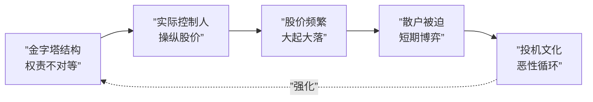

# 第05课：金融大鳄——金字塔式控股结构有何危害？

## 什么是金字塔式控股结构？

**金字塔式控股结构（Pyramidal Holding Structure）** 是指最终所有者通过一连串的"控制性股份持有链条"，以较小的资本投入实现对庞大企业集团的实际控制。在这种结构中，控制权沿着链条层层传递，形成一个上尖下宽的金字塔形态。

> [!NOTE]
> 金字塔结构的本质是 **"以小博大"** ——每一层只需要持有下一层公司51%（或更低）的股份，就能将控制权沿着链条不断延伸。最终，顶层控制人以极少的出资撬动巨大的企业资产。

### 常见形式

在中国资本市场，金字塔结构以"系"的形式广泛存在：

- **中信系** —— 以中信集团为顶端，控制大量金融与实业资产
- **明天系** —— 肖建华通过复杂的金字塔结构控制多家金融机构
- **海航系** —— 曾通过多层控股构建庞大的航空旅游帝国
- **方正系** —— 北京大学旗下的企业集团，内部治理问题频发

这些"系"的共同特征就是：**顶层出资少，底层资产多，控制链条长，透明程度低**。

---

## 经典案例：李嘉诚家族金字塔结构

金字塔结构最具代表性的案例，非李嘉诚家族莫属。通过巧妙的多层控股设计，李嘉诚以极低的现金流权撬动了巨大的控制权。

```mermaid
graph TD
    A[”李嘉诚家族信托基金”] -->|”持有49.9%”| B[”长江实业<br/>(Cheung Kong Holdings)”]
    B -->|”持有49.9%”| C[”和记黄埔<br/>(Hutchison Whampoa)”]
    C -->|”持有36.0%”| D[”卡文迪斯国际<br/>(Cavendish International)”]
    D -->|”持有38.9%”| E[”香港电力集团<br/>(HK Electric)”]

    style A fill:#e74c3c,color:#fff
    style B fill:#f39c12,color:#fff
    style C fill:#3498db,color:#fff
    style D fill:#2ecc71,color:#fff
    style E fill:#9b59b6,color:#fff
```

**三层控股的数据对比：**

| 层级 | 公司 | 控制权 | 现金流权 |
|:----:|:----:|:------:|:--------:|
| 第1层 | 和记黄埔 | 49.9% | 49.9% |
| 第2层 | 卡文迪斯国际 | 36.0% | **17.96%** (= 49.9% x 36.0%) |
| 第3层 | 香港电力 | 38.9% | **6.99%** (= 49.9% x 36.0% x 38.9%) |

> [!WARNING]
> 经过三层控股后，李嘉诚家族对香港电力的 **控制权仍为34%**（取各层持股比例的最小值），但 **现金流权仅剩约2.5%**（各层持股比例的乘积）。这意味着，香港电力每赚100元，李嘉诚家族只能分到约2.5元，却能掌控整个公司的经营决策。

### 现金流权与控制权的分离

上述案例揭示了金字塔结构的核心特征：**现金流权与控制权的严重背离**。

- **控制权**：由控制链条中最薄的环节决定（持股最小值），体现了实际控制人对公司的支配能力。
- **现金流权**：由各层持股比例的乘积决定，体现了实际控制人承担的经济利益与风险。

控制权远超现金流权，意味着实际控制人可以用很少的经济利益去操纵巨大的资源。这种"权责不对等"是金字塔结构所有问题的根源。

---

## 金字塔结构的三大危害

### 危害一：隧道挖掘（Tunneling）行为

**隧道挖掘**是指控股股东利用控制链，将底层公司的资产通过关联交易、资产转移等方式悄悄"掏空"的行为。就像挖一条隧道，把地下的宝藏偷偷运走。

> [!EXAMPLE]
> **典型案例：** 某"系"集团的实际控制人，通过金字塔链条逐级转移资产：
> 1. 底层上市公司高价收购控制人旗下的劣质资产
> 2. 上市公司为关联方提供巨额担保
> 3. 通过关联借款将资金转移至上层控股公司
> 4. 最终资金流入实际控制人的私人腰包
>
> 由于控制链条长，中小股东往往在最后一刻才能发现，但损失已无法挽回。

### 支撑行为（Propping）—— 掏空的前奏？

值得注意的是，实际控制人也可能利用金字塔结构向子公司注入优质资产、提供资金支持，这就是所谓的**支撑行为**。

> [!QUESTION]
> 实际控制人为什么会帮助子公司？是出于善意吗？
>
> 答案往往是：**为了未来更好地掏空。** 支撑行为就像是"养猪"——先养肥了再杀。实际控制人先通过支撑行为提升子公司业绩，推高股价，再通过隧道挖掘把资产转移走，实现利益最大化。

以 **三星动力** 为例，三星集团曾向其注入大量优质业务，使其成为全球领先的电池企业。但在随后的重组中，这些优质资产通过复杂的股权交易被重新分配给集团核心成员，中小股东的利益受到严重损害。

---

### 危害二：资本运作与市场炒作

金字塔结构下的实际控制人，往往更偏好**资本运作**而非实业经营。原因很简单：控制权带来的杠杆效应，使得资本运作的回报率远高于实业投资。

> [!EXAMPLE]
> **长城系案例：**
> 长城系实际控制人通过金字塔结构控制多家上市公司后，热衷于：
> - 频繁进行资产重组和概念包装
> - 利用信息优势进行内幕交易
> - 通过股价操纵获取暴利
>
> 结果是：长城系旗下公司股价大起大落，中小投资者损失惨重，而实际控制人早已通过高位套现获利离场。

这种资本运作偏好不仅损害了中小股东的利益，也扭曲了资本市场的资源配置功能。

---

### 危害三：官商勾结的腐败温床

金字塔结构的不透明性，为**官商勾结**提供了天然的庇护所。

> [!EXAMPLE]
> **包商银行与明天系案例：**
> 明天系通过多层金字塔结构控制包商银行后，大量银行资金被违规占用，最终导致包商银行被接管。调查发现：
> - 明天系通过复杂的关联交易，从包商银行套取数百亿资金
> - 涉及多名官员的腐败窝案
> - 最终由国家买单，全体纳税人承担损失

银行作为高杠杆行业，一旦被金字塔结构中的实际控制人控制，风险会成倍放大。这也是中国金融监管近年来严厉打击"资本系"的原因所在。

---

## 金字塔结构与A股散户投机

金字塔结构不仅是资本大鳄的掘金利器，也是造成**A股市场散户投机性强的深层制度原因**。



**逻辑链条如下：**

1. 金字塔结构使实际控制人有强烈动机操纵股价
2. 股价的剧烈波动使得长期持有的风险极高
3. 散户被迫转向短期投机，追涨杀跌
4. 投机行为进一步加剧股价波动，形成恶性循环

> [!WARNING]
> 只要金字塔结构不被有效抑制，A股的散户投机文化就难以根本改变。这不是简单的投资者教育问题，而是**制度层面的结构性缺陷**。

---

## 自我检测

<details>
<summary><strong>点击展开自我检测题</strong></summary>

**问题1：** 假设金字塔结构为 A→B→C→D，A持有B 60%，B持有C 55%，C持有D 51%，那么A对D的控制权和现金流权分别是多少？

> **答案：** 控制权 = min(60%, 55%, 51%) = 51%；现金流权 = 60% × 55% × 51% ≈ 16.83%

**问题2：** "隧道挖掘"和"支撑行为"之间是什么关系？

> **答案：** 支撑行为往往是为隧道挖掘做准备。实际控制人先向子公司注入优质资产（支撑），待子公司价值提升后，再通过关联交易等方式将资产转移出去（隧道挖掘）。二者构成一套完整的利益输送链条。

**问题3：** 为什么金字塔结构会导致A股散户投机性强？

> **答案：** 金字塔结构使实际控制人有权责不对等的动机操纵股价，导致股价大起大落，散户被迫短期博弈，形成投机恶性循环。这是制度层面的结构性问题。

</details>

---

## 课后思考

金字塔结构作为一种杠杆控股工具，本身是否"有罪"？如果像阿里巴巴的"合伙人制度"那样，通过制度设计将超额控制权用于企业长远发展而非个人私利，是否能够解决金字塔结构的治理困境？

下一课 [[0006-zhong-guo-shi-nei-bu-ren|中国式内部人——为何公司会被内部人控制？]] 将探讨另一种公司治理的顽疾。

> [!NOTE]
> **延伸阅读：** [[../index|公司治理：掌控与激励的艺术]]