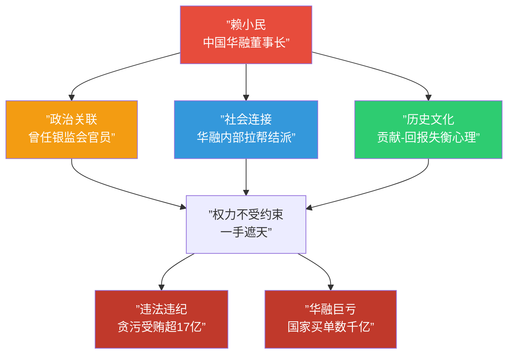

# 第06课：中国式内部人——为何公司会被内部人控制？

## 什么是内部人控制？

**内部人控制（Insider Control）** 是指公司经理人利用超过其职责权限的控制权，谋取个人或小团体私利，从而损害股东利益的现象。

> [!NOTE]
> 内部人控制并非中国独有——所有现代公司都存在所有者与经营者之间的"委托-代理"问题。但 **"中国式内部人控制"** 在成因、表现和治理难度上，都与英美模式有着本质区别。

---

## 英美模式 vs 中国模式：三大区别

| 维度 | 英美模式 | 中国模式 |
|:----:|:--------:|:--------:|
| **股权结构** | 高度分散，无单一控股股东 | 持股比例较高（国企国有股，民企家族股），但**制衡不足** |
| **经理人激励** | 普遍采用股权激励，经理人持股比例高 | 受薪酬管制，持股有限，激励机制不足 |
| **内部人核心** | CEO是内部人核心 | **董事长**是内部人核心，总经理更像是"行政助理" |

### 区别一：股权结构

英美公司的股权高度分散，没有任何单一股东能够完全控制公司，因此代理问题主要存在于**股东整体 vs 经理人**之间。

中国公司虽然大股东持股比例较高，但由于多种原因（国有股所有者缺位、家族股东监督意愿不足等），大股东往往无法有效制衡经理人，反而可能出现**大股东与经理人合谋**的局面。

### 区别二：经理人激励

英美模式的核心逻辑是：**"给经理人股份，让他变成股东"**。通过股权激励将经理人的利益与股东利益绑定。

而中国国有企业对经理人实行严格的**薪酬管制**，经理人持股比例极低，股权激励覆盖面有限。这意味着：

- 经理人的努力无法通过持股获得合理回报
- 经理人更容易通过在职消费、关联交易等方式"补偿"自己
- 激励不足反而加剧了内部人控制问题

### 区别三：内部人核心

英美公司中，内部人控制的核心人物是**CEO**。而在中国公司中，**董事长**才是内部人控制的核心，总经理更像是董事长的"行政助理"或"执行人"。

> [!TIP]
> 这一区别源于中国公司治理的"二元制"结构：董事会既是决策机构也是监督机构，董事长集决策权与监督权于一身，权力高度集中。总经理只是董事会决议的执行者，缺乏独立的决策空间。

---

## 所有者缺位：内部人控制的温床

**所有者缺位**是国有企业内部人控制问题的根源。所谓"所有者缺位"，是指国有企业的名义所有者为"全体人民"，但没有任何一个自然人真正拥有企业的剩余索取权和剩余控制权。

> [!QUESTION]
> 国企的"老板"是谁？
>
> 理论上——全体人民；实际上——各级国资委；但国资委官员本身也是代理人，并非真正的所有者。由此形成了"代理人监督代理人"的困境，监督链条越长，效率越低。

所有者缺位意味着：
- 没有人真正为国有资产的保值增值负责
- 经理人在缺乏有效监督的情况下容易滥用权力
- 国企的薪酬管制进一步强化了经理人"以权谋私"的动机

---

## 中国式内部人控制的三大成因

### 成因一：政治关联

**政治关联**是指企业高管通过担任或曾担任政府官员，与政府建立的特殊关系。这种关系一方面可以为企业带来政策资源和保护伞，另一方面也为内部人控制提供了掩护。

> [!EXAMPLE]
> **恒丰银行蔡国华案例：**
> 蔡国华曾任烟台市委常委，后调任恒丰银行董事长。凭借深厚的政治背景：
> - 他在恒丰银行一手遮天，重大决策个人说了算
> - 通过关联交易向亲属输送利益
> - 将恒丰银行视为"私人钱袋"
>
> 最终东窗事发，恒丰银行被接管，蔡国华被判处死缓。但恒丰银行已造成的巨额亏损，最终由国家和储户承担。

政治关联的存在，使得内部人控制的"安全边际"极高——只要关系在，就难以被有效追究。

### 成因二：社会连接

**社会连接**是指公司内部高管之间基于同乡、同学、同事等关系形成的非正式网络。这些关系会削弱董事会对经理人的监督意愿。

> [!WARNING]
> 据研究统计，中国上市公司中 **董事长与总经理籍贯相同的公司数量**，从2007年的约90家增长到2018年的约170家。同乡关系使得董事会在监督总经理时"抹不开面子"。

社会连接对内部人控制的影响机制：
1. **同乡** —— 老乡关系使得监督变得"不近人情"
2. **同学** —— 校友情谊弱化了制衡的力度
3. **同事** —— 长期共事的默契转化为"互相包庇"

### 成因三：历史文化

中国内部人控制的第三个成因，根植于深层的**历史文化土壤**。

> [!TIP]
> 两个值得关注的文化现象：
>
> **1. 企业家历史贡献未获合理回报**
> 许多国企经理人在企业初创期付出巨大努力，使企业从小做大。但由于薪酬管制，他们的贡献未能在薪酬上体现。这种"贡献-回报"的不对等，使他们产生"补偿心理"——既然合法报酬不够，那就通过控制权来"拿"。
>
> **2. 感恩文化导致不合理预期**
> 中国文化中的"感恩"观念延伸到企业管理中，表现为：经理人认为"我帮你把公司做大了，你应该感恩"，从而期待超出契约范围的回报。当这种预期无法被满足时，就容易转向灰色地带谋取私利。

---

## 三种力量共同作用：中国华融与赖小民案

赖小民案是中国式内部人控制的"集大成者"——三种成因在他身上得到了充分体现。



> [!WARNING]
> 赖小民案不仅是个人的堕落，更暴露了 **"政治关联 + 社会连接 + 历史文化诱因"** 三重因素叠加下的治理失控。只要这三重因素不被有效切断，下一个"赖小民"随时可能出现。

---

## 2015年后的公司治理困境：三股力量叠加

2015年中国资本市场经历剧烈震荡之后，公司治理面临着一个前所未有的复杂局面——**三股破坏性力量同时叠加**。

```mermaid
graph LR
    A[”野蛮人<br/>(门口的野蛮人)”] --> D[”公司治理<br/>三重困境”]
    B[”金融大鳄<br/>(金字塔结构)”] --> D
    C[”中国式内部人<br/>(内部人控制)”] --> D
    D --> E[”万科股权之争<br/>三力叠加的典型案例”]

    style A fill:#e74c3c,color:#fff
    style B fill:#f39c12,color:#fff
    style C fill:#3498db,color:#fff
    style D fill:#9b59b6,color:#fff
    style E fill:#e74c3c,color:#fff
```

### 万科股权之争：三力叠加的典型案例

万科股权之争完美呈现了三股力量的叠加：

1. **野蛮人（宝能系）** —— 通过万能险资金大规模举牌万科，试图夺取控制权
2. **金融大鳄（宝能系背后的金字塔结构）** —— 宝能系本身就是一个复杂的金字塔控股结构，姚振华通过层层控股以小博大
3. **中国式内部人（万科管理层）** —— 以王石、郁亮为代表的万科管理层，在缺乏大股东有效制衡的情况下，形成了强大的内部人控制

> [!NOTE]
> 万科事件的戏剧性在于：**野蛮人（宝能）** 和 **内部人（万科管理层）** 都声称自己代表中小股东利益，但实际上都有各自的私利动机。而隐藏在宝能背后的 **金字塔结构（金融大鳄）** 使其收购行为更加危险。
>
> 最终，深圳地铁以"白衣骑士"身份入主万科，这场持续两年的控制权大战才落下帷幕。但这场斗争揭示的公司治理困境远未解决。

---

## 自我检测

<details>
<summary><strong>点击展开自我检测题</strong></summary>

**问题1：** 英美模式与中国模式的内部人控制，最核心的区别是什么？

> **答案：** 英美模式的核心是CEO，中国模式的核心是董事长。这一区别源于中国"二元制"的公司治理结构，使得董事长集决策权与监督权于一身。

**问题2：** "所有者缺位"为什么会导致内部人控制？

> **答案：** 国有企业的所有者是"全体人民"，没有自然人真正拥有剩余索取权。国资委官员也是代理人，形成"代理人监督代理人"的低效率链条，经理人在缺乏有效监督的情况下容易滥用权力。

**问题3：** 列举中国式内部人控制的三个成因，并各举一例。

> **答案：** （1）政治关联（恒丰银行蔡国华）；（2）社会连接（董事长与总经理同乡关系）；（3）历史文化（企业家贡献-回报失衡心理，感恩文化导致不合理预期）。

**问题4：** 万科股权之争中体现了哪三股力量的叠加？

> **答案：** 野蛮人（宝能系的敌意收购）+ 金融大鳄（宝能系的金字塔控股结构）+ 中国式内部人（万科管理层的内部人控制）。

</details>

---

## 课后思考

如果"三股力量"是公司治理困境的根源，那么解决方案也应从三个维度入手：如何规范门口的野蛮人？如何打破金字塔结构？如何约束内部人控制？这三者之间是否存在"两害相权取其轻"的取舍关系？

> [!TIP]
> **延伸思考：** 结合 [[0005-jin-zi-ta-kong-gu-jie-gou|第05课：金融大鳄——金字塔式控股结构有何危害？]] 的内容，思考金字塔结构与中国式内部人控制之间是否存在共生关系？当实际控制人与内部人合谋时，中小股东的利益该如何保护？

---

*笔记基于郑志刚教授《公司治理：掌控与激励的艺术》课程内容整理。*