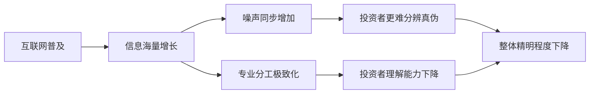

# 第07课：创业达人——互联网时代的来临带来了什么新挑战？

## 一、引言：互联网时代加剧了信息不对称

我们通常认为，互联网的普及让信息传播更快、更广，理应**缓解**信息不对称问题。然而，现实却给出了相反的答案——互联网时代**加剧**了信息不对称。

> [!WARNING]
> **知识悖论**：互联网让我们每个人在专业领域内懂得更多，但在专业领域之外懂得更少。分工的极致细化导致了一个吊诡的结果——**人们整体上变得更"愚蠢"了**。

为什么会这样？因为互联网时代催生了**知识爆炸**。每个学科、每个细分领域都积累了海量知识，一个人穷尽一生也只能掌握其中极其狭窄的一小部分。于是，我们比以往任何时候都更依赖他人来完成专业之外的事情。现代人只懂自己的专业，其余一切都要"外包"给其他专业人士——这本身就是信息不对称被加剧的体现。

> [!QUESTION]
> **思考**：当你使用一款互联网产品时，你真的理解它的商业模式和盈利逻辑吗？还是仅仅因为"大家都在用"就投入了资金？

---

## 二、学术研究：互联网时代投资者的认知局限

### 2.1 博尔顿教授的研究

哥伦比亚大学帕特里克·博尔顿（Patrick Bolton）教授的研究表明：**互联网时代，股东之间的认知分歧变得更大了**。过去，由于信息渠道有限，不同股东对同一家公司价值的判断虽然存在差异，但差距有限；而互联网时代，海量信息涌入，每个人都能找到支持自己观点的"证据"，反而让分歧更加难以弥合。

> [!NOTE]
> 认知分歧扩大的直接后果是：公司治理中的"共识成本"大幅上升。股东们更难就重大决策达成一致意见。

### 2.2 苏布拉玛尼亚姆教授的研究

另一位学者苏布拉玛尼亚姆（Subrahmanyam）教授的研究则发现了更令人担忧的趋势：**互联网时代，投资者的总体精明程度在下降**。

这看似矛盾——信息越多，投资者应该越聪明才对。但现实是，信息的泛滥带来了"噪声"的暴增。投资者在海量信息中难以分辨真伪，反而更容易被误导。加之互联网使得投机行为更加便利，短期交易盛行，深入研究的激励反而下降了。



---

## 三、经典案例：看不懂的商业模式

### 3.1 二手车直卖网的困局

"没有中间商赚差价"，这句广告语曾经铺天盖地。但冷静思考一下：**不做中间商赚差价，现金流从何而来？**

一家企业不可能永远靠融资活着。如果平台不赚取差价，那它必须要找到其他盈利模式——比如金融服务、保险、售后等。但问题是，当投资者看不懂这些新型商业模式时，他们如何判断这家公司是否值得投资？

> [!WARNING]
> **模式风险**：当"颠覆传统"成为口号时，投资者需要警惕——颠覆之后，盈利模式是否真的成立？

### 3.2 互联网金融与非法集资的边界

互联网金融曾经风靡一时，P2P平台如雨后春笋般涌现。但随之而来的是一连串暴雷事件。一个核心问题始终没有被解答：**互联网金融和非法集资的边界到底在哪里？**

- 互联网金融：用技术手段提高资金融通效率
- 非法集资：以高回报为诱饵，用后参与者的钱偿付前参与者

当两者在外观上高度相似时，普通投资者如何辨别？这个问题在互联网时代变得更加棘手。

---

## 四、明星案例：Snapchat 的 ABC 三重股票

### 4.1 背景：两个斯坦福辍学生的创业故事

Snapchat（Snap Inc.）由埃文·斯皮格尔（Evan Spiegel）和博比·墨菲（Bobby Murphy）两位斯坦福大学辍学生创立。这款"阅后即焚"的社交应用迅速风靡全球，成为挑战 Facebook 的重要力量。

### 4.2 ABC 三重股权结构

2017年 Snapchat 上市时，推出了震惊资本市场的**ABC三重股权结构**：

| 股票类别 | 投票权 | 持有者 |
|---------|--------|--------|
| A类股 | 1股1票 | 公众投资者 |
| B类股 | 1股10票 | 创始人团队 |
| C类股 | **无投票权** | 早期员工、合作伙伴 |

> [!EXAMPLE]
> **核心逻辑**：斯皮格尔和墨菲想要通过这种结构实现两件事：
> 1. 保持对公司的绝对控制（B类股的10倍投票权）
> 2. 对外融资的同时**不给投资者投票权**（C类股完全无投票权）

这种设计在当时引发了巨大争议。许多机构投资者认为这是对"同股同权"基本原则的践踏。但不可否认的是，它代表了一种新型创业公司应对互联网时代挑战的制度创新。


---

## 五、四种制度因素总结

走到这里，我们可以对前面四节课的内容进行一次系统性的总结。**公司治理挑战的根源是四种制度因素**：

| 制度因素 | 对应的"敌人" | 核心问题 |
|---------|-------------|---------|
| 分散股权时代 | **野蛮人** | 股权分散导致外部人控制权 |
| 金字塔结构 | **金融大鳄** | 用少资金控制庞大资产帝国 |
| 政治关联/社会连接/历史文化 | **中国式内部人** | 非正式关系取代正式治理机制 |
| 互联网时代 | **创业达人** | 投资者看不懂业务模式，创始人如何保持控制 |

---

## 六、核心挑战总结

互联网时代给公司治理带来了一个前所未有的核心挑战：

> [!TIP]
> **核心命题**：如何把大多数投资者看不懂的业务模式，放心地交给少数创业者，同时又能对投入的资本进行有效掌控？

这个问题的答案，正是后续课程将要展开的内容。从下一课开始，我们将讨论具体的制度设计——**同股同权下的股权结构设计**、**同股不同权的双重股权结构**，以及**合伙人制度**等。

```mermaid
graph TD
    A[投资者看不懂业务模式] --> B{如何解决？]
    B --> C[同股同权设计]
    B --> D[同股不同权设计]
    B --> E[合伙人制度]
    C --> F[股权协议谅解]
    C --> G[一致行动协议]
    C --> H[防御型员工持股]
    C --> I[超额委派董事]
    D --> J[双重股权结构]
    D --> K[三重股权结构]
    E --> L[阿里式合伙人制度]```

---

> 版权信息：本文档基于郑志刚教授《公司治理：掌控与激励的艺术》课程整理。  
> 标签：`#公司治理` `#互联网时代` `#信息不对称` `#创业达人` `#Snapchat` `#股权结构`