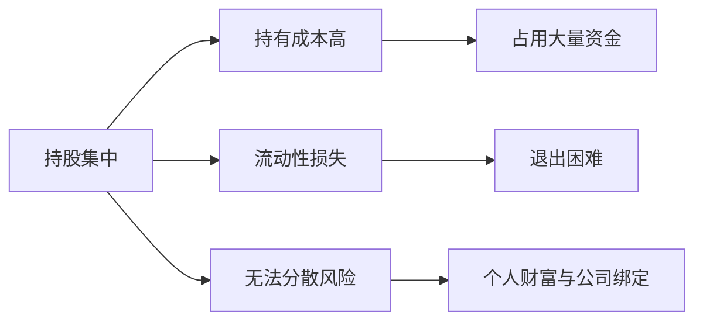
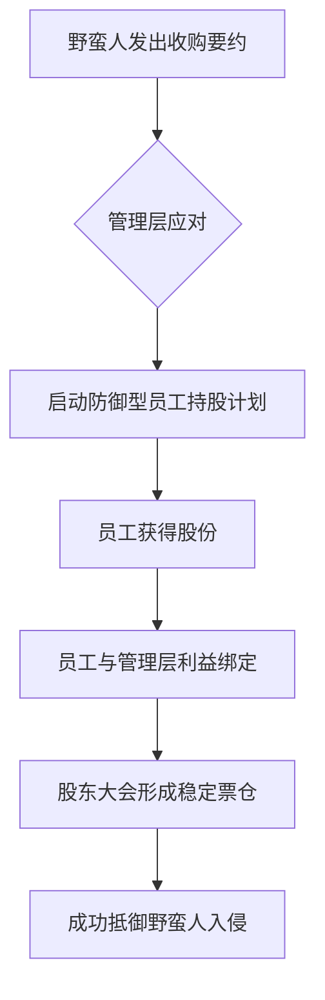

# 第09课：同股同权——持股比例不高如何保持对公司的掌控？

## 一、引言：同股同权的基本原则

**同股同权**，即"一股一票"原则，是股份有限公司的基石性制度安排。它的核心逻辑朴素而直接——**谁出资多，谁说话好使**。每一股份承载相等的表决权，出资额与话语权成正比。

> [!NOTE]
> 同股同权保证了"风险与权利相匹配"：出资多的人承担了更大的财务风险，理应获得更大的决策话语权。这是现代公司治理最朴素的公平观。

然而，在[[0007-hu-lian-wang-shi-dai|创业达人——互联网时代的来临带来了什么新挑战？]]一课中我们已经看到，互联网时代的创始人面临着"持股比例不高却希望保持控制"的困境。在同股同权的框架下，这个矛盾更加突出——股权被稀释，控制权也随之流失。

---

## 二、关键持股比例门槛

在同股同权制度下，不同持股比例对应着不同的权利边界。以下是中国公司法框架下的关键持股比例门槛：

| 持股比例 | 法定权利 | 通俗含义 |
|---------|---------|---------|
| **50%以上**（绝对控股） | 控制股东大会普通决议 | 控制性股东，大多数事项说了算 |
| **1/3以上**（>33.33%） | 一票否决权 | 可否决修改章程、增减资等重大事项 |
| **10%以上** | 可提议召开临时股东大会 | 在董事会不作为时主动召集会议 |
| **5%以上** | 举牌线 / 信息披露义务 | 持股达到5%须公告，此后每增减5%须披露 |
| **3%以上** | 可向股东大会提出提案 | 拥有向大会提交议案的资格 |

> [!WARNING]
> **认识误区**：很多人以为"51%"就是绝对控股。但真正的绝对控股权门槛是**50%以上**，在股权高度分散的公司，甚至30%就能实现实际控制。而修改公司章程等特殊决议，则需要**2/3以上**表决权通过。

---

## 三、持股集中的问题

如果仅仅聚焦于"持股比例越高越安全"的逻辑，创业者自然会倾向于集中持股。但这种策略存在明显的**三大代价**：

1. **持有成本高**：要维持高比例持股，创始人必须投入巨额资金，这往往需要放弃其他投资机会。
2. **流动性损失**：高比例持股意味着可交易的股份变少，股票流动性下降，退出通道受限。
3. **无法分散风险**：将大部分个人财富集中在单一公司，一旦公司经营不善，个人财富将遭受毁灭性打击。

> [!QUESTION]
> **思考**：如果既想保持控制又不想高比例持股，同股同权框架下有没有两全其美的办法？

答案是肯定的。以下四种方法都是在不违反同股同权原则的前提下，帮助创始人以较低持股比例实现对公司的有效控制。

---

## 四、方法一：与主要股东达成股权协议谅解

### 案例：腾讯 × Naspers

腾讯创始人马化腾团队持股比例仅为**20.86%**，远未达到绝对控股水平。但马化腾团队始终保持着对腾讯的实际控制权，这背后的关键之一是与主要股东 Naspers（南非报业）达成了**股权协议谅解**。

| 要素 | 内容 |
|------|------|
| 马化腾团队持股 | 约20.86% |
| Naspers持股 | 约25% |
| 协议安排 | 双方约定在重大决策上保持一致 |
| 实际效果 | 双方合计超过**75%**，通过**对等提名**机制控制董事会 |

> [!TIP]
> **核心逻辑**：创始人不需要靠自己达到50%，而是通过与"友好股东"结成联盟，形成事实上的控制性投票集团。关键是要找到**利益一致**且**值得信赖**的战略伙伴。

Naspers作为长期战略投资者，看重的是腾讯的长期价值而非短期套利，因此愿意支持创始团队的管理决策。这种"默契"虽然不形成法律上的约束，但在实践中极具效果。

---

## 五、方法二：一致行动协议

### 什么是一致行动协议？

一致行动协议是指多个股东通过签署协议，约定在股东大会投票时按照统一意志行使表决权。这是一种有法律约束力的正式安排。

### 案例：嘉迅飞鸿

嘉迅飞鸿的6位创始股东合计持股**66.1%**，但单个股东的持股比例都不高。通过签署一致行动协议，他们将分散的表决权**集中**起来，形成一个稳定控制的投票"原子"。

> [!NOTE]
> **一致行动协议的本质**：将多个股东的投票权"打包"，形成事实上的控制性股东。在资本市场中，这被视为一种"**专利制度**"——不是物理上将股份集中，而是通过契约将表决权集中。

### 一致行动协议的优势与风险

**优势**：
- 不需要实际转让股份即能集中表决权
- 可根据需要灵活设计协议条款
- 保持各个股东独立的法律地位

**风险**：
- 签署方可能违约（需要约定违约金等约束机制）
- 协议有期限，到期后可能不再续签
- 各方利益诉求发生变化时协议可能破裂

---

## 六、方法三：防御型员工持股计划

### 原理

防御型员工持股计划（ESOP）不是单纯的激励工具，更是一个**反收购盾牌**。当公司将一部分股份交由员工持有，且员工在重大事项上与管理层保持一致时，这部分股份就成为了抵御"野蛮人"的堡垒。

### 案例：安利股份

安利股份在面对外部"野蛮人"威胁时，启动了员工持股计划。员工与管理层利益绑定，在股东大会中形成了抵抗恶意收购的稳定票仓。

> [!WARNING]
> 防御型员工持股计划并非万能。如果收购方出价足够高，员工可能选择"用脚投票"——将股份卖给收购方套现。因此，员工持股计划作为防御工具的有效性取决于员工对管理层的信任程度和公司长期价值的认同感。

---

## 七、方法四：超额委派董事

### 原理

**超额委派董事**指的是持股比例不高的股东，按照超过其持股比例的名额来委派董事。在同股同权框架下，这似乎是矛盾的——但现实中确实存在。

### 案例：南波 A

在南波A的控制权争夺战中，宝能系持有**26.36%** 的股份，却成功委派了**50%** 的非独立董事。这如何实现？关键在于公司治理中的**累积投票制**和股东之间的博弈安排。

> [!TIP]
> **核心启示**：超额委派董事虽然看起来"不公平"，但往往反映了公司实际控制结构的复杂性——某个股东虽然持股不高，却可能因为其他股东的"委托"或"弃权"而获得更多董事席位。

### 两种不同的视角

郑志刚教授提出了一个重要的区分：

- **第一大股东超额委派**：**不鼓励**。这可能强化"一股独大"的治理弊端，损害中小股东利益。
- **非第一大股东超额委派**：**鼓励**。这有助于形成制衡机制，防止第一大股东滥用控制权。

### 拓展案例：中国联通混改

中国联通在混合所有制改革中，引入了多家战略投资者。虽然单一战略投资者的持股比例不高，但通过董事会的精细化设计，实现了非第一大股东的有效参与和制衡。联通混改后，董事会席位分配体现了多元股东的利益平衡，是超额委派董事理念的正面实践。

---

## 八、四种方法的对比总结

| 方法 | 核心机制 | 代表案例 | 适用场景 |
|------|---------|---------|---------|
| 股权协议谅解 | 与友好股东达成默契联盟 | 腾讯 × Naspers | 有长期战略合作伙伴 |
| 一致行动协议 | 契约约束下的表决权集中 | 嘉迅飞鸿 | 多个创始股东 |
| 防御型员工持股 | 员工持股形成稳定票仓 | 安利股份 | 面临野蛮人威胁 |
| 超额委派董事 | 低持股高比例委派董事 | 南波A / 中国联通 | 需要制衡第一大股东 |

> [!QUESTION]
> 

> 
<strong>自我检测：你掌握了多少？</strong>

>
> 1. 腾讯马化腾团队持股仅20.86%，为何能保持对公司的控制？
> 2. 一致行动协议的本质是什么？与股权协议谅解有何不同？
> 3. 防御型员工持股计划在什么情况下可能失效？
> 4. 为什么郑志刚教授"不鼓励"第一大股东超额委派董事，但"鼓励"非第一大股东超额委派？
>
> **参考答案**：
> 1. 通过与Naspers达成股权协议谅解，双方合计超过75%的通过门槛，形成对等提名机制。
> 2. 本质是通过契约将多个股东的投票权"打包"，形成事实上的控制性股东。协议谅解偏"默契"，一致行动协议偏"契约"。
> 3. 当收购方出价足够高，员工选择套现时。
> 4. 第一大股东超额委派会强化"一股独大"问题；非第一大股东超额委派可形成制衡。
> 

---

## 九、小结：同股同权下的生存智慧

在同股同权的制度框架下，创始人面临的挑战是：**持股比例无法达到绝对控股，但又不希望丧失对公司的控制**。但正如本课所示，这个困境并非无解：

- **对外**，与友好股东形成联盟（股权协议谅解）
- **对内**，与创业伙伴形成契约（一致行动协议）
- **向下**，与员工形成利益绑定（防御型员工持股）
- **向上**，与董事会形成权力制衡（超额委派董事）

然而，这些方法都有其局限性。下一课我们将探讨一种更激进的制度创新——**同股不同权**的双重股权结构，它在根本上改变了"一股一票"的底层逻辑。

> 版权信息：本文档基于郑志刚教授《公司治理：掌控与激励的艺术》课程整理。  
> 标签：`#公司治理` `#同股同权` `#股权结构` `#一致行动协议` `#员工持股` `#超额委派董事` `#腾讯` `#中国联通`