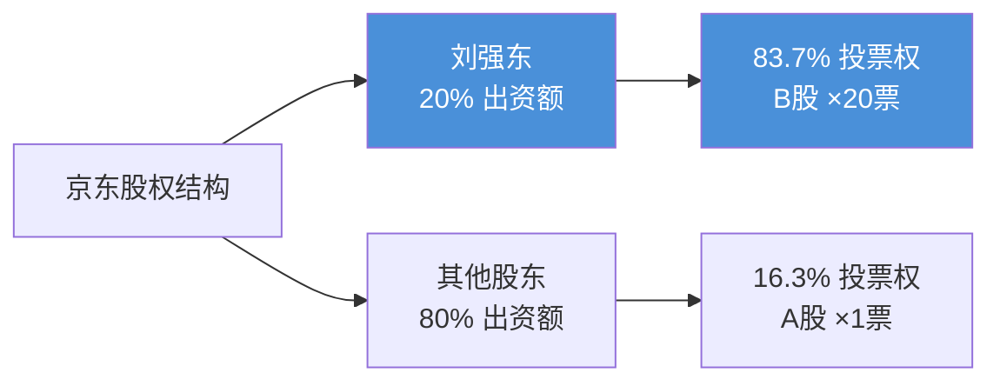
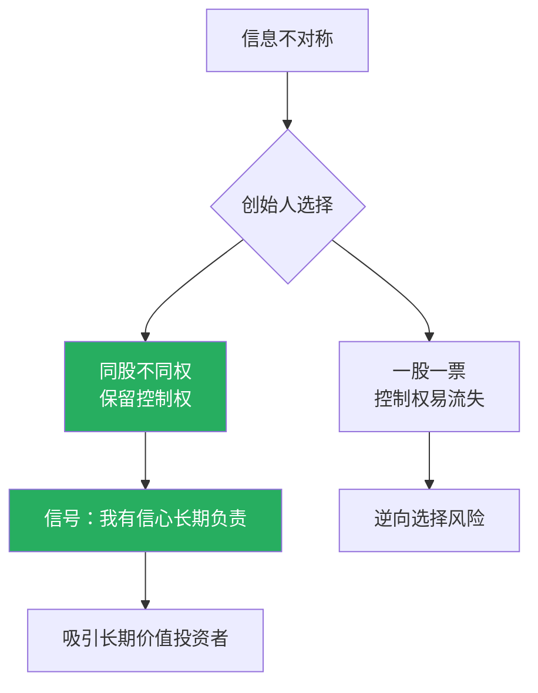

# 第10课：同股不同权——为什么投票权向创始团队倾斜？

> [!NOTE]
> 传统公司治理奉行「一股一票」的平等原则，但在互联网时代，越来越多的科技公司选择了同股不同权的 AB 双重股权结构。本课将深入探讨这一制度设计的逻辑、争议与实践。

## 什么是 AB 双重股权结构？

**AB 双重股权结构**，是指同一家公司发行多类股票，不同类别的股票享有不同的投票权。通常：

- **A 类股**（高投票权股）：由创始团队持有，每股享有数倍乃至数百倍投票权
- **B 类股**（低投票权股）：向外部投资者公开发行，每股通常只有 1 票

这一结构使得创始团队能够在持股比例较低的情况下，依然牢牢掌握公司的控制权。

> [!WARNING]
> 同股不同权本质上是将「经济收益权」与「投票控制权」分离，打破了传统公司法中「风险与权力对等」的假设。

## 经典案例

### 谷歌（Google）

谷歌在 2004 年 IPO 时采用了 AB 股结构：

- **A 类股（GOOGL）**：每股 1 票投票权，公开交易
- **B 类股**：由拉里·佩奇、谢尔盖·布林持有，每股 10 票投票权
- **C 类股（GOOG）**：每股 0 票投票权，无表决权

2014 年谷歌还进行了股票分割，创设了无投票权的 C 类股，进一步巩固了创始人的控制地位。

### 京东（JD）

刘强东通过 AB 股结构实现了对中国电商巨头的绝对控制：

- 刘强东本人持有约 **20% 的经济利益**（出资额）
- 但其投票权高达 **83.7%**
- 京东 B 类股每股享有 **20 票**投票权

这意味着即使其他所有股东联合反对，刘强东依然能够决定公司的重大事项。

## 历史争议：同股不同权是否合理？

> [!QUESTION]
> 同股不同权违反了「一股一票」的民主原则，这是否意味着它天生就不合理？

经济学界对同股不同权长期存在争议：

| 学者 | 立场 | 核心论点 |
|------|------|----------|
| **哈特教授**（Oliver Hart） | 反对 | 投票权应当与剩余索取权匹配，否则控制人缺乏承担风险的激励 |
| **施莱福教授**（Andrei Shleifer） | 反对 | 控制权私人收益过高时，同股不同权会加剧对中小股东的剥削 |

然而，互联网时代的实践让这一制度重新获得认可。

## 互联网时代青睐同股不同权的四大原因

### 1. 防范野蛮人入侵

在股权高度分散的时代，敌意收购的风险显著上升。同股不同权相当于为创始人团队装备了「防毒面具」，使其能够抵御门口的野蛮人。

> [!TIPS]
> 分散股权结构下，任何外部收购方都可以通过在公开市场买入股票来夺取控制权。AB 股结构使得收购方即使买下全部流通股，也无法获得足够的投票权。

### 2. 投资者把不懂的业务交给专业团队

互联网企业的商业模式往往高度复杂且充满不确定性。外部投资者难以理解其技术路线和战略选择，与其外行指导内行，不如将投票权委托给最了解业务的创始团队。

### 3. 向资本市场传递积极信号

这里可以借用 **阿克洛夫（Akerlof）的旧车市场模型**（柠檬市场）来解释：

- **逆向选择问题**：如果所有公司都是一股一票，优质公司的创始人可能因为担心失去控制权而不愿上市
- **信号传递机制**：选择同股不同权的创始人向市场传递了「我对公司未来有信心，愿意长期持有并负责」的积极信号

### 4. 从短期雇佣合约转化为长期合伙合约

同股不同权实质上改变了创始人与投资者之间的关系性质：

- **传统模式**：投资者随时可以「解雇」管理层（短期雇佣合约）
- **AB 股模式**：投资者认可创始人的长期价值，愿意成为战略合伙人（长期合伙合约）

## 日落条款

> [!EXAMPLE]
> **拼多多黄峥案例**：2021 年 3 月，黄峥宣布辞任拼多多董事长。根据拼多多的公司章程，其超级投票权在卸任董事长后**自动失效**。这就是典型的「日落条款」应用。

**日落条款**（Sunset Clause）是同股不同权制度中的权力自动中止/失效机制，通常包括：

- **时间日落**：上市一定年限后超级投票权自动失效
- **事件日落**：创始人离职、去世、转让股份等特定事件发生时失效
- **比例日落**：创始人持股低于一定比例时超级投票权失效

> [!WARNING]
> 日落条款是平衡创始人控制权与中小股东利益的关键机制。缺乏日落条款的 AB 股结构可能让不称职的创始人永久把持公司。

## 全球监管趋势

| 市场 | 态度 | 关键事件 |
|------|------|----------|
| 美国 | 允许（纽交所、纳斯达克） | 谷歌、Facebook 等均采用 |
| 香港 | 2018 年改革后接纳 | 小米成为首家采用 AB 股上市的公司 |
| 中国内地 | 科创板跟进 | 允许特殊股权结构企业上市 |
| 新加坡 | 2018 年改革后接纳 | 吸引新经济公司 |

## 小结

同股不同权是互联网时代公司治理的重要制度创新。它在 **防范敌意收购、解决信息不对称、传递积极信号、促进长期合作** 四个方面发挥了重要作用。但同时，日落条款的合理设计也至关重要，以确保创始人的控制权不会成为永久性的「铁帽子王」。

---

自我检测：你理解同股不同权了吗？

**问题1**：京东的刘强东持股约 20%，却拥有 83.7% 的投票权。请问 B 类股每股相当于 A 类股多少票？

> 答：约 20 票。京东 B 股每股拥有 20 票投票权。

**问题2**：什么是日落条款？请列举两种常见类型。

> 答：日落条款是同股不同权制度中超级投票权自动终止的机制。常见类型包括时间日落（上市满一定年限后失效）和事件日落（创始人离职或转让股份时失效）。

**问题3**：为什么互联网时代比传统行业更需要同股不同权？

> 答：（1）互联网公司股权更分散，面临更大的敌意收购风险；（2）互联网业务技术门槛高，外部投资者信息不对称程度更大；（3）创始人的人力资本对互联网公司更关键。

---

> **延伸阅读**：[[0011-he-huo-ren-zhi-du|第11课：合伙人制度]] | [[0012-you-xian-he-huo-jia-gou|第12课：有限合伙架构]]