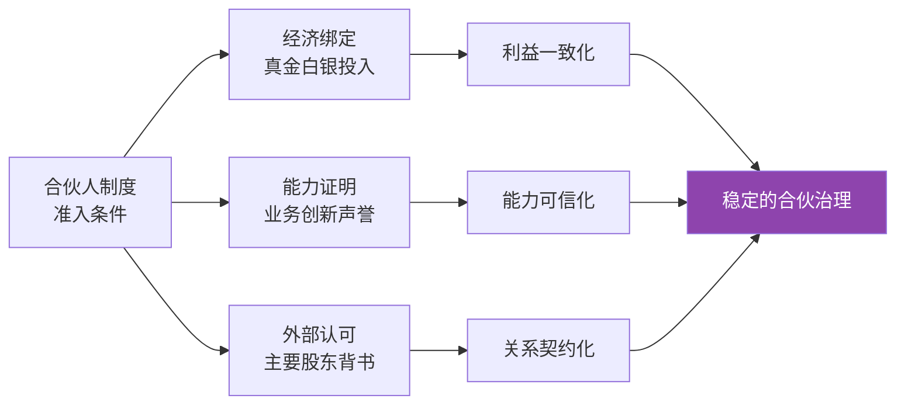

# 第11课：合伙人制度——如何找到长期合作共赢的伙伴？

> [!NOTE]
> 阿里巴巴的股权结构极为分散——软银持股 31.8%、雅虎持股 15.3%，马云本人仅持股 7.6%。然而，阿里的实际控制人并非这两大股东，而是**合伙人团队**。这背后是怎样的制度设计？

## 合伙人制度的定义

**合伙人制度**（Partnership System），是指管理团队以股东身份集中持有公司股票，集体扮演大股东角色的股权结构安排。它在 AB 双重股权结构的基础上更进一步，将控制权从**个人**扩展到了**团队**。

## 两个层面的合伙

### 层面一：内部成员合伙

合伙人制度首先是一种**企业文化与组织机制**：

- 打破传统科层制的等级壁垒
- 建立共同的价值体系与决策文化
- 核心管理层以「合伙人」身份平等参与公司治理
- 形成「上下同欲」的凝聚力

> [!TIPS]
> 阿里的合伙人并非法律意义上的合伙关系，而是一种管理机制——它通过文化认同和利益捆绑，让核心管理者超越部门利益，从公司整体角度思考问题。

### 层面二：与主要股东的合伙

这是合伙人制度的**实质所在**——基于专业分工的战略合伙：

- 创始人团队负责**业务经营与战略决策**
- 财务投资者（软银、雅虎）负责**提供资本**
- 双方通过合伙人制度形成稳定的权力分配契约

## 投票权代理机制

阿里合伙人制度的核心在于**投票权代理安排**：

| 股东 | 持股比例 | 投票权代理安排 |
|------|----------|----------------|
| 软银 | 31.8% | 将 **30% 以上** 投票权转交阿里合伙人代理 |
| 雅虎 | 15.3% | 将 **三分之一** 投票权转交阿里合伙人代理 |

> [!WARNING]
> 这意味着阿里合伙人实际控制的投票权远超其持股比例——通过主要股东的投票权委托，合伙人团队实现了「少数控制多数」的治理格局。

## 合伙人制度四大优势（与同股不同权共通）

1. **防范野蛮人入侵**：合伙人团队掌握实际控制权，敌意收购难以得逞
2. **专业的人做专业的事**：投资者无需理解复杂的互联网业务
3. **传递长期信心信号**：合伙人制度向市场表明管理团队对公司长期发展的承诺
4. **长期合伙而非短期雇佣**：建立稳定的资本与管理合作关系

## 合伙人制度两大独特优势

> [!EXAMPLE]
> **独特优势一：管理团队事前组建**
>
> 传统公司往往是先有公司再有管理层。而阿里在上市之前就通过合伙人制度完成了核心管理团队的组建与磨合，这相当于一个**人才库**——合伙人队伍持续吸纳新鲜血液，确保管理团队的代际传承。

> [!EXAMPLE]
> **独特优势二：激励机制前置**
>
> 阿里合伙人制度将代理冲突的缓解机制**从事后转移到了事前**。核心管理者本身就是股东（合伙人），其利益与公司长期价值深度绑定，而非等到出现问题后再通过薪酬委员会等机制来约束。

## 合伙人制度的三个严苛条件

马云曾总结，要成为阿里的合伙人并非易事：

| 条件 | 具体要求 |
|------|----------|
| **真金白银投入** | 马云本人持股不低于 1%，所有合伙人都需以股东身份实际出资 |
| **业务创新声誉** | 必须建立业务创新引领者的声誉，如双十一的成功就是重要考量 |
| **外部主要股东认可** | 必须获得软银、雅虎等主要股东的背书与信任 |

> [!NOTE]
> 这三个条件确保了合伙人并非「空手套白狼」，而是既有经济利益的绑定，又有业绩声誉的证明，还获得了外部资本市场的认可。

## 三种「合伙人」制度的比较

阿里合伙人制度与国内其他「合伙人」概念有本质区别：

| 维度 | 阿里合伙人制度 | 事业合伙人制（万科） | 律所合伙制 |
|------|----------------|---------------------|------------|
| **法律基础** | 公司章程约定 | 项目跟投机制 | 合伙协议 |
| **核心目的** | 巩固控制权 | 项目层面激励 | 专业服务共享 |
| **责任形式** | 有限责任（股份公司） | 项目层面共担 | 无限连带责任 |
| **是否持股** | 是，必须持有公司股份 | 项目跟投，不一定持有母公司股份 | 是，持有律所权益 |
| **退出机制** | 严格，需合伙人委员会批准 | 项目结算后退出 | 较为灵活 |

### 万科事业合伙人制

万科的「事业合伙人」制度借鉴了阿里，但实质不同：

- 万科管理层通过有限合伙平台持有公司股票
- 项目层面实行**跟投机制**（管理层强制跟投项目）
- 主要目的是**绑定管理者与项目绩效**，而非控制权安排

### 律所合伙制

法律界的合伙制是真正的法律意义上的合伙：

- 合伙人承担**无限连带责任**
- 决策机制为**一人一票**
- 与公司治理中的合伙人制度有本质区别

## 小结

阿里合伙人制度是对同股不同权结构的**升级版本**——它将控制权从创始人个人扩展到了管理团队集体，通过事前组建人才库和前置激励机制，建立了更稳定的长期合伙关系。这一制度的核心在于：**用专业分工换取资本信任，用制度约束替代人际博弈**。

---

自我检测：你理解合伙人制度了吗？

**问题1**：软银持有阿里巴巴约 31.8% 的股份，但阿里的实控人并非软银。为什么？

> 答：因为软银将其超过 30% 的投票权委托给了阿里合伙人团队代理，加上雅虎也将其三分之一的投票权委托代理，使得合伙人团队掌握了实际控制权。

**问题2**：合伙人制度相比于同股不同权的两大独特优势是什么？

> 答：（1）管理团队事前组建——上市前已完成核心团队的组建与磨合；（2）激励机制前置——代理冲突的缓解从「事后约束」转变为「事前绑定」。

**问题3**：阿里合伙人制度与万科事业合伙人制的核心区别是什么？

> 答：阿里合伙人制度的目的是巩固控制权，核心是投票权代理安排；万科事业合伙人制的主要目的是项目层面的激励绑定，通过跟投机制将管理者利益与项目绩效挂钩。

---

> **延伸阅读**：[[0010-tong-gu-bu-tong-quan|第10课：同股不同权]] | [[0012-you-xian-he-huo-jia-gou|第12课：有限合伙架构]]