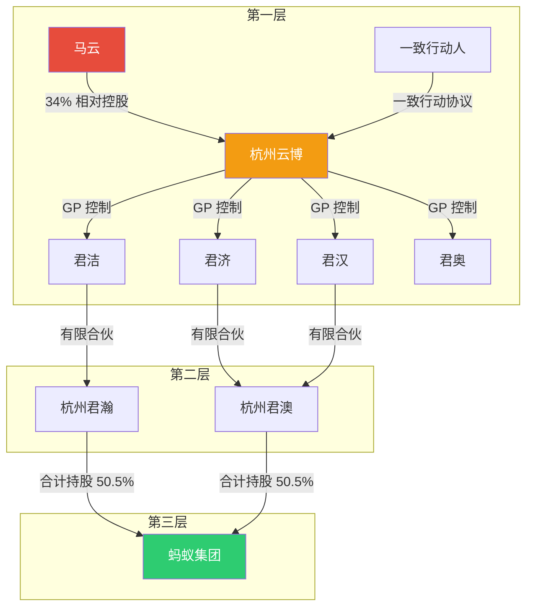
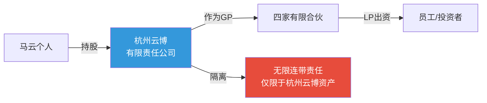
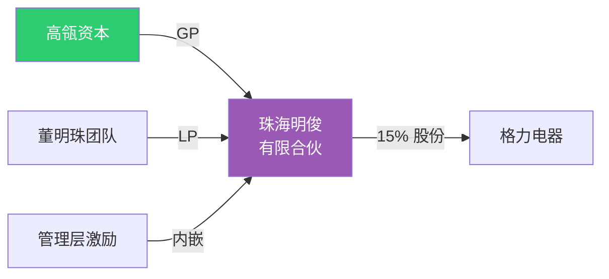

# 第12课：有限合伙架构——加强控制权的同时如何激励核心员工？

> [!NOTE]
> 有限合伙架构是公司治理领域实现「控制权与激励兼顾」的精妙设计。蚂蚁集团通过三层有限合伙架构，让马云以不到 10% 的持股比例实现了对万亿级金融科技帝国的绝对控制，同时内嵌了员工持股激励计划。

## GP 与 LP：有限合伙的基本概念

有限合伙架构将合伙人分为两类：

| 角色 | 英文 | 权利与义务 |
|------|------|------------|
| **普通合伙人** | GP（General Partner） | 执行合伙事务，承担**无限连带责任**，掌握实际控制权 |
| **有限合伙人** | LP（Limited Partner） | 仅出资，不参与管理，以出资额为限承担**有限责任** |

> [!WARNING]
> GP 虽然掌握控制权，但承担无限连带责任——这是有限合伙架构中「权责不对等」的法律支撑。GP 之所以不敢滥用权力，是因为一旦出事，它将承担无限赔偿责任。

## 蚂蚁集团三层有限合伙架构

蚂蚁集团的股权结构是有限合伙架构的经典范本，可拆解为三个层次：

### 第一层：杭州云博

马云通过以下方式实现对杭州云博的相对控制：

- **持有 34% 的股份**——虽未达绝对控股，但通过一致行动协议与一票否决权实现了实际控制
- 杭州云博的定位是**有限责任公司**，而非有限合伙企业

### 第二层：四家有限合伙公司

杭州云博作为 **GP**，控制四家有限合伙公司：

- 君洁
- 君济
- 君汉
- 君奥

这四家有限合伙公司共同构成了控制链条的中间层。

### 第三层：杭州君瀚与杭州君澳

两家有限合伙公司**合计持有蚂蚁集团 50.5% 的股份**，成为控股股东：

- **杭州君瀚**：由君洁控制
- **杭州君澳**：由君济、君汉、君奥共同控制

> [!TIPS]
> 三层架构的精妙之处在于：每一层都起到了 **放大控制权** 的杠杆作用。马云首先控制杭州云博，杭州云博作为 GP 控制四家有限合伙，四家有限合伙再分别控制持股平台，最终以极小的出资撬动了巨大的控制权。

## 有限责任公司的隔离作用

> [!QUESTION]
> 为什么第一层不直接用有限合伙，而是用有限责任公司（杭州云博）？

关键在于**无限连带责任的隔离**：

- GP（普通合伙人）在法律上承担无限连带责任
- 如果马云个人直接担任 GP，一旦出现债务纠纷，个人财产将面临风险
- 通过设立**有限责任公司**（杭州云博）作为 GP，将该公司的有限责任作为「防火墙」

这样一来，看似承担无限连带责任的 GP，实际上只需以杭州云博的资产为限承担责任——马云的**个人财产得到了有效保护**。

## 有限合伙架构的三个升级点

与阿里合伙人制度相比，有限合伙架构实现了三个重要升级：

| 维度 | 阿里合伙人制度 | 有限合伙架构（蚂蚁） | 升级点 |
|------|----------------|---------------------|--------|
| **员工激励** | 股权激励计划**外配**于治理结构 | 员工持股计划**内嵌**于有限合伙 | 激励更直接、成本更低 |
| **实际控制人** | 合伙人**集体**控制 | **唯实控人**（马云）控制 | 决策更集中、更高效 |
| **信任基础** | 依赖主要股东（软银、雅虎）的**意愿** | 依赖法律保护的有限合伙**投资协议** | 法律关系取代人际关系，更稳定 |

### 员工持股内嵌

蚂蚁的员工持股计划直接内嵌在有限合伙架构中：

- 员工以 **LP 身份** 加入有限合伙公司
- 享有经济收益权（分红、增值），但不享有投票权
- 既实现了激励，又不稀释控制权

> [!NOTE]
> 这种设计巧妙地解决了「既要激励员工，又要保持控制」的两难问题。相比之下，传统股权激励会稀释创始人的投票权，而有限合伙架构完美规避了这一缺陷。

## 应用案例

### 重庆钢铁混改

重庆钢铁在引入四源合作为战略投资者进行混合所有制改革时，采用了有限合伙架构：

- 四源合以 GP 身份参与重庆钢铁治理
- 实现了**国有资本与民营资本的有效融合**
- 有限合伙架构为混改提供了灵活的控制权安排

### 格力电器股改

2019 年格力电器完成混合所有制改革，引入了珠海明俊作为战略投资者：

- 珠海明俊由**高瓴资本 + 董明珠团队**共同设立
- 采用有限合伙架构实现控制权与激励的平衡
- 董明珠团队以 LP 身份参与，享有经济收益

## 有限合伙架构的两大作用

### 作用一：变相形成同股不同权

通过 GP/LP 的分层设计，实现了比 AB 股更灵活的控制权安排：

- GP 可以以极小的出资比例掌握完全的控制权
- 不需要修改公司章程，只需要签订合伙协议
- 法律基础更成熟（《合伙企业法》）

### 作用二：内嵌员工持股计划激励

有限合伙天然适合作为员工持股平台：

- 员工作为 LP 享有经济收益（分红、资本增值）
- 员工的投票权统一由 GP 行使，不分散控制权
- 员工离职时的股份处置在合伙协议中事先约定，避免纠纷

## 小结

有限合伙架构是公司治理工具箱中的「瑞士军刀」——它既能实现 **控制权的集中**（通过 GP 角色），又能实现 **核心员工的激励**（通过 LP 角色），还能通过有限责任公司进行 **风险隔离**。它是从阿里合伙人制度基础上的又一次进化，将控制权安排从人际关系契约升级为法律保护的投资协议。

---

自我检测：你理解有限合伙架构了吗？

**问题1**：GP 和 LP 的核心区别是什么？

> 答：GP（普通合伙人）负责执行合伙事务，承担无限连带责任；LP（有限合伙人）仅出资，以出资额为限承担有限责任，不参与管理。

**问题2**：蚂蚁集团三层有限合伙架构中，哪一层起到了隔离无限连带责任的作用？

> 答：第一层的杭州云博。它是一家有限责任公司，作为 GP 的法律主体，将无限连带责任的承担范围限制在杭州云博的资产内，保护了马云的个人财产。

**问题3**：有限合伙架构相比于阿里合伙人制度的三个升级点是什么？

> 答：（1）员工激励从外配变为内嵌；（2）实控人从合伙人集体变为唯实控人；（3）信任基础从主要股东意愿变为法律保护的投资协议。

---

> **延伸阅读**：[[0010-tong-gu-bu-tong-quan|第10课：同股不同权]] | [[0011-he-huo-ren-zhi-du|第11课：合伙人制度]]