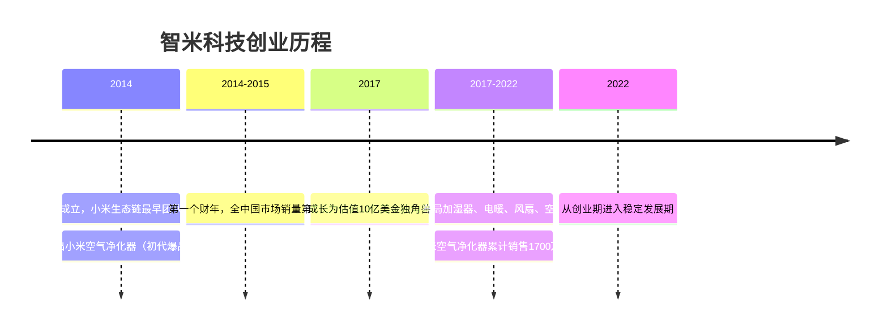

# 第01课：导论——从案例到心法，还原独角兽的爆品之路

## 核心概念

### 讲师的创业原点

- **时间**：2014年（已做大学老师14年，系主任、教授）
- **契机**：小米雷军、刘德（德哥）发起生态链战略
- **决策原则**：德哥翻通讯录找熟悉的人——"做生态链要做得快准狠"
- **产品方向**：空气净化器（智能家电突破口）

### 为什么是空气净化器？

1. 小米在手机端已有几千万部的年销量
2. 通信录中已有成功先例：紫米（移动电源）、万魔声学（耳机）
3. 雷军布局智能家庭IoT，智能家电是核心领域
4. 空调、风扇等行业有传统巨头且缺乏痛点
5. 空气净化器是刚需（雾霾污染严重），但市场分散、价格虚高、选择困难

### "创业是一条不归路"

- 德哥对苏峻的忠告：这句话发自内心的提示
- 创业过程中有开心顺利的时候，但更多的是痛苦、煎熬、不断学习成长和蜕变
- 要求创业者"义无反顾"

## 阶段模型详解

### 课程讲述逻辑（时间线法）

```
0到1阶段 ──> 0到1之后（困扰期）──> 1到10阶段 ──> 当下系统总结
     │               │                  │              │
  从业务出发      个人能力局限      企业稳定基盘    爆品方法论
  组建精悍团队    成长不足          继续向前能力    创新型组织
  快速突破        环境干扰          创业者蜕变
```

### 创业者的成长路径

```
识别机会 → 做产品 → 靠业务驱动拉动公司
    ↓
具备系统思考能力 → 具备战略思维 → 企业管理者
```

## 操作方法和步骤

### 从大学老师到创业者的转换心法

1. **识别个人核心能力**：机会稍纵即逝，果断选择"做产品"这一梦想
2. **信任基础**：选择与熟悉且信任的人合作，降低协同成本
3. **抓住市场机会**：环境变化（雾霾）创造刚需，行业痛点=商业机会

## 案例参考

### 智米科技发展简史



### 小米生态链早期的成功逻辑

| 公司 | 产品 | 增长逻辑 |
|------|------|----------|
| 紫米科技 | 移动电源 | 手机标准化配件 |
| 万魔声学 | 耳机 | 手机标准化配件 |
| 智米科技 | 空气净化器 | 智能家电突破口 |
| 小米手机 | 手机 | 核心流量入口 |

## 金句摘录

> "这是一条不归路，你想好了再来。"

> "每个人来到这个世界上都有自己的角色，这个角色在某些程度上是与生俱来的。"

> "做老师是让我很快乐、很开心的一件事情，但做产品是我的梦想。"

> "创业的过程中，你会有非常开心的时候、非常顺的时候，但更多的时候是非常痛苦、非常煎熬，不断的学习成长、寻求蜕变的时候。"

## 自检问题

<details>
<summary>点击展开自检问题</summary>

1. 如果你是创业者，你的"德哥"是谁？翻翻通讯录，谁是你最信任、最能快速协同的人？
2. 你所在行业中，是否存在用户"非常痛"但尚未被充分满足的需求？这个痛点有多痛？
3. 创业是个"不归路"——你是否已经做好了面对长期痛苦和煎熬的心理准备？支撑你坚持下去的底层动力是什么？

</details>