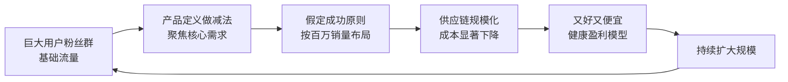

# 第03课："0-1"阶段：怎样打造爆品并建立口碑营销

## 核心概念

### 产品打造的两个关键词：极致 + 快

```
产品打造
    ├── 极致（三个维度）
    │   ├── 成本（性价比）
    │   ├── 美学与品质
    │   └── 性能
    │
    └── 快（反对完美主义）
```

### 信任飞轮：爆品 × 口碑 × 流量

```
        爆品（产品越好）
            │
            ▼
     ┌──────────────┐
     │   流量越大    │◄──── 流量
     │   产品越好    │
     └──────┬───────┘
            │
            ▼
     ┌──────────────┐
     │   口碑不塌    │◄──── 口碑（核心支撑）
     │   持续放大    │
     └──────────────┘
```

## 操作方法和步骤

### 第四步：产品打造——极致

#### 维度一：成本（性价比）

| 传统做法 | 智米做法 |
|----------|----------|
| 用低价=用差原料 | 精简意义上的高品质 |
| 家电行业通行的成本结构 | 降维打击的工艺选择 |
| 叠加功能推高成本 | 产品定义精简降低基础成本 |

**具体方法**：
1. 使用手机/移动互联网行业的人才做结构、电子电路和软件控制
2. 提高集成度，减少元器件数量（比过去减少约40%）
3. 面向大规模自动化生产来设计（以终为始）
4. 供应链布局按年销量100万台以上来设计

#### 维度二：美学与品质

**底层动力**：团队创业激情——家电行业的产品品质与经济发展水平不匹配

| 传统家电痛点 | 智米的解决方案 |
|-------------|---------------|
| 包装粗糙、有毛刺 | 复印机/打印机精度的模具（成本约3倍） |
| 操作体验差 | 极简交互（一个按键） |
| 原材料产生不良气味 | 高品质材料选择 |
| 产品不美观 | 精密的美学设计 |

**美学细节案例**——通风孔的孔径选择：

```
测试过程：
  3.3mm → 3.5mm → 3.6mm → 3.9mm（每0.2mm一个梯度）
                                ↓
                  找到合理值（美学+性能均衡）
```

**原理**：孔太大 → 视觉混色效应 → 整体显得脏；孔太小 → 通风效率不足

#### 维度三：性能

**目标**：在最小占地面积内实现最好的功能

**设计约束**：
- 居室面积有限
- 摆放物品体量有限
- 不到一张A4纸面积的占地面积

**关键技术点**：
- 优化气流和风道
- 优化滤材材料（低阻力、高通过性）
- 静电驻极概念增强PM2.5捕捉能力
- 小体积 + 高性能

### 第四步：产品打造——快（反对完美主义）

**核心理念**：
- 做的是商业，不是艺术创作
- 快 = 抓住稍纵即逝的商机
- 完美主义是有条件的——以能抓住市场机会为前提

**案例：乔布斯与iPhone天线门**
- iPhone4有严重天线缺陷（右手持握信号受影响）
- 但核心功能（手机+音乐播放器+移动互联网工具）出色
- 未妨碍它成为伟大产品

**案例：空气净化器一代的红外传感器**
- 传感器产业当时不成熟
- 激光颗粒物传感器还在推进中
- 先用红外传感器（有缺憾但能赶上2014年冬季旺季）
- 如果错过冬季这个季节窗口，规模可能只有现在的几分之一

**时间线**：
```
2014年3月 组队
    ↓ （仅9个月）
2014年冬季 产品推出（赶上旺季）
    ↓
如果错过 → 等到下一年 → 规模可能是现在的几分之一
```

### 第五步：产品传播——口碑裂变

**初始困境**：
- 创业公司影响力不够
- 营销预算为零

**解决路径**：

```
小米手机核心用户群（初始转化率）
    ↓
用户收到产品（极致性价比）
    ↓
打开包装/使用体验超预期
    ↓
自发传播：
  - 家里多买几台（每个房间一台）
  - 给父母买
  - 朋友圈晒单推荐
    ↓
零广告预算的病毒式传播
```

### 补充：小米IoT体系的流量优势

**IoT设备 → 数字流量 → 精品电商**

- 用户使用IoT设备时频繁打开APP交互
- APP中嵌入有品链接 → 自然承接流量
- IoT设备越多 → 流量越大 → 电商转化越大
- IoT可卖耗材、收集数据、提升体验、增强用户粘性
- 全球小米IoT连接量：近6亿台（不含手机）

## 案例参考

### 雷军互联网创业七字诀 vs 智米实践

| 七字诀 | 智米对应实践 |
|--------|-------------|
| **专注** | 聚焦PM2.5去除，去掉所有附加功能 |
| **极致** | 三个维度（成本/美学/性能）追求极致 |
| **口碑** | 产品自己卖自己，零预算裂变传播 |
| **快** | 9个月推出产品，抓住冬季旺季 |

### 又好又便宜的底层逻辑（非补贴模式）



**电源线案例**：
- 平台体系规范出标准化电源线
- 集团采购量：1000万根
- 普通价格：20元/根 → 平台价格：6-8元/根

**激光颗粒物传感器案例**：
- 初始价格：120元/只
- 大规模采购后：30元以内

## 金句摘录

> "低成本并不意味着这个产品要用差的原料、差的工艺。"

> "在创业期要坚决地反对完美主义。"

> "完美是有条件的，完美是在你能抓住市场机会前提下的完美，而不是无上限地追求完美。"

> "产品是有说服力的，产品自身是能销售自身的。"

> "永远口碑不能塌。口碑不塌，产品就能够持续的放大，就能够稳态的发展。"

> "我们不是补贴，我们不是用短期的行为去恶性地去占领这个市场——我们是从整个产品的底层效率出发，全系统地提升效率。"

## 自检问题

<details>
<summary>点击展开自检问题</summary>

1. **极致自检**：你的产品在成本、美学、性能三个维度上，哪个维度最弱？能否找到一个"降维打击"的工艺或方法？
2. **快 vs 完美**：你是否在某个细节上过度纠结，导致错过了市场窗口？如果现在必须3个月内推出产品，你会砍掉什么？
3. **口碑裂变**：如果你的营销预算为零，你的产品能否让用户自发传播？用户拿到产品后，"超预期"的点在哪里？
4. **规模效应**：如果你假定你的产品能卖100万件，你的供应链和成本结构会如何改变？哪些供应商会相信你并愿意支持？

</details>