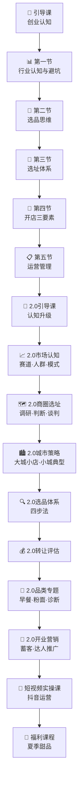

# 课程地图——学习路径导航

## 推荐学习顺序

## 模块详情

### 第一部分：1.0 基础篇

| 模块 | 前置要求 | 时间估计 | 核心产出 |
|------|---------|---------|---------|
| [[lessons/0001-dao-yin-ke|引导课]] | 无 | 15分钟 | 理解"认知>努力"的创业观 |
| [[lessons/0002-xing-ye-shu-ju-yu-liu-da-keng|第一节：行业数据与6大坑]] | 引导课 | 30分钟 | 识别餐饮加盟陷阱 |
| [[lessons/0003-xuan-pin-si-wei|第二节：选品思维]] | 第一节 | 30分钟 | 掌握选品5个标准 |
| [[lessons/0004-xuan-zhi-ti-xi|第三节：选址体系]] | 前序 | 40分钟 | 学会评估商圈和商铺 |
| [[lessons/0005-kai-dian-san-yao-su|第四节：开店三要素]] | 选址 | 15分钟 | 产品/位置/团队三角 |
| [[lessons/0006-yun-ying-guan-li|第五节：运营管理]] | 开店 | 30分钟 | 财务、员工、换品 |

### 第二部分：2.0 进阶篇

| 模块 | 前置要求 | 时间估计 | 核心产出 |
|------|---------|---------|---------|
| [[lessons/0007-shi-chang-ren-zhi|市场认知]] | 1.0全 | 30分钟 | 判断自己适合什么模式 |
| [[lessons/0008-shang-quan-xuan-zhi|商圈选址进阶]] | 选址基础 | 40分钟 | 市场调研与人流动线分析 |
| [[lessons/0009-shang-wu-tan-pan|商务谈判]] | 商圈知识 | 20分钟 | 低成本的拿铺技巧 |
| [[lessons/0010-cheng-shi-ce-lue|城市策略]] | 商圈知识 | 15分钟 | 大城小店vs小城典型 |
| [[lessons/0011-xuan-pin-ti-xi|选品体系]] | 选品基础 | 25分钟 | 选品四步法 |
| [[lessons/0012-zhuan-rang-fei|转让费评估]] | 选址 | 15分钟 | 评估转让费的方法 |
| [[lessons/0013-pin-lei-zhuan-ti|品类专题]] | 选品+选址 | 40分钟 | 早餐/粉面/诊断 |
| [[lessons/0014-kai-ye-ying-xiao|开业营销]] | 全 | 20分钟 | 蓄客与达人推广 |

### 第三部分：短视频实操课

| 模块 | 前置要求 | 时间估计 |
|------|---------|---------|
| [[lessons/0015-dou-yin-yun-ying|抖音运营]] | 无 | 25分钟 |

### 第四部分：福利课程

| 模块 | 前置要求 |
|------|---------|
| [[lessons/0016-xia-ri-bing-tang-yuan|夏日冰汤圆]] | 无（配方课） |
| [[lessons/0017-xia-ri-bing-fen|夏日冰粉]] | 无（配方课） |
| [[lessons/0018-xia-ri-qing-bu-liang|夏日清补凉]] | 无（配方课） |

## 自学建议

1. **1.0 基础篇**建议完整按顺序学习，这是整个课程的地基
2. **2.0 进阶篇**可以根据兴趣跳选，但商圈选址和选品体系建议至少学一个
3. **短视频实操课**和**福利课程**可以当作独立模块随时学习
4. 每节课都有 [[reference/glossary|术语表]] 可以快速查阅