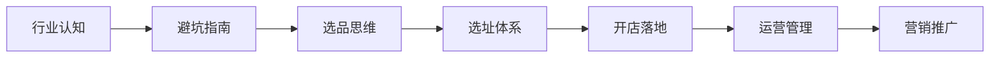

# 勇哥小餐饮创业线上课

## 课程简介

本课程由成都建设路 10 年小吃店主理人 **永哥** 主讲，他在成都建设路运营 13 家小吃店，是全网少有的以**结果为导向、以实操为前提**的餐饮创业课程。课程覆盖从行业认知到开店落地的全流程知识。

## 适合这样的你

- 对小餐饮行业感到好奇的**兴趣学习者**
- 正在考虑进入餐饮行业的**创业观望者**
- 已经是餐饮从业者、希望**系统补全知识**的店主

## 核心学习路径

## 课程结构

### 1.0 基础篇 — 打好认知地基

| 模块 | 内容 | 课次 |
|------|------|------|
| 引导课 | 创业认知、种子计划理念 | 第1课 |
| 第一节 | 行业数据分析、餐饮6大坑、成功因素、市场规模、优势、痛点 | 第2-7课 |
| 第二节 | 品类特点、项目5特点、竞争分析、产品优化、经验分享 | 第8-12课 |
| 第三节 | 选址全流程：商圈判断、聚客点、商铺分析、竞品分析、投产比 | 第13-19课 |
| 第四节 | 开店三要素：产品、位置、团队 | 第20课 |
| 第五节 | 财务管理、员工管理、换品思维、售卖技巧 | 第21-24课 |

### 2.0 进阶篇 — 深入实战细节

| 模块 | 内容 | 课次 |
|------|------|------|
| 引导课2 | 认知升级 | 第25课 |
| 市场认知 | 小吃赛道、适合人群、加盟vs培训、摆摊开店流程 | 第26-29课 |
| 商圈选址 | 商圈选择、市场调研、人流动线、商铺判断、优质商圈 | 第30-35课 |
| 商务谈判 | 谈位置5种方式、沟通技巧、合作案例 | 第36-38课 |
| 城市策略 | 大城市开小店、小城市典型 | 第39-40课 |
| 选品体系 | 选品分析4步法 | 第41-44课 |
| 转让评估 | 转让费评估上下 | 第45-46课 |
| 品类专题 | 早餐店选址、粉面馆开店、餐饮诊断、社交型餐饮选址 | 第47-54课 |
| 开业营销 | 开业活动、蓄客、达人推广 | 第55-57课 |

### 短视频实操课 — 抖音运营

| 课次 | 内容 |
|------|------|
| 1-2 | 前言、做抖音的3大误区 |
| 3-5 | 内容打造、账号起飞、内容质量提升 |

### 福利课程 — 夏季甜品制作

| 品类 | 内容 |
|------|------|
| 夏日冰汤圆（14课） | 设备、原材料、煮制、13种口味 |
| 夏日冰粉（7课） | 手工搓冰粉、石灰水点、火龙果/红糖冰粉 |
| 夏日清补凉（4课） | 原料、椰椰、西米、芋圆红豆 |

## 核心认知框架

> **选择大于努力。** 餐饮创业是一个系统工程，需要掌握的远不止一门技术。正确的选址、选品、合伙人选择，比盲目努力重要100倍。

> **投入产出比是终极判断标准。** 所有的生意决策都可以用"投入多少、获得多少"来评估。

## 开始学习

建议按顺序学习。先建立行业认知，再深入各模块细节。

- [[00-course-map|课程地图——学习路径导航]]
- [[lessons/0001-dao-yin-ke|第01课：引导课——创业认知与种子计划]]
- [[reference/glossary|术语表]]