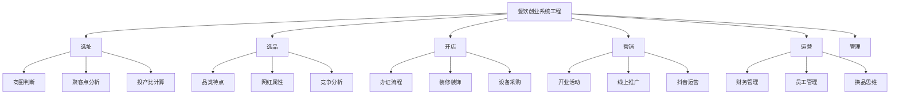

# 第01课：引导课 - 认知突破与种子计划

## 课程概览

引导课是整套课程的起点。讲师勇哥在成都建设路运营13家小吃店，用十年餐饮经验总结出：**一个人挣钱不需要十年，一到两年完全够，核心差别在于认知有没有突破**。这层"窗户纸"捅破了，就能看见窗外的世界。

---

## 核心认知一：认知突破决定赚钱速度

> [!note] 讲师背景
> 勇哥大学期间开始创业进入餐饮行业，早期和所有新手一样懵懂，认为只要努力就有结果。在物质不那么丰富的年代赚到了钱，后来想做品牌被"打脸"，才意识到自己并不懂成功背后的真正原因。2016年起大量研究选址、选品、投产比评估等系统性方法，最终在成都建设路、奎星楼、宽窄巷子开出20多家不同品类的小吃店。

- 很多人赚钱难，不是因为不够努力，而是**对赚钱的能力要求变高了**
- 十年前会技术就能赚钱，十年后需要具备**专业能力、学习能力、创新能力**
- 没有专业领域的知识和认知，不可能做出正确的选择

## 核心认知二：选择大于努力

> [!warning] 选择错误的代价
> 很多餐饮新手一上来就选择加盟、技术培训，可能一开始就是一个错误，走向了错误的方向。

选择从参与角度包含多个维度：
- 如何选择位置
- 如何选择项目
- 如何选择合伙人
- 如何选择员工

**任何一个选择错误都会导致功亏一篑。选择正确，不用太努力也能做到水准之上；选择不好，越努力越绝望。**

## 核心认知三：餐饮创业是系统工程

餐饮创业远不止于"学会技术"。它是一个完整的系统工程，需要掌握：

## 核心认知四：投入产出比思维模型

做生意始终围绕一个核心思路：**投产比**。所有的生意、所有的对错，都可以用"投入多少、获得多少"来简单评估。

- 餐饮创业的投入包括：时间、金钱、精力
- 必须核算清楚所开店铺的投入产出是否是自己想要的
- 核算数据背后需要各种专业知识

## 种子计划

种子计划分为**两部分**：

### 第一部分：学习

跟着课程系统学习餐饮的**选址、选品、管理、运营**，及时掌握行业动态风向标。课程会不断更新迭代，跟随市场前行。除理论知识外，更注重教会实操：

- 如何找到当地消费者的需求
- 如何筛选当地优质商圈
- 如何在优质商圈低成本拿下铺子
- 如何找到当下适合自己的产品
- 如何做好抖音和运用营销软件

### 第二部分：结果

种子计划以**结果为目的**，而非仅仅是学习过程。学习是为了让大家更好更快地了解行业。讲师会亲自为学员的店铺做规划：

- 一对一个性化定制产品、店型、店铺
- 帮助规避风险，快速实现盈利
- 从技术角度提供技术支持
- 未来两年所有需要调整的项目的技术由讲师负责

> [!tip] 学习建议
> 课程不会一次性更新完，跟着节奏每天学习一点，循序渐进。同时根据市场变化更新当下最新的打法。学习过程中做好笔记，可以到直播间与讲师连麦交流。

## 复习清单

- [ ] 理解"认知突破"为什么比"努力"更重要
- [ ] 能说出餐饮创业中"选择"包含哪几个维度
- [ ] 理解为什么餐饮创业是系统工程而非仅仅技术
- [ ] 掌握投入产出比思维模型的基本概念
- [ ] 记住种子计划的两部分：学习 + 结果
- [ ] 思考自己当前最大的认知瓶颈是什么

## 自测问题

1. 为什么说"选择大于努力"在餐饮创业中尤其重要？
2. 种子计划的两部分分别是什么？它们之间的关系是怎样的？
3. 你目前对餐饮行业的认知处于什么阶段？最需要突破的点在哪里？

## 下一步

- [[0002-xing-ye-shu-ju-yu-liu-da-keng|行业认知与避坑]] - 深入了解餐饮行业数据、六大坑和成功因素
- 开始思考你想在什么样的城市、什么样的位置开一家什么样的店
