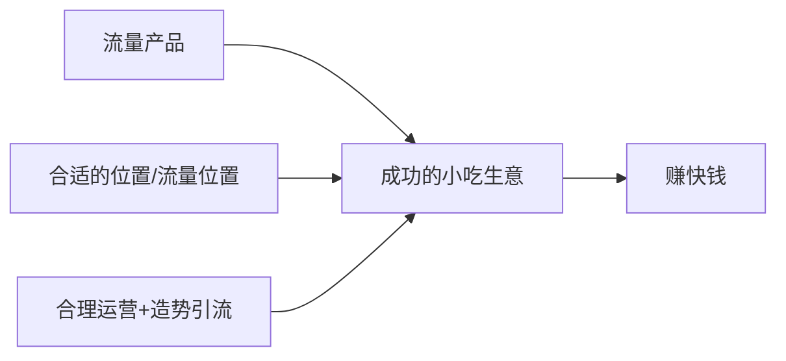

# 第02课：行业认知与避坑 - 餐饮数据、六大坑与成功因素

## 课程概览

本节从宏观行业数据切入，帮助学员建立对餐饮尤其是小吃行业的完整认知。涵盖餐饮行业特点、六大坑（每个均有真实案例）、成功六因素、小吃市场规模与优势，以及行业三大痛点的解决方案。

---

## 一、餐饮行业数据分析

### 行业活跃度

2020年疫情期间，餐饮行业的活跃度仍然比教育、幼儿、美容、服装、家居、酒店、汽车等其他行业要高得多。印证了中国的一句老话：**民以食为天**。

### 行业注册趋势

2015年至2022年，中国餐饮相关企业注册数量持续正增长，即使在2020年疫情高爆发期，注册数量仍达到236.4万，呈现稳步上升态势。

### 餐饮行业的三大特点

| 特点 | 说明 |
|------|------|
| 刚需属性 | 每个人都需要吃饭，复购天然存在 |
| 门槛低 | 对学历没有要求，任何人都可以尝试 |
| 现金流好、资金回报高 | 每天都有现金进账，不像其他行业投入后长期无收入 |

> [!note] 勇哥的亲身经历
> 2011年勇哥在成都上大学，从摆摊卖武大郎烧饼开始创业。当时一张烧饼卖5元，每天卖50张就有250元收入。这种每天看得见的现金流，是餐饮创业最直接的吸引力。

### 区域性竞争

餐饮行业的竞争是**区域性**的，并非全国性竞争。每个餐饮店只在它所在的区域内与其他店铺竞争，这给了新手创业者很大的生存空间。

---

## 二、餐饮行业六大坑（每个均有案例）

### 坑一：加盟坑

> [!warning] 核心警示
> 这个世界上最深的路，就是快招公司的套路。在中国拥有正规加盟资质的餐饮公司屈指可数，因为获取加盟资质对企业的财务、运营、店铺管理有非常高的要求。

**案例一：40万加盟汉堡店血本无归**
- 陈先生加盟阿蕊拉汉堡，拿下福州两个区域总代理权
- 加盟费12万 + 统一装修 + 设备 = 总投入40万
- 总部宣称"每天做个一两百单很正常"
- 最终血本无归

**案例二：奶茶加盟公司跑路**
- 加盟商还没开业，加盟公司就跑路了
- 留下一批全新未拆封的设备（制冰机、封口机、操作台冰箱等）

**加盟的本质问题：**
- 高昂加盟费 + 统一装修 + 统一设备 = 投入20-60万
- 承诺的扶持无法落地——总部远在天边，不了解当地实际情况
- 最终能不能做好完全靠加盟商自己

### 坑二：选址坑

> [!warning] 核心警示
> 产品不好还可以拯救，但选址一旦错误，基本上没有救。尤其对于小吃店，选址的重要性体现得淋漓尽致。

**案例一：徐老大/黄师傅百万门店关店**
- 在老旧小区楼下开餐饮（住改商）
- 楼上居民投诉油烟和噪音
- 改排风、改排烟花了50多万
- 最终被逼关店

**案例二：富翔排骨与二房东**
- 勇哥团队从二房东手上租铺子做富翔排骨
- 生意红火每天排队，做了一年
- 房东眼红收回铺子自己开店，改名"复记排骨"
- 合同漏洞致损失

### 坑三：房租坑

**案例：10万转让费打水漂**
- 合同签了，钱付了
- 社区告知不能做餐饮
- 房东不认账，合同里规避了责任

**富翔排骨的房租陷阱：**
- 约定8000元/月租金，按季支付
- 第二季度房东大幅涨租
- 合同里没有约定租金递增条款和涨幅限制
- 不交就违约，只能按房东说的交

> [!tip] 合同必审条款
> 签合同时务必确认：产权证、房东本人身份、租金递增比例和周期、遇到疫情等特殊情况如何处理、如果是二房东需证明能持续使用房屋。

### 坑四：装修坑

**案例：800万投资只干了一年**
- 老板装修设计图纸花了二三十万
- 凳子500多块钱一个，桌子大几千
- 全套自动设备投入巨大
- 关键：他自己的房子不要房租都干不下来

> [!tip] 核心原则：轻装修重装饰
> 勇哥在建设路的13家店，每家店就是把墙刷白，贴个墙纸，几百块钱搞定。不搞大装修，强调的是"重装饰轻装修"。

### 坑五：设备坑

**案例：300万烘焙店半年倒闭**
- 100多平的烘焙店，总投资300万
- 设备占比达到150万（几乎全是进口设备）
- 开业半年，三个合伙人因经营和管理问题产生矛盾，宣布倒闭

> [!tip] 二手设备优先
> 功能完全一样的设备，二手冰箱400元，新的2000元。节省下来的就是利润。而且新设备一旦转卖就按废铁价称重，贬值极快。

### 坑六：退场坑

**案例：退场还要赔钱恢复原样**
- 生意做不走了，全部投入打了水漂
- 房东要求"把房子恢复到原样"
- 恢复原样花了十几万

> [!warning] 深层教训
> 一切归咎于一开始入场时没有沟通好条款。新手容易满腔热血，只幻想每天卖多少钱，忽略退场条款，最后"一地鸡毛"。

---

## 三、决定餐饮成功的六大因素

| 因素 | 权重 | 说明 |
|------|------|------|
| 选品 | 极高 | 选对品类就成功了一半以上 |
| 选址 | 极高 | 选址定生死，小吃店尤其明显 |
| 开店 | 中 | 办证、装修、设备、原材料 |
| 营销 | 中 | 开业营销、日常营销、线上推广 |
| 运营 | 中 | 财务管理、员工管理、换品思维 |
| 管理 | 中 | 绩效、制度、流程 |

> [!note] 关键洞察
> 前面两个因素（选品 + 选址）做对了，基本上就成功了**一半以上**。后面是第二梯队的事情。很多人失败，就是因为其中一项或两项没有做好。

---

## 四、小吃行业与市场规模

### 小吃 vs 大型餐饮对比

| 维度 | 大型餐饮（火锅/酒楼） | 小吃 |
|------|----------------------|------|
| 投资 | 30万只能开小店且位置差 | 30万可拿优质位置 |
| 人力 | 至少7-8人 | 1-2人 |
| 装修 | 重装修，成本高 | 轻装修重装饰 |
| 回本周期 | 半年到两年 | 甚至一个月内 |
| 转换成本 | 换品需重装 | 换品成本极低 |
| 抗风险 | 低 | 高 |

### 评效与人效

- **评效**：每平米创造的利润。小吃店面积小（几个平米），评效远高于大餐饮
- **人效**：每个店员创造的利润。小吃店1-2人即可，人效极高
- 小吃店不需要堂食，打包就走，无需翻台率

> [!note] 数据支撑
> 脆皮五花店：2个人，一个月营业额42万。火锅店30万投入可能还达不到这个数。

### 小吃行业的三大优势

1. **投入成本更少**——设备不超过3000元（极少数店除外）
2. **效率更高**——开店效率3天搞定，评效人效均高于大型餐饮
3. **投资回报更大**——快则一个月、甚至三天就能回本

---

## 五、夫妻店模式

> [!note] 不可颠覆的夫妻店
> 不管行业怎么颠覆，在中国永远干不倒的就是夫妻行业。两夫妻搭档，一个月挣8000也觉得OK，挣1万也OK，挣2万觉得赚了。他们的成本极低，相当于把自己的工资挣了。

小吃行业从业人员多、商户数量多、交易规模大、民生联系紧。商户聚集形成规模效应，为消费者提供"一站式"体验，由此带来客流。

---

## 六、行业三大痛点及解决方案

### 痛点一：复购低

小吃不属于刚需产品，消费者不会每天去吃。

**解决方案：选址决定复购率**
- 找流量大的位置（小吃街、夜市、大学周边、地铁口）
- 每天有不同的人流量自然经过，不需要太强的复购
- 做的是**流量生意**而非复购生意

> [!tip] 核心逻辑
> 小吃不需要复购，需要的是每天有新的流量。选址对了，复购问题自然解决。

### 痛点二：更新换代快

网红小吃的生命周期短，如脆皮五花从火遍全国到热度下降不过半年。

**解决方案：快速迭代换品**
- 不坚守单一品类
- 在产品的生命周期内把钱挣到手
- 热度下降果断换品

> [!note] 富翔排骨的启示
> 唯一做了8年的产品是富翔排骨。原因是排骨/猪肉属于大众化品类，更常规。但即便如此热度也在下降。而脆皮五花5个月卖出150万营业额、利润90万，热度过了就换。

### 痛点三：缺乏科学系统的指导方法

**解决方案：系统学习 + 实战方法**
- 选址、选品、运营、管理缺一不可
- 每步流程清晰，每个环节做什么事、什么时间节点做
- 掌握逻辑和体系后，到不同地方可以灵活套用

---

## 七、新的小吃商业模式

传统模式：选址选品听天由命 + 品牌加盟
新模式：**流量产品 + 合适的位置（流量位置）+ 合理运营 + 造势引流**

网红小吃产品天生自带话题性，加上短视频的蓬勃发展，产品热度就是流量。如脆皮五花全网讨论热度达到80多亿，招牌一挂消费者自然进店。

### 社交属性设计

除了好吃，当前网红小吃还有一个重要特征：**适合拍照分享到社交媒体**。

**怎么做：**
- 杯套、吸管套等包装设计——让顾客拿在手里就想拍照
- 产品颜色搭配讲究视觉冲击力
- 出餐摆盘有"仪式感"
- 一句 slogan 或一段小故事增加传播性

设计社交属性的本质是**让产品自己说话**——顾客拍照发朋友圈/抖音/小红书，等于免费给店铺做推广。

---

## 复习清单

- [ ] 能说出餐饮行业的三大特点和区域性竞争的含义
- [ ] 能复述六大坑及每个坑的真实案例
- [ ] 理解为什么加盟坑是"最深的套路"
- [ ] 掌握"轻装修重装饰"的原则
- [ ] 理解评效和人效的概念及其意义
- [ ] 知道夫妻店模式为什么不可颠覆
- [ ] 能说出小吃行业三大痛点及对应的解决方案

## 自测问题

1. 为什么说选址错误是"无法拯救"的错误？产品不好为什么反而可以挽回？
2. 加盟的本质问题是什么？为什么大部分加盟商做不起来？
3. 小吃的三大痛点中，你认为哪一个对你即将开始的创业影响最大？如何应对？

## 下一步

- [[0003-xuan-pin-si-wei|选品思维]] - 了解小吃品类的8个特点、网红小吃五要素和选品方法
- [[0004-xuan-zhi-ti-xi|选址体系]] - 深入学习选址四大模型和完整评估体系
