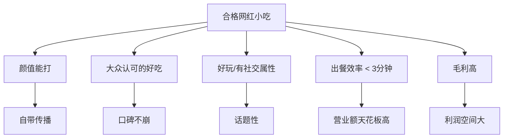
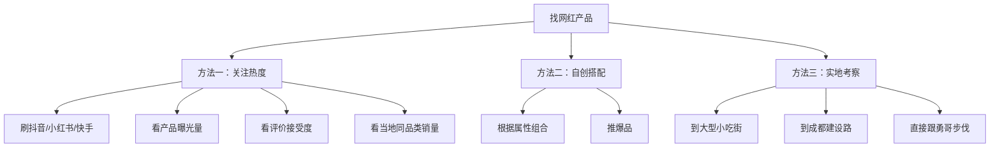

# 第03课：选品思维 - 品类特点、网红五要素与选品方法

## 课程概览

餐饮人有一句话：**选品如选命**。选对了品类等于站在风口上，猪都能飞起来；选错了就杀入同质化严重的红海市场，到处充满失败。本节是选品的系统方法论。

---

## 一、小吃品类的8个特点

| 特点 | 说明 |
|------|------|
| 需求弹性 | 休闲餐饮，非刚需，消费者"遇到了、看到了、想尝鲜"才会消费 |
| 功能性 | 不同场景有不同功能需求：夏天解暑解渴，冬天暖身饱腹 |
| 趋势性 | 必须选当下流行的产品，做新奇特体验，挣快钱 |
| 淡旺季 | 受季节影响明显：夏季适合冰饮，冬季适合油炸和烤类 |
| 适应性 | 受南北口味影响，需因地制宜做调整 |
| 复购性 | 小吃复购不如正餐，但必须保证口碑不崩（负面评论会毁掉生意） |
| 供应链 | 好的供应链决定成本和门槛，需找到性价比高的原材料渠道 |
| 操作技术性 | 尽量用半成品，追求快速高效出餐，不把时间花在搓汤圆这种环节上 |

### 选品需匹配场景

| 场景 | 选品策略 |
|------|---------|
| 学校周边（小学/初中/高中） | 性价比优先：好吃+实惠 |
| 大型小吃街/旅游集散地 | 新奇特优先：特色+颜值+打卡属性 |
| 夏天 | 冰饮类：柠檬茶、泰茶、绵绵冰、冰汤圆等解暑产品 |
| 冬天 | 油炸/烤/肉类：暖身饱腹产品 |

---

## 二、网红小吃五要素

一个合格网红小吃产品必须同时满足以下**五个条件**，缺一不可：

### 1. 颜值

好看的东西总是容易被分享。颜值决定了产品是否自带社交属性、是否能让顾客主动拍照发朋友圈。

> [!note] 案例：手打柠檬茶的迭代
> 第一版用普通杯子加上成都/建设路的杯套和吸管套，消费者自发拍照打卡。"手打渣男柠檬茶""手打渣女柠檬茶"等命名进一步增加话题性。被模仿后推出第二版泡菜坛子包装，加上小黄鸭等元素，持续保持差异化。

### 2. 好吃

> [!warning] 关键认知
> 你认为的好吃不一定是好吃。必须通过测试，大众觉得好吃才算好吃。在互联网时代，大家会到抖音、小红书、美团等平台评价，口味不过关会被直接曝光。

### 3. 好玩

包装要有新奇特属性，让顾客走在街上被问"你买的是什么"。产品要自带话题和传播力，而不是靠口味硬扛。

**案例：泰茶**——用透明塑料袋装着提着走，成为街头话题。

### 4. 出餐效率（3分钟以内）

小吃做的是流量生意，追求的是卖多少份，而不是一桌消费多少钱。

- 出餐效率超过3分钟就不算合格的网红流量小吃
- 出餐效率直接限制营业额天花板（如勺皮豆干最多一天烤1500张）

### 5. 毛利

- 和肉制品相关的产品毛利都比较低（储存、运输、原材料价格波动）
- 非肉制品毛利高：如芝士马铃薯（土豆1元成本，卖19元）
- 排骨类毛利约70%，薯条/柠檬茶/泰茶等毛利可达80%以上

---

## 三、竞争分析策略

### 策略一：跟随策略（踩肩膀）

当小吃街上某家店特别火、天天排队，证明它已经验证了市场。在它旁边或对面开一家同类产品，做好营销和产品，就可以分走一部分客流。

> [!tip] 核心理念
> "别人已经排长队了，说明他把市场消耗不完。我们踩着他的肩膀往上走就可以了。"

### 策略二：产品错位

同样的两个店铺，不把同样的产品放在同样的位置，而是根据周围业态做错位搭配。

> [!note] 案例：建设路的两家店
> - 一家卖手打柠檬茶：开在一排全是烤、炸、油、腻的店铺中间。吃完油腻的来一杯清凉解腻的柠檬茶，效果比同位置其他店铺好一两倍
> - 一家卖脆皮五花：开在茶百道、书亦烧仙草等饮品店中间。喝完饮品想吃点咸的油的，脆皮五花就正好

**核心逻辑：油的地方卖凉的，凉的地方卖油的。**

---

## 四、产品优化三策略

### 策略一：低端产品高端化

把低端产品通过包装、命名、工艺升级做出高端感。

| 案例 | 低端版 | 高端版 | 价格提升 |
|------|--------|--------|---------|
| 芝士马铃薯 | 土豆（几毛钱一斤） | 芝士马铃薯 | 卖19元 |
| 手打柠檬茶 | 蜜雪冰城柠檬水（3元） | 渣男/渣女柠檬茶 + 杯套 + 纯手工概念 | 卖25元 |

### 策略二：高端产品低端化

把高端产品降低消费门槛，让普通大众也能消费。

| 案例 | 高端版 | 低端版 |
|------|--------|--------|
| 老挝咖啡 | 星巴克/瑞幸精致包装 | 泰茶透明塑料袋装 |
| 牛排 | 西餐配红酒 | 街头牛排 |

### 策略三：组合搭配

把不同的产品组合在一起创造新的网红产品。

- 肥肠 + 大葱 = 肥肠包大葱
- 五花肉 + 脆皮工艺 = 脆皮五花肉
- 冰粉 + 汤圆 = 冰汤圆
- 豆干 + 各种馅料 = 勺皮豆干

---

## 五、选品四维度

勇哥十年选品经验总结，选品时围绕以下四个维度判断：

| 维度 | 考量 |
|------|------|
| 季节是否合适 | 提前筹备，夏天换夏天的，冬天换冬天的 |
| 颜值是否能打 | 是否满足大众审美，是否具备社交属性 |
| 产品本身的热度 | 是否在网上有足够的话题量和曝光度 |
| 出餐效率与毛利 | 是否能在3分钟内出餐，毛利是否足够高 |

> [!note] 技术不值钱
> 在小吃行业，配方和技术已经不是最大的问题。原材料到处都能买到，重要的是选对渠道、拿到高性价比的货源。

---

## 六、找网红产品的3种方法

1. **关注互联网热度**：在抖音、小红书、快手等平台看产品曝光量、评价和接受度，以及所在地周边是否有类似店铺和他们的销量
2. **自创搭配**：根据网红属性（颜值、好吃、好玩等），将不同食材组合创造新的爆品
3. **实地考察**：到当地或成都建设路等标杆小吃街实地调研，或者直接跟随勇哥的步伐，他在卖什么、换什么品，学员就跟着换

> [!tip] 实用建议
> 学完选品，即使以后从勇哥的产品池中选择产品，也要判断是否符合你当地的属性。如果选品没选好，后面做再多营销都没有意义。

---

## 复习清单

- [ ] 能说出小吃品类的8个特点
- [ ] 能复述网红小吃五要素及每个要素的重要性
- [ ] 理解"跟随策略"和"产品错位"两种竞争策略
- [ ] 掌握三种产品优化策略并能举例说明
- [ ] 能说出选品四维度
- [ ] 知道找网红产品的3种方法
- [ ] 理解为什么"技术不值钱"而"选品值钱"

## 自测问题

1. 网红小吃五要素中，你认为哪一个最难做到？为什么？
2. 如果你所在的城市有一条小吃街，街口是奶茶店、中间是炸鸡店、街尾是烧烤摊，你想在这里开一家小吃店，应该选什么品类？运用什么策略？
3. 低端产品高端化和高端产品低端化，你觉得哪一种策略更适合你目前的资源条件？

## 下一步

- [[0004-xuan-zhi-ti-xi|选址体系]] - 选定品类后，如何找到最匹配的流量位置
- [[0002-xing-ye-shu-ju-yu-liu-da-keng|行业认知与避坑]] - 温习选品前需要了解的行业背景
